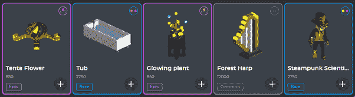

# 沙盒:备受期待的区块链元宇宙游戏

> 原文：<https://medium.com/coinmonks/the-sandbox-the-hugely-anticipated-blockchain-metaverse-game-7f5ecea03f86?source=collection_archive---------2----------------------->

在[语音](https://www.voice.com/post/@tulip/the-sandbox-the-hugely-anticipated-blockchain-metaverse-game-1604837783-1)阅读我的原创文章。

[沙盒](https://sandbox.game/login?r=hrmUO4h5%7Epb%7ENwc8wMI69)是一个社区驱动的基于体素的虚拟世界，玩家可以在其中建立、拥有和货币化他们的游戏体验。这些资产可以以 NFTs 的形式进行货币化和交易，也可以集成到游戏中。

## **历史**

[沙盒](https://sandbox.game/login?r=hrmUO4h5%7Epb%7ENwc8wMI69)原本是手机和微软 Windows 的游戏。它是由 Pixowl 工作室开发的。Pixowl 后来被 Animoca Brands 收购。原版沙盒下载量超过 4000 万，月活跃用户超过 100 万。

沙盒开始探索区块链，并开始创建一个体素风格的区块链版本的游戏。区块链将赋予用户分享和货币化其创作的权力。在第一轮融资中，沙盒筹集了 250 万美元的资金来开发这个项目。

沙盒建立在以太坊区块链上。它旨在为玩家和用户提供区块链的核心优势:

**不变性:**沙盒中的任何创建都作为不可替换的令牌存储在区块链中(NFT)

**真实所有权:**沙盒资产是独一无二的，具有不同的稀有性。任何把这种资产存放在钱包里的人都是唯一真正的所有者。

**货币化:**资产可以在二级市场出售，土地可以出租或游戏化，这创造了一个全新的经济和激励体系。

**互操作性:**任何使用以太坊标准的平台都能够托管这些资产。

**关键组件** [**沙盒**](https://sandbox.game/login?r=hrmUO4h5%7Epb%7ENwc8wMI69)

## **土地**

土地是以太坊区块链中以 NFT 形式创建的数字不动产。游戏创作者可以利用这些土地在上面建立体验。玩家可以用游戏和资产来填充一片土地。土地的最小单位是 3x3。多块土地可以组合成一块地产。最大土地供应量为 166，464。

## **沙子**

SAND 是沙盒的实用令牌。这是一个 ERC-20 实用令牌。沙子的总供应量是 30 亿。Sand Token 的使用案例包括

**沙盒游戏中的交易媒介**

参与**治理**决策

**赌注**沙子赚取奖励

沙子最近在币安发射台发射。

## **宝石和催化剂**

宝石和催化剂定义了资产的等级、稀缺性和属性。催化剂包括可以填充宝石的空的 NFT 插座。高质量的催化剂有更多的插座，使资产更加稀缺。

普通催化剂:1 个宝石插座。25 个属性。两万份资产拷贝。

稀有催化剂:2 个宝石插座。50 个属性。4000 份资产拷贝。

Epic Catalyst: 3 个宝石插座。75 个属性。1500 份资产拷贝。

传奇催化剂:4 个宝石插座。100 个属性。200 份资产副本。

**产品:**

## **VoxEdit**

VoxEdit 是 Sandbox 自己的一体化工具，用于创建体素模型并制作动画。它是唯一能够将资产输出到市场的软件。它有三个主要功能建模器，动画师和块编辑器。

## **市场**

市场是一个地方商店，在那里你可以用沙子购买创造者的资产。你可以在这里购买资产、土地和不动产。它还没有完全推出。

## **游戏制作者**

Game Maker 是一个任何人都可以下载和使用的软件。用户可以使用社区在 VoxEdit 中制作的数千个体素模型来创建游戏。用户可以组装这样的模型，创建自己的宇宙。

推荐的系统要求包括 64 位处理器。操作系统:Windows 7，处理器:双核 2GHz，内存:4 GB 内存，显卡:512MB，VRAM DirectX:版本 11，存储:2 GB 可用空间

## **建立在沙盒上的游戏**

**蘑菇狂:**打败蘑菇怪，清除所有谜题，还可以探索巨人荒野

**德古拉的城堡:**扮演一个受范海辛启发的恶魔猎手

在一个遥远的星球上复活迷失的生物。

## **结论**

沙盒是 2020/2021 年最值得期待的游戏之一。该项目仍处于向玩家和游戏制造商出售土地的阶段。它得到了 Animoca 的支持，并与币安、雅达利和蓝精灵等大品牌建立了合作伙伴关系。甚至在推出之前，沙盒已经变得非常受欢迎。土地预售 4.2 即将到来。土地成本相对便宜。尽量在大品牌旁边拿地。这款游戏一经推出就会一炮而红。

如果你能在评论中留下你的观点以供进一步讨论，我将不胜感激。

**在这里玩沙盒**T24

**参考** : [维基百科](https://en.wikipedia.org/wiki/The_Sandbox_(video_game))，[沙盒](https://sandbox.game/login?r=hrmUO4h5%7Epb%7ENwc8wMI69)

**看我之前的文章:** [第一 Polkadot NFTs:sub punks](/coinmonks/the-first-polkadot-nfts-substrapunks-3398f33c8ae1)

**跟我来**

https://twitter.com/rumadas123➡推特:

https://www.linkedin.com/in/ruma-das-a1439320/➡领英:

## 另外，阅读

*   [最佳加密交易机器人](/coinmonks/whats-the-best-crypto-trading-bot-in-2020-top-8-bitcoin-trading-bot-c16adeb13317)
*   [Deribit 审查](/coinmonks/deribit-review-options-fees-apis-and-testnet-2ca16c4bbdb2) |选项、费用、API 和 Testnet
*   FTX 密码交易所评论
*   最好的比特币[硬件钱包](/coinmonks/the-best-cryptocurrency-hardware-wallets-of-2020-e28b1c124069?source=friends_link&sk=324dd9ff8556ab578d71e7ad7658ad7c)
*   [密码本交易平台](/coinmonks/top-10-crypto-copy-trading-platforms-for-beginners-d0c37c7d698c)
*   最好的[加密税务软件](/coinmonks/best-crypto-tax-tool-for-my-money-72d4b430816b)
*   [最佳加密交易平台](/coinmonks/the-best-crypto-trading-platforms-in-2020-the-definitive-guide-updated-c72f8b874555)
*   最佳[加密贷款平台](/coinmonks/top-5-crypto-lending-platforms-in-2020-that-you-need-to-know-a1b675cec3fa)
*   [莱杰 vs 特雷佐](/coinmonks/ledger-vs-trezor-best-hardware-wallet-to-secure-cryptocurrency-22c7a3fd391e)
*   [block fi vs Celsius](/coinmonks/blockfi-vs-celsius-vs-hodlnaut-8a1cc8c26630)vs Hodlnaut
*   Bitsgap 评论——一个轻松赚钱的加密交易机器人
*   为专业人士设计的加密交易机器人
*   [PrimeXBT 审查](/coinmonks/primexbt-review-88e0815be858) |杠杆交易、费用和交易
*   [HaasOnline 评论](/coinmonks/haasonline-review-d8d1a3400419)享受九折优惠
*   Bitmex 上的[保证金交易的白痴指南](/coinmonks/the-idiots-guide-to-margin-trading-on-bitmex-dbbd7742c6fc?source=friends_link&sk=7bfa99d2a181142510c8442c8ddb0786)
*   [eToro 评论](/coinmonks/etoro-review-78807ddeb33c) |交易股票、密码、交易所交易基金、差价合约和商品
*   [Bitmex 高级保证金交易指南](/coinmonks/bitmex-advanced-margin-trading-guide-2270c195ce25?source=friends_link&sk=1d986cca731f5084b9a2db4a4bc4a7ad)
*   [面向开发人员的最佳加密 API](/coinmonks/best-crypto-apis-for-developers-5efe3a597a9f)
*   [最佳区块链分析工具](https://bitquery.io/blog/best-blockchain-analysis-tools-and-software)
*   [加密套利](/coinmonks/crypto-arbitrage-guide-how-to-make-money-as-a-beginner-62bfe5c868f6)指南:新手如何赚钱
*   顶级[比特币节点](https://blog.coincodecap.com/bitcoin-node-solutions)提供商
*   最佳[加密制图工具](/coinmonks/what-are-the-best-charting-platforms-for-cryptocurrency-trading-85aade584d80)
*   了解比特币最好的[书籍有哪些？](/coinmonks/what-are-the-best-books-to-learn-bitcoin-409aeb9aff4b)

> [直接在您的收件箱中获得最佳软件交易](https://coincodecap.com?utm_source=coinmonks)

