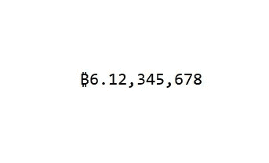
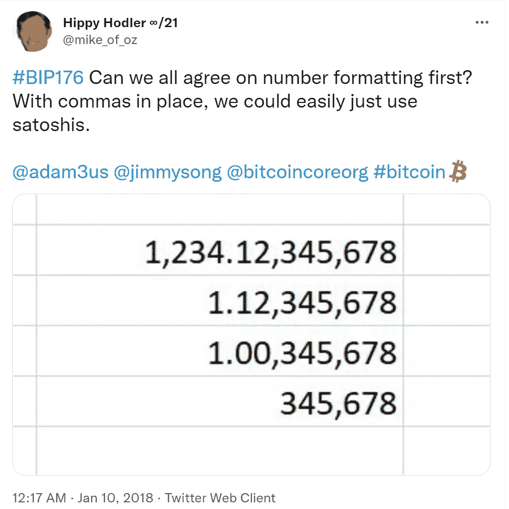
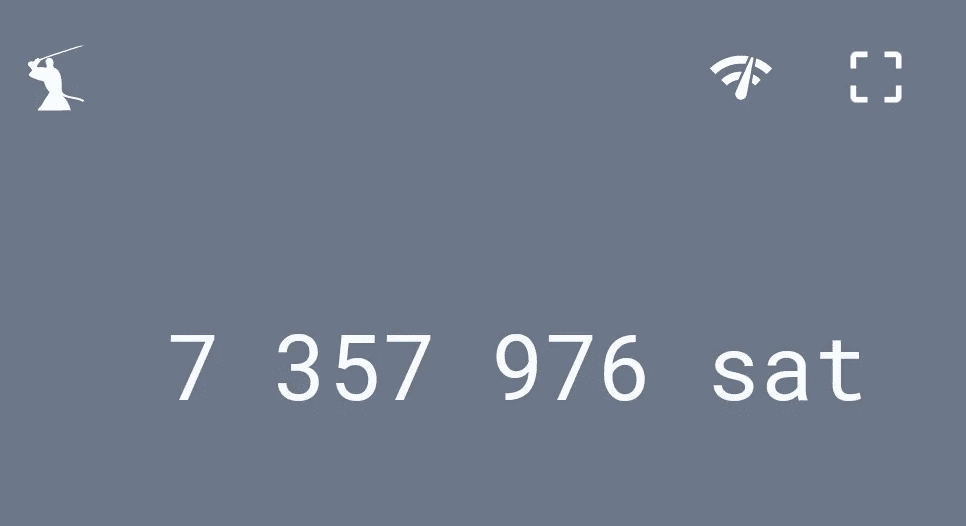
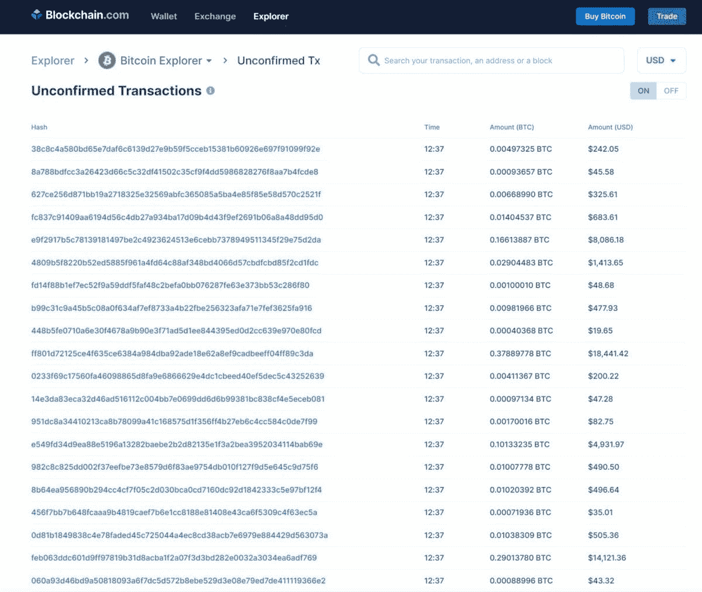

# 卫星逗号标准

> 原文：<https://medium.com/coinmonks/the-satcomma-standard-89f1e7c2aede?source=collection_archive---------0----------------------->

## **一种新颖的比特币次十进制数符号方案**

无论我们使用什么样的钱包软件，比特币符号标准，即数字如何出现在你的余额中，是我们与比特币关系的主要 UX 组成部分。货币的标点符号，即句号和逗号，以及它们在序列中出现的位置，为我们提供了关于个人财富和商品成本的重要信息。符号标准是当一长串数字相邻出现时，我们如何快速推导出含义。

在这篇文章中，我提出了一个新的比特币符号标准，它在小数点的右侧使用逗号，在我们目前用于整数的位置符号方案的预期间隔处使用逗号分隔符:从**右**到**左**每三个数字计数一次。虽然这明显不同于习惯的符号，但它立即传达了比特币和 satoshis 之间的转换率，satoshis 是比特币的最小单位。这种新的符号格式的唯一用途是为用户提供一个该转换比率的即时参考。

. 03445674 BTC

会是

.03,445,674

# **向 sat 转变**

各种因素交织在一起，导致越来越多的声音支持比特币完全在 sat 中命名。随着十进制以下数量的比特币在更广泛的经济中变得普遍，对 satoshi 单位的认识正在增长。例如，在闪电网络中，整个 BTC 量还没有用于生产，在 sat 中命名是必须的。

尽管有 sat 的趋势，但在很长一段时间内，整数比特币面值将成为生活的一部分。上面概述的符号格式将比特币和 sat 统一在一个视觉表示中。

# **这解决了什么问题？**

如果你与部分比特币金额互动的时间足够长，这些基本要素将成为你的第二天性。尽管如此，我可能花了两年时间才能快速直观地将 0.5 BTC 转换为 5000 万 sat，因为快速转换存在心理障碍。难点在于，虽然 sat 普遍以百万计，但“百万”这个词本身不是一个分数，而是一个整数，a 对应于小数点左边**的逗号的特定位置。**

0.5 BTC = 50，000，000.00 sat。

我们必须明白的是，用 sat 表示的数量隐含着一个**尾随的**小数。那么，在符号空间中定位用户的最简单的方法是从右边的**开始每三个数字提供一个逗号分隔符**，与整数符号一致。

只是因为比特币的设计者中本聪本人选择在十进制以下的比特币上加 8 个零，而不是 9 个，我们才下意识地纠结于“智”中第三个逗号的难题。如果比特币是由 9 个零组成的，那么不管你是从右边读还是从左边读，第三个逗号都会在合适的位置。

如果 Satoshi 添加了 9 个零，那么 10 亿个 sats 将等于 1 个 BTC，小数点将出现在自然分隔符处。

如果他加上九个零，6.15 个 BTC 和一个聪将等于 6.15 个 BTC 的十亿分之一，或 6.150000001。按照新的符号标准编写，它看起来像这样:

₿6.150,000,001.

对此我们很熟悉，因为小数点出现在我们期望有标点符号的地方。这对眼睛和大脑都有意义。

但是 Satoshi 在比特币上加了 8 个零，所以 1 个比特币=一亿个 sats，留给我们一个尴尬的记数结果，那就是为了真正在 sats 中思考，我们必须在它不属于的地方插入一个精神标点符号(句号):在从九千九百万，九百九十九，到一亿的过渡处。

因此，6.15 BTC 和一个聪实际上等于 6.15 和一个 BTC 的一亿分之一，或 6.15000001。按照新的符号标准编写，它看起来像这样:

₿6.15,000,001.

# **没关系**

这个问题在传统金融中不存在，因为只存在于会计中的次分价值，在我们把它们视为消费者时，总是被四舍五入到最接近的十分之一。用法定术语来说，千分之一美元是不存在的。比特币在经济史上第一次让长串的次十进制数值成为必要。由于第三个逗号难题和表达 8 位数、次十进制字符串的新要求，新的记数标准可能会有所帮助。上面提出的方案提供了即时定向并解决了这两个问题。

快速浏览以下数字，并在阅读时在脑海中描述 sat 转换。你会发现这很容易。

₿0.03,860,000

₿0.00,400,000

₿0.00,005,873

₿6.15,000,001

如上所述，当在 BTC 和 sat 之间进行心算转换时，这个符号标准对于少于一百万个 sat 是非常有用的。

假设您遇到以下金额:

₿0.004

为了将这转换成 sat，当前的符号标准给用户留下了两个选择；当从 BTC 到 sat 时，要么将转换表提交到内存中，要么将零向右扩展。结果是:

₿0.00400000

这种做法的问题在于，人类不擅长仅仅通过盯着一张图片来审核金额。在添加了上面的零之后，必须至少进行一次纠错，再次检查是否添加了正确数量的零。这是一个缓慢的过程。

这是另一个例子:

698,000 sats。

为了把它转换成 BTC，我们必须做上面同样的练习，但是要反过来，把零向左扩展，然后加上一个小数。结果是:

₿0.00698000

虽然这两种转换都很简单，但必须非常精确。另一个问题出现了，它与生物学有关。

# 视觉似曾相识

当在计算机屏幕上数一串零时，人眼不会逐渐地从一个字符移动到另一个字符，而是进行剧烈的、受控的肌肉抽搐，将我们从一个焦点转移到另一个焦点。用电影术语来说，不是慢镜头，更像是过场，仿佛从特写镜头到特写镜头。当把一个人的视觉焦点向下移动到一长串相同的形状时，例如零，这就成了问题，因为两边的图像是相同的，并且没有视觉锚来保证我们现在数的零不是我们刚才数的那个零！出于这个原因，当在屏幕上数 0 时，人们经常用手指或笔尖作为计数的辅助，因为越往前数，就越感觉到 10 的幂。在比特币中，相差 10 的 1 次方是一个代价高昂的错误。

接下来的目标是创建一个符号标准，它可以通过一种普遍理解的视觉语言立即完成这种转换，内置的值符号可以在第一次传递时提供错误纠正，并允许用户进行值评估，而无需放慢速度来计数，然后重新计数各个零，或者不得不求助于使用手指等指点设备。

# **正反馈**

这个提议在 T2 的推特上引起了很多讨论。最让我惊讶的是大量的积极回应。

> [@JimmyKostro](https://twitter.com/JimmyKostro) :“真不敢相信过了 12 年才有人提出这个杰作。”
> 
> @JaslanRooney :“你为社会做出了贡献，这种贡献将会永存。干得好。”
> 
> [@BitcoinMonke](https://twitter.com/BitcoinMonke) :“这就是天才”
> 
> [@ drbitcoimd](https://twitter.com/DrBitcoinMD):“哦。那很有趣。这可能行得通。”
> 
> [@rajjha](https://twitter.com/rajjha) :“高明。”
> 
> [@dangershony](https://twitter.com/dangershony) :“它结合了两个世界的精华，我们停留在比特币面额，但可以轻松阅读 Satoshis，我喜欢。”
> 
> [@ZacharyPardey](https://twitter.com/ZacharyPardey) :“请不要再显示没有逗号的余额”
> 
> [@carlo_campisi](https://twitter.com/carlo_campisi) :对！？我们正在考虑在我们的卡界面中显示 sat 奖励

最令人惊讶的是，我不是第一个想到这一点的人。

马克·纽金特最近发表了[这篇优秀的论文](/@mark.nugent.iv/grouping-bitcoins-fractional-digits-an-idea-whose-time-has-come-22d9dad8ac51)。他和我各自得出了相同的结论。他的提议是用撇号代替逗号作为分隔符，我觉得这不太吸引人。确实，用作分隔符的字符可以变化。逗号、句号、撇号、下划线、空格或半空格都可以使用。既然逗号是我们在美国习惯使用的，那么这就是我更喜欢的。该提议并不建议组分隔符成为协议数据的一部分。它应该仅仅是钱包软件的一个参数，因此任何定界符都可以作为输出掩码覆盖在钱包中，并且都是可接受的。例如，Samourai 钱包提供了使用“空格”作为分隔符，以及传统的整数分组。

# 批评

对这个概念的反应并不是 100%积极的。

BTC 奖励插件 Lolli [的马特·森特说](https://twitter.com/MattSenter/status/1430117232433106947?s=20)😬不用了，谢谢。但我会更新邮件，使用符号。”

在那些不喜欢这个想法的人中，出现了一些共同的批评。

# 批评#1 —使用从左到右的分组

上面的格式建议不起作用，因为它们没有反映大整数的传统格式。如果一个人如此明目张胆地背离正统，以至于把逗号放在小数点的右边，那么这种改变在整数方面一定有某种“意义”。当我看到 10，000，000 时，我立刻知道这意味着一千万。逗号、它们的位置以及它们所表示的数量是根深蒂固的。上面建议的两种形式只会加剧现有的问题，而不会提供新的解决办法。

@roblanderos 总结得很好:“从左边开始不是把一个大数分割成千的方法。从最右边开始计数，然后向左添加逗号。就比特币而言，只要使用八位小数就可以了。”

# 批评之二——这不是面向未来的

@ConstructnRates 回应了其他几个人提出的一个有趣的问题，那就是将来在协议中添加零。我认为这是必要的，所以让我们看看我们现在在哪里，并试着想象什么时候可能是必要的。

在撰写本文时，一 BTC 约为 50，000.00 美元，因此一美元约值 2，000 沙特特，一沙特特值千分之一便士。目前没有必要以这种粒度水平为商品定价(*除了闪电网上的 BTC 交易本身，闪电网已经有了亚 satoshi 量，但那是另一个帖子的事情*)。

考虑未来某一时刻，1 BTC = 1，000，000 美元，因此 1 美元将等于 100 sats，1 sat 将等于 1 便士。在这一点上有必要加一个零吗？如果我们现在不必这么做，那么当 1 BTC = 10，000，000 美元和 1 satoshi 等于 10 美分时会怎么样？

每当我们到达需要一个额外的零点时，这种改变将在协议级别上实现。然而，本文中提出的符号标准是在钱包级别上实现的，所以将逗号放在哪里取决于用户和钱包设计者。但我的部分提议包含了这个启发式: ***一个 satoshi 应该永远是比特币的最小单位*** *。因此，如果在协议中添加第 9 个零，那么“聪”实际上就从 1 亿分之一 BTC 贬值到了 10 亿分之一 BTC。*

要理解其中的原因，我们必须把握这样一个现实:由于比特币的硬供应上限，如果它成为整个经济的记账单位，并且经济增长，那么每个 satoshi 的购买力将以整个经济的增长率增长。这意味着我们不会只在协议中添加一个零，而是根据需要永远添加零。在比特币的小数点右边加上零将变得像一个时钟，以数量级来记录人类实际资本价值的增长。也许有一天，比特币的小数点右边会有 10、20 或 30 个零，而不是引入毫微微卫星、微微卫星、毫微微卫星等。在我们的思维框架中，更简单、更清晰的想法是降级 satoshi 本身，这样它总是用整数表示比特币网络上的最小价值单位。

这里提出的符号标准符合上述启发，只要比特币存在，就可以保持不变，无论全球经济或比特币的份额增长多少。

@oldcryptogeek [指出](https://twitter.com/oldcryptogeek/status/1428995048767737858?s=20)未来不同的实现问题:

> “但是这样你就不得不总是包含所有的整数。所以 0.12 就得写成 0.12，000，000
> 
> 而另一种方法是缩短它
> 
> 0.120
> 
> 0.120,300
> 
> 0.120,300,02
> 
> 另一种方式看起来很奇怪，除非总是完成到最后
> 
> 0.12,0
> 
> 0.12,030
> 
> 0.12,030,002"

在大多数情况下，你可能必须写出整个数字，然而在我们当前的经济中，大多数比特币交易实际上使用了所有八位小数。此外，通过这种方案，我们看到的比特币金额越多，我们就越能强化向 satoshis 的转换。

@Piramida 分享了我的结论:

> “当大量 btc 与全 sat 精度混合时，这是非常罕见的情况。通常是 12.56 或 12.56，789，但 btc 的实际使用情况都是 0.00，123，456 或多或少，您可以立即知道它是大约 123k 的 sat。”

@JohnXReed 也简洁地总结道:

> “我喜欢这种方法，因为它在一个简单的数字显示中传达了比特币价格和 Satoshi 价格。新手没必要用谷歌从 BTC 转换=> SAT。”

# 批评 3——只使用 sat！

这无疑是最常见的批评。

我认为 sat 能够也将会成为一个普遍的标准。然而，这种可能性只会加大帮助人们转向比特币的需求。越是在 sat 中独家定价的东西，人们内化这个比例就越重要。但不管 sat 有多普遍，比特币的整数金额仍将无处不在。

> “此外，像交易所和区块链探索者这样的应用程序可能会一直使用 BTC 作为他们的比特币单位，因为他们需要以一种通用的格式列出大额和小额金额。考虑一下这个未确认交易列表的屏幕截图…”—[Mark Nugent](https://link.medium.com/s2Bkczl9Vib)

# 批评之四——欧洲怎么样？

欧洲国家目前对逗号和句点使用相反的定位。美国的 10，500，000.00 在欧洲显示为 10.500.000，00。最终，这个方案的重要部分不在于使用哪个分隔符，而在于小数右边使用了整数分隔符。如上所述，由于这种表示法是钱包软件的一种覆盖，因此可以针对每个地区进行定制。

**小数不等于小**

最后，我想简单地转到单位偏差的问题，以及这个符号如何间接地帮助改善这个问题。对小数点右边数字的偏见——认为它们代表微不足道的数字——完全适用于一个通胀体系，在这个体系中，所有数值的实值都在不断变小。由于 2100 万枚硬币的硬上限供应，比特币永远避免了这种思维模式。对于我们中的许多人来说，用领先周期来衡量大量财富将成为日常惯例。satcomma 标准(这个名字归功于@ZoltanTokoli)在小数点右边重新创建整数。用在金钱的上下文中，这种格式重新训练大脑将小数点右边的区域视为财富的省份。

> 加入 Coinmonks [电报频道](https://t.me/coincodecap)和 [Youtube 频道](https://www.youtube.com/c/coinmonks/videos)获取每日[加密新闻](http://coincodecap.com/)

## 另外，阅读

*   [复制交易](/coinmonks/top-10-crypto-copy-trading-platforms-for-beginners-d0c37c7d698c) | [加密税务软件](/coinmonks/crypto-tax-software-ed4b4810e338)
*   [网格交易](https://coincodecap.com/grid-trading) | [加密硬件钱包](/coinmonks/the-best-cryptocurrency-hardware-wallets-of-2020-e28b1c124069)
*   [密码电报信号](http://Top 4 Telegram Channels for Crypto Traders) | [密码交易机器人](/coinmonks/crypto-trading-bot-c2ffce8acb2a)
*   [最佳加密交易所](/coinmonks/crypto-exchange-dd2f9d6f3769) | [印度最佳加密交易所](/coinmonks/bitcoin-exchange-in-india-7f1fe79715c9)
*   开发人员的最佳加密 API
*   最佳[密码借贷平台](/coinmonks/top-5-crypto-lending-platforms-in-2020-that-you-need-to-know-a1b675cec3fa)
*   [免费加密信号](/coinmonks/free-crypto-signals-48b25e61a8da) | [加密交易机器人](/coinmonks/crypto-trading-bot-c2ffce8acb2a)
*   [杠杆代币](/coinmonks/leveraged-token-3f5257808b22)终极指南