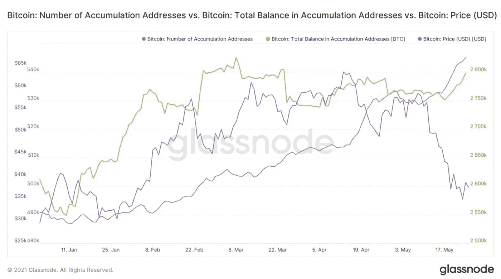
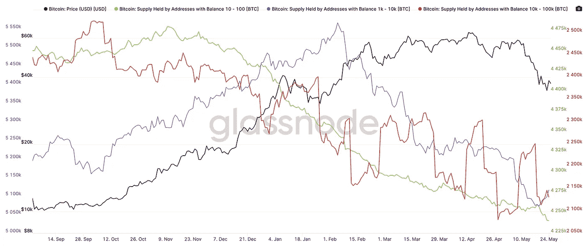
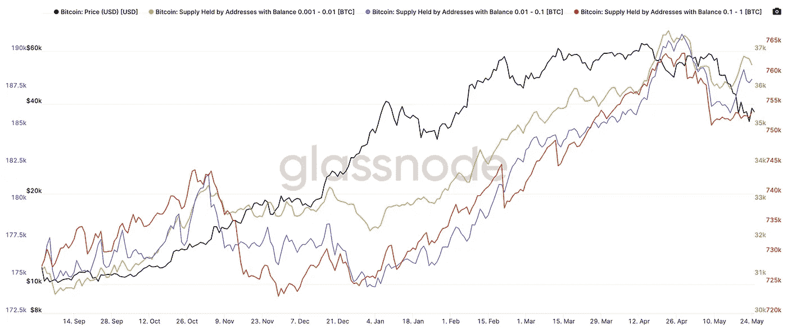
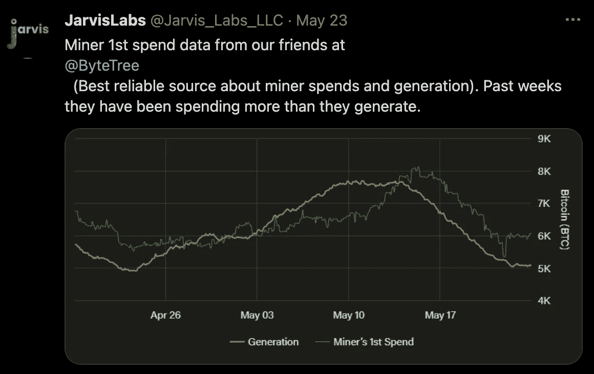
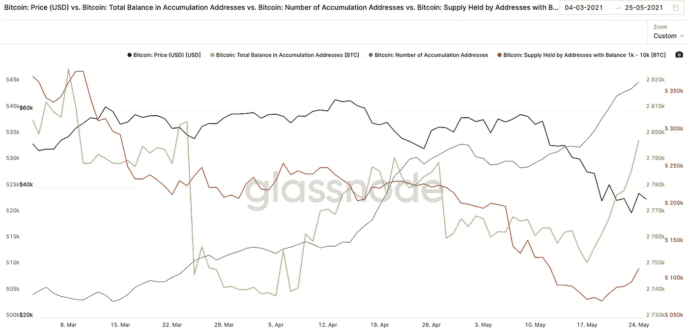

# 加密的替罪羊:Elon 和零售

> 原文：<https://medium.com/coinmonks/the-scapegoats-of-crypto-elon-and-retail-7ee61dd202c1?source=collection_archive---------4----------------------->

称之为威科夫……称之为顶部分配模式……称之为鲸鱼抛售散户……称之为矿工抛售……称之为想要更低价格的场外交易柜台……

都很准确。

你唯一不能做的就是说是 Elon 或者 retail 造成的。

他们是替罪羊。

如果你关注的任何一个分析师说他是 Elon 或者散户，不要关注他们或者停止阅读他们的作品。他们在伤害你。

相反，是三连胜导致了当前的价格。

今天，我想带你看一看这三件事，以及我们现在是如何见证这种逆转的。

更重要的是，这些板块正在以这样一种方式移动，即长期牛市不仅完好无损，而且正在增强。

然后我会用一些灰色的素材和氦来结束今天的演讲。

有很多内容要讲，所以让我们开始吧。

# 罪犯

三巨头由鲸鱼、矿工和市场推动者组成。

前两个主题你可能已经读过了。后者是一个你可能在我们的警报中看到过的话题。事实是，他们都促成了抛售。

我知道每个人都喜欢 4chan 的家伙，矿工前线运行市场，或其他类似故事的阴谋。但是现实主义者认为这三个实体都是独立行动的。

首先是鲸鱼。

查看它们的最佳方式是通过积累模式。

从二月中旬到抛售期间，累积地址的总余额停滞不前。这是下图中的绿线。蓝色是比特币的价格。

与此同时，累积地址的*数量*也在增长。

当这些地址中的 BTC 平衡时，地址的数量是如何增长的？

通过易手。

以下是一些大钱包的人口统计数据。每一个都显示了在三月、四月和五月供应的减少。

不要太在意这张图表。人们很容易陷入许多不同的事情中，例如钱包如何在出售前用于分期付款，比特币基地如何使用新的保管协议将 BTC 分成更小的金额，以及有多少鲸鱼不再只使用一个钱包…

我在这里简单地传达的事实是，曾经在上面的图表中显示为积累的更大的钱包不再这样做了。也就是曾经积累的更大的钱包正在出售。

拿走售出的 BTC 的实体是更小的钱包。

果不其然，当我们改变人口统计学上看钱包少于 1 BTC…我们看到购买。

现在，在下面的图表中，这还不足以获得 BTC 上市的 10 万多股。

这只是为了说明那些余额较少的人在积累，而那些钱包较大的人不再积累。

这就是为什么我们称这种横向模式为大钱包向小钱包的分配事件。随着时间的推移，这在价格上是不可持续的。你需要大钱包来推动需求，以获得更高的价格。

然后矿工们就像一堆堆的东西…

从 5 月 11 日到 16 日，矿工的钱包在“消费比特币”。这在下面推文中的绿线中可以看到。这要感谢我们在 ByteTree 的朋友，他们在追踪矿工钱包方面做得很好。关注 5 月 11 日的价格很重要，因为那是抛售真正开始的时候。

所以那时我们有鲸鱼出售和矿工出售。

然后最后…

市场推动者。

其中最臭名昭著的是[巴勃罗](https://jarvislabs.substack.com/p/who-crashed-the-market)。他是去年 3 月 Covid 坠机事件的重要人物。他或她这次又活跃起来了。

似乎在过去的几个月里，每当我们联系该实体时，它都在测试大约 5 万美元的支持。在 Elon 发布推文之前，当 price 接近 50k 美元时，他们再次进行了测试。然后在埃隆的推特之后，运动升级了。一旦价格突破，就无法停止。

我们跟踪的市场推动者看到了价格的疲软，并积极攻击它。

这是一个场外交易商想要为客户提供更低的价格，就像网上的阴谋所暗示的那样吗？也许吧。

不管怎样，市场推动者继续推高价格，毫不留情。这些都记录在我们追踪的与价格相关的钱包里。他们让我们的警报系统超负荷运转。

现在，这一切都归结为鲸鱼卖了一段时间。在 Elon 发推特并加入鲸鱼销售之前，矿工们就已经在卖了。鲨鱼(市场推动者)攻击鲸鱼和矿工抛售造成的市场疲软。

更有甚者，retail 在 Elon tweet 上并没有卖出去。

埃隆的推特只是在他出现之前就已经发生的事情。

此外，这是现场驱动的。许多人表示，这要归咎于杠杆。但是这里有一个快速统计…

4 月 17 日，价值超过 90 亿美元的 BTC 被清算。那一天，价格下跌了 15%。

伊隆发推特当天 70 亿美元被清算。价格下降了 35%。这是在他发推文前一周比特币下跌 23%之后。

然而，一些业内资深人士指责衍生品交易所吸引了 100 倍的用户……这肯定不是罪魁祸首。我们需要问为什么这些老兵试图指责？这很可能会推动他们自己的议程。

但是不跑题…

鲸鱼、鲨鱼和矿工通过现货市场压低了价格。他们实现了高价退出的梦想。但它们会回来吗？如果会，会上升吗？

在下面的图表中，累积地址的数量(蓝色)、累积地址的总余额(绿色)和一个鲸鱼种群(红色:1k-10k 大小)正在累积。

因此，我们可以立即看到这些实体没有离开 crypto。他们还在这里，还在购买。如果他们购买，那么很可能是相信未来价格会更高。

这有利于长期牛市观点保持一致。我们将继续不时地审视这一点，以重申这一信念。

至于灰度如何在这一切中发挥作用…

# 灰度等级

如果我们假设我们在链上看到的(鲸鱼现在从卖转为买)和我们在一系列解锁中的事实…

我们需要假设 GBTC 正在卸货。这就是折扣持续增长的原因。

但随着这种下降，折扣缩小，同样的人口统计和积累模式也可能出现在灰度中。不幸的是，我们不能像使用链上工具那样看到这些人口统计数据，所以我们需要假设它是相似的。

如果我们的假设是正确的，那么对于那些寻求溢价回报的人来说，这是一个好消息。事实上，溢价回归的可能性似乎比以往任何时候都大。

我们的鲸鱼需求在增长，折扣在缩小，资产价格在下降。与此同时，我们正处于大规模解锁的早期阶段，一些大公司将于 6 月底上市。

(刚接触浓缩咖啡，不知道灰度效果是什么？[阅读此处](https://jarvislabs.substack.com/p/the-grayscale-effect)了解更多信息)

通过名为 Simplify (SPBC)的新 ETF 抛出新的 GBTC 股票需求，DCG 干粉准备购买 GBTC，市场 FOMO 目前在融资利率下 6 英尺……剧本是为溢价在 6 月底前回归而绘制的。

现在需要的是在 6 月底前提高价格。这就是我关注的焦点，为了让这种效应在这里发挥出来，什么时候折扣需要缩小。

这里正在发生好的发展。它告诉我们，我们可以有一个强劲的牛市下半年。只是需要一点时间来再次预热引擎。

你的脉搏在加密，

本·莉莉