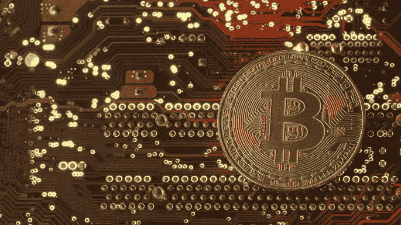

# 稀缺性问题:为什么加密货币如此具有争议

> 原文：<https://medium.com/coinmonks/the-scarcity-problem-why-cryptocurrencies-are-so-divisive-1ecab558c2e2?source=collection_archive---------3----------------------->

在加密信徒和加密怀疑者之间的争论中，一个总是出现的主题是关于加密货币的内在价值以及这与它的稀缺性之间的关系。理解加密货币所需的陡峭学习曲线在这场辩论中没有帮助，因为它通常可以归结为“如果你没有得到它，你就不配获得这场革命的回报”或“我为什么要帮助一个在我看来像 FUD(恐惧、不确定性和怀疑)一样传播的人”。

诚然，许多加密货币现在都被高估了，在没有一个可用产品的情况下筹集了数十亿美元，但其背后的技术值得双方进行更多的审查和理解。内在价值和稀缺性之间的这种关系非常重要，因为简化的论点往往会将人们推向两个对立的派别:

*   盲目的信徒:那些对加密货币赞不绝口，却对该技术的局限性没有更细致入微的理解的人。这种信念建立在加密货币将如何摆脱中间人并通过将信任转移到分散网络来赋予个人权力的模糊想法上。在最好的情况下，他们大大低估了将理论转化为实际工作产品的难度。

> 咒语:密码将拯救世界，组织对此无能为力。你可以在这个过程中轻松致富，因为中间商产业价值 XXX 亿。

*   不屈的怀疑者:那些认为加密货币只不过是金字塔/庞氏骗局或类似郁金香崩盘的投机狂热的人。这是基于一种信念，即加密货币没有任何附加值，其估值只是由人为的稀缺性驱动的。

> 咒语:加密货币是 FOMO(害怕错过)推动的快速致富计划。即使这项技术是有用的，现在投资也没有意义，因为在这个过程中会出现更好的技术。

**迷失在翻译中**

首先，根据个人对该行业的了解，“加密货币”一词往往有不同的含义。快速搜索将提供以下定义:

> 一种数字货币，使用加密技术来管理货币单位的生成和验证资金转移，独立于中央银行运行

这确实解释了什么是“加密货币”,但对于不熟悉的人来说，他们唯一能在现实中将其与主流媒体对比特币疯狂价格上涨的报道联系起来的方法。那些稍微深入挖掘的人最终会发现，“加密货币”包含了一整套数字货币，每种货币都有不同的设计和用途。因此，这种差异会立即导致沟通中断。

这是一个重要的区别，因为内在价值和稀缺性的论点取决于加密货币的具体实施。这种缺乏区别可以比作认为文具只包括一支笔，当然这是大多数人会想到的东西，但有这么多种类型的笔，甚至其他工具服务于不同的目的。

一般来说(为了简单起见)，加密货币分为 3 类:

*   价值储存:把这想象成黄金的数字版本
*   交易媒介:现金的数字版本
*   特殊令牌:特定网络独有的令牌，允许持有者加入网络

这些类别是非排他性的，但每种加密货币都有不同的等级，这取决于它们的设计。

**数字黄金**

[https://www.thetimes.co.uk/article/bitcoin-plundering-of-52m-highlights-dangers-in-the-digital-gold-rush-m3q3f9rvd](https://www.thetimes.co.uk/article/bitcoin-plundering-of-52m-highlights-dangers-in-the-digital-gold-rush-m3q3f9rvd)

现在实施的比特币(BTC)倾向于成为价值储存手段(交易吞吐量低、交易费用高、结算时间慢)。因此，这就是为什么稀缺论点总是与它联系在一起，以及为什么许多怀疑论者嘲笑比特币成为全球数字货币的想法。

如果你想到实物黄金，人们大多会“投资”它，因为历史已经证明，社会作为一个整体对拥有一定数量的黄金有一定的价值。因此，他们确信未来会有买家购买他们的黄金。黄金有几个关键特征，这使得它在社会眼中很有价值:

*   有限的用途:黄金的其他用途很少，因此确保其“价值”主要由社会决定
*   稀缺:供应有限，开采黄金需要大量的工作。与确保价格稳定的现有库存相比，开采的数量也很少
*   相对可替代性:一盎司黄金与另一盎司黄金无法区分，从而实现隐私、匿名和可分性
*   耐用:一根金条可以用很多辈子

从这个意义上说，比特币与实物黄金有很多共同特征，并比数字黄金更进了一步。本质上，比特币让这种“价值储存”资产的使用变得更加民主:

*   不相关的物流成本，因为资产的移动是以数字方式发生的
*   维护成本最低，因为除了设备访问网络之外，不需要任何物理存储
*   增加了进入市场的途径，因为只需要一台设备和互联网

在这两种情况下,“价值”在于人们对网络本身的信任，因此这是一个社会重新定义什么是每个人都同意的“安全”价值储存的例子。如果你感兴趣，这是一篇很棒的文章。

**数字货币**

[https://www.information-age.com/future-digital-currency-123471159/](https://www.information-age.com/future-digital-currency-123471159/)

至于交换媒介的说法，比特币现金(最初比特币的一个分支)等加密货币以其更高的交易速度和更低的交易成本更适合这一角色。由于比特币现金的设计，交易成本显著降低，支付相对即时。这使得小额交易得以发生，而这在传统银行业中是没有商业意义的。

对于更多地被设计为数字货币的加密货币来说，投资于它并希望在升值中获利是没有多大意义的，这实际上削弱了它作为货币的用途。稀缺性论点在这里并不适用，但现在有人投资它，因为它仍处于非常早期的阶段。实际上，他们希望在这种货币被大规模采用后找到更高的均衡之前投资于它。这是一种可能性，因为与法定货币相比，这些加密货币的总市值微不足道。一个重要的警告是，这依赖于货币具有很小程度的“价值储存”特征。

**特殊令牌**

至于特殊的代币，稀缺的论点在这里只适用于股份适用于早期风险资本主义。你可以把这些代币想象成预先购买打折门票，以便为嘉年华的建设提供资金(这不是我的类比，但我不记得在哪里看到过)。人们现在购买这些代币，希望他们能够以折扣价加入未来的网络。这些代币应该作为开发者的初始资金，以及网络参与者交流价值的一种方式。

必须注意的是，目前大多数人购买这些代币，目的是一旦代币升值就在公开市场上出售。这违背了它作为融资工具的全部目的，因为这种投机目的给网络带来了显著的波动性。许多骗局是建立在出售他们的代币的稀缺性和个人如果现在购买代币可以得到多少折扣的基础上的。

**比特币未来会被取代吗？**

反对现在投资加密货币的另一个理由是，这是一项未经证实的技术，未来将会出现 2.0 版本，因此现在投资它没有意义。这绝对是一种可能性，但由于加密货币本质上是代码，它们可以像任何计算机上的软件一样升级。主要区别在于，在对网络进行这种改变之前，网络的大多数必须同意。如前所述，这种加密货币的价值在于网络，因此，那些已建立用户基础的加密货币可能会进行代码升级，然后采用全新的未经验证的加密货币。

**结论**

稀缺性论点是对加密货币工作方式的过度概括，因为它有效地将所有加密货币归入一个篮子。因此，加密货币的内在价值也在很大程度上取决于加密货币的目标。它可以是轻松访问“价值存储”资产的能力，可以是轻松进行微交易的能力，也可以是特定加密货币引入我们生活的附加值。

加密货币使价值链中的参与民主化，并消除了组织和个人之间不对称的权力关系。加密货币并不能完全取代政府或中间人系统，而是为这些中央系统提供了一种替代方案。它的适用性肯定是有限的，但是它被有效地推广的意义是巨大的。话虽如此，我们需要抛开宣传。当我们不再试图将加密货币和区块链作为解决所有问题的灵丹妙药，而是专注于找到手头问题的正确解决方案时，这就是加密货币真正为社会增加价值的时候。

*对于那些更了解加密货币的人来说，我承认主要的过度简化，特别是关于 3 个分类，但这是为了清晰起见。*

*谢谢你坚持到最后。希望听到你的想法/评论，所以请留言。我在 twitter 上很活跃*[*@*AwKaiShin](https://twitter.com/awkaishin)*如果你想收到更多易于理解的加密相关信息，或者访问我的* [*个人网站*](https://www.awkaishin.com/) *如果你想要我的服务:)*