# Dapps 可以成功地与审查网络竞争

> 原文：<https://medium.com/coinmonks/the-search-for-the-killer-dapp-fda1971d38d6?source=collection_archive---------1----------------------->

*tldr；优先考虑抵制审查的智能合同平台可以成功地与 Tor 隐藏服务和审查网络竞争。*

# 介绍

以太坊的社区最近一直在谈论以太坊的更名。这是 dapps 没有达到以太坊曾经被认为是世界计算机的期望的结果。有 dapps，他们工作，但他们未能找到产品市场适合和吸引用户。以太坊社区现在正专注于少数似乎最有前途的 dapps，通常是金融工具，如交易所和抵押品支持的资产，将以太坊的叙事称为开放金融。

在这里，我使用基本原则来确定我们应该如何利用 dapps 来寻找更好的产品市场匹配，重点是经过审查的网络。

# 什么是杀手级应用？

来自[维基百科页面](https://en.wikipedia.org/wiki/Killer_application):

> 一个**杀手级应用**(通常简称为**杀手级应用**)是任何[计算机程序](https://en.wikipedia.org/wiki/Computer_program)，它是如此必要或可取，以至于它证明了一些更大技术的核心价值，例如……一个[软件平台](https://en.wikipedia.org/wiki/Software_platform)...[【1】](https://en.wikipedia.org/wiki/Killer_application#cite_note-1)换句话说，消费者购买(通常昂贵的)硬件只是为了运行该应用程序。一个杀手级应用程序可以极大地增加它所运行的平台的销量。[【2】](https://en.wikipedia.org/wiki/Killer_application#cite_note-Killer_Application_Feb_1989-2)[【3】](https://en.wikipedia.org/wiki/Killer_application#cite_note-Killer_App_1989-3)

因此，我们只需要找到一些需要区块链和 dapps 独特属性的东西，它需要解决比其他平台更有效地推动消费者采用的根本问题。这方面的例子有方便 Windows 购买的 Internet Explorer 和方便个人电脑购买的电子邮件。

# 关于 dapps

## 性能

1.  它们允许信任最小化的计算。
2.  它们与货币体系紧密相连。
3.  它们可以抵制审查(依赖于平台)。

dapp 有时被描述为实现无许可创新，但这更多地是因为加密货币和 dapp 缺乏监管，而不是因为其现有的任何属性。

DAO 利用了第一点，信任最小化，根据股东的偏好公平地分配资金。“开放金融”的叙事是利用#2，与货币系统的耦合，创造金融工具。这篇文章将关注第三点，抵制审查。

## 性能指标

.

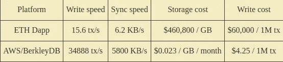

ETH dapps vs. AWS/BerkleyDB

与集中式服务相比，以太坊上 dapps 的性能指标效率低得惊人。据我所知，没有任何性能指标表明 dapps 在哪些方面优于集中式替代方案。这就是说，dapps 不太可能与作为通用计算和数据存储平台的 web 服务竞争。更糟糕的是，任何技术改进都将适用于 AWS/BerkleyDB，就像它们适用于 dapps 一样。

用户通常会选择能够解决他们潜在问题的任何解决方案。不幸的是，这些问题通常是速度和成本，这是分散式系统所不擅长的。这就是说，如果没有一个非常非常好的商业理由，dapps 试图与现有的 web 服务竞争是没有多大意义的。相反，我们可以为 dapps 找到一个合适的位置，利用它们的特性比集中式服务更好地解决特定的问题。幸运的是，抵制审查是 dapps 擅长的事情，而网络服务是弱项。

# 我们对审查的威胁模型是什么？

## **政府**

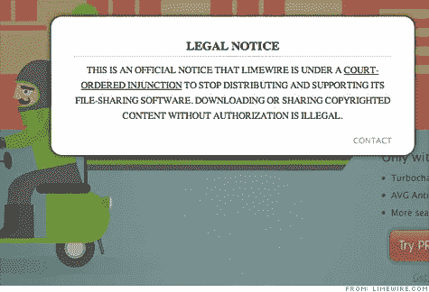

Government censorship of a filesharing service for violating copyright law

这是最明显的例子。任何可能违反成文法的服务，任何违背强大政治或商业集团利益的服务，任何违背政府利益的服务等都处于危险之中。这需要一种非常复杂的审查——抵制，这种抵制是巧妙地分散的，并在法律的范围内运作，或者仅仅是任何人都无法控制的东西。想想 Napster，维基解密，BitTorrent，Backpage。

## **平台所有者**

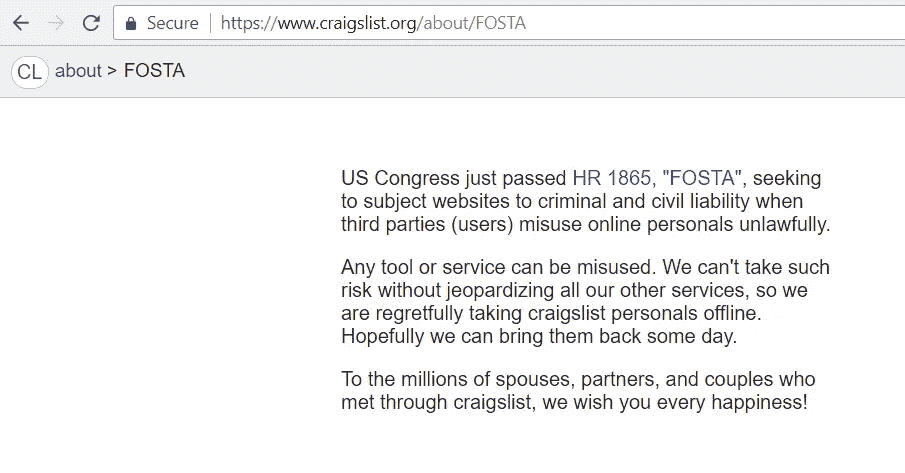

US congresses passes FOSTA which makes websites criminally liable for the content users post. This created an exemption to safe harbor laws. Now sites could be criminally liable if users were engaging in prostitution.

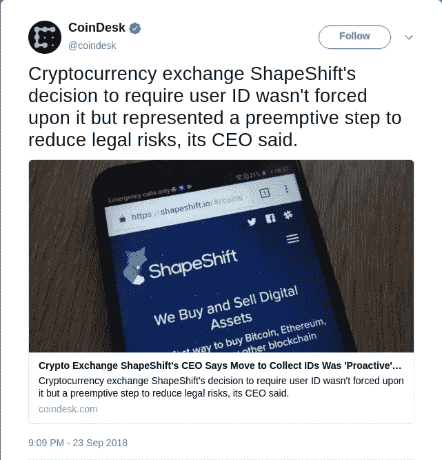

[Shapeshift implements KYC do reduce legal risks](https://www.coindesk.com/crypto-exchange-shapeshift-erik-voorhees-kyc-proactive/)

通常平台会在政府施压之前实施审查。这就是为什么 Craigslist 关闭了他们的个人主页；为什么 Twitter 正在清除机器人；为什么变形需要 KYC；以及为什么脸书/YouTube 会删除可能被认为是不良的内容。平台也会删除不利于他们成长的内容，这也是为什么平台会频繁删除裸露，允许用户举报骚扰的原因。如果审查不是因为政府的压力而发生的，那么就不需要改变建筑。答案就是在另一个平台上运行这项服务，拥有更友好的所有者。

在这篇文章中，我主要关注来自政府的审查阻力，因为这是唯一需要一种新平台的案例。还有一些被政府压制的商业模式。

# 政府如何实施审查

## **服务合法**

政府以联邦指控相威胁进行恐吓，这可能会使房主在监狱里呆上几十年。如果他们不遵守，像 Backpage 或维基解密，那么他们经常被切断与银行和信贷处理公司使用相同的恐吓方法。根据民事和刑事资产没收，个人和公司资产可以被冻结，而不需要所有人被判有罪。

他们的家或办公室可能会被搜查。政府可以牵线搭桥，让主流媒体以不那么恭维的方式来报道你，目的是为了让公众产生偏见，而陪审团将从公众中选出，对你进行审判。一次被控一项不相关罪行的概率出乎意料地高(例如[朱利安·阿桑奇](https://en.wikipedia.org/wiki/Julian_Assange#Swedish_sexual_assault_allegations)、[科迪·威尔森](http://www.foxnews.com/us/2018/09/19/cody-wilson-gun-entrepreneur-accused-sex-with-minor-left-us-for-taiwan-officials-say.html))。还在继续。[看看海盗湾的历史，感受一下这个](https://en.wikipedia.org/wiki/The_Pirate_Bay#Incidents)。

## **服务不合法**

立即没收个人和公司资产并逮捕所有人。如果你住在国外，像金·多特康姆，你会被引渡。

## 政治和法律游戏

当所有其他途径都失败时，一个松散相关的话题被严重政治化，并被用来通过一项新的法律。出于自我保护，平台将关闭任何可能让它们面临风险的服务。FOSTA-SESTA 的情况可以说是如此，在那里[性工作平台在性贩运](https://motherboard.vice.com/en_us/article/vbxqv3/backpage-sex-trafficking-texas-carl-ferrer)的幌子下成为目标。

政府的恐吓非常有效，以至于平台会根据律师的建议先发制人地进行审查。平台审查的动机是自由审查。审查太少会使网站运营商面临被起诉的风险，审查太多只是为了处理用户投诉。这是一个容易的决定。

# 现实世界中的审查阻力

## clearnet 网络服务有多抗审查？

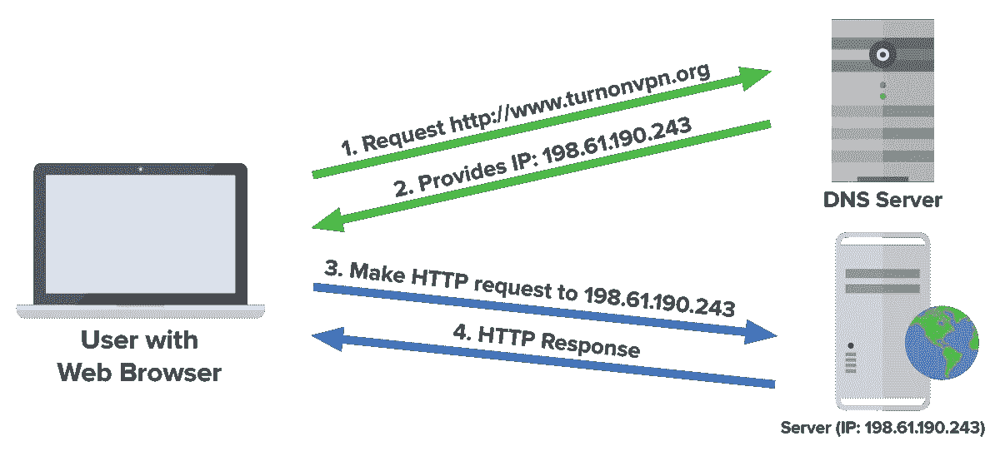

When you visit a website in your browser, you first talk to a DNS server to get the IP address.

当您在浏览器中访问某个网站时，您的电脑会要求 DNS 解析器找到与该域名相关联的 IP 地址。用这个 IP 地址你可以直接联系网站。IP 地址是由保存客户记录的互联网服务提供商分配的。如果一个政府想要审查一个网站，他们就去找相应的 ISP，询问与 IP 地址相关的客户信息。执法部门可以使用这些信息来追踪服务器的所有者，并对服务器进行物理控制。

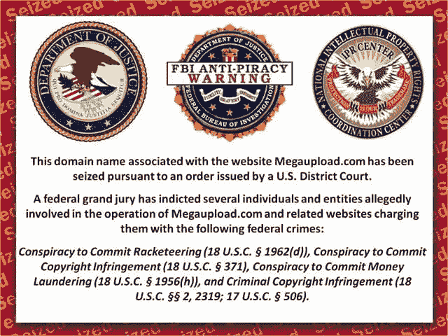

Megaupload.com is shut down and the owners are indicted on 28 counts of copyright infringement and money laundering.

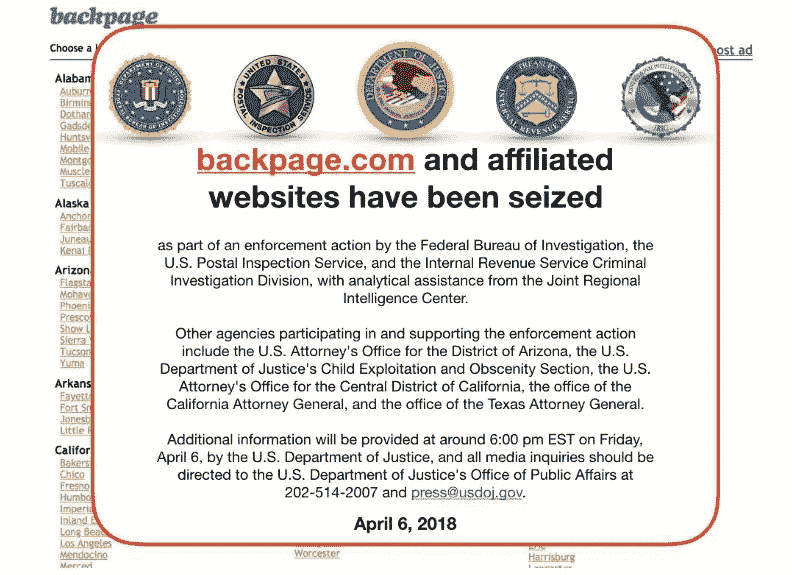

Backpage gets shut down. The owners are charged with a 93-count federal indictment.

clearnet 网络服务缺乏对审查的抵制是如此严重，以至于你对审查盛行的看法被生存偏见所玷污。Clearnet 网站很容易受到审查，以至于很少有人试图托管容易受到审查的内容，因为政府已经以一种非常公开的方式[对其他网站做出了榜样](https://www.npr.org/sections/thetwo-way/2018/04/09/600360618/backpage-founders-indicted-on-charges-of-facilitating-prostitution)。

绝大多数被审查的网站很快就消失了，再也没有出现过，也没有留下他们短暂存在的痕迹。幸存下来的是由生活在更友好的司法管辖区的积极分子托管的，或者仅仅是托管其他非目标内容的平台。

## Tor 隐藏服务的审查阻力有多大？

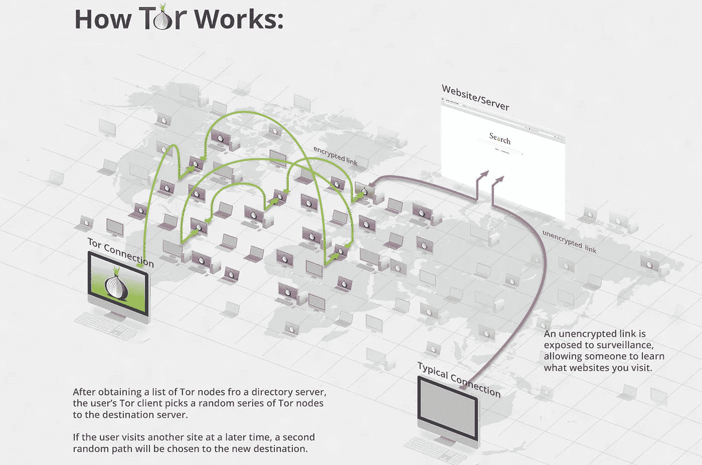

To talk to a hidden service, your request is routed through 6 computers with an encrypted link. To talk to a clearnet web service without Tor, you connect to them directly with an unencrypted link. Neither the user nor hidden service know each other’s real IP address.

网络服务中最先进的抵制审查的方式是使用 Tor [隐藏服务](https://en.wikipedia.org/wiki/Tor_(anonymity_network)#Hidden_services)。服务通过它们的洋葱地址来访问，比如[facebookcorewwi . onion](https://en.wikipedia.org/wiki/Facebookcorewwwi.onion)。Tor 是一个代理覆盖网络，或者说是互联网之上的一个通信协议。当你从 Tor 隐藏服务中请求一个资源时，这个请求会被传送到几台电脑上，这些电脑永远不知道你是谁，你的信息内容，以及你同时在和谁说话。通过这种方式，任何最终用户都无法直接知道他们正在与之对话的网站的 IP 地址。

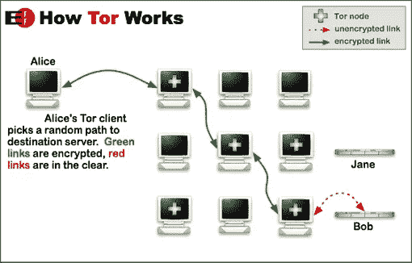

You can use Tor to talk to a clearnet service, in which case you have an encrypted link proxied through three computers. This protects the user’s anonymity.

Tor 隐藏服务通过混淆服务器的真实位置而生存。Tor 网络不提供完美的隐私，这种匿名性可能会被破坏。一旦找到隐藏服务的 IP 地址，就可以监控服务器以识别管理员。从历史上看，确定一个 Tor 隐藏服务的位置通常需要一定的复杂程度，通常只有政府才能做到。这就是说，良好的审查阻力只存在于低价值的目标。

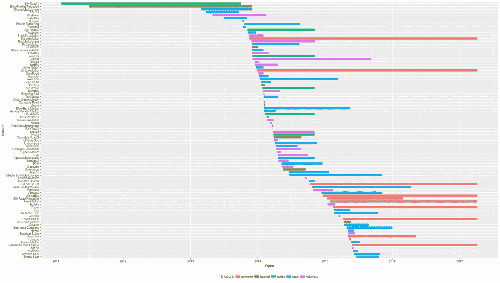

A chart of darknet market lifetimes from [https://www.gwern.net/DNM-survival](https://www.gwern.net/DNM-survival)

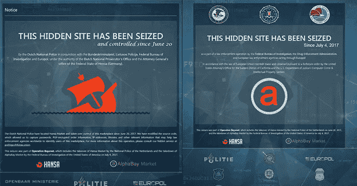

Darknet markets Hansa and Alphabay were taken down in Operation Bayonett, a 10-month multinational law enforcement effort.

暗网市场是隐藏服务最著名的例子，也是政府的高价值目标。市场本身不会存在很长时间，很少能坚持到三年。

运行一个容易受到审查的隐藏服务的主要问题是，如果它们被去匿名化，它会给管理员带来危险。第一个暗网市场管理者罗斯·乌布里希特被判[两项无期徒刑外加 40 年不得假释](https://www.theguardian.com/technology/2015/may/29/silk-road-ross-ulbricht-sentenced)。在这次调查和审判中，有多起严重违反第四修正案和第八修正案的行为。该案中的多名联邦特工被判犯有与其案件工作相关的罪行([来源](https://arstechnica.com/tech-policy/2015/10/corrupt-silk-road-agent-carl-force-sentenced-to-78-months/)、[来源](https://www.reuters.com/article/us-usa-cyber-silkroad/ex-agent-in-silk-road-probe-gets-more-prison-time-for-bitcoin-theft-idUSKBN1D804H)、[来源](https://arstechnica.com/tech-policy/2017/11/ex-agent-corrupted-by-silk-road-sentenced-to-2-additional-years/))。表面上看，这些都不重要，因为乌尔布利特的定罪从未被推翻。这就是说，政府会轻易地违反自己的宪法和法律来审查高价值的目标，很少会面临处罚。

## 以太坊 dapps 有多抗审查？

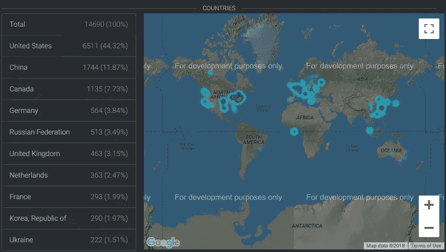

Ethereum nodes from [https://www.ethernodes.org/](https://www.ethernodes.org/network/1)

如果不取消用户对区块链完整性进行信任最小化验证的能力，就不可能删除不良内容。《以太坊区块链》目前大约有 15000 本。公平地说，以太坊提供了比 Tor 更好的抗审查能力，因为数据分布更加广泛。隐藏服务通常只在减少分布式拒绝服务攻击的影响的程度上进行分发。

Dapps 还为访问内容提供了更好的隐私，因为运行完整节点的用户下载整个状态，而不会暴露他们正在访问的信息。隐私暗示是在发送事务时，因为传播事务的第一个节点很可能是它的来源。如果以太坊实施了像比特币的蒲公英 BIP 这样的隐私措施，将交易发送给容易受到审查的 dapps 对终端用户来说会安全得多。

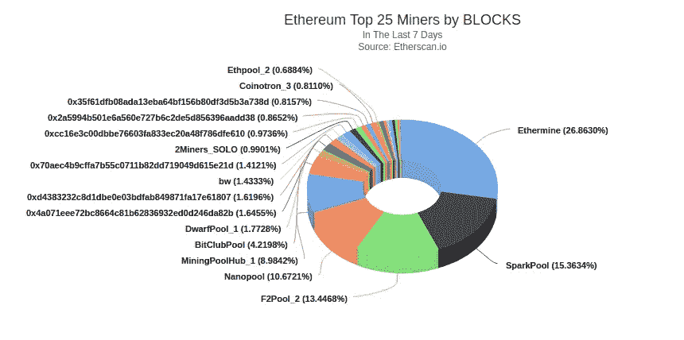

Ethereum hashrate distribution

以太坊有大约 20 个矿业集团，拥有超过 0.5%的总哈希值。这是区块链审查制度的弱点，因为如果矿商不接受某些智能合同的交易，就没有人能更新 dapp 服务。到目前为止，dapps 的胜算很大，因为只有一个组需要将您的事务包含在一个块中，使其成为全局状态的一部分。举例来说， [Tor 有大约 826 个出口路由器](http://torstatus.blutmagie.de/)，如果被控制，它们可以对网络进行审查。重要的是，随着时间的推移，区块生产变得更加分散，因为政府审查这么小的群体并不困难。

The DAO logo

另一方面，以太坊的社区已经审查了一个带有[道](https://en.wikipedia.org/wiki/The_DAO_(organization))的 dapp。DAO 是一个有缺陷的智能合同，也是当时总乙醚供应量的 14%的托管人。可惜合同在提高 ICO 后很快就被黑了。社区决定通过改变区块链来改变全球状态，导致一个硬分叉。现在看来，在一个抵制审查的平台上，dapp 审查面临的最大风险是真实的社区。从这个意义上说，以太坊是正确的技术，但可能有错误的社区。以太坊经典是以太坊的少数派分支，它尊重 dapp 的不变性，对于容易受到审查的 dapp 来说可能是一个更好的选择。

最后，以太坊没有链上隐私。和比特币一样，所有的交易细节都是公开的，都是化名的。这是有问题的，因为它将任何与这些易于审查的 dapps 互动的人置于危险之中。区块链分析可以将地址与身份联系起来。通过可选混合的混淆不能提供强有力的隐私保证，并且通过公共网络移动大量令牌几乎是不可能的。通过区块链分析已经逮捕了许多人，但没有一个是通过使用像 Monero 这样具有强大的强制链上隐私的加密货币而被逮捕的。

迄今为止，还没有区块链被审查。这没有法律依据，即使有，也很难做到，因为每个管辖区都有数千个节点，[有时甚至在空间上](https://blockstream.com/satellite/)。尽管一些[区块链托管数据，否则将受到关闭通知](https://www.coindesk.com/child-porn-bitcoin-blockchain-what-it-means/)。我们有足够的信息表明，对于容易受到审查的服务来说，这是一个比 Tor 更好的平台，除此之外的问题涉及链上隐私、网络隐私、去中心化挖掘和保留不变性的概念。

# 什么样的审查服务对 dapps 有意义？

## dapp 市场的案例

与 dapp 市场最相似的是暗网市场，作为隐藏服务运行。从 2013 年到 2015 年，暗网市场[的全球收入预计为 1 亿到 2 亿美元。这显然是有市场的。](https://www.usenix.org/system/files/conference/usenixsecurity15/sec15-paper-soska.pdf 100-200M yearly.)

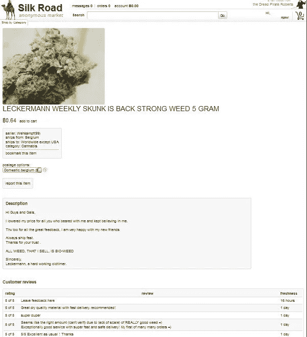

A listing on Silk Road. Listings are mostly text with an optional image.

暗网市场面临着已知的最具对抗性的环境:来自多个司法管辖区的多个政府机构将协调拿下这些服务，并在此过程中自愿违反各自的法律(例如[Onymous](https://www.wired.com/2014/11/operation-onymous-dark-web-arrests/)行动和[刺刀行动](https://www.europol.europa.eu/newsroom/news/massive-blow-to-criminal-dark-web-activities-after-globally-coordinated-operation))。他们成功地摧毁了暗网市场，证明了一个更加分散的平台是必要的。这也表明优先考虑抵制审查的智能合同平台可能有一个经济护城河。

主要缺点是[没有强大的链上隐私和强制隐私，本地加密货币使用起来不安全](https://bitcoinmagazine.com/articles/danish-police-can-now-catch-criminals-who-used-bitcoin/)。但这并没有阻止市场实施和使用单独的货币，或开发链上/链下混合器来缓解这一点。

## dapp 赌博案

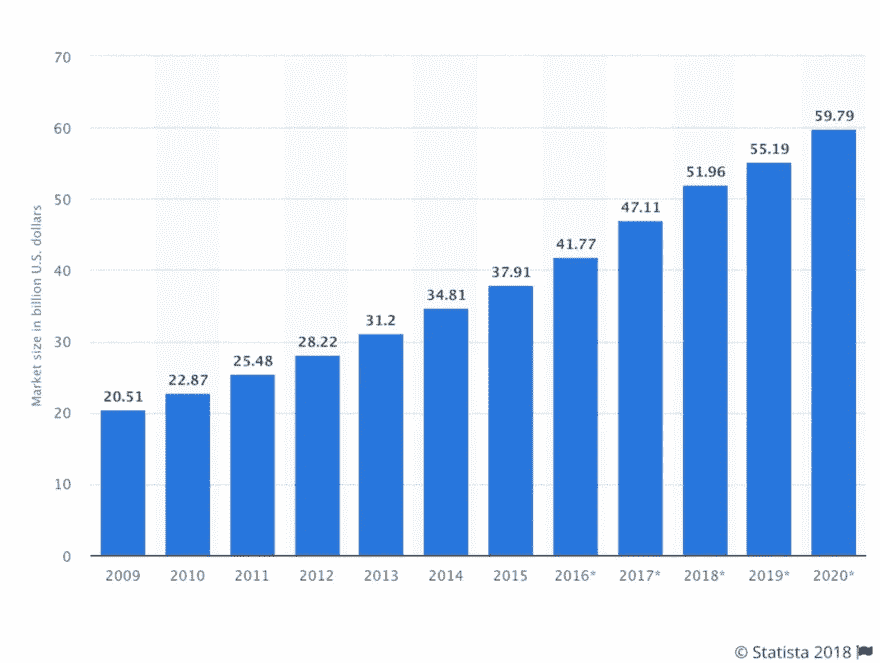

Worldwide volume of online gambling in from 2009–2015, with projections for 2016–2020.

网上赌博肯定能赚钱。尤其是在抗审查的平台上，提供信任最小化计算，并提供随机性来源(新的块散列)。在线赌博是区块链技术最受欢迎的应用之一。在以太坊，这是一个公认的主要类别。

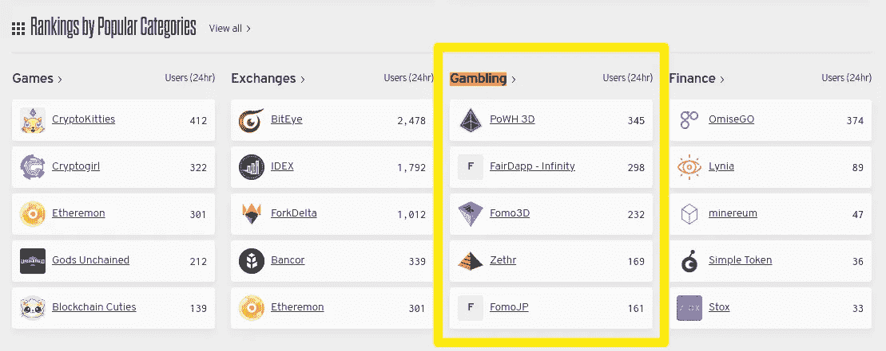

Gambling dapps have consistently been one of the most popular categories of dapps on Ethereum. From [www.stateofthedapps.com](http://www.stateofthedapps.com)

尚不清楚 dapp 赌博要可行，最低的分权水平需要是多少。尽管这在大多数司法管辖区是非法的或受管制的，但迄今为止，政府通常并不太重视这一点。目前，每一种加密货币都支持 dapp 赌博，其编程程度不受审查。如果政府真的取缔区块链博彩业，只有足够抵制审查的平台才会有经济护城河。

## dapp 分类广告的案例

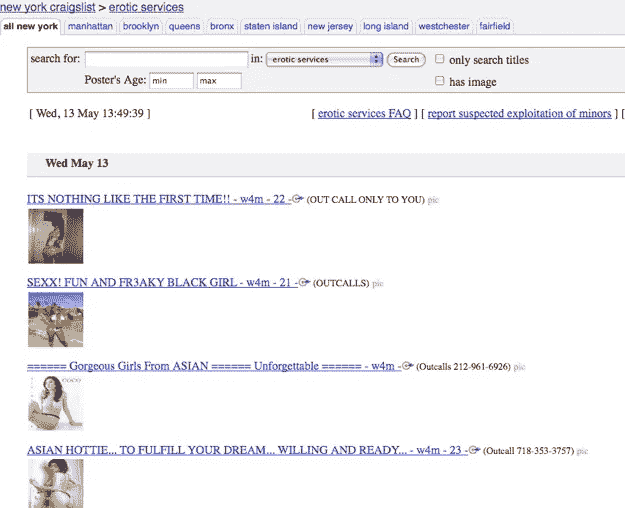

Craigslist erotic services. Listings have sparse descriptions with 1–5 pictures.

最接近的类比是性工作分类广告。据估计，2010 年，Craigslist 大约有 30%的收入来自成人广告。2015 年，他们的总收入为 1.22 亿美元。从 2013 年到 2015 年，Backpage 曾经让 [99%的收入来自成人分类广告，2014 年他们的总收入为 1 . 35 亿美元。](https://oag.ca.gov/system/files/attachments/press_releases/signed%20dec%20for%20arrest%20warrant%20pdf_Redacted.pdf)

[FOSTA-SESTA](https://en.wikipedia.org/wiki/Stop_Enabling_Sex_Traffickers_Act) 将网站通过托管用户生成的相关内容为性交易提供便利定为犯罪。现在，任何平台托管用户生成的与自愿性工作相关的内容都面临着极大的法律风险，而这种自愿性工作并不是贩卖人口。这可以说是 FOSTA-SESTA 的意图，因此性工作分类不能再存在于集中的平台上。

This jpg image is 64KB and would cost about [$29.44 to put on Ethereum](/@noahruderman/how-inefficient-are-dapps-c18062c80a71)

关于 dapp 平台的不确定性在于，它还没有作为隐藏服务被尝试过。我的印象是，没有一个足够精通技术的人试图以严肃的方式解决这个问题，这就是为什么没有 Tor 分类广告。不管怎样，如果有人成功地将它实现为隐藏服务并占领了市场，它很可能会像 darknet markets 一样成为高价值的目标。性交易是一个敏感的政治问题，就像毒品交易一样，所以我们可以推断，创建隐藏的服务分类广告就像创建一个暗网市场一样危险。

## 哪些审查服务对 dapps 来说还没有意义？

需要处理大型媒体文件或必须由同一实体频繁更新的内容的任何事情。交易费用累积起来，这些费用需要在实际服务的用户之间进行分配，这样才经济。种子、图库、视频等。考虑到上传 1 GB 数据到 Ethreum 的成本约为 460，000 美元，可能不划算。然而，如果它们增加了商业价值，小的压缩图像是可能的，并且随着技术的改进，对于只有几兆字节的介质来说，这可能变得更具成本效益。

# 当我们可以为这些服务使用专用产品时，为什么还要使用 dapps 呢？

有像 [OpenBazaar](https://openbazaar.org/) 、 [Syscoin](https://www.syscoin.org/) 、[particle](https://particl.io/)这样的产品，它们都寻求提供分散的市场。那么，当我们可以使用 dapp 平台时，为什么还要使用它呢？

## 通用 dapp 平台提供更高的隐私性

如果暗网市场在这些专业平台上站稳脚跟，这可能是它们唯一的主要用例。如果您托管了一个 Particl 节点，并且它的主要用例是用于暗网市场，那么可以推断您是一个用户、供应商或管理员，这种可能性不可忽略。对于通用智能合约平台，不能做出相同的推断，因为它们可以用于更广泛的应用。同样的观点也适用于其他被审查的服务。

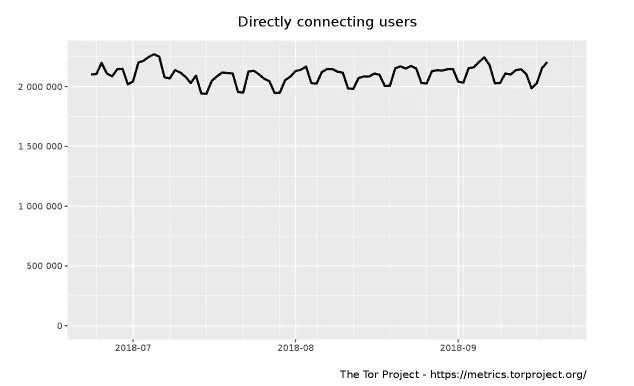

Daily active users of Tor from July — September 2018

例如， [97%的 Tor 流量用于 clearnet](https://www.theregister.co.uk/2017/07/29/tor_dark_web/) 。事实上，Tor 上最受欢迎的服务是脸书。 [Tor 也有超过 200 万的日活跃用户](https://metrics.torproject.org/userstats-relay-country.html)。Tor 被记者、罪犯、持不同政见者、隐私活动家以及显然很多普通人使用。Tor 的多种用途使得如果你知道某人正在使用该软件，就很难辨别他的信息。

## Dapp 平台支持多种实施方式和低切换成本

如果你不喜欢一个 dapp 实现，可以使用另一个，不需要下载新的链。也许完全自主的市场和管理的市场都是成功的。或者可能是一个市场效率低且昂贵，但另一个市场设计得非常仔细，以保持低成本(例如，上传未压缩数据与压缩数据)。也许有一个市场将 html、javascript 和 css 放在一个智能合约上，以实现一个真正伟大的前端。

## 单个 dapps 比整个服务更容易审计

隐私和安全也许是审查服务的重中之重。开源是最少的，但是对于专门的产品来说，可能对隐私产生实质性影响的代码量是非常大的。与整个软件产品相比，Dapps 需要审核的代码要少得多。对于需要分散平台的服务来说，共享一个平台会更容易。这样，审计就可以局限于 dapps 的业务逻辑。

# 有比智能合约平台更好的托管易受审查服务的替代方案吗？

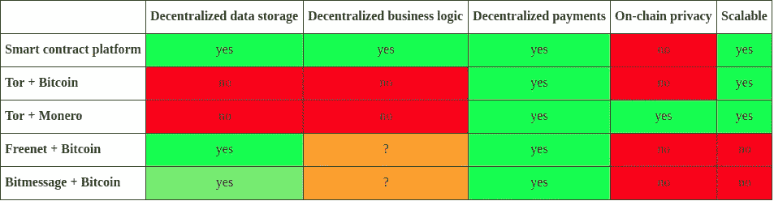

Smart contract platforms are competitive with Tor hidden services as a scalable, decentralized service.

## Dapp 平台是可扩展的

Freenet 和 Bitmessage 都是静态数据的分散数据存储。这非常类似于智能合约平台，但没有合约、虚拟机等，因此每个智能合约都具有所有者的任意写访问权限，以及被授权查看数据的其他所有人的只读访问权限。如果以太坊有智能合约，那么 Freenet +比特币或者 Bitmessage +比特币有哑合约。

因此，我认为 Freenet +比特币或 Bitmessage +比特币的可扩展性有限。业务逻辑需要由每个人手动实现，通信开销肯定非常高，除非买方和卖方通过即时消息进行交流。在这些平台上实现审查服务肯定是可能的，但用户体验是一种痛苦，与更熟悉的 Tor 隐藏服务相比，这些平台在这样使用时会感到尴尬。

## Dapp 平台是高效的

原来[智能合约平台是围绕一个抗审查的数据存储](/@noahruderman/smart-contract-platforms-vs-tor-bitcoin-for-censorship-resistant-online-services-545bd1f7a789)建立在线服务的逻辑结论。也就是说，如果我们从一个抗审查的数据存储开始，并要求它以分散的方式执行业务逻辑，我们就得到一个智能合约平台(即合约+虚拟机+区块链)。这表明，正如我们所知，智能合约平台在高层设计中已经很高效了。区块链需要序列化事务的执行顺序。如果我们找到一个更好的解决方案，它可能会是一个更好的智能合约平台，而不是一个完全不同的平台。

# dapps 如何作为一种类似网络的服务工作？

## 后端

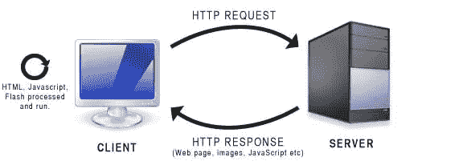

Client-server model. Dapps are just a server.

dapp 本身将承担[客户端-服务器模型](https://en.wikipedia.org/wiki/Client%E2%80%93server_model)中的服务器角色。对这个后端的只读请求将以远程过程调用的形式出现。这类似于 http GET 请求。写请求将以事务的形式到达网络。这类似于 http POST 请求。认证将通过地址控制来完成，这正是 dapps 已经在做的。

尽管智能合约代码是不可变的，但是软件设计技术可以利用合约的可变数据来代理对其他智能合约的函数调用，以便可以以经济高效的方式更新服务。当协议足够成熟时，可能会有一个终止开关来防止进一步的变化。

## 前端

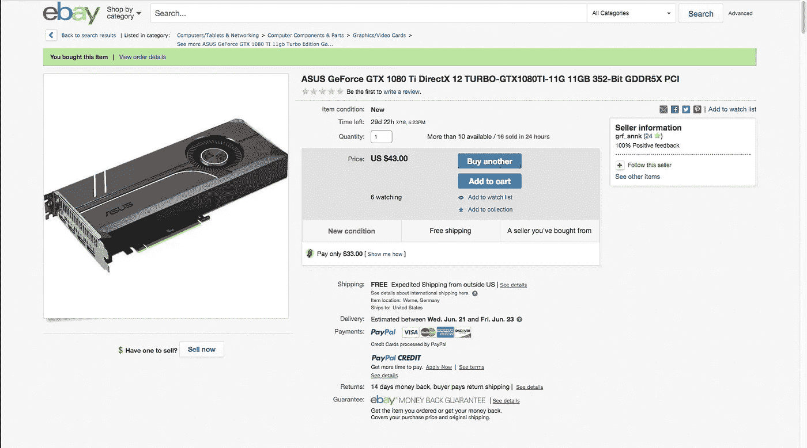

A dapp market accessed through a browser should feel similar to using Ebay.

用户界面将与 dapp 服务器严格分离。界面本身将从命令行界面开始，但最终将通过 web 浏览器实现。通过利用 dapp 的浏览器界面，Metamask 的想法是正确的，但对于容易受到审查的 dapp，最终用户应该运行自己的完整节点来保护他们的隐私。

目标是用户甚至没有意识到他们正在与区块链互动。Dapps 可以通过一个包含 html、javascript 和 css 的独立契约来呈现他们的用户界面。将来可能会有单独的合同独立实现用户界面，用户可以挑选。安全使用 dapp 的唯一要求是在线、同步的节点；一个浏览器；和一个私钥。

# 结论

作为一个通用平台，Dapps 效率太低，无法与网络服务竞争，但当人们决定利用它们的主要优势时，比如抵制审查，Dapps 可以发挥作用。极易受到审查的网络服务很快就会被关闭或转移到 Tor 隐藏服务。Tor 隐藏服务无法保护高价值目标，因为它们不是抗审查的，而是隐藏的，隐藏不足以防止审查。易于审查的服务需要一个提供审查阻力的平台。优先考虑抵制审查的智能合约平台有一个经济壕沟来托管容易受到审查的服务，这种需求比专门的平台更好地得到满足。