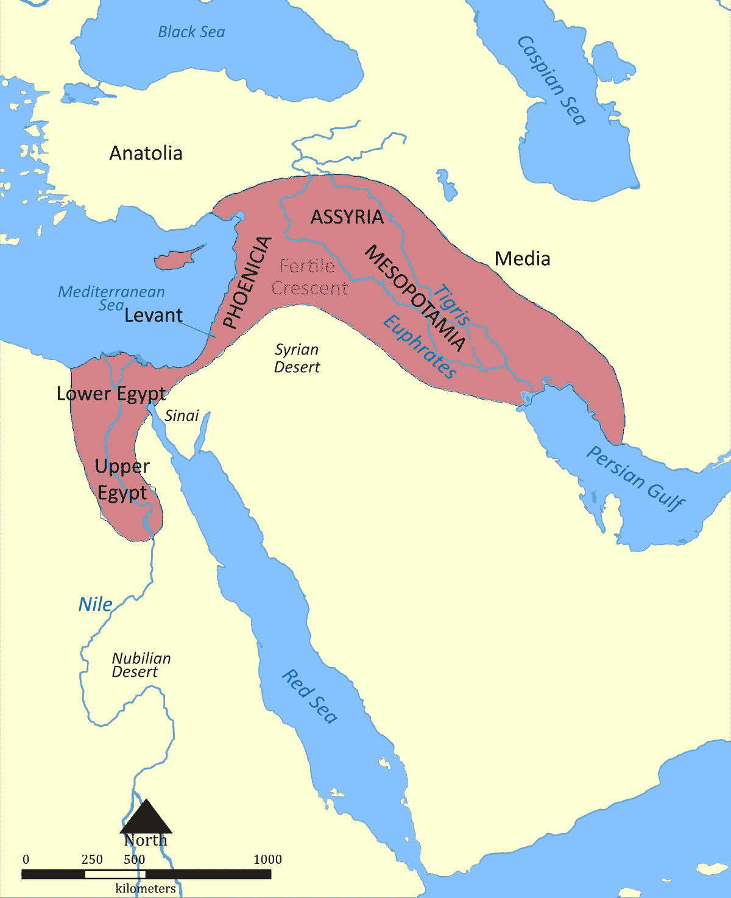

# 第二次农业革命

> 原文：<https://medium.com/coinmonks/the-second-defi-agricultural-revolution-54a1240adf3d?source=collection_archive---------0----------------------->

Mesopotamia is an ancient area between the Tigris and Euphrates rivers and spanning modern day Irak, Kuwait, Syria and Turkey. It the birthplace of civilizations like Sumer, Babylon and Assyria. [Source](https://en.wikipedia.org/wiki/Fertile_Crescent)

Y 公元前 9500 年(公元前)。在肥沃的底格里斯河——幼发拉底河流域，人类开发了历史上最重要的技术之一；栽培动植物的艺术和科学。T2 农业的发明是发展定居人类文明的关键。它使苏美尔农民积累了大量剩余的谷物和其他作物，这反过来又使他们能够形成城市定居点，如世界上最古老的城市之一[乌鲁克](https://en.wikipedia.org/wiki/Uruk)城。乌鲁克，在今天的伊拉克，在公元前 4000 年是世界上最大的大都市，大约有 80，000 居民。随着农业的发展，苏美尔扩展和城市化了这个地区，成为世界上最早的伟大文明之一。

在最初的几个世纪里，只有几种作物可供耕种。小麦，大麦，小米和其他谷物是第一批。大麦被广泛用于人类使用，但也有货币溢价，经常被用作一种支付形式(又名 [**商品货币**](https://bankless.substack.com/p/eth-and-btc-are-the-only-crypto-money) )。后来，发展了其他作物，如芝麻(用来榨油)、扁豆、无花果、黄瓜和苹果。世界上的其他地区也发展了农业，种植了更能适应其地理和气候条件的其他作物。地区间的贸易丰富了人们的食物供应。

Farming started as a manual activity. Diverse technologies were developed throughout the centuries to increase productivity and yield. . [Source](https://www.ancienthistorylists.com/mesopotamia-history/top-11-inventions-and-discoveries-of-mesopotamia/)

技术也与时俱进。起初，农民们手工收割庄稼。在接下来的几个世纪里，人类开发了新技术，如灌溉、作物轮作和肥料。他们成功地提高了土地的生产力，降低了风险。快进到 20 世纪:一场新的农业革命发生了。农业自动化和机械化等新技术极大地提高了生产率。

Y 公元 12 年(比特币之后)。一场数字农业革命正在发生。伴随区块链网络而来的 [**数字稀缺性**](https://bankless.substack.com/p/bitcoins-scarcity-game) 的发明和民主化，使得人类能够通过一种被称为**密码令牌(**又名 cryptoassets)的新型数字资产来虚拟地表示价值。2020 年 3 月[股市崩盘](https://en.wikipedia.org/wiki/2020_stock_market_crash)几个月后，比特币区块链首创的激励结构被用于新生的 [DeFi](https://blog.coincodecap.com/the-ultimate-guide-to-defi-decentralized-finance) 生态系统。它获得了 [**的名称**](/coinmonks/the-defi-agricultural-revolution-d6bca0a39d63) **。**

基本思想是奖励和激励用户提供对引导和操作网络至关重要的资源。这种奖励通常以协议的本地令牌支付。以比特币为例，**矿商**通过提供计算机能力为网络提供安全保障，并以平台比特币(BTC)的原生代币获得回报；在 DeFi 中，**流动性提供者**向[货币协议](https://bankless.substack.com/p/crypto-banks-vs-money-protocols)提供资本，并获得其原生令牌。产量养殖获得了**流动性开采的名称。**

在最初的几个月里，DeFi 几乎没有可以种植的数字作物。发行和交易衍生品的协议 Synthetix 和无需许可的借贷平台 T2 Compound 都是先驱。用户被激励将他们的资产投入到一个协议或一个分散的交换中。通过这样做，他们为一个新生的市场提供了流动性，并“耕种”数字资产，如[、](https://coinmarketcap.com/currencies/synthetix-network-token/)和[、](https://coinmarketcap.com/currencies/compound/)作为回报。某种程度上是对货币市场供给方的补贴。解决平台商业模式**鸡和蛋问题**的聪明方法。

The first “Digital Crops”: $COMP and $SNX

按交易量计算最大的分散式交易所 Uniswap 等分散式交易所使这成为可能。任何人都可以列出一个令牌，任何人都可以创建一个市场，无需许可。自动化创客创客(AMMs) ，一个定义新颖的事物，将彻底改变世界经济。

资本开始涌入协议。DeFi 和 Ether 开始增长抛物线。许多其他协议开始了他们自己的产量农业项目。产量农业热潮开始了，这引发了新的加密牛市。

Total value locked in DeFi growing parabolically since March 2020\. [Source](https://defipulse.com/)

在接下来的几周和几个月里，一系列全新的数字作物问世了。[平衡器](https://balancer.finance/)、自动做市商【BAL】、[曲线](https://www.curve.fi/)、去中心化稳定债券交易所(CRV)、通用市场准入(Universal Market Access)、衍生品平台(UMA)等等。[开发了复杂的策略](https://yieldfarmingtools.com/)来同时耕种几种资产，开发了[计算器](https://yieldfarming.info/)来优化产量。

资产的性质也开始发生变化。到目前为止，用户主要将代币放在他们的钱包里，并猜测它们将来会增值。不再是了。“闲置代币”现在体现了经济和政治权利。其中一些拥有[价值累积机制](https://bankless.substack.com/p/how-to-value-crypto-capital-assets)并向其持有人提供现金流，一些提供投票权以决定协议的进一步发展。这将它们转化为生产性资产，类似于股票等传统资本资产。

以太坊是开放的，没有权限。代码是开源的。几乎任何人都可以复制，编辑和重新部署智能联系代码。任何人都可以设计和发行虚拟资产。因此，各种各样的货币实验闪闪发光。新一代的 [**食物代币、**](https://tokenbrice.xyz/posts/2020/defi-moneygames/#level--1---erc-20-staking-pool---ok-if-the-code-is-safu\) 山药、寿司、咸菜等应运而生，其中不乏前代成功项目的叉子。所有这些都是实验，非常投机的金钱游戏。不幸的是，其中许多没有真正的经济价值，或者至多是零和游戏。社区很快了解到，并不是所有的数字作物都可以食用，有些甚至有毒。当心！

技术与时俱进。在最初几周，数字农民手工收割庄稼。这意味着单独投资一项资产，手动寻找最佳收益。在接下来的几个月里，新的协议被开发出来，以提高数字农业的生产率。它们被称为**金钱机器人** ，因为它们在无人参与的情况下实现了农业和投资的自动化。换句话说，他们将主动投资策略(产量农业)转变为被动策略，通过智能合约来执行。

迄今为止推出的最重要的金钱机器人可能是[渴望协议](https://yearn.finance/vaults)。向往协议是**优化收益回报**的协议；您只需存入一项资产，协议就会为您分配市场上产量最高的农业策略中的资产。是一台自动化的产量优化机器。 [$YFI](https://coinmarketcap.com/currencies/yearn-finance/) ，协议的原生令牌，变抛物线。

Value of $YFI, [Source](https://www.coingecko.com/en)

自动化收割和优化产量的其他策略应运而生。像[闲散金融](https://idle.finance/)或 [RARI](https://rari.capital/) 这样的“收益率反弹者”将你的资金分配到最佳收益率的农业策略中。新一代的机器人理财顾问已经出现，这是 DeFi 行业真正的技术革命。

在 2 年的时间里，DeFi 复制并超越了金融行业几个世纪以来的创新。加密的时间过得更快。几天和几周感觉像几年和几十年。一个新的金融和货币体系正在我们眼前以惊人的速度建立起来。该技术的无许可和开源特性只会加速事情的发展。不可能预测 5 年或 10 年后我们会在哪里，但这肯定是一件巨大的事情，可能是意想不到的。系好安全带:这只是开始！

P.D .无论是作者还是蓝天鹅，都与本文提到的任何项目没有商业关系。任何评论纯粹基于独立的标准和基于作者经验的结论。作者拥有 SNX 公司、YFI 控股公司，并使用了本文中提到的一些高产农业协议。本文内容仅供学术和教育之用。这不是财务、税务或法律建议。请做好自己的尽职调查和研究。

蓝天鹅学院是一个面向区块链经济的教育平台，专注于法律和金融行业。请在这里查看我们的[当前产品。](https://academy.blue-swan.io/)

[在此注册订阅我们的时事通讯！](https://academy.blue-swan.io/form-newsletter-170920)

## 另外，阅读

*   最好的[密码交易机器人](/coinmonks/crypto-trading-bot-c2ffce8acb2a)
*   [密码本交易平台](/coinmonks/top-10-crypto-copy-trading-platforms-for-beginners-d0c37c7d698c)
*   最好的[加密税务软件](/coinmonks/best-crypto-tax-tool-for-my-money-72d4b430816b)
*   [最佳加密交易平台](/coinmonks/the-best-crypto-trading-platforms-in-2020-the-definitive-guide-updated-c72f8b874555)
*   最佳[加密借贷平台](/coinmonks/top-5-crypto-lending-platforms-in-2020-that-you-need-to-know-a1b675cec3fa)
*   [最佳区块链分析工具](https://bitquery.io/blog/best-blockchain-analysis-tools-and-software)
*   [加密套利](/coinmonks/crypto-arbitrage-guide-how-to-make-money-as-a-beginner-62bfe5c868f6)指南:新手如何赚钱
*   最佳[加密制图工具](/coinmonks/what-are-the-best-charting-platforms-for-cryptocurrency-trading-85aade584d80)
*   [莱杰 vs 特雷佐](/coinmonks/ledger-vs-trezor-best-hardware-wallet-to-secure-cryptocurrency-22c7a3fd391e)
*   了解比特币的[最佳书籍有哪些？](/coinmonks/what-are-the-best-books-to-learn-bitcoin-409aeb9aff4b)
*   [3 商业评论](/coinmonks/3commas-review-an-excellent-crypto-trading-bot-2020-1313a58bec92)
*   [AAX 交易所评论](/coinmonks/aax-exchange-review-2021-67c5ea09330c) |推荐代码、交易费用、利弊
*   [Deribit 审查](/coinmonks/deribit-review-options-fees-apis-and-testnet-2ca16c4bbdb2) |选项、费用、API 和 Testnet
*   [FTX 密码交易所评论](/coinmonks/ftx-crypto-exchange-review-53664ac1198f)
*   [n 零审核](/coinmonks/ngrave-zero-review-c465cf8307fc)
*   [Bybit 交换审查](/coinmonks/bybit-exchange-review-dbd570019b71)
*   3Commas vs Cryptohopper
*   最好的比特币[硬件钱包](/coinmonks/the-best-cryptocurrency-hardware-wallets-of-2020-e28b1c124069?source=friends_link&sk=324dd9ff8556ab578d71e7ad7658ad7c)
*   最佳 [monero 钱包](https://blog.coincodecap.com/best-monero-wallets)
*   [莱杰纳米 s vs x](https://blog.coincodecap.com/ledger-nano-s-vs-x)
*   [bits gap vs 3 commas vs quad ency](https://blog.coincodecap.com/bitsgap-3commas-quadency)
*   [莱杰 Nano S vs 特雷佐 one vs 特雷佐 T vs 莱杰 Nano X](https://blog.coincodecap.com/ledger-nano-s-vs-trezor-one-ledger-nano-x-trezor-t)
*   [block fi vs Celsius](/coinmonks/blockfi-vs-celsius-vs-hodlnaut-8a1cc8c26630)vs Hodlnaut
*   Bitsgap 评论——一个轻松赚钱的加密交易机器人
*   为专业人士设计的加密交易机器人
*   [PrimeXBT 审查](/coinmonks/primexbt-review-88e0815be858) |杠杆交易、费用和交易
*   [埃利帕尔泰坦评论](/coinmonks/ellipal-titan-review-85e9071dd029)
*   [赛克斯石评论](https://blog.coincodecap.com/secux-stone-hardware-wallet-review)
*   [BlockFi 评论](/coinmonks/blockfi-review-53096053c097) |从您的密码中赚取高达 8.6%的利息