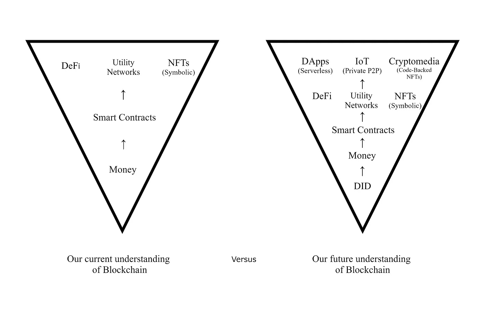

# 第二种力量——为你去中心化的网络灵魂进行技术主义论证

> 原文：<https://medium.com/coinmonks/the-second-power-207a6d750b96?source=collection_archive---------1----------------------->

> 区块链的第一个技术和文化突破是国家与货币和金融服务的分离。
> 
> 第二个将是大技术与数据和身份的分离。

2019 年，加密货币运动的首席演说家安德烈亚斯·安东诺普洛斯(Andreas Antonopolous)发表了一篇关于传统金融系统心理学的演讲，描述了银行家的剥削本性如何可以简化为一个“架构问题”。

因为金融体系允许通过收费(他描述为在每笔交易中间插一根稻草)剥削个人，这并不是说参与其中的银行家故意心怀恶意，只是如果一个人可以逃脱剥削，他们将永远受到诱惑这样做。因此，金融体系的结构是以这样一种方式构建的，即有中间人参与其中，而这些中间人以最终用户为代价获利；在东南亚，有人想往家里寄钱，你决定用你的信用卡在国外买些不正常的东西。

他总结道，解决这个问题的自然方法是比特币。移除中间人，将国家从货币控制中分离出来。我不反对这种解决方案，越来越多的人也不反对，他们宣称，菲亚特时代已经结束，比特币这一伟大的技术宗教正在崛起，要拥抱与通缩世界相一致的稳健货币。

但是，安德烈亚斯的“建筑问题”并不仅限于金融系统。管道运行得更深，到互联网本身的基础架构，以及我们作为个人如何被限制与它连接并随之反映。现在越来越多的人呼吁迁移到分散/私人的社交媒体和消息应用程序，以及像 *The Social Dilemma* 这样的纪录片，强调了这些应用程序对我们产生的潜在成瘾性质和行为改变，就是证明。

人们开始意识到，大型科技公司自身的中间人效应是如此之大，以至于似乎无法逾越，但为了民主和个人自由，它也像银行一样，必须以某种方式被克服。

## **基地驻地**

为了对比特币区块链(以及推而广之的第二种加密商品)的第二个基本用例提出合理的论证，让我们首先考虑以下问题:

> a)你与任何人进行价值交易的能力是否应被视为超越国家和企业主权的基本人权？
> 
> b)您的数据所有权，包括控制(提供和放弃)其使用的能力，是否应被视为超越国家和企业主权的基本人权？
> 
> c)是否有可能对 A 回答是，对 B 回答否，并保持一致的自由意志主义世界观？
> 
> d)如果对 C 的回答是肯定的，你不认为有可能通过分布式系统解决了 A，而 B 不能通过这种方式解决吗？此外，鉴于大型科技公司在互联网领域的主导地位，我们这样做在道德上并不必要？

我有意选择了自由意志主义。因为这一论点吸引了那些最赞同比特币加密货币运动最大主义观点的人。正是他们，我希望通过演绎推理来说服他们的工作证明区块链的第二种力量。

这些问题可以被重新组织成两个基本前提，从这两个基本前提可以得出一个我上面没有提到的结论:

> 1)你的钱应该在你的控制之下
> 
> 2)您的数据应该在您的控制之下
> 
> 3)金钱和数据都必须在你的控制之下，才能实现一个完全自主的互联网

这里隐含着第二个潜台词。其中之一将需要一些阐述…

工作证明区块链有两个明确的用例(健全的货币&分散的身份)。

虽然第一点(健全的货币)对比特币创造者来说显而易见，但第二点(去中心化的身份)就不那么明显了。这是因为为了解决第二个问题，我们需要一个更大的系统，而功率区块链只是所提出的解决方案的一部分。

说明这一点的简化类比包括:

*   Excel(代表比特币的账本)和 Windows(其运行环境)的区别。
*   把区块链当作一种配料，而不是食物。
*   比特币是细胞核(一种细胞器)，而不是整个细胞。

为了在基础设施层面上控制一个人的数据，我们需要一个分散的个人标识符(DID)。然而，为了保持对一个人的数据的控制和所有权，这样的 DID 不能被松散地归因于区块链，因为这是最大化主义者公平地用于批判符号不可替换令牌的相同论点。仅仅在区块链上注明你的存在的所有权并不能解决控制对该存在的利用的问题，正如在区块链上注明一幅图像的所有权并不意味着你明确地控制该图像以及它是否可以被复制。这就是我们需要深入了解的地方，然后再介绍提出的解决方案，智能网络。

## **Web 3 的缺点**

Foundations Matter.

正如我在本文开头提到的，人们越来越意识到数据封建互联网的缺点:

*   你的数据是别人的利润
*   你的数据被用来对付你，给你做广告，影响你的观点、想法和信仰
*   应用程序被激励去抓住你的注意力(去偷你的时间)

通过移除中央服务器的去中心化是一个不充分的解决方案，因为这种孤立的行动不能完全保护你的个人数据。

摆脱现状社交媒体的阻力很大程度上是因为缺乏从零关注者开始的愿望。如果你要提供一个替代方案，你需要一个独特的卖点，要么是对当前系统的补充，要么是非常优越的。这就把我们带回了 DID 的必要性和创新性，因为它提供了一种通用凭证和一个安全的环境来存放您的数据。

这意味着，当你使用分散的社交媒体应用时，默认情况下，你是内容的最终管理者。在这种框架下，社交媒体应用变得更像共享协议，而不是特定的平台。算法影响成为一种选择，你的所有数字生活(包括其他应用程序和对稀缺程序和资产的访问)都回到这个完全由你控制的安全基础上。我们可以将 DID 视为一个元系统层，它位于健全货币或流行货币之上或之下。

> DIDs 塑造了你数字家庭的安全 3D 墙，为此比特币的 2D 账本就放在你的桌子上。

如果不承认对这种网络操作系统的需求，就意味着既不能解决社会困境问题(集中式应用程序被激励来窃取你的注意力并操纵你的行为)，也不能承认这个问题日益严重，无论是对民主国家还是你自己的数字自我主权而言。

这也意味着创建 Web 3.0(即像以太坊这样的智能契约架构)的计划目前未能解决 Web 当前迭代的根本缺陷。仅仅把区块链放在当前有缺陷的框架之上是不够的，我们必须吸取我们所学到的一切，重新设计和重建我们如何连接到互联网，并把区块链的安全融入其基础。
从这些首要原则中培育一个环境，也将智能合约的功能从严格限制于抽象或松散的符号化扩展到包括真正稀缺的数字商品(电子书、音乐、视频、游戏、虚拟现实艺术)，因为底层代码受到网络操作系统的保护。可交易令牌简单地表示从网络访问所述底层代码的权利；复杂程度超过当前主要基于以太坊的趋势，受到比特币社区的公平批评。
此外，这种系统对于未来十年物联网时代的发展至关重要，因为我们的设备将越来越需要一种统一的通用语言来相互通信，以及这种 DID 网络堡垒提供的钻石般的安全性。

## **辩解&反驳**

听起来不错。但是比特币可以做到这一点。

不完全是。正如之前所讨论的，如果我们认为 DID 是基础设施的基石，并且我们必须尽快走向数字自主的世界，那么我们必须承认，必要的网络操作系统在技术上比比特币复杂得多。虽然你可以提出一个论点，即一个人的 DID 的创造应该以比特币计价(当然可以在用户界面层面，但不是在后端)，但要强迫比特币(一种令人垂涎的数字价值储存手段)改变其条纹，使之成为本质上不是比特币的东西，即使不是完全不可能，也是非常困难的。听起来可能很奇怪，这两种功能的分离是比特币自身长寿的最好情况(不仅是在拟议的更大网络操作系统上的共生，也来自比特币)。否则，在一个足够长的时间框架内，比特币对健全货币的主张可能会成为 DID 元商品的附庸，特别是如果它呈现了比特币货币政策的所有可取属性，甚至更多。
或者，可能有一种观点认为用例可能会被混淆(这是比特币制造者反对以太坊的一种常见观点)。这就是为什么最好的解决方案是合并-开采一种独立的商品和比特币，对 DID、个人和我们希望利用 PoW 安全性的物联网设备承担全部责任。这种分离让比特币可以做它最擅长的事情。鼓励将其作为价值储存手段长期持有，而不是出于辅助目的与其进行交易。

> 从另一个角度来看，比特币是全球储备货币，是一种可以被收购的数字商品；*一个稀缺的，象征性的代表你的主权网络灵魂。*

*我们不需要区块链安全的互联网操作系统。*

那么我们就不希望克服当前互联网上数据大王垄断的行为剥削。这相当于说，我们可以取消中间商银行，但不能取消中间商大型科技公司。诚然，我们可以选择不在这个方向创新，但似乎越来越多的理想主义正引导我们走向这样一个解决方案。操作系统是软件的灵魂，也是加密货币运动不可或缺的基础技术解决方案。这也是我们向往的物联网未来安全需求的基础。

DIDs 不需要代币。

相反，它们绝对存在，因为只有在比特币的区块链(全球最安全的分布式网络)的保护下，DID 才能以最成熟的形式存在。为了将 DID 提交给链(利用这种安全性)，必须提供经济补偿。这需要第二种加密商品，并展示了粉末区块链的第二个用途；保护你的网络灵魂。

## **智能网络**

Layer 1 Blockchains vs ElastOS: A Serendipitous Visualisation (Credit @AurelienVautier)

到目前为止，我还没有强调开发中的特定项目。然而，通过我自己的广泛研究，我得出结论，只有一个项目足以提供我们所寻求的必要的网络操作系统，来解决所有(而不仅仅是部分)即将出现的日益增长的文化问题。

这个项目就是 Elastos，由前微软员工和中国最重要的操作系统权威陈蓉创立。如果没有他孜孜不倦的工作，这个论点就不会存在，我敢肯定，更少的人会意识到去中心化的身份与整个密码对话的日益增长的相关性。

但不要只相信我的话。以下是事实…

*   在撰写本文时，Elastos 上的 did 与比特币合并，目前仅获得其 50%以上的哈希值
*   用于私有 P2P 通信和分散网络流量的独立运营商网络(最后检查当前活动的 200，000 个节点)
*   内置分散存储(蜂巢)
*   智能合约侧链直接链接到比特币自己的 hashpower，或民主选举的代表节点，以更高的效率签署区块(同时保持 power 功能的回归，以保持自治)
*   如今，私人 P2P 信使(【https://hyper.im/】)和分散式社交媒体@elastOSFeeds 已经存在

这些只是该项目的一些令人印象深刻的成就。欲了解更多信息，请访问 https://elastos.info/[网站](https://elastos.info/)进行自我调查，或者在 Google Play 或 App store 上下载安全浏览器/DApp 商店。尝试一下，然后面无表情地告诉我，从 UI/UX 的角度来看，去中心化应用领域的任何东西都很接近。

事实是，我们可以今天就开始集体迁移到这个新系统的过程，或者我们可以等待几年，也许几十年，直到有人挪用或开发完全相同的系统。我赞成前一种方法，我认为我们这样做是合理的，而且在道德上与人类的未来相关。我还认为，加密货币领域的前进之路是与比特币共生，而和欣思通过给矿工一个新的存在理由，加强了他们的事业。保护智能网络。

我要求比特币创造者抛开智能合约架构和竞争性货币政策的噪音，考虑更广泛的哲学图景。去中心化的身份从根本上来说是必要的，从道德上来说是必要的，以实现一个完全自主的互联网，这是区块链工作证明的决定性的第二个力量。

今天就加入网络共和国，帮助我们将对话向声音技术和合法的主流相关性发展。