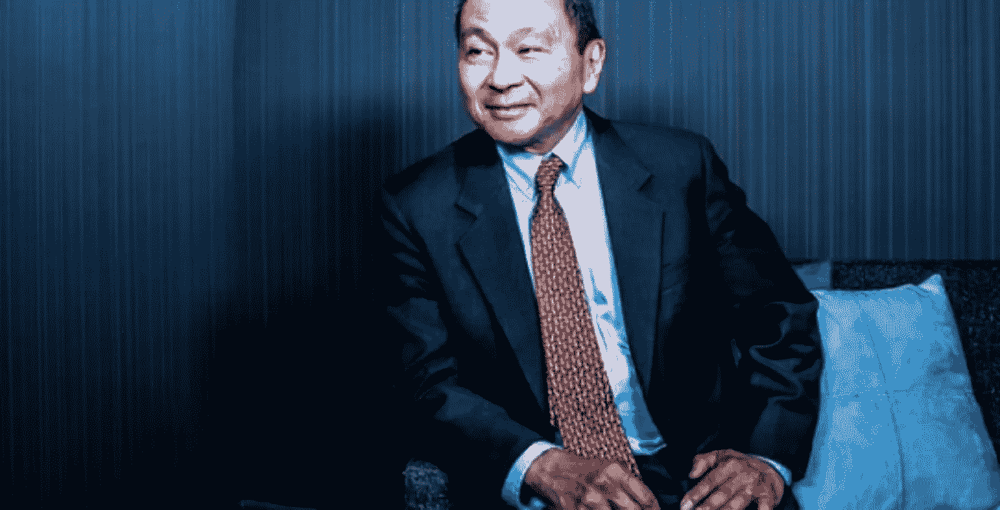

# 比特币机构的语义撤退

> 原文：<https://medium.com/coinmonks/the-semantic-retreat-from-bitcoin-agency-c8b2e7ad562a?source=collection_archive---------0----------------------->

Horse with rider galloping through mist.

有一项关于经济学家使用博弈论的观察表明，它损害了本体论的“现实”，并使(博弈论)的应用毫无意义——除非作为一种规范人类行为的符号工具。

这个想法是，博弈论必须允许“法律”是“一种法律”，而不是“命运”，至少通过一个隐含的承认，一个成功的优雅或从游戏中走出是可能的。

这一观察与尼采在 [*谱系*](https://en.wikipedia.org/wiki/On_the_Genealogy_of_Morality) 中的历时性身份相关，记忆被认为是通过债务人/债权人关系灌输的，通过时间持续存在，因为每一方都不是每天重生*。*

# *句法和语义*

*现代逻辑是一个二分法，语法方面在提供规则、证明、量词、变量、递归、常数等方面形式上是超然的——因此现实并不关心如何应用这种逻辑。*

*语义学是对[逻辑]的解释和意义，尼采在这里对语言的深层结构和摇摆不定有了认知——这可能是误导——因为语言可能建立在与现实不一致的假设上，以便在一个宏大的宇宙计划中驱散信念。*

*有鉴于此，尼采评论道:“恐怕我们并没有摆脱上帝，因为我们仍然对语法有信心”。*

*也有对二价性的审查，通过询问是什么迫使我们将好与坏两极分化，而不是介于两者之间的更亮或更暗的阴影？*

# *谨慎的推理*

*尼采认为历时性的同一性是合乎逻辑的，但像物体一样，也是一种虚构，因为他观察到物体是由满足一种观点的属性组合而成的方便的虚构。*

**

*Francis Fukuyama — [The End of History and the Last Man](https://aeon.co/essays/was-francis-fukuyama-the-first-man-to-see-trump-coming) (1992), drew on Nietzsche in predicting Trump: God may be dead, but we’ve not replaced Him yet - becoming prone to rakish political rhetoric instead.*

*对尼采来说，事物总是存在又消失。作为以[贝克莱](https://en.wikipedia.org/wiki/George_Berkeley)和[休谟](https://en.wikipedia.org/wiki/David_Hume)为代表的哲学传统的一员，他的[对象束理论](https://en.wikipedia.org/wiki/Bundle_theory)让尼采意识到，如果他去除一个事物的所有属性和所有活动的所有关系，那个事物就不会存在。*

*为此，不可能有真正的或永恒的历时性，因为包的持续时间是短暂的，使得语义在过程中存在。*

# *良币和劣币*

*对于一般观众来说，良币和劣币的二价性在于每种货币的购买力，这很可能意味着这些货币对通货膨胀的敏感度。*

*事实上，通货膨胀的话题在比特币方面再次出现，语义差异很快上升到进一步分析不可避免的程度，就像尼采认为短暂的逻辑一样。*

# *对比特币的影响*

*尼克·萨博(Nick Szabo)的[比特黄金(bit gold)](https://nakamotoinstitute.org/bit-gold/)，一种尚未实现的比特币的前身，以及约翰·纳西理论上的[理想货币](http://personal.psu.edu/gjb6/nash/money.pdf)，声称在[方面与【比特币】有相似之处](/coinmonks/satoshis-game-central-banks-and-the-social-contract-c00698f8779e)。*

*有趣的是，在研究理想货币时，纳什认为零通胀目标是“理想的”，但也观察到货币可能太好了，因为它不会流通——因此意识到它需要一个恒定和可预测的通胀率:因此理想货币变成了渐进的理想货币。*

*还应该注意的是，比特币本身(就通胀而言)并不是渐进的，因为它的发行在达到所谓的理想利率方面变得无关紧要；但当打开一个地位相当的关系时，主权发行之间的渐近限制波动性使尼采再次成为一种新的戏剧。*

# *捆绑理论与电子对等现金系统*

*这种“理想”的微妙转变朝着关系间稳定的方向发展，但实际上这本身并不是超“现代”的:[凯恩斯致力于这样的观念](/coinmonks/the-ideal-republic-bitcoin-and-keynes-in-parallel-dd4979a990e5)，即使当前的内部平衡目标(通货膨胀)方法很流行，汇率彼此自由浮动。*

*央行自己将承认，通胀目标并非“理想”,因为通胀可以是任何东西——尽管他们不确定如何完全理解通胀，但它允许他们通过价格水平稳定来管理货币环境:这在语言游戏中可以相对容易地表达出来。*

*纳什的理想货币和萨博的比特黄金之间的区别在于纳什承认他的提议不适合世界帝国的背景:他明白在竞争中存在不同的货币，而不是朝着多边合作的方向努力。*

*尼采的*捆绑理论*的背景有助于解释这一点与比特币的相关性:没有这样的东西本身存在，也没有没有其他东西可以存在的东西。*

*当把比特币理解为一种*现金系统*时，这强调了作为比特币市场价值表达的法定兑换价格:换句话说，比特币和法定不是二价的:*

# *“缩放”的语义限制*

*这种(市场价值的)表述正是语义撤退的背景所在:比特币通常被支持者和反对者视为一个独立的系统:*

*这意味着话语的总体水平围绕着费用、能源消耗、去中心化、交易速度、审查阻力、匿名、通货膨胀率等主题，就像尼采观察被语言束缚的逻辑一样:*

# *结算代理*

*[完整的社会契约](/coinmonks/satoshis-game-central-banks-and-the-social-contract-c00698f8779e)将没有翻译、解释和执行问题——在宏观层面上解决 [*因货币在非合作的基础上竞争而产生的*](https://en.wikipedia.org/wiki/Hold-up_problem) :*

*[稳定联盟形成的想法](/coinmonks/proof-of-work-in-games-contracts-and-language-67c7b6609bff)会出现在这个范式之外，但是有一个问题可以应用博弈论:*

*比特币不一定需要明确的用例，因为它已经具有对冲“法律”成本的基本隐含特征:*

*在强力比特币逻辑递归下分解语义困难的明确流程，找到平衡并超越“游戏”:*

*在价格发现成为代理表现的 cas-h 系统中，cas-ual 能变得多随意？*

*在相对较短和巨大的爆发中，历时性从平淡无奇地描述的互联网货币演变而来:单词被遗忘到我可能已经几乎不知道我在说什么的程度！*

> *[直接在您的收件箱中获得最佳软件交易](https://coincodecap.com/?utm_source=coinmonks)*

**