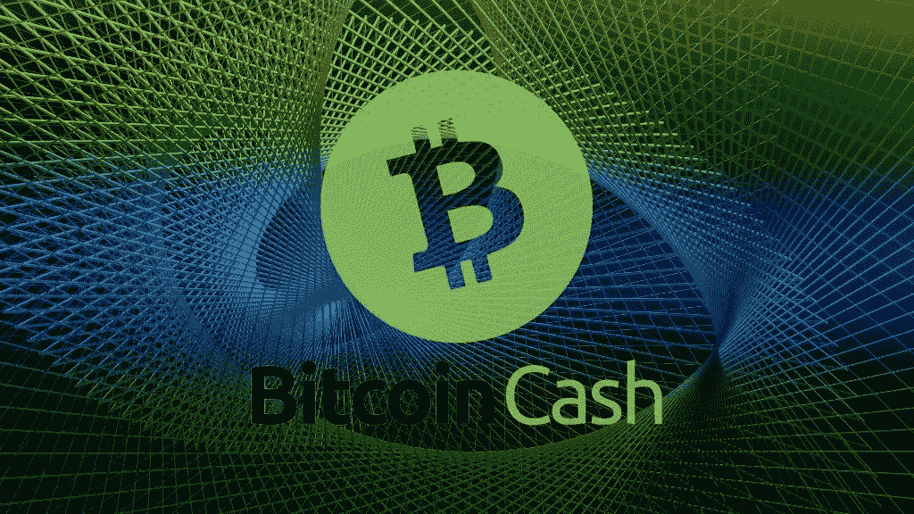
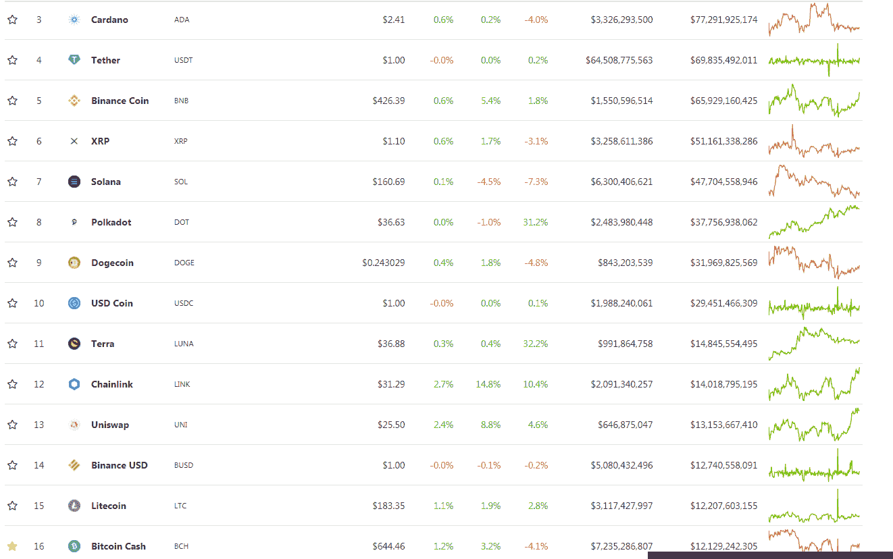

# 加密市场的疯狂——比特币现金仍然被低估

> 原文：<https://medium.com/coinmonks/the-sheer-lunacy-of-the-crypto-market-bitcoin-cash-still-undervalued-a8fdb7bf660b?source=collection_archive---------3----------------------->

比特币现金作为一种资产，可能是加密货币领域最有前景的。由于一些硬币会无缘无故地膨胀，而只是营销和极端炒作，比特币现金是唯一一种在雷达下飞行的货币，具有惊人的近期发展和广阔的视野。

随着 SmartBCH 侧链的开发，它开始了 DeFi/NFT 阶段。除了以太坊，还有更多区块链和以太坊仍在努力完成的事情。

到目前为止，只有币安智能链与以太坊竞争，但从长远来看，它看起来不像是一个可行的解决方案，主要是因为它的集中化问题。

我们最近看到，顶级金融机构创建了加密货币柜台，并为其客户提供交易或投资选项。

Interactive Brokers 是最后一家，现在为其美国客户提供比特币现金投资。

# 比特币现金——不是卡尔达诺、BNB、索拉纳、波尔卡多特、多格等…

这些组织(银行、基金管理公司、顶级交易室)不仅仅因为 Twitter 的炒作而选择加密货币。今天，我们有 Interactive Brokers、gray、JP Morgan、SBI 控股、21 Shares、Paypal 以及更多选择三到四种加密货币的机构。而比特币现金永远是其中之一。

在选择提供哪些加密货币时，比特币现金是金融机构的首选。

没有 Cardano，没有 Polkadot，没有任何其他大肆宣传和未经测试的密码，仍然在测试模式下运行其测试网。

上述所有金融机构均未选择这些加密货币中的任何一种:

*   卡尔达诺
*   币安硬币
*   索拉纳
*   波尔卡多特
*   XRP(SBI 除外，它是 Ripple 旗下 XRP 的战略投资者)
*   Dogecoin
*   土地
*   链环
*   Uniswap

然而，所有这些加密货币和更多的半软件正在享受某种投资狂热，这种炒作狂热不断以前期的价格行动吸引投资者。

所有这些加密货币的市值都在比特币现金之上！这是不合理的，并且完美地解释了为什么这个市场仍然是不成熟的和完全不合理的。

此外，其中一些加密货币尚未完全开发或测试，但已经雇佣了成千上万的广告商和社交媒体账户，攻击任何质疑开发延迟甚至提问的人。位居榜首的是 Cardano，它的表现超过了所有的(月亮)指标，并且已经开发出**还没有工作产品**。

所有这些机构都更喜欢比特币现金、以太坊、BTC 和莱特币，有些机构出于未知原因还选择了 ETC 和 SBI，包括 XRP。

一些人说，这个市场是关于新闻和他们如何看涨到足以将市场推向极端。

没有。正是 Tether/Bitfinex 推动了 BTC，也为以太坊提供了一些喘息空间，由于各种原因(ETHE，DeFi，NFTs)，以太坊的市值激增至 4000 亿美元。

## 莱特币和以太坊经典？

不过，我不太确定莱特币是否有所发展，也不认为它有比特币现金那样的潜力。

自从 2018 年查理·李(Litecoin 的创始人)以惊人的利润出售了他所有的 LTC 以来，Litecoin 被完全遗忘了，这是他创建 Litecoin 的总体目标。主要是因为这个事实，莱特币从未恢复，绝对没有发展，唯一剩下的是莱特币每四年减半，以推动价格。

比特币现金是一个特殊而强大的网络，拥有受驱动的开发者、雄心勃勃的社区和呈指数增长的忠实粉丝群。

随着 SmartBCH 的发展，sidechain 赔率表明 DeFi、NFT、Dapps 和区块链游戏的开发者将开始进入比特币现金生态系统。

# 最后

根据图表，比特币现金似乎也与 LTC 相关。这是非常不合理的，并使许多人思考加密交换的做法和如何系绳(USDT)机制的工作，特别是在“市场下跌”。

BTC 是如何得到 USDT 的支持的，为什么在低谷时，BTC 总是增加市场支配力？

很明显，USDT 为 BTC 和瑞士联邦理工学院创造了 99%的支持率。此外，今天的莱特币在任何层面上都远不及比特币现金。莱特币如何与比特币现金正在创造的东西相提并论？

到目前为止，比特币现金已经为数百万人长期采用加密货币创造了条件。它有 100%的把握保持其大部分用户群，甚至在年底前翻一番。

SmartBCH 不是一个典型的创建某种本机加密的侧链。本机令牌不是必需的，也不会为用户提供额外的东西。SmartBCH 只使用 BCH，从这个意义上说，它为比特币现金提供了最终支持。

**跟我上:***●*[*read cash*](https://read.cash/@Pantera)*●*[*noise cash*](https://noise.cash/u/Pantera99)*●*[*Medium*](/@panterabch)*●*[*Hive*](https://hive.blog/@pantera1)*●*[*steem it*](https://steemit.com/@pantera1)*●*

***如果你喜欢这篇文章，别忘了订阅并点赞！***

*最初发布于*[*https://read . cash*](https://read.cash/@Pantera/the-sheer-lunacy-of-the-crypto-market-bitcoin-cash-still-undervalued-125c9161)*。*

> 加入 Coinmonks [电报频道](https://t.me/coincodecap)和 [Youtube 频道](https://www.youtube.com/channel/UCbyDhTbOiKh2iUMKBi4-4Zg)了解加密交易和投资

*   [AscendEx 保证金交易](https://blog.coincodecap.com/ascendex-margin-trading) | [Bitfinex 赌注](https://blog.coincodecap.com/bitfinex-staking) | [bitFlyer 审查](https://blog.coincodecap.com/bitflyer-review)
*   [Bitget 回顾](https://blog.coincodecap.com/bitget-review) | [双子 vs 区块链](https://blog.coincodecap.com/gemini-vs-blockfi) | [OKEx 期货交易](https://blog.coincodecap.com/okex-futures-trading)
*   [AscendEx Staking](https://blog.coincodecap.com/ascendex-staking)|[Bot Ocean Review](https://blog.coincodecap.com/bot-ocean-review)|[最佳比特币钱包](https://blog.coincodecap.com/bitcoin-wallets-india)
*   [霍比审核](https://blog.coincodecap.com/huobi-review) | [OKEx 保证金交易](https://blog.coincodecap.com/okex-margin-trading) | [期货交易](https://blog.coincodecap.com/futures-trading)
*   [麻雀交换评论](https://blog.coincodecap.com/sparrow-exchange-review) | [纳什交换评论](https://blog.coincodecap.com/nash-exchange-review)
*   [美国最佳加密交易机器人](https://blog.coincodecap.com/crypto-trading-bots-in-the-us) | [经常性回顾](https://blog.coincodecap.com/changelly-review)
*   [在印度利用加密套利赚取被动收入](https://blog.coincodecap.com/crypto-arbitrage-in-india)
*   [Godex.io 审核](/coinmonks/godex-io-review-7366086519fb) | [邀请审核](/coinmonks/invity-review-70f3030c0502) | [BitForex 审核](https://blog.coincodecap.com/bitforex-review)
*   [最佳比特币保证金交易](/coinmonks/bitcoin-margin-trading-exchange-bcbfcbf7b8e3) | [萝莉点评](/coinmonks/lolli-review-e6ddc7895ad8) | [比特币保证金交易](https://blog.coincodecap.com/bityard-margin-trading)
*   创造并出售你的第一个 NFT | [密码交易机器人](https://blog.coincodecap.com/best-crypto-trading-bots)
*   [折叠 App 回顾](https://blog.coincodecap.com/fold-app-review) | [本地比特币回顾](/coinmonks/localbitcoins-review-6cc001c6ed56) | [Bybit vs 币安](https://blog.coincodecap.com/bybit-binance-moonxbt)
*   [加密保证金交易交易所](/coinmonks/crypto-margin-trading-exchanges-428b1f7ad108) | [赚取比特币](/coinmonks/earn-bitcoin-6e8bd3c592d9) | [Mudrex 投资](https://blog.coincodecap.com/mudrex-invest-review-the-best-way-to-invest-in-crypto)
*   [WazirX vs CoinDCX vs bit bns](/coinmonks/wazirx-vs-coindcx-vs-bitbns-149f4f19a2f1)|[block fi vs coin loan vs Nexo](/coinmonks/blockfi-vs-coinloan-vs-nexo-cb624635230d)
*   [杠杆代币](/coinmonks/leveraged-token-3f5257808b22) | [最佳密码交易所](/coinmonks/crypto-exchange-dd2f9d6f3769) | [Paxful 点评](/coinmonks/paxful-review-4daf2354ab70)
*   [加密套利](/coinmonks/crypto-arbitrage-guide-how-to-make-money-as-a-beginner-62bfe5c868f6)指南| [如何做空比特币](/coinmonks/how-to-short-bitcoin-568a2d0b4ae5) | [1xBit 回顾](https://blog.coincodecap.com/1xbit-review)
*   [如何在印度购买以太坊？](https://blog.coincodecap.com/buy-ethereum-in-india) | [如何在币安购买比特币](https://blog.coincodecap.com/buy-bitcoin-binance)
*   [在美国如何使用 BitMEX？](https://blog.coincodecap.com/use-bitmex-in-usa) | [BitMEX 评论](https://blog.coincodecap.com/bitmex-review) | [买入索拉纳](https://blog.coincodecap.com/buy-solana)