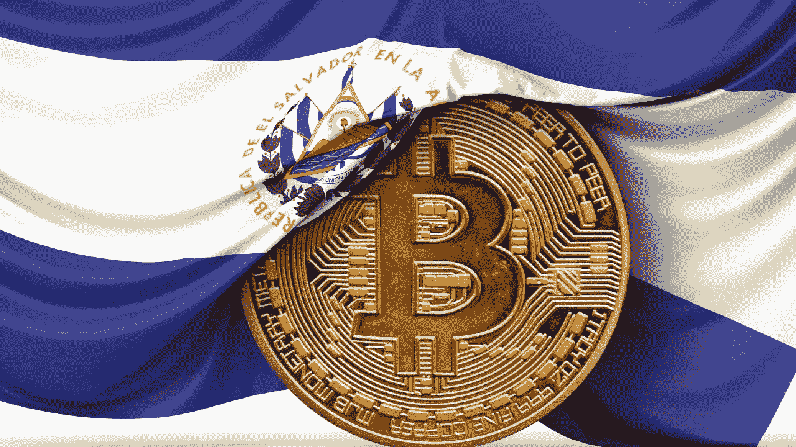

# 比特币法定货币的意义。(你可能已经错过了)

> 原文：<https://medium.com/coinmonks/the-significance-of-bitcoin-legal-tender-that-you-might-have-missed-d819c0fc0d70?source=collection_archive---------6----------------------->

萨尔瓦多已经正式承认比特币为法定货币，如果你对历史不是很熟悉，你可能不会注意到它的历史意义，让我来解释一下…

自从第一个人类文明以来，法定货币一直是最重要的，原因如下:

一个文明需要人力资本或劳动力来建立自己，罗马不是一天建成的，但建立一个文明也需要公民之间的大量合作，

例如，如果我们只解决自己的问题，建造自己的房子等等，那么就不会有竞技场，没有社区建筑，没有公司，最终也不会有文明。所有这些都需要那些原本没有兴趣投资的人共同努力来建造它们。

我们现在面临激励冲突，每个人都想要一个文明，但我们需要一种分配人力资本的方式，最好是公平公正的方式。

如果你回顾历史，方法主要有两种:

1.  奴隶制；资产阶级挑选下层公民，强迫他们工作，如果他们不工作，就会被杀死或受到惩罚。这种方法已经在全球范围内被几乎每一个文明使用了几千年，如果你没有灵魂的话，这种方法非常有效，但不幸的是，大多数人都是好人，我们集体认为这是不对的。
2.  贸易/劳动代币；向你的公民提供代表劳动的代币，如果我为我的邻居做了 2 小时的工作，那么他就欠我(价值 2 小时的劳动硬币)，一旦得到支付，我就可以自由地花这些硬币让别人为我提供 2 小时的工作，等等。

现在，显然贸易和劳动力代币是更好的解决方案，更少的人死亡，更多的人出生，更多的总人力资本分配，更高质量的工作完成，你最终会有一个值得生活的文明。

但是，这些劳动象征物，通常被称为货币，需要得到社会每个成员的集体同意，这样我们就可以减少争议，政府也知道应该对什么征税，降低什么的价值。

因此，在历史上，一个特定国家的政府决定他们想要的劳工标志是什么，并将其写入法律。

这样，如果你为任何人做任何劳动，他们提出用这些劳动代币来偿还你，你在法律上有义务接受，你将不再能够提出债务尚未还清的纠纷。

一旦政府决定了他们的劳动象征是什么，是牛，还是金，还是铜，或者在今天的情况下，特别政府发行了一些印有已故总统的酷图形的纸张，那么它就被那个国家认为是所谓的“法定货币”。

政府非常重视法定货币，因为这是他们获得资金的方式。

例如，在古罗马，货币贬值的方法(降低公民货币的价值，同时获得政府使用的刮削价值)是通过字面刮削人民金币的边缘，熔化并制造新的硬币来资助战争和军事扩张。

同样的贬值今天也在发生，除了我们不再剪去金币的边缘，而是印刷新的货币供政府使用，增加了供应量，从而降低了公民储蓄的价值，但这只是在政府花掉新“印刷”的货币之后。

然而，在古罗马，如果你要伪造硬币，或者拒绝接受他们的法定货币作为债务的支付，大约在 81 年颁布的*lex Cornelia testamentaria nummaria*。BCE 称对此类罪行的处罚如下:

*“那些世卫组织人伪造黄金或白银货币，掺杂、清洗、铸造、切割、腐蚀或侵入黄金或白银硬币，或拒绝印有皇帝头像的货币，除非它是假的:如果他们是精英，他们将被流放到一个岛上，如果他们是低阶层，他们将被判处矿山或十字架。奴隶在犯罪后将被处以极刑…”*

因此，我认为可以肯定地说，法定货币非常重要，代表萨尔瓦多将比特币纳入这一类别是前所未有的。

这就是为什么萨尔瓦多的情况如此重要，对于整个国家来说，决定比特币构成法定货币是令人难以置信的，我个人认为至少在未来 5 年内不会发生这种情况。

我希望这有助于增加一些历史背景，为什么每个人都在谈论萨尔瓦多，为什么比特币社区对这个消息如此兴奋。

如果你喜欢这篇文章，一定要关注我或者订阅 www.permissionlessltd.com[的博客邮件列表](http://www.permissionlessltd.com)

> 加入 [Coinmonks 电报频道](https://t.me/coincodecap)，了解加密交易和投资。

**同样，阅读**

*   [尤霍德勒 vs 科恩洛 vs 霍德诺特](/coinmonks/youhodler-vs-coinloan-vs-hodlnaut-b1050acde55a) | [Cryptohopper vs 哈斯博特](https://blog.coincodecap.com/cryptohopper-vs-haasbot)
*   [币安 vs 北海巨妖](https://blog.coincodecap.com/binance-vs-kraken) | [美元成本平均交易机器人](https://blog.coincodecap.com/pionex-dca-bot)
*   [如何在印度购买比特币？](/coinmonks/buy-bitcoin-in-india-feb50ddfef94) | [WazirX 评论](/coinmonks/wazirx-review-5c811b074f5b) | [BitMEX 评论](https://blog.coincodecap.com/bitmex-review)
*   [比特币主根](https://blog.coincodecap.com/bitcoin-taproot) | [Bitso 回顾](https://blog.coincodecap.com/bitso-review) | [排名前 6 的比特币信用卡](/coinmonks/bitcoin-credit-card-bc8ab6f377c6)
*   [双子座 vs 比特币基地](https://blog.coincodecap.com/gemini-vs-coinbase) | [比特币基地 vs 北海巨妖](https://blog.coincodecap.com/kraken-vs-coinbase)|[coin jar vs coin spot](https://blog.coincodecap.com/coinspot-vs-coinjar)
*   [印度加密交易所](/coinmonks/bitcoin-exchange-in-india-7f1fe79715c9) | [比特币储蓄账户](/coinmonks/bitcoin-savings-account-e65b13f92451) | [Paxful 审核](/coinmonks/paxful-review-4daf2354ab70)
*   [杠杆令牌](/coinmonks/leveraged-token-3f5257808b22) | [最佳加密交易所](/coinmonks/crypto-exchange-dd2f9d6f3769) | [AscendEX 评论](/coinmonks/ascendex-review-53e829cf75fa)
*   [Godex.io 审核](/coinmonks/godex-io-review-7366086519fb) | [邀请审核](/coinmonks/invity-review-70f3030c0502) | [BitForex 审核](https://blog.coincodecap.com/bitforex-review) | [HitBTC 审核](/coinmonks/hitbtc-review-c5143c5d53c2)
*   [Crypto.com 费用](/coinmonks/binance-fees-8588ec17965) | [僵尸加密审查](/coinmonks/botcrypto-review-2021-build-your-own-trading-bot-coincodecap-6b8332d736c7) | [替代品](https://blog.coincodecap.com/crypto-com-alternatives)
*   [有哪些交易信号？](https://blog.coincodecap.com/trading-signal) | [比特斯坦普 vs 比特币基地](https://blog.coincodecap.com/bitstamp-coinbase)
*   [ProfitFarmers 回顾](https://blog.coincodecap.com/profitfarmers-review) | [如何使用 Cornix 交易机器人](https://blog.coincodecap.com/cornix-trading-bot)
*   [MXC 交易所评论](/coinmonks/mxc-exchange-review-3af0ec1cba8c) | [Pionex vs 币安](https://blog.coincodecap.com/pionex-vs-binance) | [Pionex 套利机器人](https://blog.coincodecap.com/pionex-arbitrage-bot)
*   [我的加密副本交易经历](/coinmonks/my-experience-with-crypto-copy-trading-d6feb2ce3ac5) | [比特币基地评论](/coinmonks/coinbase-review-6ef4e0f56064)
*   [CoinFLEX 评论](https://blog.coincodecap.com/coinflex-review) | [AEX 交易所评论](https://blog.coincodecap.com/aex-exchange-review) | [UPbit 评论](https://blog.coincodecap.com/upbit-review)
*   [AscendEx 保证金交易](https://blog.coincodecap.com/ascendex-margin-trading) | [Bitfinex 赌注](https://blog.coincodecap.com/bitfinex-staking) | [bitFlyer 点评](https://blog.coincodecap.com/bitflyer-review)