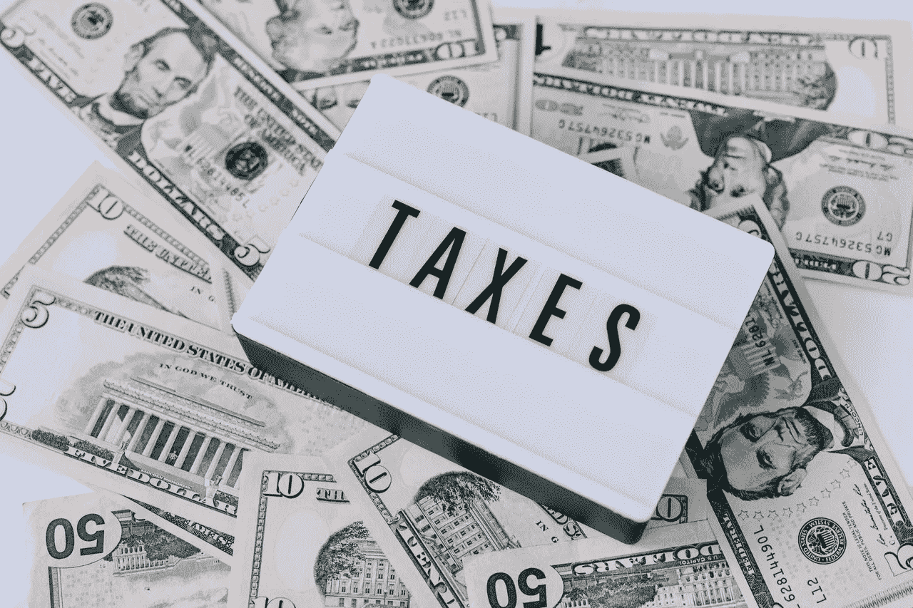

# 加密货币税简单指南

> 原文：<https://medium.com/coinmonks/the-simple-guide-to-cryptocurrency-tax-and-its-scenarios-dbcb782e213f?source=collection_archive---------0----------------------->

随着[比特币](https://blog.coincodecap.com/a-candid-explanation-of-bitcoin)的诞生，加密货币仅仅在十多年前才存在。这是区块链网络上第一个打破传统分类帐技术的应用。自那以来，比特币通过一种去中心化和安全的数字货币，为许多有抱负的金融科技初创公司打开了大门。

这些初创公司充当了普通公众和加密货币世界之间的桥梁。最初，世界各国政府对支持采用比特币犹豫不决。然而，加密货币技术和弹性已被证明是有效的，并随着时间的推移越来越受欢迎。出于这个原因，官员们终于开始考虑如何将比特币纳入成熟的金融市场。

直到最近，大多数加密持有者和交易者都不知道他们的加密货币的税收影响。世界各国政府开始加强他们的加密税收政策。美国国税局甚至开始[向纳税人邮寄教育信](https://www.irs.gov/newsroom/irs-has-begun-sending-letters-to-virtual-currency-owners-advising-them-to-pay-back-taxes-file-amended-returns-part-of-agencys-larger-efforts)，他们怀疑这些纳税人在数字资产交易中欠政府税。在许多国家，比特币等加密货币被视为财产或投资，产生的收益受资本损益规则的约束。

本加密货币税简单指南的内容主要基于美国法规编写。然而，大多数国家在税收方面采取了类似的做法。

> 为你的钱最好的[加密税务软件](/coinmonks/best-crypto-tax-tool-for-my-money-72d4b430816b)

# 加密货币税是如何运作的？

确定你从加密货币和纳税义务中获得多少利润有点棘手。[加密货币税](/coinmonks/best-crypto-tax-tool-for-my-money-72d4b430816b)由资本利得税和所得税组成。在加密货币中，资本收益是交易或出售数字资产产生的利润或损失；这是卖价减去买价和费用。从会计的角度来看，你的买价及其相关成本被称为成本基础。

*这里有一个关于资本收益的简单场景:*

如果你从交易所以 10，000 美元买入 1 BTC，并支付了 50 美元的费用，那么你的成本基础是 10，050 美元。过了一段时间，你以 20，000 美元的价格卖掉了你的 BTC，这意味着你的应税资本收益是:

*$ 20000—$ 10000—$ 50 = 9950。*

在不同的情况下，您使用加密货币可能会导致纳税义务。让我们来看看其中的一些。

> 另请阅读:[加密货币税——你需要问的 5 个问题](https://blog.coincodecap.com/five-questions-about-cryptocurrency-tax-and-bitcoin-tax)

## **购买加密货币:免税**

好消息！用法定货币购买密码不会导致任何纳税义务。如果你拥有许多加密资产并持有它，那就是持有加密资产而不是出售它；它是免税的。

## **出售加密货币:资本利得税**

虽然你不需要为拥有比特币或其他加密货币缴税，但当你出售它时，纳税义务就产生了。上面的第一个例子显示，你买了 1 BTC，卖了 9950 美元的利润；这笔利润将作为资本收益征税。

## **开采加密货币:所得税**

无论您是拥有自己的采矿平台还是在社区游泳池中采矿，您从开采加密货币中获得的任何收益都需要在所得税申报表中申报。如果您出售开采的加密货币硬币，您申报为收入的价值与您出售硬币时的价值之间的差额将被视为资本利得，并被征税。

## **从 CeFi、DeFi、Staking、Masternodes 收到利息:所得税**

假设你把你的加密货币存在像 [Hodlnaut](https://www.hodlnaut.com/) 这样的中央金融(CeFi)中，它提供 6.2%-8.3% APY 的利息。在这种情况下，你获得的任何收益都将被征税，就像开采加密货币一样。

## **交易和交换加密货币:资本收益税**

如果你想从一个密码交易到另一个，比方说从 BTC 到瑞士联邦理工学院，这是应税的，被认为是资本收益税。这里发生了两笔交易，首先是将 BTC“出售”给法定货币，然后用出售的钱购买 ETH(这不是应税事件)。

## **收到关联奖金:所得税**

许多加密贷款平台提供一个[附属项目](https://blog.hodlnaut.com/earn-commission-hodlnauts-affiliate/)，以加密货币的形式奖励用户。当推荐成功并获得加密回报时，这是应纳税事件并被视为所得税。

## **赠送加密货币:免税**

假期即将来临。如果你想给你的朋友和家人一些加密货币，那是免税的。赠与免税最高 15000 美元；除此之外，你还需要申报礼物税。

## **保证金交易:资本利得税**

由于保证金交易有点复杂，目前还没有明确的指引。这种交易包括从交易所或 T2 的加密借贷平台借入资金进行交易，然后偿还贷款。目前的立场是，借来的资金是你的投资。保证金交易和贷款偿还将被视为应税事件和资本收益。

## **用比特币支付:所得税**

接受比特币作为工资是增加你的加密组合的一个很好的方式。但是，请记住，这是应纳税的所得税。无论你是作为自由职业者获得一次性报酬，还是从公司领取月薪，你从中获得的任何密码都要根据获得时的市场价值纳税。

## **参加 ICO/IEO:资本收益税**

参与首次硬币发行(ICO)和首次交易所发行(IEO)被视为应税事件。你是在用一种加密货币交换其他将在以后发行的代币。当你收到代币时，这就变成了纳税义务，需要申报资本收益。

## **货叉和空投:所得税**

在加密货币中，分叉是指数字资产开发者使用相同的代码创建第二个分支。这样做的结果是，比特币持有者可能会获得新的分叉硬币及其原始硬币。空投是指新的加密货币项目将他们的硬币分发给现有的比特币持有者，以提高流动性。叉(硬叉)和空投都作为收入征税。

# 计算您的加密货币税(示例)

让我们看看另一个资本收益是如何计算的例子。

*   克莱尔于 2020 年 11 月 1 日在一个[加密货币交易平台](/coinmonks/the-best-crypto-trading-platforms-in-2020-the-definitive-guide-updated-c72f8b874555)上花 5 万美元购买了 5 个 BTC，并支付了 50 美元的服务费。
*   然后她在 2020 年 12 月 1 日用 5 BTC 换了 100 ETH。100 个 ETH 的总市值为 55，000 美元。
*   她还从加密货币交易平台获得了 100 美元的注册奖金。

从上面的场景中，我们可以看到 Claire 的应税资本收益为:

*$55，000-$ 50，000-$ 50 = $ 4，950*

因此，克莱尔将从她的加密货币中获得 4950 美元的应税资本收益和 100 美元的应税收入。请记住，资本利得税和所得税都必须由您作为纳税人支付，而不是由其他第三方(投资公司、加密贷款平台等)支付。).

## **总之**

虽然加密货币税相对较新，并且在我们说话的时候仍在发展，但世界各地的当局开始看到它的重要性，并将加密货币视为财产。与任何形式的投资一样，当加密货币升值时，你出售/交易/使用它来获利，这将是一个应税事件。了解加密货币税的工作原理可以帮助您确定要支付的正确税款，并避免不必要的税务打击。

## 另外，阅读

*   [会计审查](https://blog.coincodecap.com/accointing-review-a-complete-crypto-tax-solution) -完整的加密税务解决方案
*   [CoinTracking Review](https://blog.coincodecap.com/cointracking-review-a-reliable-cryptocurrency-tax-software) —一款可靠的加密货币税务软件
*   [TokenTax Review](https://blog.coincodecap.com/tokentax-review-bitcoin-tax-software-and-accounting) —加密税务软件和会计服务
*   最佳[比特币会计](https://blog.coincodecap.com/crypto-tax-bitcoin-accounting-softwares)和加密税务软件
*   最好的[密码交易机器人](/coinmonks/crypto-trading-bot-c2ffce8acb2a)
*   [Deribit 审查](/coinmonks/deribit-review-options-fees-apis-and-testnet-2ca16c4bbdb2) |选项、费用、API 和 Testnet
*   [FTX 密码交易所评论](/coinmonks/ftx-crypto-exchange-review-53664ac1198f)
*   [Bybit 交换审查](/coinmonks/bybit-exchange-review-dbd570019b71)
*   最好的比特币[硬件钱包](/coinmonks/the-best-cryptocurrency-hardware-wallets-of-2020-e28b1c124069?source=friends_link&sk=324dd9ff8556ab578d71e7ad7658ad7c)
*   [密码本交易平台](/coinmonks/top-10-crypto-copy-trading-platforms-for-beginners-d0c37c7d698c)
*   最好的[加密税务软件](/coinmonks/best-crypto-tax-tool-for-my-money-72d4b430816b)
*   [最佳加密交易平台](/coinmonks/the-best-crypto-trading-platforms-in-2020-the-definitive-guide-updated-c72f8b874555)
*   最佳[加密贷款平台](/coinmonks/top-5-crypto-lending-platforms-in-2020-that-you-need-to-know-a1b675cec3fa)
*   [莱杰纳米 S vs 特雷佐 one vs 特雷佐 T vs 莱杰纳米 X](https://blog.coincodecap.com/ledger-nano-s-vs-trezor-one-ledger-nano-x-trezor-t)
*   [block fi vs Celsius](/coinmonks/blockfi-vs-celsius-vs-hodlnaut-8a1cc8c26630)vs Hodlnaut
*   Bitsgap 评论——一个轻松赚钱的加密交易机器人
*   [Quadency Review](/coinmonks/quadency-review-a-crypto-trading-automation-platform-3068eaa374e1) -为专业人士打造的加密交易机器人
*   [PrimeXBT 评论](/coinmonks/primexbt-review-88e0815be858) |杠杆交易、费用和交易
*   HaasOnline 评论享受九折优惠
*   Bitmex 上的[保证金交易指南](/coinmonks/the-idiots-guide-to-margin-trading-on-bitmex-dbbd7742c6fc?source=friends_link&sk=7bfa99d2a181142510c8442c8ddb0786)
*   [eToro 评论](/coinmonks/etoro-review-78807ddeb33c) |交易股票、密码、交易所交易基金、差价合约和商品
*   [BlockFi 评论](/coinmonks/blockfi-review-53096053c097) |赚取高达 8.6%的加密利息
*   [开发人员的最佳加密 API](/coinmonks/best-crypto-apis-for-developers-5efe3a597a9f)
*   [最佳区块链分析工具](https://bitquery.io/blog/best-blockchain-analysis-tools-and-software)
*   [加密套利](/coinmonks/crypto-arbitrage-guide-how-to-make-money-as-a-beginner-62bfe5c868f6)指南:新手如何赚钱
*   顶级[比特币节点](https://blog.coincodecap.com/bitcoin-node-solutions)提供商
*   最佳[加密制图工具](/coinmonks/what-are-the-best-charting-platforms-for-cryptocurrency-trading-85aade584d80)
*   了解比特币的[最佳书籍有哪些？](/coinmonks/what-are-the-best-books-to-learn-bitcoin-409aeb9aff4b)

> [直接在您的收件箱中获得最佳软件交易](/coinmonks/newsletters/coinmonks)

