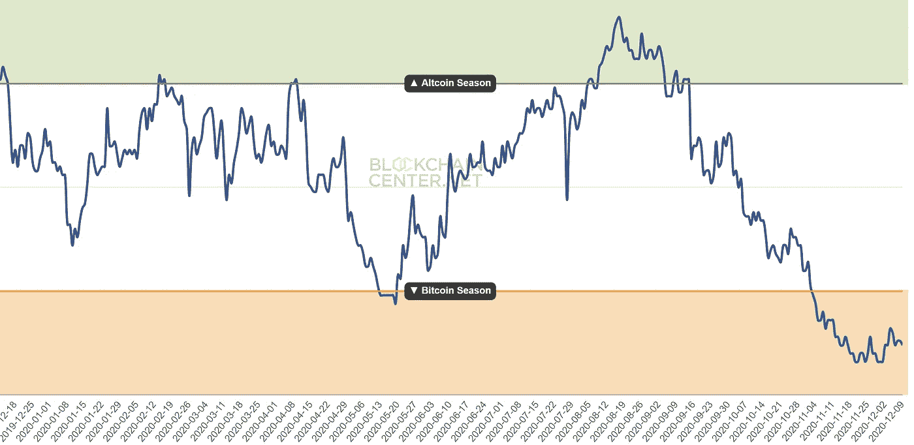

# 密码市场的六个部分

> 原文：<https://medium.com/coinmonks/the-six-segments-of-the-cryptomarket-c9e97f950954?source=collection_archive---------1----------------------->

我们不应该把所有的加密货币都扔进一个锅里，而应该把所有的硬币分成细分市场。因此，一个迷人的，多层次的“密码市场”的画面被创造出来，它告诉了很多关于网络效应的事情。

他说，目前普遍使用的密码市场优势指标已经“失效”。因为我们把所有的硬币扔向对方，然后计算哪个市场份额有…