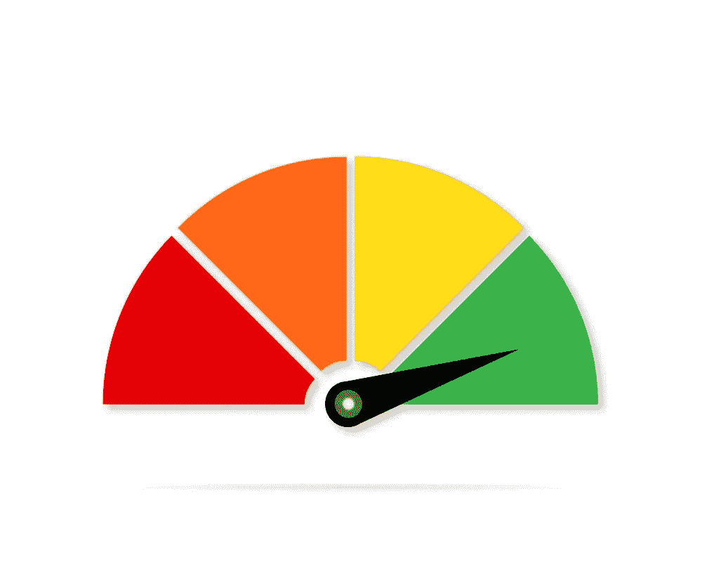
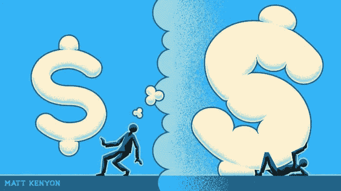
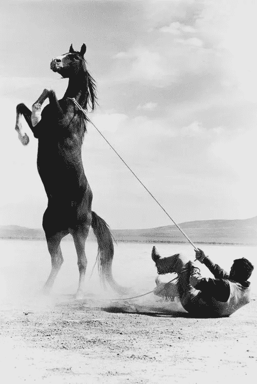
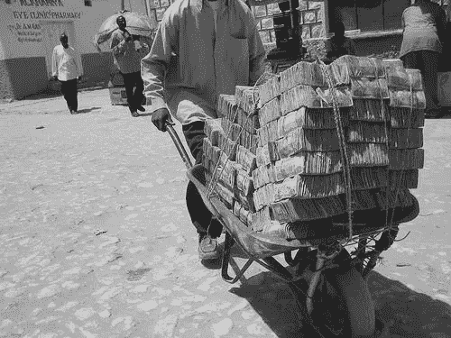
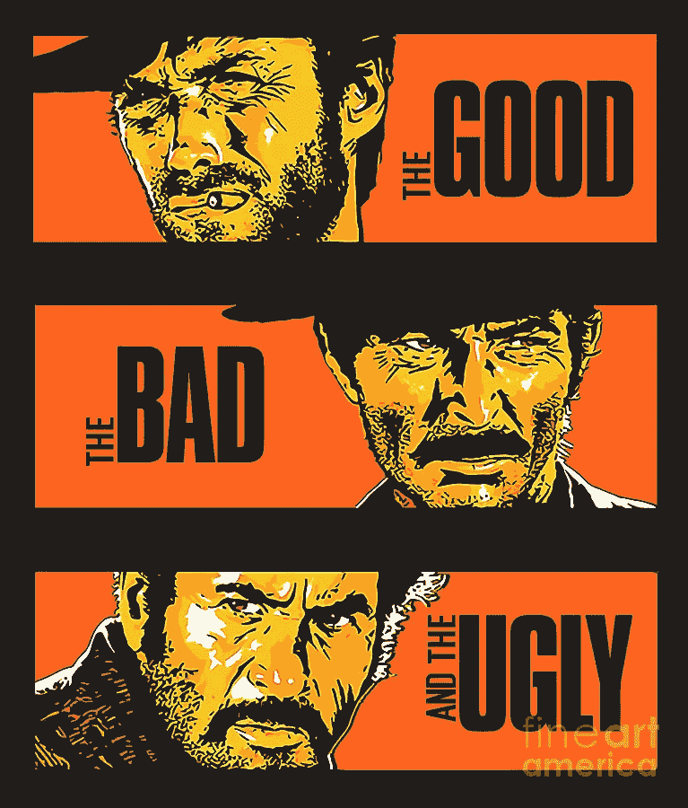
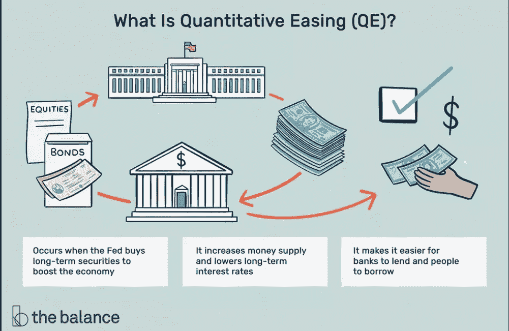
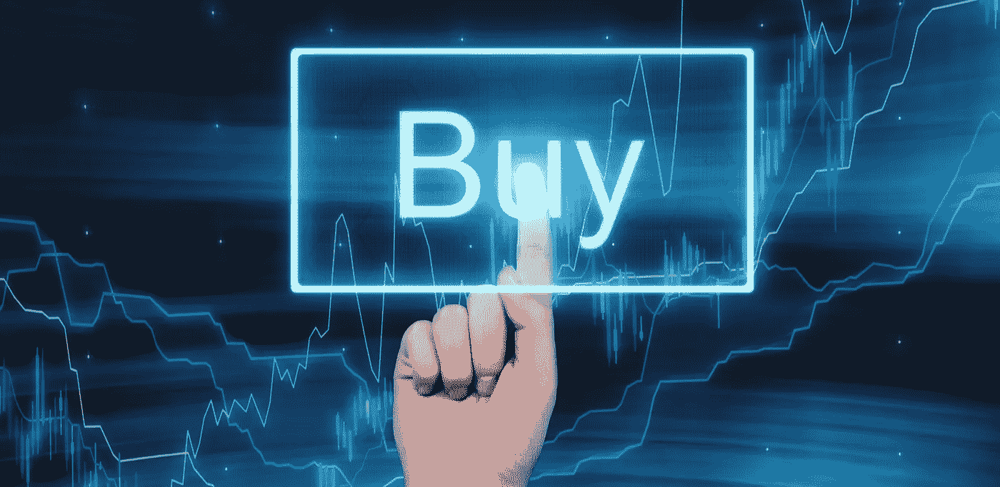
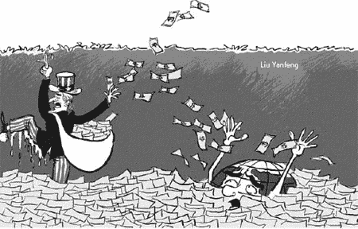
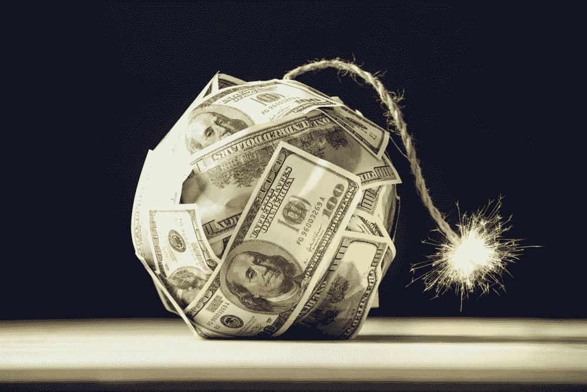
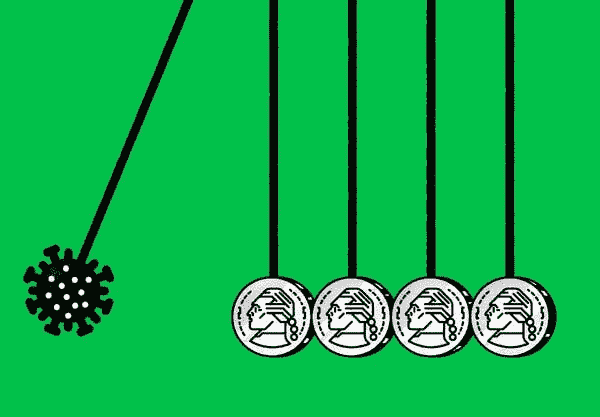

# 通货膨胀的幽灵

> 原文：<https://medium.com/coinmonks/the-spectre-of-inflation-770f9ef8369d?source=collection_archive---------9----------------------->

## 财富的“潜在”敌人——金融知识 101

通货膨胀让人们恐惧有很多原因，包括它侵蚀了工资的购买力和以美元计价的债务的价值。但是在 5 月，一位名叫*的著名外汇交易员 Stanley Druckenmiller* 警告说，一个更大的长期风险是*通货膨胀*:这可能威胁到美元作为世界主要储备货币的地位*。*

*[大卫·莫里斯:德鲁肯米勒的通胀警告对 Crypto-coin desk 有利](https://www.coindesk.com/markets/2021/05/11/what-stanley-druckenmillers-inflation-warning-means-for-crypto/)*

*美元是国际贸易中压倒性的首选货币——例如，庞大的全球石油贸易是以美元计价和结算的。美元也是各国央行最广泛持有的外币。*

*这给美国人带来了重大的经济利益——这对他们来说是一种巨大的特权，无论是美元的持有者还是受益者——美元的下跌可能会损害美国经济。*

*我们距离那种真正会对货币或经济造成严重破坏的恶性通货膨胀还有很长的路要走，正如世界各地的真实案例所显示的那样，如黎巴嫩( **144.1%** )、委内瑞拉( **1743%** )和阿根廷( **50%** )仅举几个例子，最严重的恶性通货膨胀*记录在案**

**随着全球价格飙升，阿根廷年通胀率超过 50 %|**

**[委内瑞拉货币减去六个零，三年内第二次改革|路透社](https://www.reuters.com/world/americas/venezuela-subtract-six-zeros-currency-second-overhaul-three-years-2021-10-01/)**

**[黎巴嫩跟随委内瑞拉进入恶性通货膨胀的荒野|路透社](https://www.reuters.com/article/us-emerging-inflation-graphic-idUSKCN24O20J)**

**还有大量证据表明，目前美国的通胀高度集中在几个领域，债券投资者一直顽固地怀疑通胀只是短暂的，尽管他们担心通胀率高于预期。**

**[美联储用“暂时的”来描述通货膨胀可能是“暂时的”——CNN](https://edition.cnn.com/2021/05/20/investing/inflation-stocks-economy-federal-reserve/index.html)**

**但无论通胀是否推动事情向前发展，很明显美元的储备地位已经面临压力。**

****

# **未发现通货膨胀**

## **那么，究竟什么是通货膨胀？**

> **是不是感觉一美元买的东西比以前少了？你没有胡思乱想。“这是通货膨胀，”人们抱怨道。**

# **通货膨胀是一段时间内经济中商品和服务价格的上涨。**

****这意味着你失去了购买力——同样的美元(或者你使用的任何货币)买的更少，因此价值更低。****

> **换句话说:在通货膨胀的情况下，你的钱不像以前那么多了。**

> ****例子**:如果苹果 25 美分一个，1 美元可以买 4 个。但是假设苹果变得越来越少或者种植起来越来越贵，第二年，杂货商把苹果的价格定为 50 美分一个。现在一美元只能买两个。以购买力计算，美元实际上已经贬值了一半(至少就苹果而言)。**

**请记住，现代货币实际上没有内在价值——它只是纸和墨水，或者越来越多地是电脑屏幕上的数字。它的价值是以它能买到什么或能买到多少来衡量的。**

** [## 所以你认为你了解钱？

### 金融知识 101

medium.comm](/the-capital/so-you-think-you-know-money-c03c46265c84) 

虽然通过计算商品和服务更容易理解通货膨胀，但它通常是一个广泛的衡量标准，可以应用于各个部门或行业，影响整个经济。事实上， ***美联储*** 的主要工作之一就是将通货膨胀控制在最佳水平，以鼓励消费和投资而不是储蓄，从而刺激经济增长。

[businessinsider.com.au 美联储是美国的中央银行——这就是为什么它如此强大，以及它如何影响你的金融生活](https://www.businessinsider.com.au/what-is-the-federal-reserve)** 

# **测量通货膨胀**

****

**通货膨胀的计算方法是将数千种不同商品的价格相加，并与一个月前同样商品的价格相比较。**

**这意味着在某个地方有一个清单，上面列出了在你的国家引起通货膨胀的具体因素，每个月都要有人去查看所有这些东西的价格。**

***计算通货膨胀率最常引用的两个指数是:***

*   *****居民消费价格指数；*****
*   *****生产者价格指数(PPI)；*****
*   *****个人消费支出价格指数(PCE)。*****

***让我们来详细看看。***

## ***CPI——消费者价格指数***

***美国劳工统计局使用**消费者价格指数(CPI)** 来衡量通货膨胀率。CPI 根据家庭调查，使用一篮子有代表性的商品来衡量消费者在一定时期内购买商品和服务的总成本。一篮子货币的成本增加表明通货膨胀，而使用一篮子货币通过说明更普遍的价格变化来说明不同商品的价格如何以不同的速度变化。***

## ***PPI——生产者价格指数***

***与 CPI 相反，**生产者价格指数(PPI)** 从生产者的角度衡量通货膨胀。生产者价格指数是衡量生产者在国内生产的商品和服务的平均价格。它的计算方法是，将一篮子有代表性的商品的当前价格除以特定基准年的价格，然后将结果乘以 100。***

## *****PCE——个人消费支出价格指数*****

***PCE 根据生产者的国内生产总值数据来衡量家庭商品和服务的价格变化。它没有 CPI 那么具体，因为它基于 CPI 中使用的价格估计，但也包括来自其他来源的估计。与其他两个指数一样，指数从一年到另一年的增长表明通货膨胀。***

# ***通货膨胀的原因***

******

***Credit: Matt Kenyon — Financial Times***

***有大量关于通货膨胀原因的经济文献，而且相当复杂。***

## ***不过，基本上，这归结于供求原则。***

***与通货膨胀相关的物价逐渐上涨主要有两种原因:*需求拉动型通货膨胀*和*成本推动型通货膨胀*。***

*   **需求拉动型通货膨胀发生在整个经济中需求增加导致价格上涨的时候。**
*   **成本推动型通货膨胀发生在价格因生产成本上升或供应减少(如自然灾害)而上涨的时候。**

**然而，其他分析师列举了通货膨胀的另一个原因:**货币供应的增加**——或者，简单地说，**有多少现金，或随时可用的货币在流通。****

**每当有大量的东西时，那东西就会变得不那么值钱——更便宜。的确，许多货币学派的经济学家认为这是*长期通货膨胀的最重要因素之一:***

## ***围绕供给的货币太多会使货币贬值，买东西要花更多的钱。***

***[stlouisfed.org M1 |佛瑞德|圣路易斯联邦储备银行](https://fred.stlouisfed.org/series/M1SL)***

# ***通货膨胀和美联储——一种爱恨交织的关系***

******

***他**美联储**是美国的中央银行，和世界各地的中央银行一样，美联储的任务是维持稳定的通货膨胀率。*联邦公开市场委员会* ( ***FOMC*** )已经确定大约 **2%** 的通货膨胀率对于就业和物价稳定是最佳的。***

**这种通胀水平给了 FOMC 在经济低迷时期通过降低利率来启动经济的空间，这使得借贷成本更低，并有助于刺激消费。**

## **较低的利率降低了企业和消费者的借贷成本，从而刺激了经济。**

## **较低的利率也意味着个人储蓄收入减少，鼓励他们消费。**

## **但所有这些额外需求都会推高通胀。**

**The U.S. Fed is printing money out ‘thin air’ at a staggering pace — injecting trillions into the economy**

# **驯服一匹野马**

****

**通货膨胀得不到控制时，通常被称为恶性通货膨胀或滞胀。这些术语描述了失去控制的通货膨胀，它削弱了消费者的购买力和经济。**

## **恶性通货膨胀**

****

**它指的是一段通货膨胀率极高的时期，有时长达几个月，每月的物价涨幅高达 50%以上。恶性通货膨胀通常是由政府赤字和过度印钞造成的。**

**在现代案例中，*委内瑞拉*正在经历恶性通货膨胀，2020 年*10 月*达到超过*800.000%的通货膨胀率。***

***[委内瑞拉 10 月份的年通胀率达到 833，997 %:国会|路透社](https://www.reuters.com/article/us-venezuela-economy/venezuelas-annual-inflation-hit-833997-percent-in-october-congress-idUSKCN1NC2F9)***

## ***滞胀***

******

***另一方面，我们遇到了一个罕见的事件，成本和价格的上涨与停滞不前的经济同时发生——T42 遭受高失业率和低生产的打击。***

***美国在 1973-1974 年经历了滞胀，这是在低 GDP 时期油价快速上涨的结果。***

***[滞胀和石油危机(文章)|汗学院](https://www.khanacademy.org/humanities/us-history/postwarera/1970s-america/a/stagflation-and-the-oil-crisis)***

# ***坏的，丑陋的和…量化宽松***

******

***当一个中央银行决定使用**量化宽松**(或**T5【QE】T6**)时，它会大规模购买**金融资产**，如政府和*公司债券*甚至股票。这个相对简单的决定引发了强大的结果:***

***首先*，经济中流通的**货币量增加**，这**有助于降低长期利率**，其次*其次*，这**降低了借贷成本，从而刺激经济增长。****

****

**QE explained — source: The Balance**

**这是 QE 的目标:通过购买更长期限的证券，中央银行旨在降低长期市场利率。相比之下，央行使用的主要工具是以短期市场利率为目标的标准利率政策。**

**当美国美联储使用标准利率政策时，它会调整联邦基金利率目标。这里的目标是影响银行间隔夜贷款的短期利率。几十年来，美联储一直使用利率政策来保持信贷流动和美国经济走上正轨。**

**但是当联邦基金利率在大衰退期间下降到零——这使得不可能进一步降息来鼓励借贷——美联储部署了 QE 并开始购买抵押贷款支持证券(MBS)和国债来防止经济冻结。**

**随着 *QE，中央银行向经济市场参与者发出了强有力的信息，*告诉他们**他们不害怕继续购买资产以保持低利率。****

****

# **QE:恶性通货膨胀的可能原因？**

****

**当金融机构崩溃，经济存在高度不确定性时，人们和企业选择囤积资金，而不是冒险投资和潜在损失。当钱被囤积时，它没有被花掉，所以生产者被迫降低价格以清理他们的存货。**

> *****但是，当人们预计明天价格会更低——而且他们的美元可以买到更多的东西——时，为什么他们今天要花一美元呢？*****

## **结果是囤积继续，价格持续下跌，经济停滞不前。**

**那么，为什么 QE 没有导致恶性通货膨胀的第一个原因是，当通货膨胀开始时，经济已经处于通货紧缩状态。**

> **正如 ***米尔顿·弗里德曼*** 所说，“通货膨胀始终是一种货币现象*，其产生仅仅是因为货币数量的增长比产出的增长更快。*”。**

**如果通货膨胀是一种货币现象，那么控制货币供应就是低通货膨胀的途径。货币总量成为实施货币政策的核心，但通往低通胀的道路相当痛苦。**

**因此，随着央行越来越关注实现价格稳定，对货币流动的关注越来越少。事实上，对货币兴趣的下降似乎与成功维持低而稳定的通货膨胀密切相关。**

****

**QE has serious downsides — yet the economic policies seem to have grown ‘addicted’ to the constant money injection in the economy**

**但是，如果货币数量翻倍以某种方式导致了经济增长的巨大增长，它也引起了人们对一些严重问题的关注，这些问题似乎越来越难以应对，因为政府的经济政策深深地依赖于 QE**

## **1)长期通胀压力:**

**当中央银行印钞票时，美元的供应量增加。假设这可能导致已经流通的货币的购买力下降，因为更多的货币供应使得人们和企业能够提高他们对相同数量资源的需求，从而推高价格，这可能达到一个不稳定的程度。**

## **2)可能造成资产泡沫:**

**量化宽松可以导致股市繁荣，股票所有权集中在已经富裕的美国人身上，无论危机与否。通过*降低利率*，**美联储**鼓励 ***股票市场的投机活动*** ，这可能会导致泡沫，只要*美联储*坚持其政策，这种乐观情绪就会建立起来。**

## **3)它造成不平等:**

**QE 的最后一个危险是，它可能会加剧收入不平等，因为它对金融资产和房地产等实物资产都有影响；这确实加剧了严重分散、联系不畅的主要“少数群体”的状况，他们发现自己已经处于岌岌可危的财务状况中，很少或根本没有获得任何金融服务或任何形式的财富保值。**

# **代际斗争**

****

**我们确定了事情的残酷真相:**

> **随着时间的推移，通货膨胀会侵蚀个人购买力**

**所以我们通过活动赚的钱还得继续赚。投资似乎是面对并有可能继续对抗通胀的最佳方式。**

**当*投资*时，聪明的&负责任的投资者应该把他/她的注意力集中在*那些回报率超过通货膨胀率的**资产上。*****

**某些类型的资产可能比其他资产更好地战胜通货膨胀，例如:**

*   **股票:股票市场没有任何保证，但总的来说，随着时间的推移，股票价格的上涨速度通常会超过通货膨胀率。大多数指数基金也公布了比通货膨胀更好的回报。**
*   ****通货膨胀指数债券:**大多数*美国*国债支付相同的固定利息——如果通货膨胀猖獗，其价值就会降低。**
*   ****实物资产和商品:**另类投资——通常是有形资产，如旧货、商品、艺术品或收藏品——在通胀环境中表现良好。不动产也是如此，尤其是以房地产形式存在的不动产。**

# **通货膨胀是“动机”**

****

**Source — NY Times**

**我们已经看到，在最近的冠状病毒危机和金融危机的早期，QE 和 T21 都发挥了巨大的作用，保持了市场的稳定，并促进了经济的增长**

# **但是代价是什么呢？**

**一旦市场稳定下来， *QE* 的风险在于，它可能会造成资产价格泡沫，加剧大多数国家已经存在的收入不平等失衡的现实。**

**通货膨胀的影响在短期内可能看起来很小，但在几年或几十年的时间里，通货膨胀会极大地侵蚀人们储蓄的购买力；适度的通货膨胀对经济增长是完全必要的，但是知道通货膨胀率是多少，是高还是低，可以帮助指导个人的金钱决策。**

****了解我们的新平台**👉**【https://thecapital.io/】****

******[https://twitter.com/thecapital_io](https://twitter.com/thecapital_io)******

> ******加入 Coinmonks [电报频道](https://t.me/coincodecap)和 [Youtube 频道](https://www.youtube.com/c/coinmonks/videos)了解加密交易和投资******

# ******另外，阅读******

*   ******[什么是融资融券交易](https://coincodecap.com/margin-trading) | [美元成本平均法](https://coincodecap.com/dca)******
*   ******[拥护卡审核](https://coincodecap.com/uphold-card-review) | [信任钱包 vs MetaMask](https://coincodecap.com/trust-wallet-vs-metamask)******
*   ******[Exness 评测](https://coincodecap.com/exness-review)|[moon xbt Vs bit get Vs Bingbon](https://coincodecap.com/bingbon-vs-bitget-vs-moonxbt)******
*   ******[如何开始通过加密贷款赚取被动收入](https://coincodecap.com/passive-income-crypto-lending)******
*   ******[BigONE 交易所评论](/coinmonks/bigone-exchange-review-64705d85a1d4) | [电网交易机器人](https://coincodecap.com/grid-trading)******