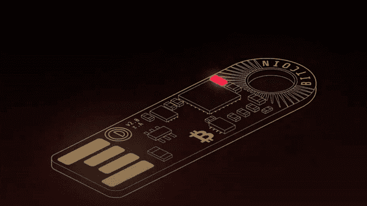
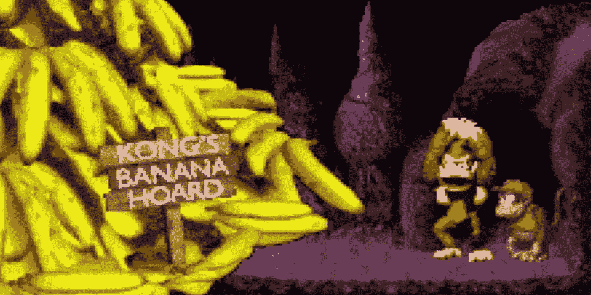
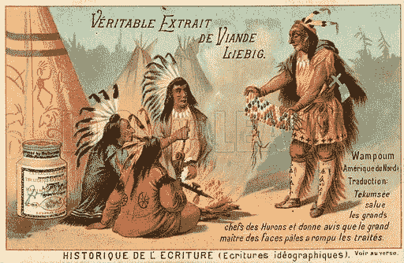
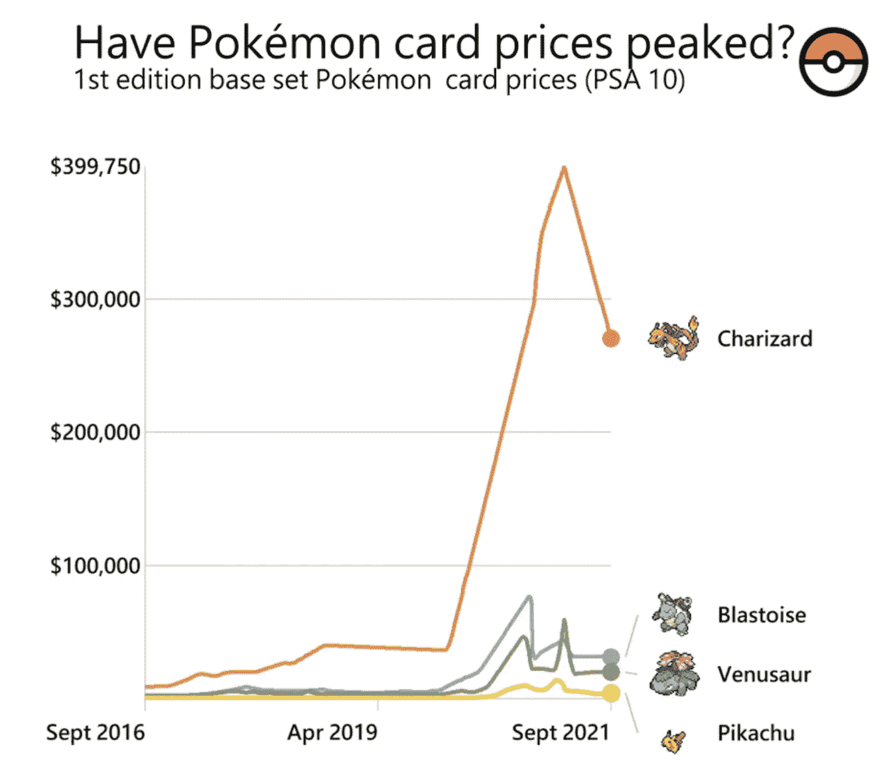
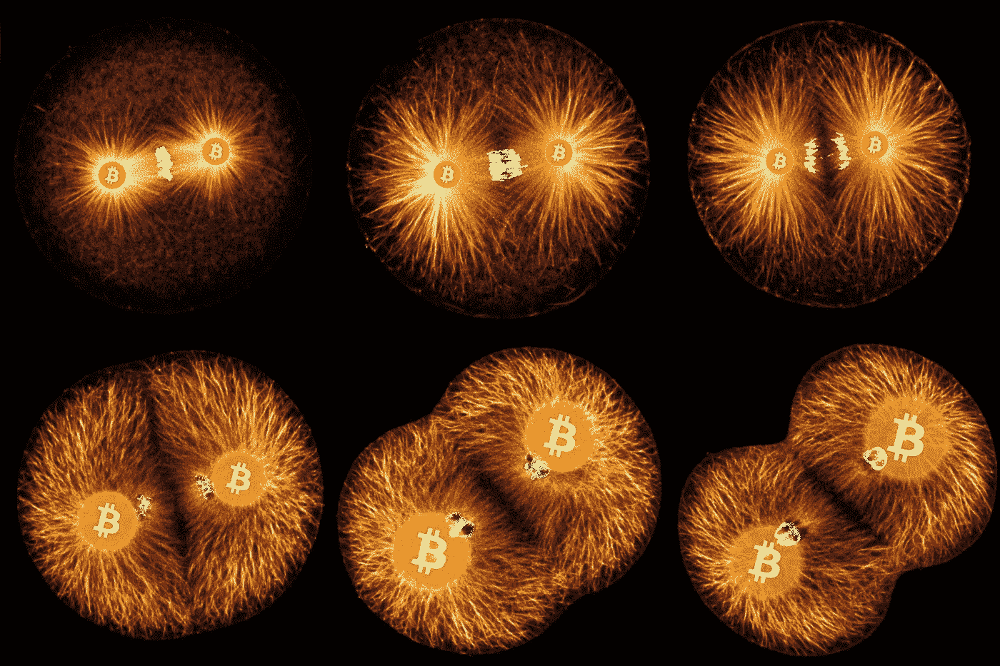

# 金钱的精神

> 原文：<https://medium.com/coinmonks/the-spirit-of-money-6e199c6e6aad?source=collection_archive---------12----------------------->

## 能源生物寻找新的宿主

钱不是你想的那样。钱不是你钱包里的硬币，也不是你银行应用程序上的数字。这些可能是它现在的形状。不，钱是变形人。正如寄居蟹在壳破了的时候寻找新壳一样，如果当前的壳破了，钱就会寻找新家。在特定的情况下，你可以从历史中看到这一点，因为金钱表现为石头、香烟或奶牛。金钱是一种外星能量，它需要一个宿主来为人类发挥作用。如果有必要，它可以跨多个主机进行拆分，以改善对我们的服务。这种生物现在生活在哪里？它以前住在哪里？最重要的是，它将来会在哪里？

## 货币职能和性质

金钱精神是人类购买行为的产物。考古研究至今表明，尼安德特人没有使用货币。因此，智人是第一个使用这种语言的灵长类动物，并可能获得了这种语言，以此作为对竞争对手的一种竞争优势。使用金钱有许多好处。它执行以下功能:

**价值储存(SoV)**
就像脂肪是你身体的能量储存库，金钱是储存你工作的时间。一个好的储蓄工具可以让你在以后用你的工作时间换取一种产品或服务。重要的是，将来你的工作时间仍然是一样的。
假设你将香蕉作为一种储蓄工具，你很快就会发现这并不是理想的储蓄机制。一个月之内，你所有的香蕉都会烂掉，你所有节省下来的时间都会化为乌有。

作为一个工作狂，你还必须能够把香蕉存放在某个地方。人们将不得不额外投资一个棚子/冷却器来储存它。因此，另一个问题产生了，因为如果棚子被烧毁或被抢劫怎么办？你的香蕉需要额外的安全措施。

最后，如果 K. Rool Corporate 突然开始种植香蕉种植园以赚取新的资金，该怎么办？由于供应量增加，你的香蕉将变得一文不值。因此，优质货币是稀缺的，也是抗通胀的。通货膨胀阻力或增加产量的困难使得资源稀缺。
总结起来，一个好的 SoV 就是**耐用**、**价值紧凑**、**不受限**和**稀缺**。

Banana Money: Does it work?

货币的第二个功能是它是一种交换媒介。高效的经济需要贸易，否则我们必须自己完成每一项任务，而不是专业化和提高一项特定技能。没有钱就有了**易货**。假设我有香蕉，需要苹果。暴躁的孔想要香蕉和苹果。我们都可以交易，因为有一个[需求](https://en.wikipedia.org/wiki/Coincidence_of_wants)的巧合。然而，当 Cranky 没有苹果但接受香蕉或者有苹果但不接受香蕉时，就有问题了。
易货也是不可扩展的。经济中需求问题的一致性随着产品/服务数量的增加而二次增加。微观经济中有 5 种商品，必须使用 5 = 25 种价格。货币解决了这一点，所以任何人都可以随时清算到交换媒介。

回到香蕉的例子，但是现在作为一个 MoE。首先，香蕉不容易携带。如果我想从 Funky 的香蕉车公司买一辆特斯拉，我必须租一辆卡车，把香蕉现金倒在他的店门口。
另外，Funky 还要检查每一根香蕉是否符合标准。也许我的香蕉太小了，或者有些有凹痕、破损或腐烂的斑点。这些香蕉不能被 Funky 用来交换其他东西，因此不能销售。最好的情况是，我们已经有了完全一致的转基因香蕉。这使得任何香蕉都可以与其他香蕉互换，即**可替换**。我们也许应该先让香蕉鉴定师对香蕉进行鉴定、批准和盖章。这样的资格会让香蕉钱变得容易辨认和可靠。显然，这个香蕉系统的效率低得惊人。
最后，交换媒介必须容易**分割**。在 Candy's 糖果店，你想买一卷薄荷糖。价格是 1.42 香蕉。然后，你必须非常具体地切香蕉，这样你才能匹配准确的价格。糖果可能只接受整个香蕉，让你在这次交易中多付了钱。

总之，一个合适的交换媒介是可替代的、可分割的、可识别的、可销售的和可携带的。

记账单位(UoA)
能够确定价值是人类的必需品，因此货币的第三个功能是作为记账单位。它要求货币的价值相对稳定。
例如，在一个香蕉共和国，由于一艘香蕉油轮被冲上了海滩，出现了恶性通货膨胀。昨天的香蕉现在比今天的值钱多了。如果 Dixie Kong 有 1 个香蕉的债务，那么很容易还清她的债务，因为经济现在被香蕉‘淹没’了。这对债权人是不利的。
UoA 就像一副眼镜，透过它你可以诠释价值。理想情况下，一个人的钱是稀缺的，因此他对经济中正在发生的事情有着最清晰的认识。

## 不同的时间，不同的钱

现在我们了解了货币的功能，让我们来看看货币在过去的表现。不同的经济条件导致货币寻找不同的主人来履行其服务。

原始货币:贝壳、石头和玻璃珠最初的货币形式通常是可以在环境中找到的稀缺物品。一些印第安部落使用由金星贝壳制成的珠子，这种珠子被称为“T8”。寻找和制作万普姆需要大量的工作，使其稀缺。此外，它还是一个很好的 MoE，易于运输，可分割等。由于殖民者拥有更先进的技术，可以用更少的劳动收获和制造更多的 wampum，这些钱通过通货膨胀失去了价值，逐渐作为货币消失了。海狸皮将成为一种更可靠的货币。

Wampum: Native American money

类似的命运等待着西非的玻璃珠经济。玻璃在这些国家很稀缺，因此成为了货币。然而，欧洲人能够工业化生产玻璃珠，并把它们倾销到非洲市场，从而买下所有的财富，使玻璃珠变得一文不值。

雅浦岛的居民证明了较小的可分物体也可以变成货币，即所谓的 **Rai 石头**。这些是巨大的石头，上面有一个洞。岛民可以各自拥有不同石头上的不同部分。为了进行交易，全岛的人必须走到一起来确认和批准交易。以这种方式，所有权永远不会被篡改，并允许无限的分裂。
稀缺性原则也适用于 Rai 宝石，因为它们在雅浦岛找不到。只有去附近的一个岛上进行一次危险的旅行(意思是:去工作)，才能创造更多的钱。这个系统最终也被西方人打破，他们可以通过更好的船只技术轻松地将新石头运到岛上。

金本位
市场自然会找到最好的货币，因此**金银币**最终会战胜原始货币。贵金属更难生产，因此更抗通胀。黄金是最稀缺的，因此会履行储蓄职能。白银在可分割性上补充了黄金，并作为主要的交易媒介，因为这种黄色金属对于小额交易来说过于紧凑。
金本位制的升级将是纸质金银券。这使得在银行的安全存储和纸张提供了改善的可运输性和可分割性。只要这些凭证的可兑换性得到保证，并且流通中的凭证不超过银行的金属存款，这种制度就能发挥作用。历史表明，没有一种纸币体系能够支持兑换，通胀总是会随之而来。在最坏的情况下，**菲亚特**会因为**过度膨胀**而完全解体。

**恶性通货膨胀:魏玛德国** 当无支持的政府货币(法币)的价值被严重侵蚀时，人们转向替代品。当一种货币经历恶性通货膨胀时就会发生这种情况，就像魏玛共和国(1922-1923 年)发生的那样。货币供应量的指数式增长是无力偿还第一次世界大战给同盟国造成的损失的结果。政府仍然能够支付损害赔偿金的唯一方法是印刷新的钞票，导致纸币迅速贬值。
在恶性通货膨胀期间，储蓄功能转移到其他货币、黄金、汽车、房屋或股票市场。当法币不再是货币时，其他一切都变成了货币。⁴

第二次世界大战期间，我们会看到其他形式的货币。在德国监狱里，香烟有时会变成钱。香烟是一种通货紧缩的货币，因为它们已经被吸完了，而且新的供应量很低。它们变得越来越稀缺，并采用了储蓄功能。
此外，一包香烟可以分成更小的可替换单元，即香烟本身，并且易于运输，因此作为交换媒介是理想的。
香烟作为货币只在封闭的环境中起作用。你一出狱，烟的价值就回落到其内在价值，即兴奋剂的价值，因为它在烟草丰富的外部世界不再稀缺。

现在:房地产、乐高玩具和神奇宝贝卡片
当前的货币体系自 1971 年以来就与黄金脱钩，因此无法保持其价值。这种贬值正在加速。其他资产正在接管它的储蓄功能。只要看看房市和股市就知道了。越来越疯狂的是，像神奇宝贝卡片和乐高这样的儿童玩具正在成为储蓄工具。人们拼命寻找保护他们购买力的方法。

货币储蓄的减少是一个主要问题。结果，**房地产**市场的价格变得过高，以至于找一个住的地方变得越来越困难和昂贵。如果薪水的很大一部分花在住房上，人们就会变得更穷，贫富差距就会扩大。理想情况下，人们应该拥有一种没有内在价值的货币，这样它就不会扰乱其他市场。

Pokémon cards: A savings alternative (credits: [PieChartPirate](https://www.reddit.com/r/dataisbeautiful/comments/qo2gzt/oc_1st_edition_base_set_pok%C3%A9mon_card_prices_from/))

迄今为止，最好的货币是黄金。纸币是便于交易的一种升级。由于数字化，交换功能进一步完善。然而，储蓄功能已经被政府政策完全侵蚀了。
**比特币**修复了这个。网络是分散的，没有人能改变系统的规则。这保证了最多发行 2100 万枚硬币，并永远解决了通货膨胀问题。
此外，比特币不会扰乱任何其他市场。这是历史上第一种为吸收所有货币能量而设计和制造的货币。房屋和股票的货币溢价可能会完全流向橙色硬币，帮助这些市场复苏。毕竟，这些资产也不适合作为 MoE，因此最终也不适合作为货币。

## 金钱的精神

几个世纪以来，货币能源精神呈现出不同的面貌。货币是一种看不见的有机体，它总是寻找最好的主人来履行它的储蓄和交换功能。大多数人把货币和法定货币混为一谈。法国人仍然称银为货币。德国人说 Geld(黄金)。人类以后会说比特币，因为比特币是为钱优化的房子。绝对稀缺，可光速运输，无限价值紧凑，不可封存，可验证，可替代，无限可分，没有内在价值。⁵

Money: An energy organism

随着越来越多的人采用比特币以及技术的进步，金钱精神正在流入比特币。截至 2021 年，它仍然主要是一种价值储存手段，但新兴的**闪电网络**正在改善交换媒介的功能。⁶这种生物会在互联网上如此自在，通过比特币以光速提供匿名、无审查的全球价值交换……它可能永远不会离开。

## 参考

1.  **炮轰出** —尼克·萨博(2002)
    [https://nakamotoinstitute.org/shelling-out/](https://nakamotoinstitute.org/shelling-out/)
2.  **万普姆** —维基百科
    [https://en.wikipedia.org/wiki/Wampum](https://en.wikipedia.org/wiki/Wampum)
3.  **比特币标准** —赛弗迪安·阿摩斯
    [https://indianpdf.com/the-bitcoin-standard-book-pdf/](https://indianpdf.com/the-bitcoin-standard-book-pdf/)
4.  **魏玛德国的恶性通货膨胀** —维基百科
    [https://en . Wikipedia . org/wiki/Hyperinflation _ in _ the _ Weimar _ Republic](https://en.wikipedia.org/wiki/Hyperinflation_in_the_Weimar_Republic)
5.  **比特币没有内在价值** —凯泽报道
    [https://www.youtube.com/watch?v=k719l_yYpOo](https://www.youtube.com/watch?v=k719l_yYpOo&ab_channel=SimonDixon)
6.  **闪电网** —维基百科
    [https://en.wikipedia.org/wiki/Lightning_Network](https://en.wikipedia.org/wiki/Lightning_Network)

> 加入 Coinmonks [电报频道](https://t.me/coincodecap)和 [Youtube 频道](https://www.youtube.com/c/coinmonks/videos)了解加密交易和投资

## 也阅读

 [## 杠杆代币[多头代币]终极指南

### 杠杆化令牌是具有杠杆化风险敞口的 ERC20 令牌，不考虑保证金、要求、管理…

medium.com](/coinmonks/leveraged-token-3f5257808b22)  [## 最佳加密交易所| 2021 年十大加密货币交易所

### 加密货币交易所的加密交易需要了解市场，这可以帮助你获得利润。之前…

blog.coincodecap.com](https://blog.coincodecap.com/crypto-exchange)  [## 2021 年最佳加密交换平台| CoinCodeCap

### 如果我们看看今天的场景，许多加密货币交换平台提供了广泛的功能和深度…

blog.coincodecap.com](https://blog.coincodecap.com/best-swap-platforms)  [## 2021 年最佳加密借贷平台| 6 大比特币借贷平台

### 获得比特币和其他加密货币的最佳贷款利率

medium.com](/coinmonks/top-5-crypto-lending-platforms-in-2020-that-you-need-to-know-a1b675cec3fa)  [## 2021 年最佳免费加密交易机器人

### 2021 年币安、比特币基地、库币和其他密码交易所的最佳密码交易机器人。四进制，位间隙…

medium.com](/coinmonks/crypto-trading-bot-c2ffce8acb2a)  [## 最佳 4 个加密交易信号电报通道

### 这是乏味的找到正确的加密交易信号提供商。因此，在本文中，我们将讨论最好的…

medium.com](/coinmonks/best-crypto-signals-telegram-5785cdbc4b2b)  [## 获取信号、交易机器人和套利

### 在本文中，我们将回顾 Bitsgap，这是一个满足您所有交易需求的一站式加密交易平台。它…

blog.coincodecap.com](https://blog.coincodecap.com/bitsgap-review)  [## 仙境提供了 83，412%的 APY 赌注:仙境是一个骗局吗？CoinCodeCap

### 仙境是雪崩网络的第一个基于时间令牌的分散储备货币协议。一篮子…

blog.coincodecap.com](https://blog.coincodecap.com/wonderland-offers-an-83412-apy-on-staking-is-wonderland-a-scam)  [## 天秤座货币——脸书的加密货币

### 自 2018 年马克·扎克伯格决定致力于改善区块链以来，关于天秤座货币的传言就一直存在…

blog.coincodecap.com](https://blog.coincodecap.com/libra-currency-a-cryptocurrency-by-facebook)