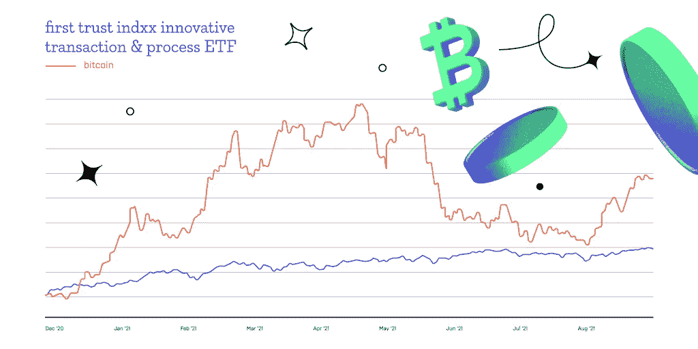

# 传统金融机构采用加密技术的阶段

> 原文：<https://medium.com/coinmonks/the-stages-of-crypto-adoption-by-traditional-financial-institutions-6aa018cc0af6?source=collection_archive---------3----------------------->

加密货币最初是作为私人用户交换价值的工具开发的，绕过了通常无利可图和繁琐的中介，如银行和其他金融网关提供商。

但随着第一批交易所的出现，加密货币行业整体的价值开始积累，区块链技术证明了它们的效率和应用潜力，超越了小额交易和买披萨的狭窄圈子，很快就变得很明显，企业是去中心化的真正受益者。

总的来说，**加密产品基于其数字特性和分散性，为企业**带来的好处要比私人用户多得多。数字资产具有更低的佣金、更高的速度、更大的灵活性和可访问性，使企业能够摆脱传统的金融中介，通过集成的金融解决方案成为银行。

加密货币驱动的解决方案不仅可以吸引新型客户，还可以让公司获得新的资本，帮助实现实时、准确的收入共享，使资金转移安全、即时，以及[更多](https://www2.deloitte.com/us/en/pages/audit/articles/corporates-using-crypto.html)。

# 业务集成的采用阶段

加密货币对商业开放，因为集成各种 DeFi 或其他解决方案所需的基础设施已经开发出来，并且正在进行改造和调整，以适应各种行业的需求。这只是一个企业必须经历的数字转型问题，无论是在技术方面还是在精神方面，都要开始将基于数字资产的解决方案集成到他们的运营中。

> *"* 加密货币发生的事情是，在许多情况下，它更像是一种资产游戏，而不是一种货币。
> 
> 要记住的主要一点是，这项业务是跟着消费者走的。如果消费者开始感觉到他们通过加密货币获得了一些影响，其他一切都会自动调整。
> 
> ****PayPal 的 CTO 斯里·希瓦南达****

*根据加密成熟度[模型](https://www.protocol.com/sponsored-content/the-crypto-maturity-model-how-traditional-finance-can-adopt-cryptocurrency-in-stages)，整合的第一阶段必须考虑经济的基本支柱——银行和整个金融系统，它控制着全球的零售、结算、投资和交易。*

*一旦加密转移成为主流并广泛可用，合成加密工具将可供全球经济的更大参与者使用，如投资基金和交易平台，允许 ETF、期货等操作。考虑到 46%的人专门使用数字渠道来满足他们的财务需求，这一点变得尤为重要。此外，统计数据显示，区块链相关公司的业绩正处于稳定增长阶段。*

*一旦主要交易平台和零售商成为数字资产市场的共同参与者，就可以考虑进一步发展加密相关服务，并开发实验或外来工具，以满足企业及其客户寻求更顺畅、更简化的企业客户体验的需求。这些服务包括托管服务和忠诚度计划，以及 OTC 服务等。*

# *新市场*

*结合所有这些服务及其衍生产品，企业不仅可以创造利润和价值，还可以推进新的数字经济，为新产品、服务或整个行业的发展创造机会。记住，一切都是 fintech？*

*以 NFT 的炒作为例。每个人都被拥有一件不可替代的现代艺术品的想法迷住了。这反过来又为新的子行业的出现铺平了道路，如支持新标准的 NFT 市场、拍卖、Dao 和数字钱包。*

**

*利用数字前沿的一个展示例子是 metaverses 的出现，它结合了 DeFi、集成金融、零售、游戏、交易、创意、令牌化等元素。随着这种新前景先于企业出现，数字资产成为主流只是一个主动性的问题。*

# *企业的数字资产机遇*

*区块链技术为企业提供了许多利用去中心化优势的机会。其中包括:*

*   *接触依赖加密货币的全新客户*
*   *通过 NFC 和加密银行卡设施实现几乎无佣金的银行业务*
*   *一系列不同的辅助服务，如赌注、流动性挖掘和其他形成分散金融部门的服务*

*然而，企业能够产生的真正流动性存在于专门为更广泛的交易领域定制和设计的专业化数字资产和工具中。*

> *最受期待的是加密货币 ETF，即交易所交易基金。这些工具代表一种投资基金，跟踪其基础资产或一篮子资产的价格指数。*
> 
> *主要基金都在急切地等待这种资产变得广泛可用并得到法律认可，因为它们代表着市场产品多样化的重要一步。*

*举例来说，Bitwise Crypto Industry Innovators ETF 在推出后不到一个月就吸引了约 4500 万美元的资产，而由 MicroStrategy 和 PayPal Holdings Inc .等股票管理的 Amplify transformation Data Sharing ETF 吸引了超过 7.11 亿美元的资产。*

**

*基金被数字资产的波动性所吸引，但它们从未对购买一种加密货币作为整个投资组合的一部分感兴趣。ETF 将允许比特币或其他加密货币在纳斯达克交易，立即允许基金开始对冲其持有的高波动性带来的利润。*

*此外，ETF 将为参与交易的企业的税收效率铺平道路，因为比特币 ETF 将受到 SEC 或任何其他主要监管机构的监管，任何为了养老金或投资基金的利益而操纵 ETF 的行为都是合法的。*

# *监护权的问题*

> *“鉴于加密货币的在线性质、交易速度和低转账佣金，使用加密货币进行支付非常方便。*
> 
> *各行各业都可以从以如此多的不同方式使用这项技术中受益:软件开发公司的加密支付、游戏的加密入口、电子商务的平板网关等等。*
> 
> *Mercuryo 的目标是设计一系列服务，满足各类企业的需求，”*
> 
> ****亚瑟·菲斯托夫，Mercuryo 的销售主管****

*但加密货币对企业有吸引力的另一个重要特征是保管方面——此类资产的存储和投资组合管理。说到存储——仅硬件钱包市场[预计](https://www.cybavo.com/blog/digital-asset-wallet-and-custody-trends-for-2021/)到 2026 年将达到 7 . 95 亿美元，比 2020 年增长三倍。*

> **加密托管解决方案是数字资产的安全、离线存储选项，通常面向持有大量加密货币的机构投资者。**
> 
> **Mercuryo 的加密 SaaS 解决方案为希望为客户提供加密货币相关服务但不想自己处理数字资产的银行提供内置托管服务。**

*托管提供商可以利用数字资产前沿为企业提供一系列与无障碍购买、销售和存储加密货币相关的服务，其费用与传统托管服务(如银行提供的服务)存在巨大竞争。*

*此外，就数字资产而言，银行在保管方面处于劣势，这主要是因为大多数银行没有运营此类资产的合法权利，而许多企业正在为其加密投资组合寻找运营商。*

*商户托管服务或商户服务提供商是市场上的另一个主要参与者，它正在迅速占领中小型企业。*

*将加密支付网关集成到企业网站中，并提供简单方便的出站解决方案，如直接点对点、钱包对钱包、钱包对账户、NFC 终端或 QR 码支付，使得加密货币作为支付手段的使用对于数字货币持有者和商家来说都非常快速、有利可图且方便。*

# *忠诚因素*

*顾客忠诚度是市场上的一种有价值的商品。推出忠诚度计划并奖励客户重复购买的企业将确保稳定的营业额。*

*考虑到部署这种平台的基础设施已经存在，使用虚拟货币建立这种系统的可能性有很多。*

*与传统的忠诚度计划不同，激励工具已经存在于分散的行业中，并使企业能够吸引专注于数字迁移的进步受众，并能够不仅提供必要的流动性，还提供动力。*

*最近[的一项调查](https://thewisemarketer.com/retail/retailers-are-accepting-crypto-should-loyalty-programs-be-next/)显示，44%的零售客户认为他们的忠诚度体现在加密货币上，28%的千禧一代拥有某种形式的加密货币。*

# *信用企业*

*加密贷款是一个非常有利可图和需求的工具，随着 DeFi 部门的出现，它正迅速获得牵引力和受欢迎程度。越来越多地采用加密贷款的主要原因之一是潜在的技术基础，它不要求贷款人提供大量的抵押品。贷方也是绿色的，因为智能合同规范了贷款，使其几乎没有风险。*

*加密贷款从根本上不同于传统贷款。一个借款人，无论是商业实体还是个人，使用数字资产，比如说 BTC，作为抵押品，获得稳定的贷款。由于波动性因素，他们不得不锁定比他们获得的基金总价值更多的 BTC。*

*后来，当贷款和利息被偿还时，他们不仅得到了他们的抵押品，如果 BTC 价格上涨，他们还能获得利润。这种工具使银行处于不利地位，因为它们的利率经常是掠夺性的。*

# *关键途径*

*一旦数字资产被正式认可为主要交易所的可交易工具，企业就可以采用加密技术。*

> *“加密货币监管不再是白日梦，而是当务之急。随着越来越多的机构投资者进入该行业，形成一个坚实的、普遍的法律框架的需要变得比以往任何时候都更加重要。*
> 
> **一旦当局起草了这样的立法，知道自己的利益受到保护的企业将更热衷于实施新技术，”**
> 
> ****亚当·伯克，Mercuryo 的法律顾问****

*但在特定阶段过去之前，加密货币可以被企业用于交易处理、忠诚度计划启动、节省费用和贷款利息。*

**最初发布于*[*https://blog . mercuryo . io*](https://blog.mercuryo.io/post/tradfin-adoption)*。**

> *加入 [Coinmonks 电报频道](https://t.me/coincodecap)，了解加密交易和投资*

## *也阅读*

* [## 最佳加密交易所| 2021 年十大加密货币交易所

### 加密货币交易所的加密交易需要了解市场，这可以帮助你获得利润…

blog.coincodecap.com](https://blog.coincodecap.com/crypto-exchange)  [## 2021 年 9 大最佳加密借贷平台

### 当谈到加密货币贷款时，大量因素等同于良好的收入状况。此外，借款的一部分…

blog.coincodecap.com](https://blog.coincodecap.com/crypto-lending)  [## 2021 年最佳加密交易机器人(免费和付费)

### 2021 年币安、比特币基地、库币和其他密码交易所的最佳密码交易机器人。四进制，位间隙…

medium.com](/coinmonks/crypto-trading-bot-c2ffce8acb2a)*