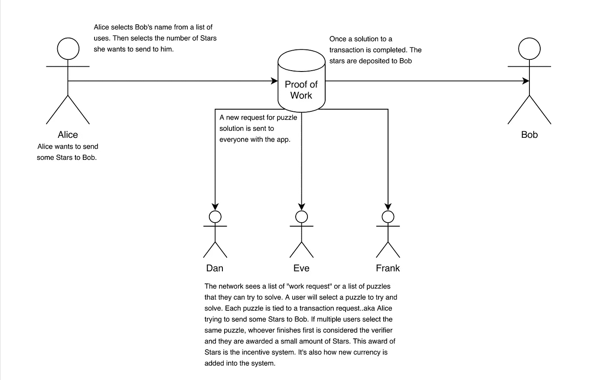
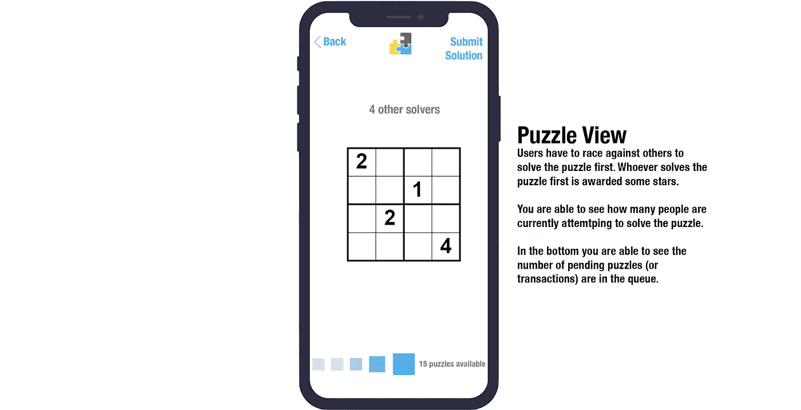

# 星锅概念

> 原文：<https://medium.com/coinmonks/the-starpot-concept-c25e98656dd?source=collection_archive---------6----------------------->

## 一种可能的新方法，结合了工作证明、股份和大脑。

几个月来，我一直在思考如何从头开始创建一个实用的区块链应用程序，作为测试激励模型和不同链实现的一种方式。最终，我想出了一个名为 Stars 的移动应用程序。这个想法很简单，在我的办公室里，如果员工们可以因为做了令人敬畏的事情而互相发送“星星”,那就太棒了。你帮我出一道难题，我送你几颗星星；最简单的货币兑换。

知道我想在区块链持久性模型上开发应用程序，我必须想办法处理双重花费。比特币使用工作证明来做到这一点，以太坊正在转向股权证明，等等。我决定我想使用工作证明，但做一些疯狂的计算问题不会在移动工作。然后我想，与其让 cpu(或 gpu)充当工作到价值的转换器，不如让人们来做。

我后来在论坛上看到一些帖子，人们抽象地谈论大脑的证据，这似乎也属于这一类，尽管我并没有和他们一起研究命名规则。

这个想法是，当一名员工想给另一名员工发送星星时，会创建一个“难题”，必须在交易被标记为有效并添加到链中之前完成。在这种情况下，这种方法效果很好，因为快速交易时间没有法定货币区块链的交易时间重要。

这个难题需要是稍微难解决的，太难了，人们不会去做。它还必须易于验证，即验证解决方案所需做的工作要少于寻找解决方案本身所需做的工作。在这种情况下，我的选项是 4x4 数独方块，某种类型的照片方块拼图(照片被切割成网格，然后被打乱，然后由求解器移动瓷砖来创建原始图像)。我现在倾向于 4x4 数独游戏，但也接受其他选择。

所以现在我们有了交易模型。现在我需要想出一个激励模型。为什么有人会解谜，除非他们的工作有所收获？在比特币中，这些人被称为矿工，他们获得新铸造的比特币作为奖励。在我的申请中，这些“解决者”将获得星星奖励。这是我开始尝试一些新东西的地方。这是我想做的，想法有点分散，所以我将它们作为要点。

1.  随着比特币中每一个新块的诞生，就有新的比特币产生。这里重要的是新的硬币被创造出来了。这意味着每一笔交易都会在经济中产生新的货币。我不想这么做。我想要一种方法来控制经济中的货币量，并能够根据通货膨胀/通货紧缩进行调整。
2.  以太坊要求你支付交易费用。这对我来说也不是很有吸引力，我们怎样才能创建一个不会因为网络负载而导致交易成本波动的系统。
3.  我们如何激励人们进行交易，而不是仅仅将货币作为价值资产而非交易资产持有。

那么我们如何解决这三个问题。因此，星锅的概念诞生了。Starpot 概念的核心特征是，有一个由众多明星组成的群体，他们在整个经济中扮演着价值平衡器的角色。如果锅里有星星，那么经济是不健康的，当交易完成时，成本是从锅里支付的。当经济健康时，交易成本很小。当用户不活动或在给定的时间范围内没有执行一定数量的交易时，就会产生罚款，他们必须向底池支付 Stars。类似于传统银行的账户费。因此，虽然我们无法完全取消交易费，但它们现在只是在某些时候存在。

现在是我当前的解决方案需要改进的地方，我正在积极地进行补救。为了让任何人都想参与其中，恒星本身必须有某种与物质世界的汇率。我的第一个想法是，在每个季度末，你可以用星星交换某种类型的奖励或直接的法定货币。尽管这种解决方案可行，但它只是拖延时间，并没有真正在区块链进行创新。我的另一个想法是，根据星星，你可以优先获得 PTO，或者在休假时获得第一次出价。虽然我目前的雇主并没有以上述任何一种方式运作，但它对我目前的情况*(我们没有对 PTO 或休假时间进行投标)*。我现在的想法是如何创建一个平台，使得从恒星到 XXX 的交换是可变的。然而，如果这样做了，就很难对明星进行一些标准的估价。

下面是一个非常基本的应用程序设计的例子。

## 发送星星

以上是大多数用户在相互发送星星时看到的画面。有很多需要改进的地方，但是要获得用户流的总体感觉。

以下是我认为最有趣的屏幕，如果你愿意，我们的“大脑的证明”。这是解决难题的地方，以便将交易推到链上。

## 拼图视图

我仍在努力完善这一系统的经济学模型，但值得注意的是，在我这样做的时候，我会记住以下一些主题:

# **人工稀缺:**

如果我们给你一个月可以发送的星星数量设定一个上限，这将激励用户向星星发送更多的责任。我的想法是，如果你一个月只能发 5 颗星，你会对奖励一颗星的价值更加挑剔。如果你想做更多的研究，斯坦福大学和丹·艾瑞里或杜克大学的穆里尔·尼德勒提出了这个概念。[维基百科](https://en.wikipedia.org/wiki/Artificial_scarcity)

# 有条件价格报价:

我一直在研究的另一个有趣的概念是将利害关系的证明和“大脑”的证明结合起来。这个想法是，你可以在经济中投入一些赌注，以获得在别人之前解决难题的机会。如果你没有在这个谜题公布给所有人之前解决它，你就失去了你的全部股份，或者可能是一部分。杰伊·沃克在这个话题上做了一些非常有趣的工作。[杰伦的专利](https://patents.google.com/patent/US6345090)

# 赢家的诅咒:

这将支持或增加包括有条件的价格要约，其思想是第二高的出价是最优的。谷歌目前利用这一点来确定广告空间的最佳价格。威廉·维克瑞用数学证明了这一点。[维基百科](https://en.wikipedia.org/wiki/Winner%27s_curse)

# 实际工作证明:

我考虑过用其他方法来建立一个更实用的工作证明系统，这样所做的工作实际上完成了一个需要的任务。尽管问题是如何使其足够灵活，使得任务可以被网络以有效的方式视为“完成”。我努力利用亚马逊的[机械土耳其人](https://www.mturk.com/how-it-works)平台。

正如你所看到的，我还有很多想法需要尝试并整合到 Starpot 的概念中，这些想法仍在开发中。如果您有意见或想要合作，请随时联系我们。

> [直接在您的收件箱中获得最佳软件交易](https://coincodecap.com/?utm_source=coinmonks)

# ❤️喜欢，分享，留下你的评论

如果你喜欢这篇文章，不要忘记喜欢，与你的朋友和同事分享，并在下面留下你对这篇文章的评论。跟我来……