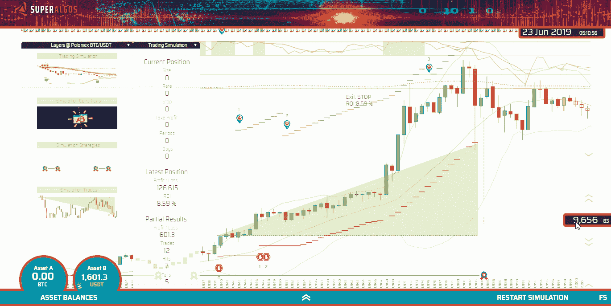

# 黑仔密码交易机器人编码入门指南

> 原文：<https://medium.com/coinmonks/the-starters-guide-to-coding-killer-crypto-trading-bots-ec68e948ad67?source=collection_archive---------1----------------------->

## 了解从哪里开始，如何处理加密交易机器人的编码过程以及该做什么和不该做什么。

*Image credit: Who is Danny, shutterstock.com*

所以你可以编码，进入加密领域，发现加密交易，并且知道——迟早——你会尝试建立一个交易机器人。

相信我，你并不孤单。

我不知道任何一个进入 crypto 的开发者从未有过这样的想法。

问题是你怎么处理这样的想法？你从哪里开始？

答案取决于你的动机是什么。

> **如果你想做的只是测试你的技能，尝试一下，看看效果如何，那么这个指南对你来说是*而不是*。**

如果这是你的动机，你可能会选择立即开始尝试。您将连接到您喜欢的交易所，开始随机下单。然后，你将尝试在基本功能的基础上进行构建，并可能开始从事交易智能方面的工作。

如果你想随机应变，感受一下算法交易是如何运作的，这很好。然而，自由探索之路将会明确地引导你犯下所有的错误，并把你的时间浪费在无成果的工作上。

本指南是为那些希望在自动交易中获得成功并赚钱的程序员准备的。

如果这是你的动机，那么请放心，你将像大多数其他开发项目一样处理这个项目:用一个适当的结构。

毕竟，一个合适的交易机器人非常像一个任务关键型交易系统。它需要可靠、安全和稳定，因此应该按照最佳实践来构建。

让我们从基础开始…

# 使用平台

编写一个独立的交易机器人毫无意义。这就像重新发明轮子一样。

可靠地运行交易算法需要大量的软件基础设施。你不会想建立这样的基础设施。编码、调整和稳定这样的基础设施可能需要一个高级开发人员数年的工作；这就是复杂的程度。

相反，你应该把重点放在构建携带交易智能的算法上。这不仅是构建交易机器人的有趣部分，也是决定你的机器人是否盈利的因素，其他所有事情都是理所当然的。

在深入交易智能主题之前，让我们简单回顾一下一个好的交易自动化平台应该提供的基础设施的最重要的特性。

**交换连接:**

交换公开了可能随时间发展和改变的 API。如果您必须自己维护不同的连接器，这将是一个长期的挑战。

对于任务关键型应用程序来说，通过互联网进行连接是很棘手的。在应用程序级别、网络级别、交易所的 API 和内部系统级别以及两者之间的任何地方，经常会出现大量问题，可能会中断、延迟或破坏您与交易所的交互。

一个好的平台应该能够处理各种各样的连接问题，并保证交易的完整性。

**交易引擎:**

乍看之下，下订单似乎是一个简单的问题。但是，交易引擎应该提供足够的智能来跟踪和管理订单，处理来自交易所的响应，并支持您的交易算法在订单执行方面所需的智能。

**数据:**

算法交易是一种数据驱动的应用。你的算法需要可靠的数据来测试策略和做出交易决定。这意味着您将需要来自交易所的历史数据集和实时数据。

交易所提供小块的原始交易或蜡烛线数据。你会想获得完整的市场历史，这样你就可以应用统计研究和使用长期指标，如移动平均线。

数据集中的一个漏洞可能会导致不可预测的结果，因此从交换中提取数据和构建数据集的过程必须是防弹的。

**战略测试环境:**

不用说，你应该能够在历史数据集上无缝地测试你的算法，或者我们称之为回溯测试。你还希望能够用实时数据测试远期策略，既不用在交易所下实际订单——我们称之为纸上交易——也不用用一小部分资金下实际订单——我们称之为远期测试。

这是基本的功能，在部署机器人进行实时交易之前的策略调整阶段会非常有用。

现在，有更多的高级平台功能可能会对您的战略盈利能力产生巨大影响。

举例来说，这就是分析你的策略表现的能力，不仅仅是基于一个汇总的回溯测试报告，而是基于每笔交易，直接在图表上。当您可以检查测试结果并直观地检查您的策略所采取的每个操作时，您将能够以更加精确的方式微调条目和存在。

A visual environment to test and tune strategies, showing all elements of each trade right over the charts.

视觉元素是一个基本特征，因为是你——人类——来设计交易策略。普通人并不擅长在头脑中处理冰冷的数字，但当涉及感官时，他们很擅长找到创造性的解决方案。

**交易协议:**

在平台级别实现的交易协议是相对更深入的分析和雄心勃勃的平台开发目标的标志。

该协议有助于如何建立和描述战略的标准化，这具有多种积极的结果。

标准化策略的直接效果是它们变得可移植。可移植性使得交易者和开发者群体能够协作，这导致了比群体中的个体成员更强的集体智慧。

从长远来看，标准有利于生态系统的发展，并促进新应用的开发，受到现有市场和用户群的吸引。

# 走向开源

使用开源平台是一个非常好的想法，因为如果您需要目前可能不存在的功能，您将能够为平台开发做出贡献。

此外，您不希望让您的算法被困在一个公司平台中，该平台可能会改变其服务条款、商业政策、商业模式，甚至在任何时间点拒绝访问。

评估不同的平台选项，考虑设置开发环境的相对难度以及可用文档的质量。这两个特性很好地表明了平台的维护程度。

在我的文章[中，我回顾了几个领先的平台，通过三个步骤](https://hackernoon.com/switching-from-manual-to-automated-crypto-trading-874gw2cji)从手动转换到自动加密交易。你可以在那里开始你的研究。

# 学习理论

缺乏知识是没有办法的。如果你不知道你在做什么，很可能你会浪费你的时间和辛苦赚来的钱。

也就是说，如果你是初学者，不要担心……只要确保你是从技术分析开始学习的。然后你可以深入阅读统计分析、博弈论、风险管理、投资组合管理、市场心理学和宏观经济学。

一个好的起点可能是 [Daniel Jeffries](https://medium.com/u/618a7c78c957?source=post_page-----ec68e948ad67--------------------------------) 在他关于[有史以来最伟大的交易书籍的文章](https://hackernoon.com/the-greatest-trading-books-ever-written-7302bcc3901e)中提供的列表。

如果你在交易知识部门落后了，你可能也想考虑和一个不会编程的交易者朋友合作，这样——一起——你可能会想出几个赢家机器人。

# 采用贸易框架

我相信你听过这句话“你必须坚持你的交易系统”。想过如何在第一时间想出一个吗？

交易框架将帮助你理解和描述交易过程。它将使你能够组织你的交易想法，分阶段打破策略，并把不同的概念组织成具有属性的元素，这些元素按照一定的规则和事件相互作用。

如你所知，自动化一个随机的或者非结构化的过程是非常具有挑战性的，所以如果最终目标是自动化交易，遵循一个交易框架是正确的方法。

我强烈推荐我在文章[开发你自己的交易系统:一步一步的逻辑指南](https://hackernoon.com/crypto-trading-systems-101-qh8jv2cch)中描述的框架，因为它特别适合交易自动化。

# 社区

确保项目有一个友好的社区，帮助你快速启动和运行。

一些社区可能对帮助初学者或任何人犹豫不决。记住，交易情报往往是在小仓库里开发的，大多数交易者都不愿意公开自己的秘密。

也就是说，其他社区非常欢迎并愿意公开分享知识，有时甚至是策略。

# 下一步是什么？

差不多就是这样！

现在是时候把手弄脏了！

你可能想从检查我在 Superalgos 项目的工作开始:我们正在与像你这样的人一起建立一个集体交易智能。

构建这种智能的路线图的第一步是将最先进的交易技术大众化。这就是为什么我们最近发布了 [Superalgos](https://superalgos.org) 软件，这是一款帮助自动化交易策略的开源客户端应用。

欢迎[通过我们的电报](https://t.me/superalgoscommunity)访问我们，并开始了解社区最近开源的一些策略。

***免责声明:*** *我不是理财顾问，这不是理财建议。我分享策略和我自己的交易经验，以此来传播知识。你要对你选择用我分享的信息做的任何事情负责。*

***披露:*** *作者是* [*Superalgos 项目*](https://superalgos.org/) *的核心团队成员。*

> [直接在您的收件箱中获得最佳软件交易](https://coincodecap.com/?utm_source=coinmonks)

