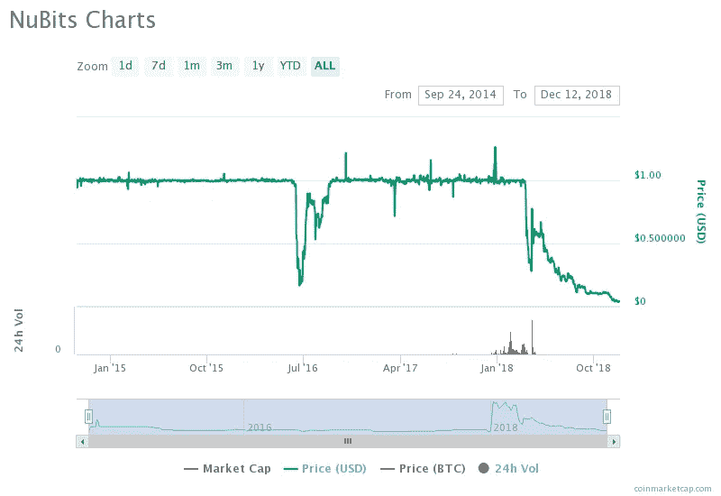
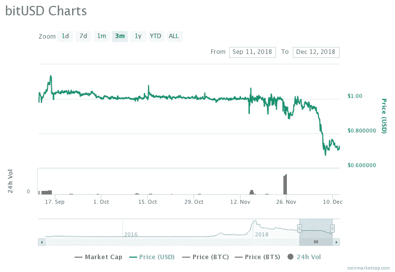
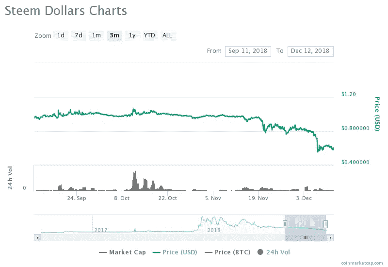
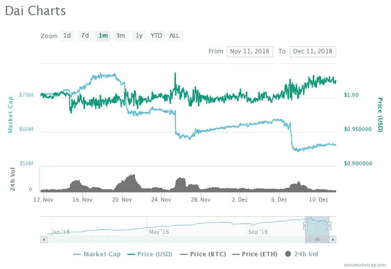
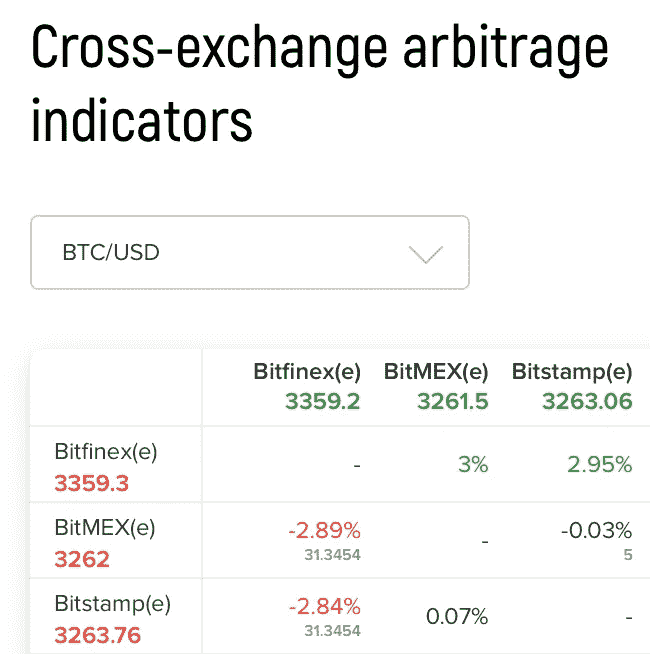

# 稳定的状态-2018 年更新

> 原文：<https://medium.com/coinmonks/the-state-of-stablecoins-update-2018-56fb82efe6de?source=collection_archive---------0----------------------->

任何人都不会感到意外，今年是加密货币动荡的一年。但令人惊讶的是，对所谓的“稳定的硬币”来说，今年也是不稳定的一年。稳定硬币是一种加密货币，其经济结构建立在区块链之上，旨在稳定硬币的交易价格。真正的稳定币将提供加密货币的好处(密码安全、隐私、激励一致性、数字可用性和无银行账户者的可访问性)，而没有不可用的波动性。它可以为稳健的分散金融系统奠定基础，并促进加密货币的经济应用。

稳定硬币的波动性报道不多，似乎被整体加密波动性所掩盖。然而，**稳定的货币波动是更有趣的消息**。加密波动并不是什么新鲜事。我以前讲过分散式稳定器是如何被糟糕地设计的。今年正在展示这些问题。

# 回顾稳定币问题

现有的稳定币设计是脆弱的。他们将传统金融的理念引入区块链环境，引入了未解决的失败点:

*   集中式设计依赖于可信机构持有链外储备资产和/或向区块链报告链外市场数据(称为 oracle，可能报告例如美元价格)。这些机构容易遭受失败、黑客攻击和欺诈。
*   分散化设计创造了复杂且设计不良的金融合约系统，这些系统由不稳定的加密货币提供支持。这些系统容易出现流动性危机，投机者不再站在稳定交易的对立面，这导致这些系统失败。

# **努比茨失败**

NuBits 是可追溯到 2014 年的首批 stablecoins 之一。如果 NuBits 变得“被低估”，它依赖于(1)人们愿意做多货币以“套利”，(2)人们愿意将他们的 NuBits 锁定在一种类似债券的工具中，这种工具承诺当货币下一次变得高估时(如果这种情况发生的话)的未来回报，和/或(3)能够出售新的 NuShares(代表如果硬币再次变得高估，系统中的某种利益变得有利可图)，以从本质上对系统进行资本重组。显然，如果人们对 NuBits 未来价值的信心动摇，他们可能不愿意采取这些立场，正如 NuBits 在 2016 年经历的那样，目前正在 2018 年进行。迄今为止，它已经降到了面值的几分之一。

NuBits is down to $0.04 on the dollar

NuBits 的失败对其他算法稳定币模型有影响，它们基本上是相似的。我之前在这里讨论过这个问题，重点是基础。事实上，最近 Basis】决定关闭并返还 1 . 33 亿美元给投资者。这归因于监管方面的担忧，但也可能与 NuBits 的失败有关。

# bitUSD 和 Steem 美元被打破

事实上，我在任何地方都没有看到这方面的报道，但 bitUSD 和 Steem 美元本月都明确打破了与美元挂钩的汇率。对一些人来说，这可能很容易被忽略，因为他们的市值很小。但加在一起，这意味着近 2000 万美元(以固定价值计算)，与其他分散的稳定资本相比，这并不是微不足道的。

BitUSD 是一种加密抵押的稳定币。也就是说，bitUSD 币是承诺在未来支付价值 1 美元的 crypto 的合约，由 crypto 在现在进行抵押。加密担保的稳定币将寻求稳定的稳定币持有者与投机者配对，投机者则站在赌注的另一边。投机者锁定加密货币抵押品，作为稳定货币价值的保险。基于他们的抵押品价值，投机者可以在一定限度内创造新的稳定的抵押品。作为回报，投机者获得了杠杆化的秘密头寸，如果秘密价格上升，这是有价值的。例如，如果投机者以 1 ETH 的抵押品开始(实际上 BTS 用作 bitUSD 的抵押品，但 ETH 作为一个例子更容易识别)，他/她可以创建和出售价值 0.5 ETH 的新 stablecoins，这使投机者拥有 1.5 ETH 的头寸(但也是所创建的 stablecoins 的负债)。

BitUSD breaks USD peg

Steem 美元的工作方式略有不同。所有 Steem 持有人本质上都支持 Steem 美元，这些美元在 Steem 平台上作为奖励支付。Steem 美元可以兑换成价值 1 美元的新铸造 Steem，因此兑换通过通货膨胀影响所有 Steem 持有者。

Steem Dollars breaks USD peg

bitUSD 和 Steem 美元(在不同时间)打破挂钩的确切原因可能与其结算算法中的流动性有关，通过结算算法，稳定的硬币持有者可以用硬币兑换基础抵押品。例如，bitUSD 的结算流程为 24 小时，而 Steem Dollars 的结算流程为 1 周。这些加密抵押硬币的崩溃对其他类似的模型有影响，如马克道的戴。算法是不同的(在某些情况下，是手动的，而不是自动的)，但设计面临着相同的基本风险。

# 戴可能进入一个反馈循环

戴是另一种加密抵押的稳定币。它遵循与 bitUSD 相同的模式，但增加了一些内容，如在经济低迷时期紧急出售做市商代币以重新抵押系统的机制。乍看之下，戴似乎很坚强。抵押率仍然很高(尽管随着 ETH 价格的下降，抵押率出现了令人担忧的下降)，最近戴的价格已经上涨到 1.02 美元。对于不经意的观察者来说，这似乎意味着力量。然而，分散的稳定核心是复杂的系统，正如我之前所说的，它们的故障点还没有被很好地理解。

Dai price appreciates as speculators decrease supply — a potential feedback loop

如果我们进一步挖掘数据，我们会发现最近的价格上涨与 Dai 供应量的减少有关。这表明向 Dai 系统提供抵押品的投机者正在通过回购 Dai 来降低他们的杠杆率(即，他们用他们的抵押品对多少 Dai 负责)。反过来，如果稳定的硬币持有者对戴的需求保持不变，这就会推高价格。这样一来，投机者就更难再次降低杠杆率，也更难在未来用给定的抵押品进行清算。从本质上讲，回购将不得不以更高的价格进行，并且只会在随后几轮杠杆降低中变得更加困难。

这就形成了一个反馈回路。如果 ETH 价格继续下跌，反馈回路只有在以下情况下才是固定的:(1)更多的资金进入抵押品池以创造更多的 Dai(这可能是通过新的投机者进入系统或紧急出售做市商代币)，或(2)人们对 Dai 失去信心，不再想持有它，这意味着系统失败。不能保证(1)总是发生。请注意，紧急出售做市商代币并不能解决这个问题:这些代币的流动性可能会枯竭，就像投机者市场可能会枯竭一样。

# 集中式 Stablecoins

集中稳定的货币继续增长，并很好地经受住了加密波动——正如预期的那样，因为它们由法定货币担保。他们当然有自己的交易对手风险问题——本质上，我们必须相信类似银行的实体以链外储备的形式持有法定货币。这种信任是区块链应该解决的问题。这些风险在今年成为现实，其中[的系绳价格跌至 0.85 美元](https://www.ccn.com/bitcoin-price-explodes-to-7500-as-tether-loses-usd-peg/)(此后有所回升)，BTC/系绳市场相对于 BTC/菲亚特市场溢价约 3%，如下所示。

~3% premiums for BTC/Tether pairs (e.g., Bitfinex) vs. BTC/fiat pairs (e.g., Bitstamp). Source: [Lykke](https://www.lykke.com/trading-indicators)

# 稳步前进

目前分散的稳定中心存在严重的问题，这些问题现在正在成为现实。然而，他们的风险仍然知之甚少。我不知道在这些系统建模和更好地理解它们的故障点方面有什么严格的工作。这对设计更好的系统提出了挑战。我正致力于在我的研究和一个新的 stablecoin 项目中解决这个问题，我计划很快写更多关于它的内容。对如何推进这一进程的所有想法持开放态度。

[**Click to read today’s top story**](http://bit.ly/2G71Sp7)