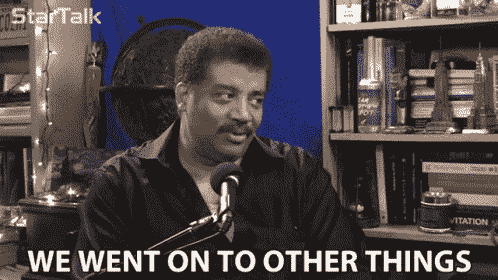

# 赌注的故事:津贴和陷阱

> 原文：<https://medium.com/coinmonks/the-story-of-staking-perks-and-pitfalls-6e121408dc04?source=collection_archive---------2----------------------->

在区块链的世界里，交易和采矿通常被认为是密码爱好者的主要收入来源。随着人们对加密技术的兴趣越来越浓厚，寻找加密块的竞争也越来越激烈。随着对电力需求的增加和大规模计算能力价格的飙升，爱好者投资采矿变得很麻烦。这个障碍产生了一个新的共识协议，称为证明赌注，以缓解事情。PoS 作为采矿的替代方案和被动收入的来源，在加密领域获得了越来越多的关注。

在本帖中， [ChangeHero](https://changehero.io/) 将向您简要介绍赌注以及它是如何随着时间的推移而演变的。

ChangeHero

## **进化**

简单来说，赌注就是委托你的硬币或代币的过程，并有助于达成共识，以换取奖励或投票权。虽然工作证明在 2009 年之前就已经存在，但它在比特币区块链中的应用引起了人们的关注。POW 用于验证区块链上交易的合法性。为了做到这一点，矿工们需要强大的计算能力来解决困难的数学难题，以换取报酬。在这种协议中，所有的矿工相互竞争寻找解决方案。比特币和以太坊是少数使用这种共识协议的流行平台。然而，PoW 协议经常因其惊人的耗电量和昂贵的硬件而受到批评。此外，如果矿工找不到石块，花在寻找石块上的精力也将白费。

Source: [Tenor](https://tenor.com/bc9eD.gif)

2012 年，Sunny King 和 Scott Nadal 提出了 Stake 和 staking 的证明，以取代 PoW 协议。PoS 与前者的主要区别在于，块创建没有竞争，算法基于用户的赌注。不是矿工解决问题，而是 PoS 决定块生产者钱包里的硬币数量。但它在维护分散化治理方面存在不足，因为权力掌握在拥有大量加密货币的令牌持有者手中。

2014 年晚些时候，Daniel Larimer 开发了授权利益证明(DPoS)机制。其目的是克服 PoW 和 PoS 系统的局限性，并确保区块链的分散性。DPoS 协议包含一个投票系统，令牌持有者在其中投票选出一个代表。这些代表负责交易的确认和达成共识。奖励由代表收集，然后按比例分配给选民。如果所选择的节点效率不高，那么它将被淘汰，并被另一个节点取代。

## **打桩**

Photo by [Keenan Constance](https://unsplash.com/@keenangrams?utm_source=unsplash&utm_medium=referral&utm_content=creditCopyText) on [Unsplash](https://unsplash.com/s/photos/bet?utm_source=unsplash&utm_medium=referral&utm_content=creditCopyText)

赌注来自 PoS 的概念，任何持有密码的用户都可以根据区块链来下注他们的资金以创建区块或选举代表。作为回报，他们将能够获得奖励。此外，staking 使用户能够为平台的治理做出贡献，并参与重要的决策活动。在赌注中，用户必须将他们的资金锁在钱包中一段固定的时间。持有的硬币越多，持续时间越长，用户获得的奖励就越高。只要用户参与下注，他/她就不能花费这些硬币。

锁定的资金将作为抵押品，任何恶意行为者将失去他们的资金，并在试图破坏系统时被踢出链。确定性算法通常通过随机化机制考虑赌注大小和硬币被持有多长时间来选择验证器。

还有一种现象叫做冷赌注，这种现象可以在持有大量资金的情况下看到。在这种情况下，这些代币保存在硬件钱包中，只要资金没有从钱包中转移，用户就可以获得奖励。

## **泳池**

PoS 协议作为一种简单的获取被动收入的方式已经引起了人们的注意。但是为了最大化获得奖励的几率，用户必须拥有巨大的赌注权力。Staking Pool 通过联合一群人的力量来验证和确认区块，提供了一个解决方案。资金池由运营商管理，希望加入资金池的用户必须将其资金锁定在特定的热钱包或冷存储中。虽然赌注池提供了稳定的奖励流，但它们通常很小，因为奖励在池中的参与者之间分配。此外，他们还收取技术安装和维护费用，这甚至会进一步减少支出。

## **津贴**

*   无需购买昂贵的硬件来最大限度地提高找到数据块的机会。
*   降低功耗，比采矿更节能。
*   确保源源不断的奖励，并作为被动收入的可靠来源。
*   与采矿中的计算硬件不同，资产的价值不会随时间贬值。

## **陷阱**

Photo by [Maria Freyenbacher](https://unsplash.com/@freyenbacher?utm_source=unsplash&utm_medium=referral&utm_content=creditCopyText) on [Unsplash](https://unsplash.com/s/photos/warning-caution?utm_source=unsplash&utm_medium=referral&utm_content=creditCopyText)

在赌注中，用户必须将资金锁在钱包中，因此容易受到波动性的影响。锁定的代币不能使用，在熊市中，它的价格会下跌。此外，从赌注中获得的回报很少，并且需要更长的时间才能获得最大回报。

## **另一种选择**

总而言之，打桩是采矿的可行替代方案，也是被动的收入来源。下注相对容易，因为许多钱包都在应用程序中嵌入了这一功能，币安和比特币基地等更大的玩家也有支持流行加密货币的下注程序。此外，DASH 更多地参与 PoS 和以太坊向该协议的过渡，将对生态系统产生重大影响，并带来更多的人。赌注不仅给霍德勒夫妇带来了回报，还通过赋予用户决定区块链未来的投票权，发挥了确保权力下放的机制作用。

在 [Twitter](https://twitter.com/Changehero_io) 、[脸书](https://www.facebook.com/Changehero.io/)和 [Medium](/@changehero) 上关注 [ChangeHero](https://changehero.io/) ，第一个获得更多关于 crypto 的有趣文章和令人兴奋的优惠。

> [直接在您的收件箱中获得最佳软件交易](https://coincodecap.com/?utm_source=coinmonks)

