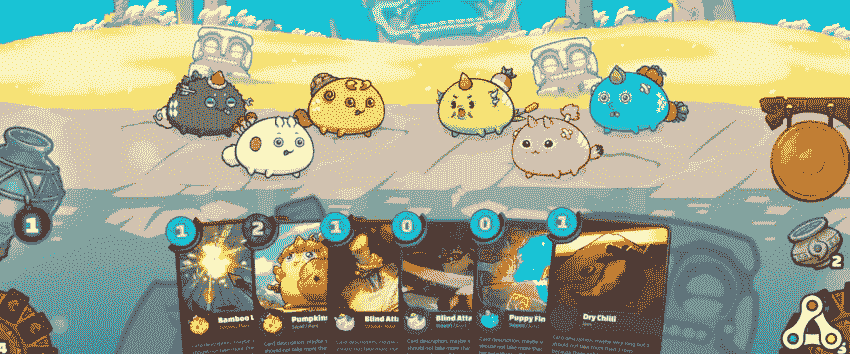
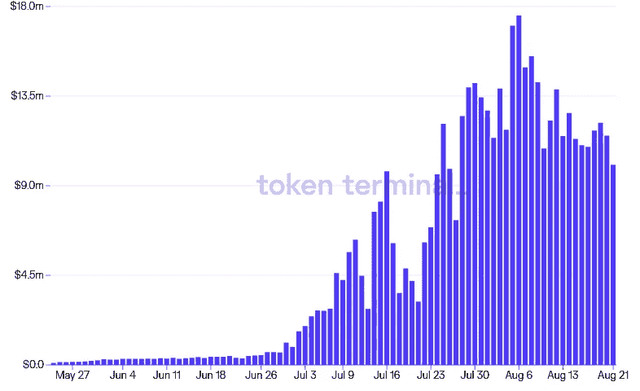

# 轴无限的奇异世界

> 原文：<https://medium.com/coinmonks/the-strange-strange-world-of-axie-infinity-203850b8e76e?source=collection_archive---------1----------------------->

通过调用反乌托邦式的《玩家一号》来打开这个帖子有点不靠谱，更不用说玩过头了。尽管如此，我还是努力想出一个更好的方法来介绍轴向无穷大的现象。

你可能还没有听说过 Axie Infinity，但这只是因为你不是来自菲律宾，在那里，其游戏中的加密货币，光滑的爱情药水(你没看错)，目前正被用作交换媒介 IRL。在这个世界里，NFT、加密货币和具有健全代币学的创造性游戏赚取结构的及时融合，使发展中国家的下层公民能够通过在元宇宙繁殖租赁的化身来谋生。如果我在 5 年前读到这句话，我会认为它是一堆废话。但是，现实是时代在快速变化，我们要么忽视我们生活的这个特殊世界正在发生的事情，要么睁大眼睛试图理解正在塑造全球各个角落的边缘数字社会。请继续阅读。

# 什么是 Axie Infinty？

像许多 90 年代初出生的人一样，我曾经沉迷于口袋妖怪。我收集卡片，玩电子游戏，虔诚地看电视节目(仅仅几季)。我年轻时的几个小时都被用来在不同的媒体上“捕捉一切”——我对我是如何度过这段时间的一点也不后悔，即使作为一个成年人回头看，因为我真的很喜欢它。我和朋友们在人物和故事情节上建立了联系，战胜了无数小时的无聊，培养了我年轻的想象力。

Axie Infinity 在几个方面与口袋妖怪相似。首先，游戏围绕着具有[特定属性](https://lynnyl.io/axie-infinity-class-guide/)的数字生物相互战斗。每个“axie”都有一套独特的用于攻击的身体部分和一个元素从属关系——水、植物、鸟等——相对于特定的其他从属关系表现得更好或更差。其次，每个 axie 都有一个所有者，他可以选择使用它作为三人小组的一部分，与 Axie Inifinity 的其他玩家或 NPC(非玩家角色，即计算机)进行战斗。Axie Infinity 和 Pokemon 的不同之处在于，每个玩 Axie 的人都存在于同一个元宇宙中，因此每个 Axie 都是可证明唯一的，并且完全由一个个人帐户拥有。浪人区块链的机制强化了这一条件，这是一个兼容 EVM(以太坊)的侧链，由 Axie Infinity 的创建者在以太坊的 mainnet 被证明太慢和太贵而无法实现他们的目的后创建的。

Axie Infinity gameplay

由于每个轴都是一个 NFT，因此可以证明是唯一的，您可能想知道它们来自哪里。斧头既可以在市场上买，也可以在游戏中培育。为了繁殖 axie，你必须首先拥有 Axie，以及 AXS (axie infinity 碎片)和 SLP (smooth love 药水)的混合物，这两种加密货币都来自 axie infinity 世界。然而，每只阿西犬只能繁殖几次，每次试图繁殖一只阿西犬，就 AXS 和 SLP 而言，代价就越大。

如前所述，轴具有不同的属性，混合了随机因素的育种过程决定了什么样的性状会遗传给后代轴。由于稀有、强大和独特的斧头可以卖到 2000 美元以上，繁殖确实是一门微妙的艺术，也可以使用拥有的斧头玩游戏成为一项有利可图的努力(稍后将详细介绍)。

最后，Axie Infinity 团队的长期愿景是创建一个强大的元宇宙，除了 axie-fighting，还有更多可看可做的事情。因此，他们正在努力改善他们的游戏世界 Lunacia 的功能，包括建立一个工具包，让开发人员让他们最疯狂的梦想成为现实，拥有数字房地产的地块。例如，一旦该特征被启用，人们可以建造房子、店面、雕塑或任何其他想要的东西。为此，Lunacia 的地块也成为了一个有趣的投机渠道，个别地块的售价与郊区地块 IRL 的售价差不多，根据位置的不同，从 1 万美元到 5 万美元不等。

# 元宇宙经济学

所以，现在我们对 Axie 元宇宙的游戏性和一些基本功能有了一些了解，是时候深入了解为什么 Axie Infinity 的崛起如此重要:钱。我已经提到了一些游戏中使用的 NFT 的惊人的高标价，如 Axie 和 land，但我们还没有介绍 Axie Infinity 的游戏中加密货币的经济学:SLP 和 AXS。

如前所述，名副其实的“光滑爱情药水”是用来培育 axies 的成分之一。除了去交易所和购买 SLP，玩家还可以通过完成游戏中的挑战来获得它——这是 Axie 的游戏赚取(P2E)模式的本质。有趣的是，Axie 的 P2E 框架分享了游戏创造的如此多的价值，以至于人们实际上正在把它变成一份全职工作，尤其是在生活成本较低的发展中国家。例如，由于疫情对全球经济造成的破坏，许多菲律宾人转向 Axie Inifinity 的游戏内奖励以求生存。对于一个普通玩家来说，Axie Infinity 的价格大约是每小时 5 美元，对于去年失业的人来说，Axie Infinity 是他们的救命稻草。事实上，很多菲律宾人都依赖 SLP，以至于无数菲律宾商人接受 T2 作为支付方式。在撰写本文时，完全稀释后的 SLP 市值为 2.17 亿美元。

现在，对于 AXS，或轴无限碎片。虽然 SLP 在游戏中被用来繁殖 axies，并作为玩游戏的奖励，但 AXS 更像是元宇宙本身的所有权股份。具体来说，AXS 持有者有权就如何运营游戏的治理提案进行投票，包括与游戏规则以及资源再投资相关的决策。在令牌发布期间，Axie Infinity 团队创建了一个社区国库，并规定所有 NFT 销售额的 4.25%，包括 Axie、土地和物品，将被纳入国库。由于 AXS 持有者控制着财政部，而且 Lunacia 内部的几乎所有东西都是 NFT，他们对元宇宙内部发生的所有经济活动的有效税率为 4.25%。尽管利润没有明确返还给 AXS 持有者，但他们确实拥有对社区财政的投票权。因此，一旦超过一半的代币供应量在流通，市场参与者理论上可以通过购买大多数 AXS 代币来耗尽 Axie Infinity 的国库。这一条件应该为 AXS 的估值设定一个下限，并强制要求从长期来看，代币的市值应该跟踪元宇宙经济活动的 DCF。在撰写本文时，AXS 完全稀释后的市值为 193 亿美元

Daily revenue for the community treasury over the last 90 days. Source: Token Terminal

# 在阴影中…

从世界任何地方登录并在视频游戏中每小时赚取 5 美元的能力听起来很遥远，但围绕 Axie Infinity 兴起的影子经济让事情变得更加奇怪。你看，这个赚钱机器有一个陷阱:要玩 Axie，你需要 Axie。在写这篇文章的时候，“地板 axie”，或者最便宜的 axie 售价 157 美元。另一方面，收购一个由三个有竞争力的轴组成的团队可能要花费 1000 美元以上。

可以预见的是，增值劳动力和前期资金之间的脱节将机会主义资本家带入了混乱。所谓的“奖学金项目”[向成功的申请者提供贷款，以换取他们所产生收入的一部分。本质上，这些奖学金的提供者购买一些 axis，找到有能力的游戏玩家愿意花时间升级和培育他们的 axis，并收取租金。回报可能是相当惊人的:一只 200 美元的 axie 可以在几个月内繁殖几次，每一轮产生额外的 200 美元 axie(繁殖费用总额)。](https://axieedge.com/axie-scholarship-programs/)

这些安排似乎并不完全符合游戏的精神，但它们发生在区块链之外(可以说是“在阴影中”)，因此很难追踪或监管。一方面，他们向更广泛的用户开放了 axie 游戏的世界，否则他们将无法负担一支有竞争力的团队。然而，axies 作为资本资产的观点可能会吸引那些对游戏没有兴趣的投资者，并且可能会推高 axies 的底价，使它们变得更加难以承受。

对我来说，这些安排最引人注目的事情，也是我写这篇文章的原因，是为了揭示一种趋势，这种趋势可能对全球贫富社会之间的关系产生长期影响。我确实相信“玩赚”是一个强大的范例，有能力为那些否则会难以维持生计的人做好事。然而，先玩后赚和 NFTs 的结合打开了一个金融工程化的通道，资本可以通过这个通道剥削劳动力。换句话说，如果一个人以前认为电子游戏会上瘾，那么引入补偿后会发生什么？是的，在疫情陷入困境的个人通过 Axie Infinity 获得了突破，但他们是否获得了任何技能，使他们在长期的劳动力市场上更具竞争力，或者他们是否无意中永久地将自己降级到元宇宙零工经济？此外，根据童工法，我们如何处理儿童玩 Axie 获得奖励的问题？

跟随金钱和价值创造有助于解释为什么这些问题如此重要。是的，Axie 允许一个人玩视频游戏赚钱，但不，没有免费的午餐，也就是说，钱来自某个地方。本质上，付费玩家(那些在轴和物品上花费数千美元的人)正在推动生态系统的金钱激励。这些玩家是谁？坦率地说，我不确定，但有一点我可以肯定地告诉你，他们并不穷。Axie Infinity 的 tokenomics 鼓励来自发展中国家的低社会经济水平的个人加入进来，基本上是为了娱乐这些付费玩家(因为谁想和一个 AI 比赛，对吗？).

你可能会回答说，玩家劳动者也在享受娱乐，如果他们在这样做的同时赚了一些钱，那又有什么问题呢？娱乐玩家可以随时离开。另一方面，玩家劳工就没那么幸运了。他们没有发展本可以用来真正提高生活水平的技能，而是被困在元宇宙，成为富裕国家的数字游戏玩家。这听起来可能有些夸张，但任何会玩 Axie 的人都必须有一台电脑和互联网连接，并可以利用在线教育获得任何数量的技能，使他们能够开始赚取自由职业者的工作，从长远来看，这将使他们在金钱上更加富有，并可能获得满足感。

# 我们将何去何从？

Axie Infinity 的爆炸式增长为 P2E 提供了概念证明，我毫不怀疑我们将继续看到这一趋势随着时间的推移而加强(Axie 的 Discord 服务器就在本月超过了堡垒之夜的会员资格！).这意味着我们现在需要考虑社会、政治和经济后果。我想象元宇宙的零工经济将会有围绕我之前提出的问题的成长的烦恼，就像优步司机作为承包商的事情似乎是一个永无休止的故事一样。我确实认为，通过跨境影子金融体系运作，将使监管机构难以解决《元宇宙协议》的这些问题。虽然我是整个加密生态系统的狂热支持者，并希望它能够实现颠覆不可否认过时和不公平的传统金融轨道的承诺，但这场运动冒着自己灭亡的风险，冲进了可能被解释为不透明和剥削性的新经济结构。P2E 处于早期阶段，现在通过评估潜在的陷阱，我们获得了避免任何类型的准备就绪的球员一式的结果的最佳机会。

*我写一些我在加密方面感兴趣的话题。如果你喜欢这篇文章，请在 Twitter @BasriRoss 上关注我。*

> 加入 [Coinmonks 电报频道](https://t.me/coincodecap)，了解加密交易和投资

## 也阅读

 [## 最佳加密交易所| 2021 年十大加密货币交易所

### 加密货币交易所的加密交易需要了解市场，这可以帮助你获得利润…

blog.coincodecap.com](https://blog.coincodecap.com/crypto-exchange)  [## 2021 年 9 大最佳加密借贷平台

### 当谈到加密货币贷款时，大量因素等同于良好的收入状况。此外，借款的一部分…

blog.coincodecap.com](https://blog.coincodecap.com/crypto-lending)  [## 2021 年最佳加密交易机器人(免费和付费)

### 2021 年币安、比特币基地、库币和其他密码交易所的最佳密码交易机器人。四进制，位间隙…

medium.com](/coinmonks/crypto-trading-bot-c2ffce8acb2a)  [## 最佳 4 个加密交易信号电报通道

### 这是乏味的找到正确的加密交易信号提供商。因此，在本文中，我们将讨论最好的…

medium.com](/coinmonks/best-crypto-signals-telegram-5785cdbc4b2b)