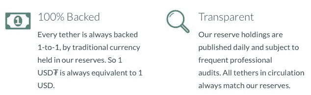
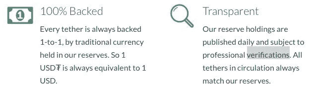
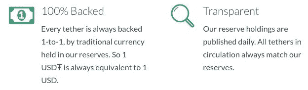
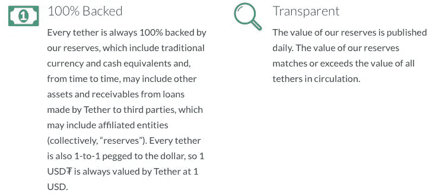
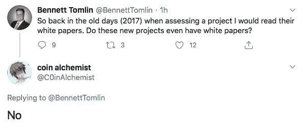

# DeFi 的愚蠢令人麻痹

> 原文：<https://medium.com/coinmonks/the-stupidity-of-defi-is-paralyzing-8db90f5fc76f?source=collection_archive---------0----------------------->

2020 年 9 月 2 日是第一次有人在加密货币领域表示，他们对自己和其他加密货币批评者没有就 DeFi 和 yield farming 大声疾呼感到惊讶。

我认为这是一个有效的批评——尽管 DeFi 在社区中引起了轩然大波，除了对其荒谬性质的即席评论，我们大多数人都保持沉默。我想真诚地为没有为普通群体承担这项任务而道歉，并解释为什么我们没有真正费心讨论 DeFi。

# 用例

我批评了许多加密货币项目，从较大的项目如 Tether、QuadrigaCX 和 tZero，到较小的未知项目如 BCNEX 和 Massive Adoption Conference。批评这些交易所、概念和加密货币虽然可能不受欢迎，但也是可行的，因为它们提供了大量需要审查和存档的信息:有白皮书、承诺、路线图，希望还有关于行政领导和员工的信息。

这使得任何人都可以一遍又一遍地阅读 ToS 的承诺，并浏览网站寻找修改和欺骗性的策略。例如，我经常发布 Tether 在“支持”方面所做的改动。

The changes over time to Tether’s promises allowed for easy, verifiable evidence that the backing was altered.

不幸的是，这些公司显示这些信息的唯一原因是为了留住用户、确保信任和发展。输入 yield farming、Uniswap 和 DeFi。

在新的范式中，没有承诺，没有效用，团队领导也不存在——因为如果没有最终目标，你为什么还需要领导？人们懒得去审计代码，懒得去创建安全的网站，发明一个令牌，确保用任何听起来不像安全的方式来标记它，他们为此得到的回报是什么？充斥着以太币或美元衍生代币。

人类的愚蠢是无法治愈的。我无法理解为什么人们会把钱投到贴着庞氏骗局标签的庞氏骗局中。成为庞氏骗局不是一个用例，尤其是当你不知道你在投资谁或什么的时候。从本质上说，这些代币是现代的慈善机构——整个罗马尼亚政府不知道如何应对这种白痴水平。不要指望纸上谈兵的侦探们现在会有解决方案。

# 带领啦啦队

我的推特时间表充满了定义标签。我就不在这里列举了。为什么不呢？因为大多数，如果不是全部的话，都是带有“内置泵转储结构”的复制粘贴模因令牌——像 Hex 一样，但不知何故更愚蠢。任何一个好的 PnD 都是这样工作的:那些第一个进来的人，把活地狱般的项目推掉，直到其他人蜂拥而至，然后跳出去，进入另一个项目。

但问题是，当谈到这些计划时，我甚至不知道谁是批评、讽刺、支持或真诚的。当 Bennett Tomlin 向社区询问一些解释时，他得到的回答是——当然——很多都没有。

honesty at least?

我对此的反应是完全避免讨论这些项目，因为人们甚至提到它们的名字，它们似乎就能茁壮成长。然而，我看到了很多关于这些代币的积极的，或者最糟糕的，矛盾的推文和故事。大多数人说“刚买了$___。不知道它是干什么的，我们走吧！”

对此我们该如何回应？

# 责任

IANAL，所以很难试图破译法律将落在这些…我不知道该叫它们什么…数字老虎机。其中一些数字老虎机声称它们是游戏，另一些是平台，还有一些是带有游戏机制的协议。随你怎么说，对我来说似乎是在赌博，我不知道谁的脑袋会掉下来。

然而，让我说清楚:我对赌博没有意见，只要那些赌博的人知道后果，并且赌场不是压倒性地反对他们。很可能大多数投资这些数字老虎机的个人知道他们在赌博，但我不确定大多数人是否明白房子对他们不利。当地毯被拉开时，这在大多数情况下是不可避免的，我不知道人们在投资了一个匿名的 shitcoin dev 创造的随机令牌后将如何寻求正义，这个匿名的 shit coin dev 没有做出任何承诺，也没有列出任何目标。好运？

# 帮我帮你

我写这篇文章是作为一个道歉和解释，也是一个请求。你的意见很重要，我的目标是尽可能地造福社区。DeFi 显然存在问题，但没有证据或恶意，很难引起人们对这些问题的注意。如果你有故事或看到问题想和对 DeFi 持批评态度的人讨论，请在 Twitter 上联系(账号是 [CasPiancey](https://twitter.com/CasPiancey) )。

保持怀疑，朋友们。