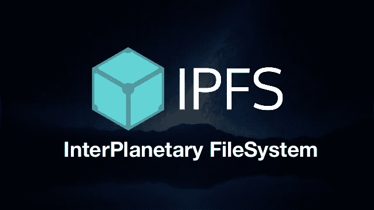

# IPFS 背后的技术

> 原文：<https://medium.com/coinmonks/the-technology-behind-ipfs-and-what-can-ipfs-do-c7009fe42bab?source=collection_archive---------3----------------------->

## IPFS 能做什么



Image [Source](https://www.google.co.in/url?sa=i&source=images&cd=&cad=rja&uact=8&ved=2ahUKEwi7rdLgnarcAhVJto8KHQBrDtQQjxx6BAgBEAI&url=http%3A%2F%2Fblog.adnansiddiqi.me%2Fgetting-started-with-python-and-ipfs%2F&psig=AOvVaw023Iiu4b5EUZvz931-KGLR&ust=1532057615544241)

简而言之，IPFS 是一个 P2P 文件系统。一些术语:

1.  **IPNS**——一个名字系统。将加密密钥映射到 IPFS 的文件。
2.  **IPRS**——一个记录系统。可以验证和查询的抽象记录。所有的 IPNS 记录都是 IPRS 记录，但不是所有的 IPRS 记录都是 IPNS 记录。
3.  **DHT** ，区块链，Pubsub 等。—分发这些记录(及更多)的方法。

# 它是如何工作的:

IPFS 给每个文件一个唯一的散列(指纹来识别文件)。即使只有一个字符的差异，哈希也是完全不同的。因此，IPFS 可以使用文件的内容来定位它的地址，而不是像 HTTP 那样使用域名。

IPFS 清除整个网络中的冗余文件。它为它做版本控制。每个编辑历史都被记录下来，可以很容易地追溯。

当搜索查询被触发时，IPFS 根据它的散列来搜索文档。因为散列是唯一的，所以很容易进行查询。

ipFS 的哈希和 HTTP 的 IP 地址都很难让人记住。人们发明了域名来定位 ip 地址。我们还有 IPNS 来找到 IPFS·哈希。IPFS 中的所有节点都存储一个哈希表来记录文件的相应位置。

# 技术

# **分布式哈希表**

在 IPFS 的例子中，**密钥是对内容的散列**。在 IPFS 节点中查询具有散列 qmc px 9 zqboyhw 8t 7 AFE 4 dbwfcjyocef 5 PE 4h 3u 7 ek 1 osnq 的内容，IPFS 节点将在 DHT 中查找哪些节点具有该内容。

对于现有的各种分布式哈希表实现，如何有效地找到特定值(快速，尽可能少的网络请求)以及如何管理分布式哈希表以便容易地吸收变化(进入/离开网络的节点，或者表中的新条目)是不同的。

DHT 在 IPFS 用于路由，换句话说:

1.  **向网络通告添加的数据**
2.  并且**帮助定位任何节点请求的数据。**

白皮书指出:

小值(等于或小于 1KB)直接存储在 DHT 上。**对于更大的值，分布式哈希表存储引用，这些引用是可以服务该块的对等体的 nodeid**。

# **阻止交流— BitTorrent**

一个显著的区别是，在 BitTorrent 中，每个文件都有一个单独的对等群(彼此形成一个 P2P 网络)，而 IPFS 是一个所有数据的大对等群。
对等体连接时，交换自己有哪些块(have_list)和正在寻找哪些块(want_list)

**比特交换策略:** -该策略基于这两个对等体之间先前的数据交换
-当对等体交换块时，它们跟踪它们共享的数据量(建立信用)和它们接收的数据量(建立债务)
-这两个对等体之间的记账在比特交换分类帐
中被跟踪-如果对等体具有**信用(共享的比接收的多**)， 我们的**节点将发送所请求的块** -如果一个对等体有**债务**，我们的**节点将共享或不共享，这取决于一个确定性函数**，债务越大，共享的机会就越小
-数据交换总是从分类帐的交换开始，如果分类帐不相同，我们的节点就断开连接

# 版本控制系统— Git

属性:
1) **不可变对象代表文件(blob)、目录(tree)、变更(commit)。2)对象是内容寻址的，通过其内容的加密散列。嵌入到其他对象的链接，形成一个 Merkle DAG。这提供了许多有用的完整性和工作流属性。
4)大多数版本化元数据(分支、标签等。)只是简单的指针引用，因此创建和更新起来并不昂贵。
5) **版本变更仅更新引用或添加对象。** 6)把版本变更分发给其他用户，就是简单的转移对象，更新远程引用。**

# 自我认证的文件系统— SFS

这用于实现 IPFS 的 IPNS 名字系统。它允许我们**为远程文件系统**生成一个地址，用户可以在这里验证地址的有效性。

SFS 引入了一种构建自认证文件系统的技术:使用以下方案寻址远程文件系统:

```
*/sfs/<Location>:<HostID>*
```

其中，Location 是服务器网络地址；

*HostID = hash(public _ key | | Location)*
因此，SFS 文件系统的名称证明了它的服务器。

# 应用程序

IPFS 也可以做 pubsub 应用。

**“发布者”发送按主题或内容分类的消息**,**“订阅者”只接收他们感兴趣的消息**，发布者和订阅者之间没有直接联系。

CLI 用法:[https://ipfs.io/blog/25-pubsub/](https://ipfs.io/blog/25-pubsub/)

# 示例:

内容发布/货币化平台:[http://www.alexandria.io/learn/#integrated-technologies](http://www.alexandria.io/learn/#integrated-technologies)

github:
https://github.com/dloa/alexandria-librarian

P2P 聊天应用:
[https://orbit . chat](https://orbit.chat)T3【https://github.com/orbitdb/orbit】T4

在线玩家:输入 hash 查看相应视频
[http://www.ipfs.guide/](http://www.ipfs.guide/)
[http://ipfser.org/2018/04/08/r36/](http://ipfser.org/2018/04/08/r36/)

媒体网络:
https://akasha.world/

例子列表:
[https://github.com/ipfs/awesome-ipfs](https://github.com/ipfs/awesome-ipfs)

# 缺点

慢:
通过 scp 复制 **100MB 和 1G 文件分别用了 1.5 秒和 17 秒**。而同样的成绩在 T21 用了 16 秒，在 IPFS 用了 170 秒。

下载 373M 二进制文件:

*   wget: 12.6 兆字节/秒
*   ipfs 获取(方向 A):9.10 MB/秒
*   ipfs 获取(方向 B):2.07 MB/秒

和

*   平:33.018 毫秒
*   ipfs ping: 32.93 毫秒
*   ipfs cat(方向 A):151 毫秒
*   指规数类别(B 方向):443 毫秒

参考:[https://github.com/ipfs/go-ipfs/issues/2111](https://github.com/ipfs/go-ipfs/issues/2111)

# 列兵 IPFS:

IPFS 中的所有文件都是公开的，这对于大多数应用程序来说不是一个理想的特性，尤其是对于企业应用程序。人们可能想要一个只能由某些实体访问的私有 IPFS。

这项功能仍处于试验阶段。
回购:[https://github.com/ipfs/ipfs-cluster](https://github.com/ipfs/ipfs-cluster)

路线图:[https://cluster.ipfs.io/roadmap/](https://cluster.ipfs.io/roadmap/)
短期(Q2 2018):

*   项目网站(正在进行中)
*   从 go-IPF/importers 中提取关键功能(正在进行)
*   分片支持原型(正在进行中)
*   改进 UX 以处理更大的文件/并发 pin 操作(几个方面，一些正在进行中)
*   在 IPFS 高效使用存储库磁盘(持续进行)
*   设置、管理和操作生产集群的参考指南。
*   第一个指标被公开。
*   由我们(IPFS)运营和维护的实时大型存储集群整合了我们所有的引脚集。(正在进行中)
*   讨论和合作始于“大型数据集”领域的参与者。

期中考试(6-8 个月)，本节于 2018 年 7 月完成

*   与对使用 ipfs-cluster/ipfs 存储大型数据集感兴趣的不同参与者进行稳定的协作。
*   对至少约 1TB 数据集(包存储库)的良好分片支持。
*   我们有指标来了解集群可以增长到多大(对等体、引脚集、存储库大小)、从哪里开始降级、应用程序性能的关键路径。
*   合作存档工作(陌生人之间)

# 有用的链接

如何托管文件:
[https://github.com/miaoski/ipfs-tutorial](https://github.com/miaoski/ipfs-tutorial)

在 IPFS 上传加密文件:
[https://medium . com/@ mycoralhealth/learn-to-securely-share-files-on-the-the-the-区块链-ipfs-219ee47df54c](/@mycoralhealth/learn-to-securely-share-files-on-the-blockchain-with-ipfs-219ee47df54c)

在 IPFS 上托管以太坊 app:
[https://medium . com/@ merunasgrincalaitis/the-ultimate-end-to-end-tutorial-to-create-and-deploy-a-fully-descentralized-dapp-in-ether eum-18 f 0 cf 6d 7 e0e](/@merunasgrincalaitis/the-ultimate-end-to-end-tutorial-to-create-and-deploy-a-fully-descentralized-dapp-in-ethereum-18f0cf6d7e0e)