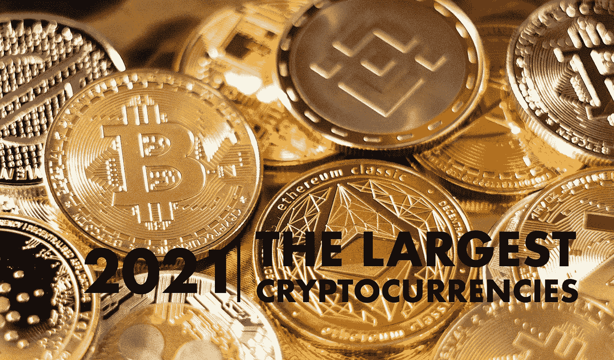

# 2021 年十大加密货币

> 原文：<https://medium.com/coinmonks/the-ten-largest-cryptocurrencies-in-2021-1ab0f4c552b8?source=collection_archive---------4----------------------->

在所有加密货币中，比特币的市值占比最大，紧随其后的是一些其他有趣的项目。在他们前面:以太坊。

The Ten Largest Cryptocurrencies in 2021 — Photo by [Art Rachen](https://unsplash.com/@artrachen?utm_source=unsplash&utm_medium=referral&utm_content=creditCopyText) on [Unsplash](https://unsplash.com/s/photos/crypto?utm_source=unsplash&utm_medium=referral&utm_content=creditCopyText), edited by the author

**概述:**

# 10)UNI WAP(UNI)

在最大的加密货币中排在第十位的是 Uniswap token，市值约为 14，750，000，000 美元…