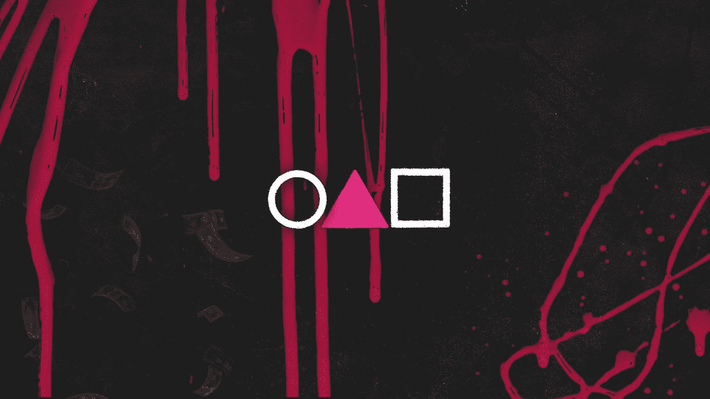
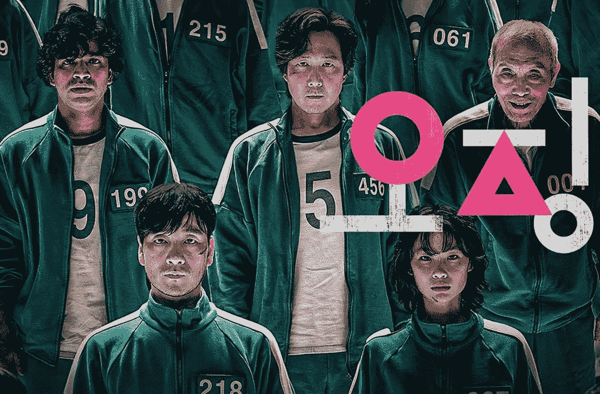
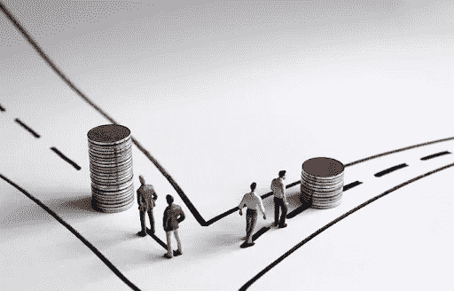
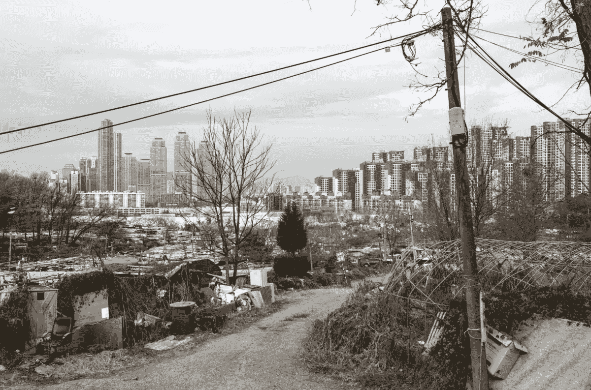
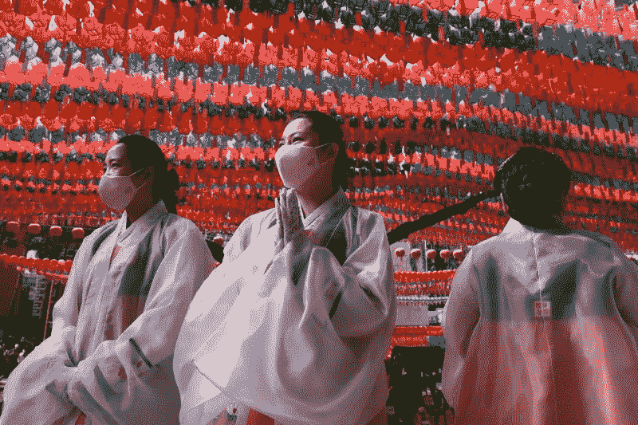

# 杠杆的触角

> 原文：<https://medium.com/coinmonks/the-tentacles-of-leverage-10fcea6d662a?source=collection_archive---------5----------------------->

## 一只乌贼如何设法困住地球

The ‘Squid Game’ logo

一个被解雇的男人，由于生意失败和赌博而陷入债务的漩涡，在他生病的母亲和即将被前妻带到美国的女儿眼中绝望地寻求救赎。

一家投资公司的前负责人尽管事业辉煌，却失宠了。一个需要钱来摆脱外国高利贷的歹徒。一个巴基斯坦移民，他的雇主已经几个月没有给他发工资了，他必须养活他的家人。

仅举几个例子，这些角色是 456 个人中的一部分，他们参加了一个有丰厚现金奖励的可怕的生存游戏；一个游戏组织者是一群富有的商人，他们寻求满足生活中无聊的空虚感。

# 参与的玩家几乎没有共同之处，除了一件事:他们想要摆脱令人窒息的债务。

## 听起来很熟悉，不是吗？

这是因为新《网飞》系列的剧情在全球范围内获得了前所未有的成功:**《乌贼游戏》**

Some of the main charatcters of the world-wide phenomenon ‘Squid Game’

该剧探讨了一个非常具体的问题:**越来越多的韩国人最终陷入极度负债的境地。**

二战后，在近乎奇迹的经济繁荣中，韩国变得异常富裕，如今却成了收入不平等最严重的亚洲国家。

这是一个腐败猖獗、偏执、竞争激烈、等级森严的国家，社会分化——一个正在崛起的大国的经济努力的典型遗产——是不可挽回的*，一边是非常贫穷的人，另一边是非常富有的人。*

# *近年来，韩国的家庭债务急剧上升，超过其 GDP 的 100%，为亚洲最高。该国收入最高的 20%的人的净资产是收入最低的 20%的人的 166 倍，这一差距自 2017 年以来增加了一半。*

**(*[*https://worldpopulationreview . com/country-rankings/Gini-coefficient-by-country*](https://worldpopulationreview.com/country-rankings/gini-coefficient-by-country)*)**

*相对于收入而言，债务一直在增加，韩国中央银行*最近上调了利率，韩国银行从* **0.5%** 上调至 **0.75%** 。*

**(*[*)https://www.bbc.com/news/business-58338261*](https://www.bbc.com/news/business-58338261)*)**

*这看起来可能不多，但这足以将那些缺乏资源来应对意外事件(如突然裁员或家庭疾病)的人推向更加危险的境地。*

*南韩遭受了并且仍然经历着非常**高的青年失业率**，它的经济掌握在**的大公司小集团**手中，房地产市场完全**失灵**:仅在过去四年里，首尔的房价就上涨了 **50%** 。*

**

*Guryong Village — a slum in Seoul (image by [Son Eun-wo](https://commons.wikimedia.org/wiki/User:Son_Eun-woo)o/Wikipedia)*

*除此之外，尽可能快地尽可能成功的社会和家庭压力非常大——即使客观地说，实现一定程度的繁荣正成为大多数人无法实现的梦想。*

# *新冠肺炎效应*

**

*Picture rights go to Chung Sung-Jun/Getty Images*

*2020 年 2 月中旬
疫情爆发，政府和央行放松了贷款规则，给予年轻人 ***前所未有的*** 信贷机会，导致*债务*急剧增加。*

*在这种前所未有的不确定性和艰难的背景下，许多年轻人都在拼命寻找一种方法来证明他们已经达到了他们父母的财富水平。*

*他们中的许多人涌入*股票市场，最值得注意的是 ***加密货币*** 。**

**即使你没有资金，投资的大趋势也会在全国范围内产生影响。今年夏天，随着住房贷款需求的增加，家庭债务达到了历史最高水平，许多人决定现在就买房，尽管价格疯狂，因为他们担心房地产成本将继续上涨，尽管政府采取了各种措施防止这种情况发生。**

> **在这种情况下，10 多岁和 30 多岁的年轻人在今年上半年从证券公司借了超过 38 万亿韩元的信用贷款来投资股票。**

**([*https://www . Republic world . com/world-news/rest-of-the-world-news/south-Korea-youths-debt-investment-supers-38-万亿韩元-上半年-2021.html*](https://www.republicworld.com/world-news/rest-of-the-world-news/south-korea-youths-debt-investment-surpasses-38-trillion-won-in-first-half-of-2021.html) *)***

**([*https://www . channel newsasia . com/cnainsider/rich-but-household-debt-is-growing-time-bomb-south-Korea-credit-928811*](https://www.channelnewsasia.com/cnainsider/rich-but-household-debt-is-growing-time-bomb-south-korea-credit-928811)*)***

**家庭和年轻一代特别容易受到的巨大杠杆影响令人深感担忧，特别是在股市崩盘或动荡的加密市场的情况下，这可能会导致巨额资金的损失，使人们过于接近社会分裂的深渊，几乎没有机会回到安全的道路。**

# **高杠杆债务**

**当然，这并不是韩国独有的故事。鱿鱼游戏的角色，他们的麻烦，以及他们的人性与全球社会的经验产生共鸣。**

**与南韩相似的经济体正经历着许多同样的挑战，并因持续的疫情而加剧。**

**由于当前的法定货币体系，杠杆问题已经发展到一个不可持续的水平，驱使个人和集体都生活在一个向下的债务螺旋中，这在相对较短的时间内带来了快速的财富和进步，但同时也带来了与市场的不可预测性以及精英阶层和政府通常糟糕的管理决策相关的负担和巨大的风险成本。**

***(请参考我的文章:‘****所以你以为你懂钱？****’)* [*https://medium . com/@ mirev 89/so-you-think-you-know-money-c03c 46265 c84*](/@mirev89/so-you-think-you-know-money-c03c46265c84)**

**《鱿鱼游戏》残酷地提醒每一阶段的获胜者和该节目的全球观众，那些成功的人往往是以那些因软弱、歧视、判断力差或运气不好而失败的人为代价的。**

> **加入 Coinmonks [电报频道](https://t.me/coincodecap)和 [Youtube 频道](https://www.youtube.com/c/coinmonks/videos)了解加密交易和投资**

## **另外，阅读**

*   **[Stackedinvest 评论](https://coincodecap.com/stackedinvest-review) | [北海巨妖评论](/coinmonks/kraken-review-6165fc1056ac) | [bitFlyer 评论](https://coincodecap.com/bitflyer-review)**
*   **最佳[加密借贷平台](/coinmonks/top-5-crypto-lending-platforms-in-2020-that-you-need-to-know-a1b675cec3fa) | [杠杆令牌](/coinmonks/leveraged-token-3f5257808b22)**
*   **最佳[加密制图工具](/coinmonks/what-are-the-best-charting-platforms-for-cryptocurrency-trading-85aade584d80) | [最佳加密交易所](/coinmonks/crypto-exchange-dd2f9d6f3769)**
*   **[比斯勒评论](https://coincodecap.com/bitsler-review)|[WazirX vs coin switch vs coin dcx](https://coincodecap.com/wazirx-vs-coinswitch-vs-coindcx)**
*   **[7 大副本交易平台](https://coincodecap.com/copy-trading-platforms) | [BuyCoins 点评](https://coincodecap.com/buycoins-review)**
*   **[my constant Review](https://coincodecap.com/myconstant-review)|[8 款最佳摇摆交易机器人](https://coincodecap.com/best-swing-trading-bots)**
*   **[Godex.io 评审](/coinmonks/godex-io-review-7366086519fb) | [邀请评审](/coinmonks/invity-review-70f3030c0502) | [BitForex 评审](https://coincodecap.com/bitforex-review)**
*   **[10 本关于加密的最佳书籍](https://coincodecap.com/best-crypto-books) | [英国 5 个最佳加密机器人](https://coincodecap.com/uk-trading-bots)**
*   **[ko only 回顾](https://coincodecap.com/koinly-review) | [Binaryx 回顾](https://coincodecap.com/binaryx-review)|[Hodlnaut vs CakeDefi](https://coincodecap.com/hodlnaut-vs-cakedefi-vs-celsius)**
*   **[MoonXBT vs Bybit vs 币安](https://coincodecap.com/bybit-binance-moonxbt) | [硬件钱包](/coinmonks/hardware-wallets-dfa1211730c6)**
*   **[火币交易机器人](https://coincodecap.com/huobi-trading-bot) | [如何购买 ADA](https://coincodecap.com/buy-ada-cardano) | [Geco。一次复习](https://coincodecap.com/geco-one-review)**
*   **[币安 vs 比特邮票](https://coincodecap.com/binance-vs-bitstamp) | [比特熊猫 vs 比特币基地 vs Coinsbit](https://coincodecap.com/bitpanda-coinbase-coinsbit)**
*   **[如何购买 Ripple (XRP)](https://coincodecap.com/buy-ripple-india) | [非洲最好的加密交易所](https://coincodecap.com/crypto-exchange-africa)**