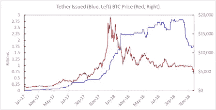
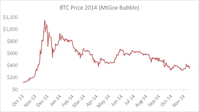
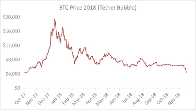
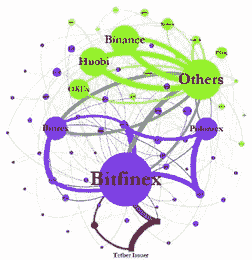
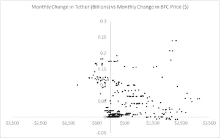
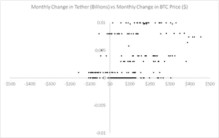

# 系绳泡沫正在从加密交换中被冲洗出来

> 原文：<https://medium.com/coinmonks/the-tether-bubble-is-washing-out-of-crypto-exchanges-dcd1f689d1c6?source=collection_archive---------1----------------------->

这不是比特币(BTC)的第一次崩盘。2011 年泡沫过后，价格下跌了 93 %, 2014 年，BTC 从 2013 年 11 月 1125 美元的高点下跌了 67%——见下图。2011 年泡沫的破裂是由糟糕的区块链代码造成的，2013 年至 2014 年是由 MtGox 交易所的交易机器人欺骗造成的，当时 70%的 BTC 在 MtGox 交易所交易。[【1】](#_ftn1)

自 2018 年 12 月 16 日 19，357 美元的高点以来，今年迄今价格已下跌 77%。最近的泡沫似乎是由 tether (USD₮)的印刷引起的，这是一种所谓的稳定硬币:“[每个 tether 总是由我们储备中持有的传统货币以 1 比 1 的比例支持。所以 1 USD₮总是相当于 1 美元](https://tether.to/)”。除了，它不是。自 10 月中旬发行人开始将其从流通中收回以来，其价格多次低至 95 美分，包括在撰写本报告时。[【2】](#_ftn2)

tether 的发行者，也是(不受监管的)Bitfinex 交易所的所有者，在今年早些时候被传唤，原因是怀疑他们的美元储备远远低于报告的支持当时发行的所有 Tether 所需的 25 亿美元。

2018 年 6 月，在两次失败的审计尝试(由富国银行和 [FSS](/@cryptoxjedi/what-did-the-fss-report-actually-tell-us-about-tether-97f0a7e73a2e) )后，约翰·格里芬和阿明·沙姆斯发表了一篇[讨论论文](https://papers.ssrn.com/sol3/papers.cfm?abstract_id=3195066)，显示了 Tether(在他们的网络图中以顺时针方向显示)如何通过 Bitfinex(和两个匿名钱包)往返于美国交易所 Poloniex 和 Bitrex(也是通过另外两个匿名钱包)，以及通过其他不受监管的亚洲交易所到达亚洲主要交易所 OKEx、Huobi 和币安(以绿色显示)。[【4】](#_ftn4)

Source: Griffin and Shams (2018) “Is Bitcoin Really Un-tethered” [Available from SSRN](https://papers.ssrn.com/sol3/papers.cfm?abstract_id=3195066)

从 2017 年 2 月开始，越来越多的系绳被发放——直到今年 10 月 14 日。然后在接下来的两个星期里，10 亿美元的等价物被从流通中收回，因为 Tether 转到了一家银行(位于巴哈马的 Deltec ),该银行发出了一封[看起来可疑的信](https://www.coindesk.com/tether-produces-letter-confirming-dollar-deposits-but-bank-hedges),对他们的美元储备估价为 18 亿美元

对标题图的随意观察表明，系绳发行被用来助长上一次比特币泡沫；还有 2018 年 1 月以太(以及其他硬币和代币)中的气泡。因此，我们应该期待回归到系绳泵送之前的价值，即 2017 年夏天的价值——比特币约为 2500 美元，以太币约为 400 美元——其他条件不变。

使用区块链的数据，格里芬和沙姆斯声称，去年 BTC 1400%的涨幅中有一半可归因于价格操纵，tether 被印刷并用于支撑比特币对抗抛售压力。下面的散点图显示了区块链以外的系绳发行和 BTC 价格，[【5】](#_ftn5)确实表明了一个类似的故事。每张图显示了 BTC 每月的损益和每月的 tether 净发行——下图放大到较小的交易，揭示了一个明确的模式，tether 发行和 BTC 每月损益之间的相关性超过 35%。即使包括较大的交易，如上图所示，数据中的对应关系也很明显。

Tether 可能助长了最近比特币和其他加密技术的泡沫，但这不是新的、不受监管的加密交易所使用的唯一不道德做法，这些交易所使用 tether 而不是美元进行加密交易。欺骗是很普遍的，[甚至在比特币基地](https://www.youtube.com/watch?v=79GOX_P_0JA)这个少数几个只交易法定货币和主要秘密交易的最大的交易所。这些新交易所采用的零定价/交易费挖掘做法鼓励了清洗交易(建立两个用于相互买入和卖出的账户，以人为抬高交易量)，使它们的排名迅速上升。[【7】](#_ftn7)按照[滑点](/@sylvainartplayribes/chasing-fake-volume-a-crypto-plague-ea1a3c1e0b5e)来衡量，从事这种业务的交易所并不提供真正的流动性。

昨天，[彭博](https://www.bloomberg.com/news/articles/2018-11-20/bitcoin-rigging-criminal-probe-is-said-to-focus-on-tie-to-tether)报道称，美国司法部正在加强对加密交易所不道德行为的刑事调查，目前重点是 tether-Bitfinex 的价格操纵。随着美国证券交易委员会继续打击不道德的交易所，我们应该期待更多的禁止在这些交易所进行交易，这些交易所的存在只是为了洗白或清洗。与此同时，像[富达和高盛](https://www.newsbtc.com/2018/10/21/crypto-week-in-review-fidelity-goldman-sachs-adopt-crypto-custody/)这样的大机构正准备进入加密领域——大时代。

英国苏塞克斯大学卡罗尔·亚历山大教授。2018 年 11 月 21 日。

cryptomarketisk 是苏塞克斯大学商学院量化金融科技网络(QFIN)加密资产风险团队的中介账户。本文表达的观点和意见是作者的观点和意见，不一定代表苏塞克斯大学的观点和意见。

[【1】](#_ftnref1)参见尼尔·甘达尔等人的[学术论文](https://www.sciencedirect.com/science/article/pii/S0304393217301666)(最近发表在《货币经济学杂志》上)了解更多关于交易机器人操纵的细节。

[【2】](#_ftnref2)使用 [Cryptocompare](https://www.cryptocompare.com/) 体积加权平均值。像其他排名网站一样，它报告了几个交易所的平均价格。Cryptocompare 的好处是，它们不包括报告系链交叉汇率的交易所。

[【3】](#_ftnref3)Bitfinex 和 Tether 的首席执行官 JL·范德费尔德、首席财务官吉安卡洛·德瓦西尼、首席合规官马修·特伦布莱和总法律顾问斯图尔特·霍格纳。两家公司的首席财务官菲利普·波特最近辞职了。

[【4】](#_ftnref4)约翰·格里芬和阿明·沙姆斯是德克萨斯大学的学术团队，他们之前揭发了操纵 VIX 指数的行为——发表了一篇论文，现在在几起与波动性交易所交易产品的不当行为有关的集体诉讼中被引用。

[【5】](#_ftnref5)这些数据来自为 Cryptocompare 做贡献的交易所。

这些公司是比特斯坦普、双子座、比特币基地和北海巨妖。

[【7】](#_ftnref7)根据[区块链透明研究所](https://www.blockchaintransparency.org/) (BTI)的研究，每天约 60 亿美元(主要是系绳)的交易量是[通过 wash 交易伪造的](https://www.ccn.com/6-billion-daily-crypto-volume-is-being-faked-how-can-it-be-combated/)。

> [直接在您的收件箱中获得最佳软件交易](https://coincodecap.com/?utm_source=coinmonks)

