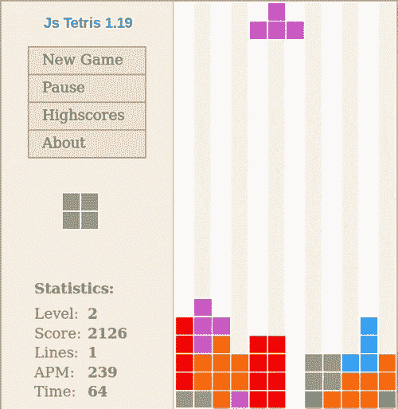
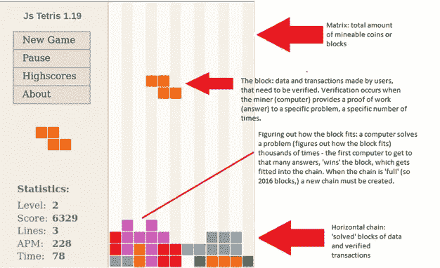

# 如何理解区块链和加密货币挖掘

> 原文：<https://medium.com/coinmonks/the-tetris-metaphor-understanding-the-blockchain-and-cryto-currency-mining-974b8024e320?source=collection_archive---------3----------------------->

俄罗斯方块隐喻:加密货币和采矿的简单解释

俄罗斯方块是一款令人上瘾的益智匹配游戏，自 1984 年发布以来非常受欢迎，可以说已经被普遍理解。谁不知道怎么玩俄罗斯方块？谁听不到诱惑你进入彩色几何世界的迷人歌声？

对于我们这些不了解内情的人来说，俄罗斯方块是这样工作的:

首先，它是一种在街机上玩的电脑游戏，在任何地方的电脑和手机上玩，也许现在就在你的家里。它在一个叫做矩阵的格子上播放，这个格子是 10 乘 20 的方块单元。不同的形状(蚱)从屏幕的顶部落下，然后停留在底部。随着游戏难度的增加，形状下降的速度越来越快。游戏的目的是创造一个完美的，由十个积木单元组成的水平链条。当一个 10 区块链被创建时，玩家得到一点奖励，链消失，必须创建一个新的链。随着玩家技能的提高和游戏难度的增加，砖块也可能开始下落得更快。当矩阵中充满了积木堆并且没有新的形状出现时，游戏就结束了。

明白了吗？恭喜你，你现在可以玩俄罗斯方块，了解区块链技术和采矿的概念。但是怎么做呢？

# 首先，我们来看一个俄罗斯方块的游戏。

Source: wikipedia

现在让我们来解构和定义俄罗斯方块的组件及其功能:

**俄罗斯方块矩阵:**游戏的大小，一般以 10 乘 20 的方块为单位。一旦矩阵满了，游戏就结束了。

**Tetriminonos:** 不同的几何块，从矩阵的顶部往下，落到底部。这些形成了水平链中的嵌段，也占据了矩阵中的空间。

**水平链:**一行块，没有间隙，覆盖了矩阵的宽度(所以一个 10 块的矩阵在它的水平链中会有 10 个块。)完美水平链的创建导致玩家的奖励。

**难度调整:**随着时间的推移，游戏所做的增加难度的改变——因此，当你通过关卡时，让方块下落得更快可以确保，随着你在游戏中的进步，你仍然需要花费特定的时间来完成每个关卡。

**目标/工作证明:**找出如何定位每个形状，使其整齐地适合水平链中的间隙。以创建水平块的矩阵宽度(so 10 块)链。这在很大程度上取决于玩家的脑力——他们能多快地找出方块的位置——这个问题的答案是“这个方块必须走哪条路才能适合这个链？”。工作的答案/目标/证明意味着块适合链，游戏继续。

**结果:**成功的答案(因此方块整齐地嵌入链中)赢得点数或保持游戏继续。积木构建成一条水平链，玩家得到奖励。

**那么，这与区块链有什么关系呢？**

“区块链”是一个相当宽泛的术语，指的是一种特定的技术，它本质上执行与会计或家庭预算相同的操作——这是一个保存交易分类账的系统。像比特币、以太币和多戈金这样的密码货币是可以在不同的人之间发送的数字币(因此称为数字货币)，使用区块链技术来检查交易是否正确，并使交易能够发生。您可以从交易所购买密码货币，就像菲亚特(硬通货、澳元、人民币等)货币一样，有一系列交易对可供选择。这就像在股票市场上交易一样，这些数字货币存储在网上或设备上的数字钱包中。但是等等，你说，这不是基本上没有意义吗？那不仅仅是想象中的钱吗？

好消息是，你是对的，加密货币是虚构的货币！但是，坏消息是所有的钱都是“想象中的钱”，因为它没有客观价值。我是说，当然，如果有足够的钱，我也许可以给自己买一栋房子，但是你不能吃它，不能住在里面，除非我们都同意，否则它没有任何意义。我们可以决定支持哪些货币，不支持哪些货币。

密码货币给了我们这种自由。密码的美妙之处在于，它不是将价值归于一种受国家经济管制的集中资源(如石油或黄金)(美国)。我们稍后会详细讨论这一点),它可以由任何一个拥有互联网连接和正确编程的电脑的个人来制作和控制。任何人都可以拥有开采加密货币的机器，因此它们不能(完全)由国家控制——无论是哪个国家。它可以由个人控制，也可以为个人开采。

好吧，那么回到区块链。让我们来看一笔交易——鲍比用 0.003 金币从比利那里买了一个纹身——这些纹身进入了区块链。区块链由一个名为“矿工”的计算机网络保护。这些矿工有两份工作。首先，他们必须验证交易是有效的(因此确认 Bobby 实际上有 0.003 dogecoins 可花，然后确认 Billy 是接收它们的人。)他们通过创建所谓的工作证明来做到这一点。本质上，这是一个非常复杂的算法(一个数学问题)的答案。)但是，他们必须做不止一次。他们做了成千上万次。所有的矿工相互竞争，看谁能首先准备好这份工作证明——这取决于你的网速；你的矿工，或一群矿工(一个矿池)能多快解决问题，达到产生工作证明所需的次数？第一个产生这份工作证明的矿工或矿池“赢得”该区块，并获得一枚硬币奖励。

一个块由一定数量的这些经过验证的交易块组成，并附有工作证明，这些交易块都被上传到每个人都可以看到的分类账中。这就是矿工的第二份工作——在区块链制造硬币。每一次矿工网络产生一个区块，就有更多的硬币被发现。这就是难度调整的用武之地。每次创建一定数量的块时——好硬币每次都检查单个块，呃……在每个 2016 年区块链结束时检查不太好的硬币——区块链系统检查矿工花了多长时间来制作数据块，并解决工作证明问题。

在开采开始之前，区块链对发现或开采所有可用硬币需要多长时间进行了猜测，因此解决所有算法有多难，以及需要多长时间。一旦所有的硬币被开采，更多的货币必须被创造出来。每个难度调整期，区块链都会将其估计的时间与矿工的实际速度进行比较。然后，区块链会根据矿工创建链的速度来改变算法的求解难度。随着时间的推移，计算机在解决问题方面变得越来越好，因此区块链增加了难度，因此组装链条和挖掘硬币仍然需要与预计相同的时间。

# 你还和我在一起吗？请问这和俄罗斯方块有什么关系？

请看下图:

区块链的俄罗斯方块解说:组件和功能。

**俄罗斯方块矩阵:**可挖掘的硬币数量

**Tetriminonos:** 数据块(比如等待验证的交易)和工作证明(比如某个问题的一定数量的答案，一定数量的次数。)

**横链:**区块链。验证数据、生产加密货币和操纵问题难度的数据块链。

**难度调整:**随着时间的推移，区块链所做的改变增加了它的难度——因此使问题变得更难确保，即使计算机变得更好，也需要估计的时间来挖掘所有的硬币——用链条填充矩阵并“结束”游戏(所以你要么升级——更多的加密货币被加入市场，要么游戏结束。)

**目标/工作证明**:让你的矿工先创建工作证明，然后‘赢得’木块(所以要想办法把木块完美地嵌入水平链中。)

**结果**:获胜的矿工获得一枚硬币奖励。

所以基本上，在俄罗斯方块中，就像加密挖掘一样，你可以通过正确解决问题和创建区块链来获得分数。除了想象“你”是一台计算机，或者一组计算机，叫做“矿工”你必须想出如何解决这个问题(因此创建工作证明)，以将这个块放入链条中的一个缺口。你有一定的时间来做这件事，由方块下落的速度决定(游戏难度如何。)你必须在方块到达矩阵底部并接触到其他链之前，找出如何将方块插入其在链中的空间。这就是你的计算机/矿工/采矿池与其他人竞争的地方，看谁能首先生成工作证明(因此正确的答案数量和正确的次数)，并因此赢得奖励(硬币奖励)或继续玩俄罗斯方块游戏。这个想法是，随着更多的水平，所以更多的货币和更多的矿工的加入，游戏变得更加困难，但奖励(所以硬币支付)仍然相当稳定。基本上就是这样！

我希望这对你来说是一个有用的比喻。概念化有助于我理解采矿的基本原理，所以我想我会分享…