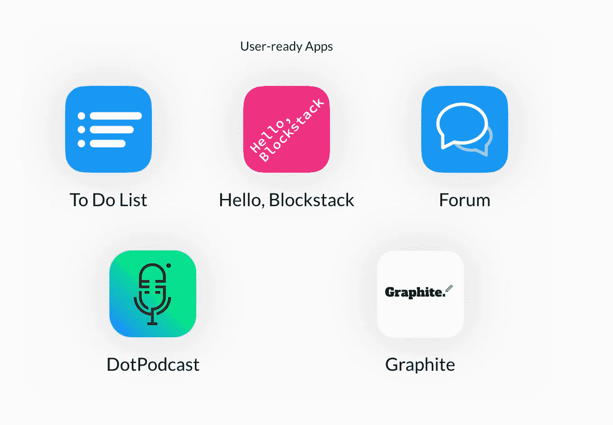

# 大多数 dapps 都搞错了

> 原文：<https://medium.com/coinmonks/the-thing-most-dapps-are-getting-wrong-b92913fd64db?source=collection_archive---------8----------------------->

在区块链和加密货币的世界中，分布式应用(dapps)是令加密社区和投资者兴奋的最新趋势。著名风投家 Fred Wilson 在他的[每日博客](https://avc.com/2018/04/dapps/)中写道，他非常兴奋，因为“2018 年是我们可以使用去中心化应用的一年。”

[Blockstack](https://blockstack.org/) 就是这样一家试图让 dapps 成为现实的公司。Blockstack 在他们的 ICO(于 2017 年 12 月结束)期间筹集了 5000 万美元，并将自己定位为“*分布式应用的新互联网，用户拥有他们的数据。*”

注册 Blockstack 后，您可以使用您的 Blockstack ID 来注册其他已构建为与 Blockstack 网络配合使用的分布式应用程序。更好的是，你不必重新输入所有的用户数据来注册每个新的应用程序，你可以查看和控制每个应用程序可以访问你的哪些数据。

我决定下载并安装 Blockstack 来尝试一些可用的 dapps。在成功安装和设置我的 Blockstack ID 之后(这很容易做到，但对于普通用户来说可能仍然太技术性了)，我能够查看以下特色应用程序，并尝试了一下 [Graphite](https://www.graphitedocs.com/) 。

The list of available user-ready apps after installing Blockstack

Graphite 是微软 Word 和 G-Suite 的第一个去中心化和加密的替代品。正如对一个处于起步阶段的项目所期望的那样，它在功能上是基本的，但做了它所声称的事情。

在试用了 Graphite 之后，我又玩了玩*待办事项列表*、 *DotPodcast* 、 *Hello Blockstack* 和*论坛*，直到我感到厌倦，并转向其他东西。不幸的是，整个经历让我很沮丧。由于对去中心化网络潜力的大肆宣传和宣称，我经历了一个 Word 或 Google Docs 的基本竞争对手和一个非常基本的待办事项列表。没有新的特性，没有新的功能，也没有令人信服的更换理由。它没有设计得更好，没有看起来更新，也没有革命性或独特性。既然没有实际的好处，我为什么要换呢？

## 仅仅控制你的数据是不够的

福音传道者会说，原因是我**现在**已经控制了我的数据，但是在这个用例中，这还不够。不管对错，大多数人相信谷歌这样的公司会提供他们的数据，并认为他们已经拥有足够的控制权。

dapps 们正在犯的错误是，他们试图与我们都知道和喜爱的现有产品竞争，而他们应该创造我们还没有发现和还不知道可能的新产品。

## Dapp 制作者正在重复开源软件社区所犯的同样的错误

这与开源软件(OSS)社区在 2000 年代中期试图将世界转变为开源软件时使用 OpenOffice 所犯的错误相同。微软的杀手锏是微软 Office，为了“赢得桌面”，Linux 和 OSS 社区想给人们提供一个选择，这样他们就可以放心地转向 OSS。尽管有免费的价格标签，这个策略最终还是失败了。你无法在微软自己的桌面游戏中击败他们，用户也不愿意转换(即使 OpenOffice 带来了安全和成本方面的潜在好处)。

Linux 和 OSS 社区不应该试图“赢得桌面”,而应该通过向用户展示在微软的工作方式下不可能实现的新应用程序，在微软无法取胜的领域与微软战斗。

直到谷歌推出 G-Suite，微软 Office 才有了真正的竞争者。为什么？G-Suite 通过将用户体验从桌面切换到在线，彻底改变了用户体验的模式。它没有试图在自己的游戏中与微软竞争(给用户一个替代的桌面应用程序)，而是向他们展示了在线套件对人们工作方式的潜在影响(以及免费的价格标签)。用户可以原谅谷歌在这种模式下拥有更少的特性和功能。谷歌提供的额外好处，如从任何地方访问你的文档，从任何带有浏览器的设备上处理它们，以及能够轻松地共享和协作文档，弥补了你不能运行数据透视表或嵌入在 Microsoft Office 中的其他强大功能，以及你只能在线访问你的文档的事实。突然间，所有关于云以及转向云的承诺都变得有意义了。

大多数 dapp 都在犯同样的错误:试图让人们使用在用户体验和人们今天的工作方式上没有重大差异的 dapp。石墨不会像 OpenOffice 对开源软件所做的那样赢得人们转向去中心化网络的心。

dapps 需要的是向人们展示一种真正新的工作、获取信息和联系方式，而不是以重新包装的方式克隆今天已经存在的东西。

彼得·泰尔在他的书《零比一:T2》中谈到了这一点..技术必须在某些重要方面比最接近的替代品至少好 10 倍，才能导致真正的垄断优势。任何低于一个数量级的改进都可能被认为是边际改进，很难销售，尤其是在一个已经拥挤的市场上。 ***要取得 10 倍的进步，最明确的方法就是发明新的东西。***

我担心最初的几个 Blockstack dapps 会遗漏这个标记，但是如果您已经发布或正在开发一个 dapp，这是一个新东西，我很乐意评论它。

