# 比特币第三次减半——比特币挖矿行业特别版

> 原文：<https://medium.com/coinmonks/the-third-halving-bitcoin-mining-industry-special-edition-ddd1718a349c?source=collection_archive---------2----------------------->

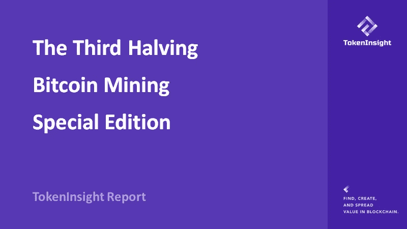

# 行动纲要

*   **我国比例哈希率下降:【2019 年 9 月以来，我国预估哈希率呈缓慢下降趋势，从 75.63%下降到 65.08%；而美国已经开始从 4.06%上升到 7.24%，上升了 78.33%**
*   **采矿边际利润跌破 0:** 减半后如果采矿者使用 Antminer S17 +，则需要将电力成本控制在 0.08 美元以下或保持最低运营成本以维持盈利；如果矿工使用 Antminer S9 型号，电费需要控制在 0.035 美元以下，否则降低运营成本是保持盈利的唯一方法
*   **矿业衍生品的崛起:** TokenInsight 对加密资产衍生品的未来持乐观态度，尤其是在机构越来越关注这种创新和这类金融产品的时候
*   **减半人气飙升:**根据 Google Trends 数据显示,‘比特币减半’的搜索量在减半后的一周内达到 100 多次，相比第二次比特币减半(2016 年 7 月 3 日至 6 日)搜索量超过 9 倍
*   **第 16 大:**5 月 20 日，比特币挖矿难度减半后首次调整。难度下降 6%，被认为是[比特币](https://blog.coincodecap.com/a-candid-explanation-of-bitcoin/)历史上第 16 大调整
*   **20%**:1000 块的平均阻塞时间(大约一周)在减半前为 560 秒，减半后为 689 秒，上升了约 20%，表明在此期间已有约 20%的网络杂凑率逐渐退出网络
*   **18%:** 减半前，交易手续费占比大多保持在 6%以下；减半后，由于奖励减半和平均交易费用增加，交易费用占比在 18% -24%范围内波动
*   **递进:** TokenInsight 认为，随着减半的到来，市场上将出现旧矿机的抛售。因此，2020 年是采矿业逐步转型的关键一年，非结构化的采矿作业将被高效、专业和精细化的管理策略所取代

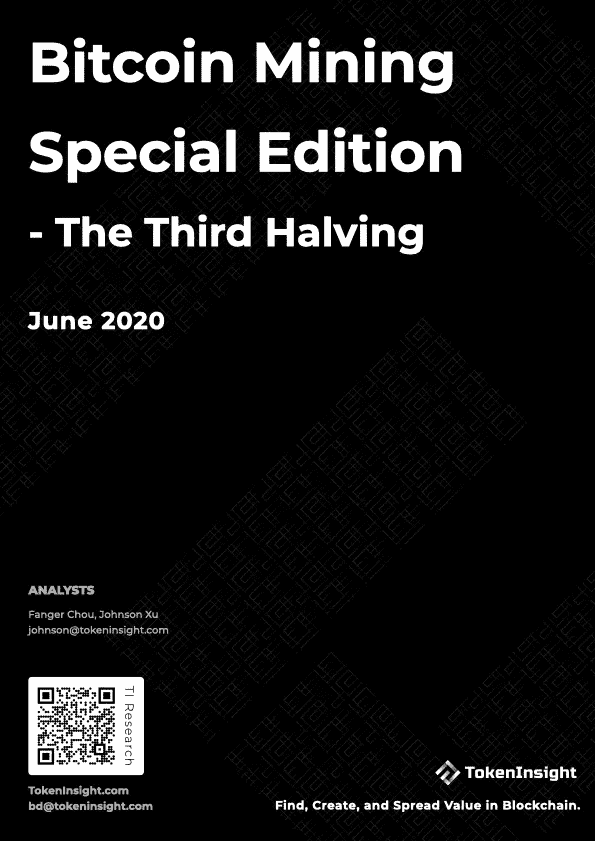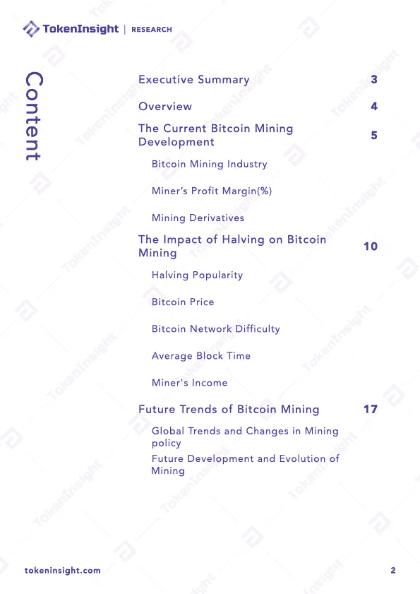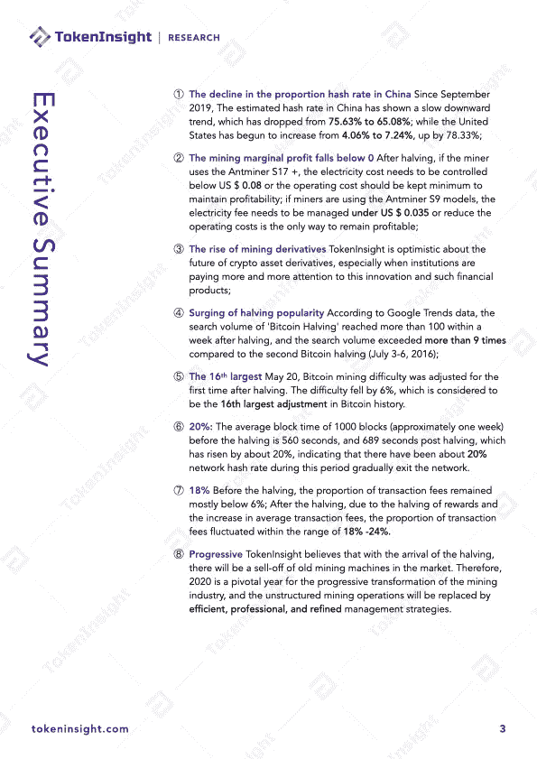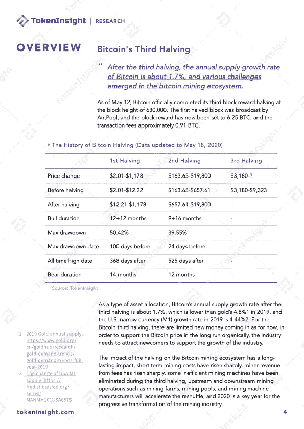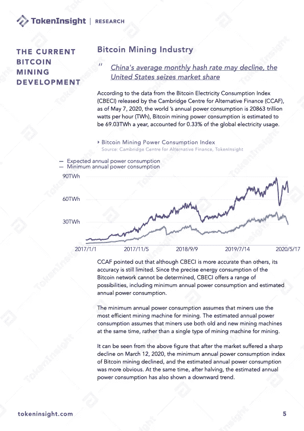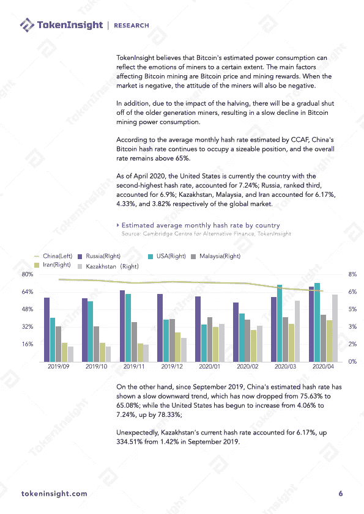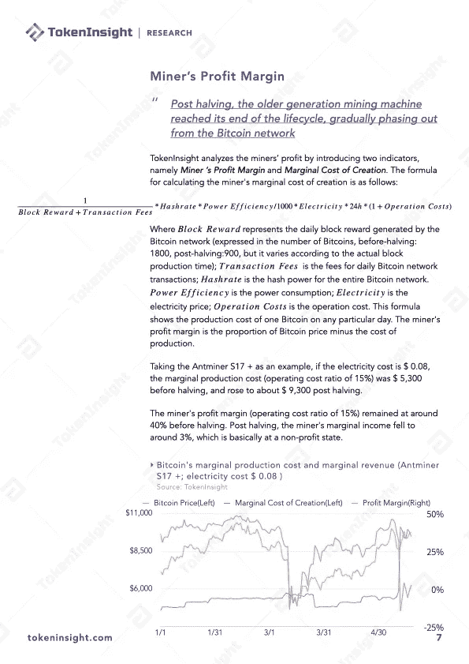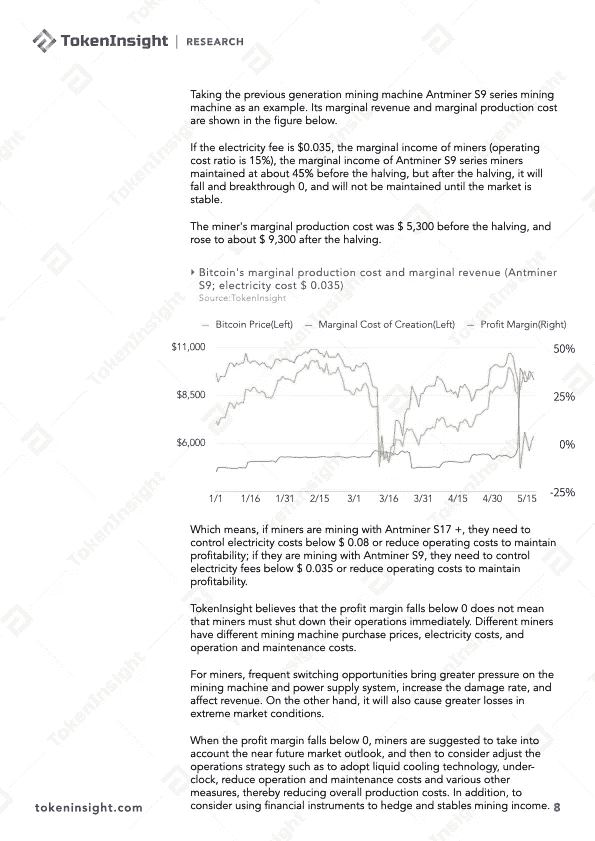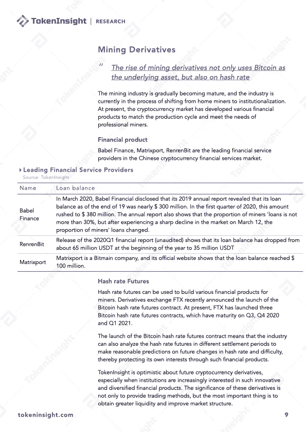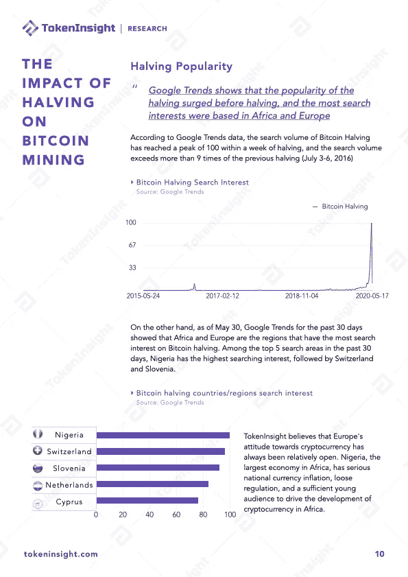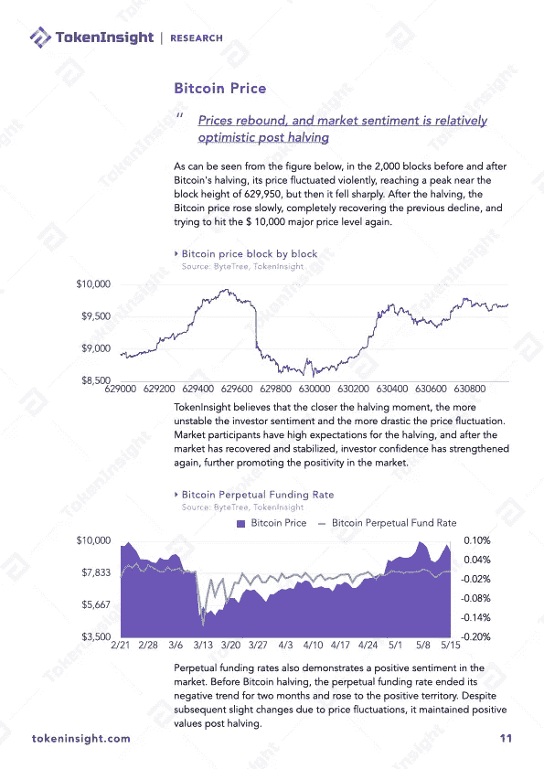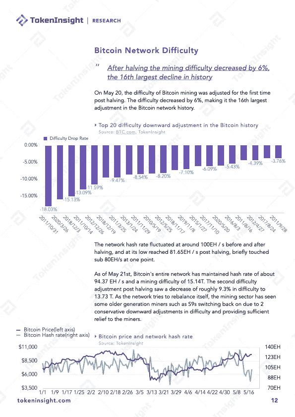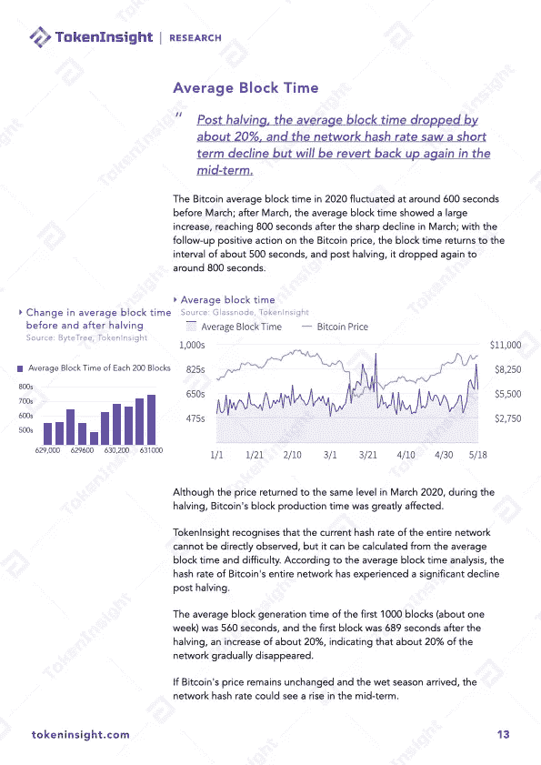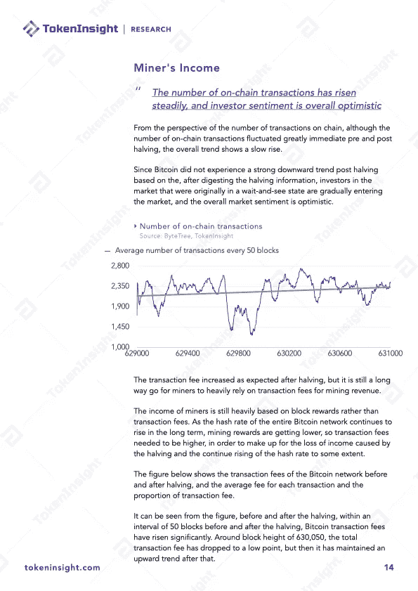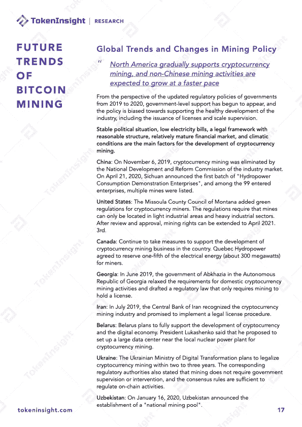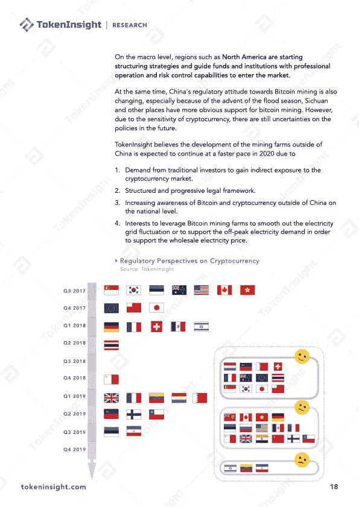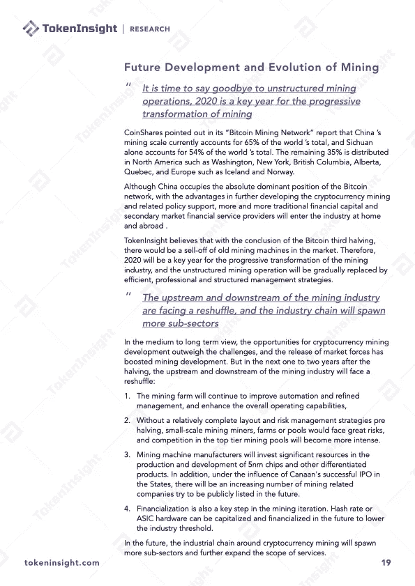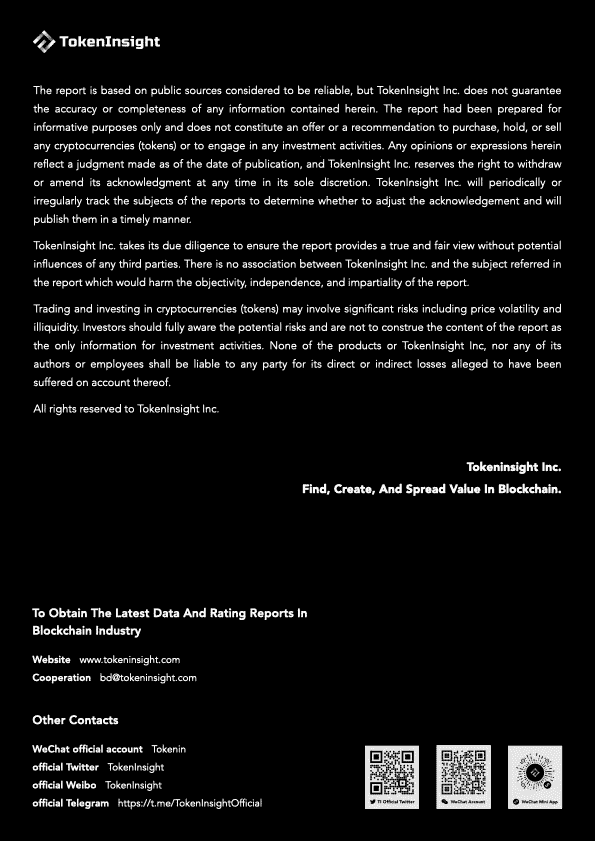

# 关于 TokenInsight

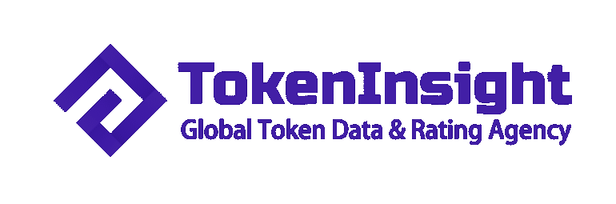

**成立于 2017 年的**[**token insight**](https://tokeninsight.com/?utm_source=article&utm_medium=medium&utm_campaign=TI)**是一家领先的数据&技术驱动的区块链金融机构。** TokenInsight 首创了完整的区块链行业分类体系，覆盖了超过**1600 个项目，**发布了超过 **300 份评级报告，**并对 **10 个主要行业进行了深入研究。**

TokenInsight 的数据、评级和研究报告可以访问全球 70 多个数据平台，包括 **Messari、Delta、币安信息、AICoin、火币信息、**等。，月 PV 超过 3000 万。TokenInsight 已正式加入由加密货币排名网站 CoinMarketCap 发起的数据问责与透明联盟(Data)。

# 如果您喜欢我们的评论，请关注我们:

💡官方网站:[https://www.tokeninsight.com](https://tokeninsight.com/?utm_source=article&utm_medium=medium&utm_campaign=TI)

📌领英官方页面:[https://www.linkedin.com/company/tokeninsight/](https://www.linkedin.com/company/tokeninsight/)

🔎电报:[https://t.me/TokenInsightOfficial](https://t.me/TokenInsightOfficial)

🗺推特:[https://www.twitter.com/tokenInsight](https://www.twitter.com/tokenInsight)

📕https://www.reddit.com/r/TokenInsight/

> [直接在您的收件箱中获得最佳软件交易](https://coincodecap.com/?utm_source=coinmonks)

