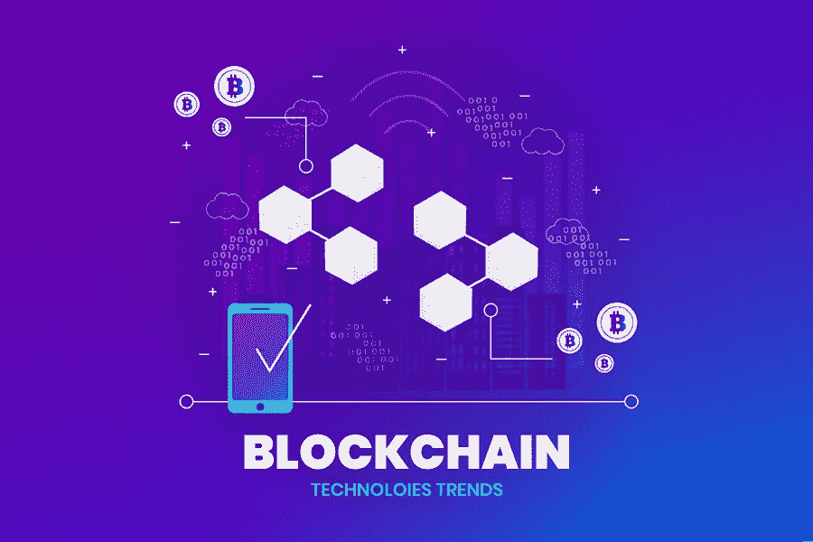

# 2022 年区块链十大趋势

> 原文：<https://medium.com/coinmonks/the-top-10-blockchain-trends-for-2021-7b60db0ee1d0?source=collection_archive---------0----------------------->

这 10 个区块链趋势将在 2022 年占据中心舞台。从 DeFi 到 IOTA 再到供应链，有很多解决方案。

区块链趋势 2022 关注透明供应链、智能合同、央行货币、加密资产和去中心化交易所。

今年承诺令人兴奋的项目，因为最近的大型投资在现实世界的应用和…