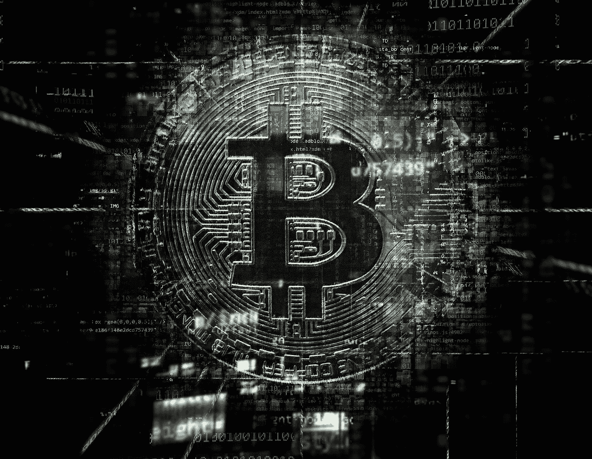
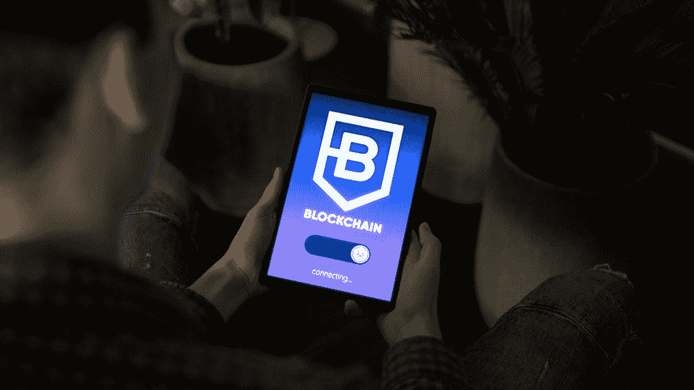
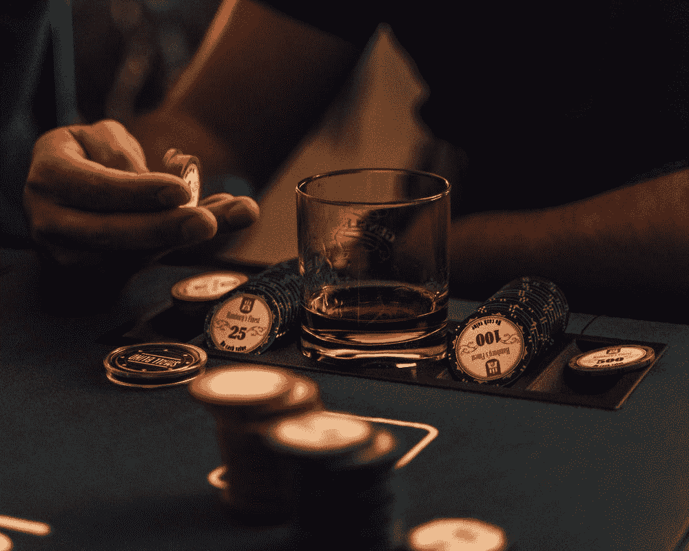
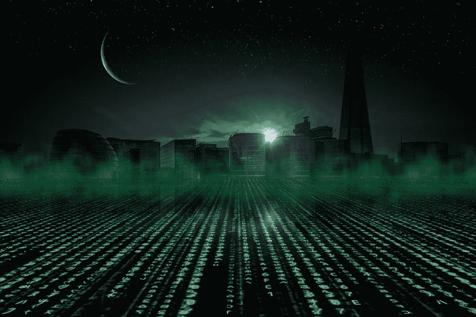
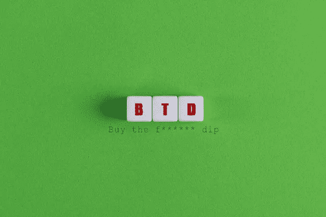
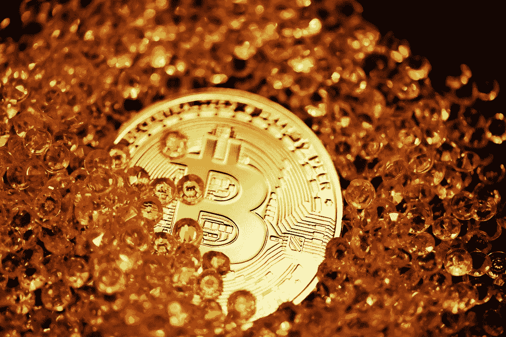
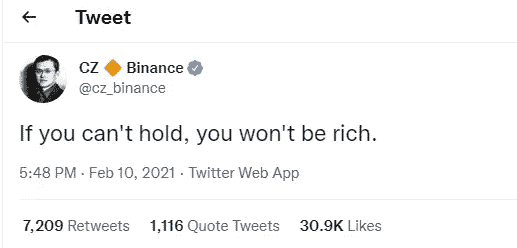
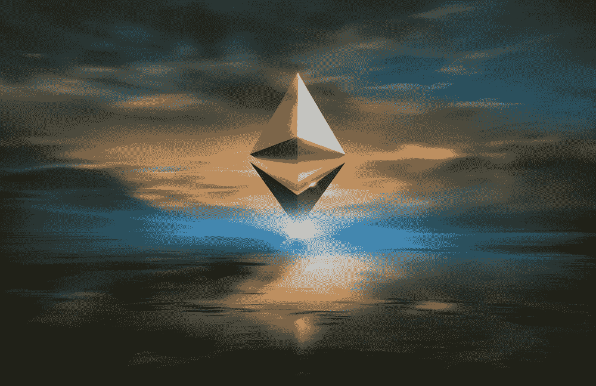

# 初学加密需要知道的 10 大细节

> 原文：<https://medium.com/coinmonks/the-top-10-crypto-details-beginners-need-to-know-5f049aab8c6a?source=collection_archive---------5----------------------->

Source: [Pixabay](https://pixabay.com/photos/bitcoin-cryptocurrency-blockchain-3014614/), by [TheDigitalArtist](https://pixabay.com/users/thedigitalartist-202249/)

绝大多数新加密货币用户都有交易或投资心态，但也缺乏对加密货币和这个市场背后的核心原则的理解。

有些人可能已经进行了长期投资，但是，也有足够重要的细节来保护这项投资。

我认为一本初学者指南是必要的，但也觉得一本冗长的指南并不理想。新来的人想要学习基础知识，而且他们想要快速掌握，以一种能给他们提示或总体印象的信息形式。

我会让这变得简单，但我也会在后面的第二部分提供更多的细节。和每个人一样，我也是一个初学者，我在零零碎碎中寻找答案，验证自己的说法。

这篇文章是写给所有新来者和最近接受 crypto 的投资者的。

**欢迎 Robinhood、CashApp、e-Toro、Revolut、PayPal 的 Crypto** 用户，以及任何其他使用类似应用或 Crypto-exchange 进行投资和交易的用户！

# 1:交换中的加密不是您的加密

Source: [Unsplash](https://unsplash.com/photos/l2kv2wVuKGU)

你不拥有任何加密货币，直到你把它提取到一个非保管钱包，一个提供私钥和种子短语的钱包。只有当您将加密货币移出您用来购买它们的任何应用程序/网站时，您才拥有它。

没错，这些顶级的加密交易所和交易室总是会告诉你，基金是“沙布”，但历史证明并非如此。

你在比特币基地、币安、北海巨妖、Bitstamp、Bittrex 或任何你购买的地方都没有任何密码。该加密仍然在 Exchange 热钱包中，并且在您提取之前不会移动到不同的地址。

如果你通过一个不允许提现的交易应用程序购买了 crypto，你应该出去从其他地方购买。以菲亚特的名义卖出，然后使用任何其他允许提款的期权再次买入。

也有一些方法可以购买 crypto 而不用冒你的私人信息的风险。KYC 在大多数交易所是强制性的，但不是全部。

# 2:永远没有安全感。这仍然是数字遥远的西部

Source: [Unsplash](https://unsplash.com/photos/zGnXou4siEI)

您必须始终保护您的私钥和种子短语。如果您只是将这些信息保存在桌面上的文本文件中，这就是一种威胁。加密货币需要关注、研究和责任。

钱包可能包含漏洞。一个包含详细信息的数据库可能会被泄露，一封带有恶意链接的网络钓鱼邮件会到达一个克隆网站，该网站会要求您提供短语和密钥。只有关注官方网站，通过官方渠道联系才是至关重要的。对你所做的一切持怀疑态度。你可能会注意到一个很小的细节，不要绕过这个，转账的时候千万不要急。

如果你被黑了，没有人会帮你处理资金。中央交易所没有责任追回你被盗的资金或偿还任何人，即使他们的网站和数据库被黑。

你在网上和任何人说话都不安全，不能相信任何人。甚至那些你认为你认识的人也可能是模仿者。有虚假的个人资料，有人可能冒充亲戚或朋友。永远不要相信网上的任何人，不仅仅是在加密领域。

加密货币解决了信任问题。一切都是可以证实的，随着时间和经验，你会学会识别什么是危险的。有些人不想冒险窃取小额资金，这是有风险的。但随着规模的增长，你永远不知道是否有人会转向。

花点时间，不要匆忙做任何决定。这将有助于你的方法，减少做出错误决定的风险。

看完这个你害怕吗？你应该害怕。你应该把钱存在银行里。也不安全，还有许多人不了解的各种危险。承担控制资金和增加安全性的责任总是更好。

# 3:有计划地投资——永远不要全力以赴

Source: [Unsplash](https://unsplash.com/photos/7dkLbNE6ycI)

不要全押。投资需要分散各种资产。正如你不能只投资房地产或黄金一样，加密也是如此。对于一些富有的个人来说，加密只占他们投资价值的 1%。
许多投资者发现这个值太低，将它提高到 5-10%。数字经济的潜力远远大于风险，因此一些投资者只是持有加密货币。但是，不建议使用这个选项。
我们处于一个非常动荡的市场，只要一个错误、黑客攻击、坏消息或任何事件，市场就会跳水，熊市就会开始。在牛市中，你可能会(至少)赚到 10 倍的钱，但当熊市开始时，你要为巨大的损失和痛苦做好准备。然而，这一切都是短暂的。你只有以更低的价格出售时才会亏损。然而，一些加密货币将永远无法恢复。

有些人只能部分恢复。即使是瑞波也没能恢复到之前的高度。我们甚至有更多的例子展示了具有先进技术的网络(比特币现金、Monero、ZCash、XRP)，但它们仍未能在 2020-2022 年的牛市中说服投资者，并且仍远远落后于其之前的历史高点。

我和许多在 3 美元买入的 XRP 投资者讨论过，三年后他们觉得 50%的损失是他们能得到的最好的交易。

计划可能会有变化。你可能希望持有和积累更多，其他人使用 DCA 来增加他们的加密货币头寸，有些人有一个标准的美元金额，当价格上涨时卖出，也许当价格过低时增加。这都是个人的，我不能向任何人建议如何投资。可能大多数新加入加密行业的人已经在交易或投资股票了，所以他们已经承担了风险。

# 4:不要公开宣布密码持有量

Source: [Unsplash](https://unsplash.com/photos/5YU0uZh43Bk)

谈论加密，因为这总是有帮助的，因为有数十亿人有问题并想听。但永远不要讨论你持有多少。也不要告诉你的朋友或者亲戚，这样只会带来麻烦。跟所有人谈加密货币，但不要谈你持有多少。

当你的密码价值突然达到数十万或数百万时，你就会回到你的社交媒体和博客上，试图找到并删除这些评论。总会有备份，被删除的帖子的恢复是那些进一步调查的人的一个选项。

看的人太多了。你不想让每个人都知道你的秘密财富。只是不要在任何地方宣布。我可以举出数百个例子来说明这是如何出错的。

当价格上涨，投资者的利润飙升时，许多人都有向社交媒体、朋友和家人宣布的冲动。如果你打算这么做，想想所有可能出错的地方。有些人甚至会鄙视这种方法，如果这种方法包含沾沾自喜，他们会成为失去追随者的一个因素。骗子也总是渴望了解这些信息。

# 5:骗子总是潜伏着

Source: [Pixabay](https://pixabay.com/photos/siluette-country-urban-skyscraper-702178/)

骗子像蝗虫一样在加密领域繁殖。它总是吸引着他们，因为总是有钱可赚。虽然，随着更多的人进入，他们在数量上增加并进化。

骗子，通常都没什么损失。他们冷酷无情，他们唯一的生活目的就是欺骗其他人类。只是我们失去资金的悲痛给他们带来了欢乐。通常他们会在监狱里结束，但似乎 crypto 给了他们一个轻松的理由。

有许多文章解释了骗子是如何工作的，但重要的是要知道骗子经常会进化并创造出更好的技术，所以我们需要不断提高警惕。

# 6:不要卖蘸酱

Source: [Flickr](https://www.flickr.com/photos/91261194@N06/51012620300)

交易时，你永远找不到准确的顶部并卖出。你也找不到确切的底部。所以，试着忽略那些不是机会的小窗口，学习如何交易。设定目标和指标，不要什么都卖。

交易者明白这个游戏是关于低买高卖。虽然我不打算卖回给菲亚特，除非有紧急情况，但下跌仍会给投资者的心态带来巨大变化。

这是人之常情，用你的投入长出厚脸皮的需求势在必行。跟风通常是错误的。

这是一个负值，在一个繁荣的行业中，任何看跌期都只会持续几个月或者两年。一些投资者和交易员在 2018 年犯下的最大错误是退出 crypto，只在价格再次过热时回头看。

有时价格可能没有上涨的潜力。然而，市场是循环运行的。实体经济经历繁荣和萧条周期，但加密经济目前的运行速度是它的 25 倍。

最近的下跌总是被买入，价格回升。虽然我解释说不要卖出下跌，但许多人明白，牛市周期终有一天会结束。这是一个根据每个人的策略进行调整和再调整的问题，但最糟糕的建议是在大多数其他投资者都在买进的时候卖出。

# 7:比特币不是安全的投资

Source: [Unsplash](https://unsplash.com/photos/cpCQqduyJVc)

加密没有安全投资，也没有价值储存。至少我们还不能这么说。

比特币仅仅存在了 12 年。这几乎没有足够的时间来考虑任何资产的“价值储存”。

它是一种投机性资产，尽管其价格持续上涨，并与当今主要市场(ETF、CME、Bakkt、gray)密切相关，但它在市场上的存在时间并不长。比特币(BTC)没有通过时间的考验，没有出现大的衰退，与负面的宏观经济事件关系不大。

一些人认为，假以时日，比特币(BTC)将成为一种价值储存手段。然而，要达到黄金的地位需要很长时间，而且许多故事经常被放弃和替换。

当然，应该谨慎对待和选择加密货币，这是一种可靠的投资。然而，这并不意味着 BTC 和瑞士联邦理工学院将永远处于领先地位。

两者都有似乎永远无法解决的问题。对许多分析师来说，比特币已经度过了它的周期，如今什么都不能提供。虽然我不完全同意，但这个论点还是有道理的。如今存在更好的加密货币。比特币只是不断利用它的品牌名称。它出售比特币，但每次面向不同的目标群体。

2013 年，MtGox 和中国投资者，2017 年散户投资者，2021 年机构投资者。还有另一个目标群体，即政府，其中一个群体目前正处于测试阶段。萨尔瓦多。虽然这项测试需要几年时间，但我仍然认为萨尔瓦多不是进行这项测试的最佳国家。具有恶性通货膨胀倾向的经济体将是进一步确定闪电网络优势和劣势的更好匹配。

# 8:“HODL”会让你变得富有！

[Source](https://twitter.com/cz_binance/status/1359529612024270851)

持有是有意义的，但关键是影响者告诉投资者“何时”持有 HODL，因为当价格超过任何以前的泡沫区时，你可能会了解到 HODL，并且看起来不够稳定，可能会跌到比这个水平低 80%的底部。

CZ 是币安的首席执行官，看起来像一头用财富支撑市场的永久公牛。然而，币安已经让 CZ 成为了亿万富翁。

我想所有初学者都需要从这篇推文中提取一些细节:

一般来说，加密影响者、交易所首席执行官、Twitter 和 Reddit 都在推广他们的投资和业务。这些都不是可用的主要研究工具。网上有信息网站，但大多数细节需要几个月的研究。不要指望在一周内学会所有的东西。

价格在抛物线攀升后将会修正，熊市总是有可能的。如果投资者在顶部买入，可能需要很多年才能恢复，而且根据所买入的加密资产，可能永远也不会恢复。

这些秘密影响者可能经常提供一些适当的观察。但对于一个初学者来说，很难从那些毫无意义的推文中识别出真正有价值的推文。为了更清楚，我鼓励避免将社交媒体作为研究的一部分。

“HODL”，可以让投资者在菲亚特条款丰富。然而，在任何特定时间买入都是不明智的。投资需要时间、研究和不同的策略。

# 9:想想未来

Source: [Pixabay](https://pixabay.com/illustrations/earth-world-planet-outer-space-6632399/)

而不是购买一个很酷的、被大肆宣传的迷因硬币，并持有它 10 年。我不认为这有什么帮助。也许如果马斯克继续像今天这样有影响力，他可以继续“提升”多吉的价格，尽管目前看来多吉鲸正在充分利用这一点。

所以，这不是“HODL”的建议。这是关于展望数字经济以及哪些加密货币将在其中发挥作用。

例如，元宇宙是一个将在未来更频繁讨论的主题。我们将有一个元宇宙可供选择，而不仅仅是脸书设想的那样。我们将能够在苹果元宇宙、育碧元宇宙等产品中进行选择。

这些不同的元诗句，应该是相互联系的。这才是重点。元宇宙最显著的特征将是从公司拥有的数字权利过渡到将数字资产的所有权授予用户。

我们只能通过使用非功能性测试来实现这一点。当前 NFTs 的唯一竞争对手将是更先进的 NFT 协议，它们仍将在分散的区块链上运行。没有什么比这更强大的了，而且可能在一段时间内都不会。

*Source:* [*Pixabay*](https://pixabay.com/illustrations/new-york-skyline-night-scene-new-974432/)(modified)

因此，对于任何只考虑短期利润的投机者来说，最好也开始相信这项技术。我计划将总投资资金的 10%投资于满足所有要求的某些加密货币，以成为可能的元宇宙内的主要支付方式。

这些应该包含高速、低费用、可靠电力开采网络的特征，并反映以普遍采用为目标的发展。

# 10:相信自己，忽略其他一切

Source: [Unsplash](https://unsplash.com/photos/IcUbKfIuQ70)

**忽略此贴。**

忽略你在这里读到的任何东西，忽略所有人。

说真的。做你的研究，相信你自己。你比世界上大多数人都更早进入加密领域。你现在正在研究，阅读这篇文章，这是其他 99%的人永远不会做的事情。

核实，交叉引用，反复检查所有东西，尤其是当一些东西看起来有问题的时候。每个人都有一定的技能，开发者往往没有抓住重点，没有意识到这个世界需要什么。

有理想和各种意识形态聚集在一起，并在 crypto 中找到立足之地。往往有些叙事是假惺惺的推广和转载。虽然有想法，每个人都可以扩展和写很多，但这并不意味着事情就是这样。

找到可靠的内容创作者需要时间，他们不会简单地遵从大众的要求，而是进行调查性报道。

对每件事都要半信半疑，因为每个人都会夸大其词。

# 最后

Source: [Unsplash](https://unsplash.com/photos/uNXmhzcQjxg)

嘿！感谢你阅读这篇文章！

还有，欢迎来到 crypto 这篇文章送给你！我假设 crypto 中的一些条件现在已经很清楚了，对于更多的细节，我会尝试创建一个更好更详细的指南。

如果加密市场持续增长，你们可能很快就会变得富有，但同样重要的是进一步教育和理解加密货币背后的核心概念。加密不仅仅是一项帮助制造更多法定货币的投资，它还有一个不同的目标。你迟早会明白的。

虽然每个人都可能因为紧急原因需要出售他们的部分密码(完全理解)，但最终可能没有必要。

未来对加密货币的接受将是普遍的。有些人可能想把他们的财富放在固定存款中以确保安全，但他们也希望财富每年缩水 5-15 %,因为这是所有经济体的新通胀模型。

这只是 CPI，而每个人都有不同的需求和不同的消费习惯。所以对于普通人(你和我)来说，今天的通货膨胀率大概是 50%(一个适度的估计)。

我以前很喜欢我的欧元，但最近通货膨胀达到了荒谬的水平。我觉得把菲亚特存在银行里不再安全了。

希望这篇文章能帮助您理解一些核心概念，并以更大的信心继续您的加密之旅。

Follow me on: ● [ReadCash](https://read.cash/@Pantera) ● [NoiseCash](https://noise.cash/u/Pantera99) ● [Medium](/@panterabch) ● [Hive](https://hive.blog/@pantera1) ● [Steemit](https://steemit.com/@pantera1) ●[Vocal](https://vocal.media/authors/pantera) ● [Minds](https://www.minds.com/pantera99/) ● [Twitter](https://twitter.com/Panterabch) ● [LinkedIn](https://www.linkedin.com/in/panterabch/) ● [email](https://read.cash/@Pantera/localcryptos-p2p-exchange-is-now-offering-bitcoin-cash-trading-06637230#bad-link)

**备注:**

> 免责声明:本内容中发布的所有材料均用于娱乐和教育目的，并符合合理使用的准则。无意侵犯版权。如果你是或代表本文所用材料的版权所有者，并且对所述材料的使用有问题，请发送[电子邮件](https://read.cash/@Pantera/cryptouknowns-battlegrounds-the-crypto-battle-royal-part-i-0ca762da#bad-link)。

***支持内容创作者。***

如果你喜欢这个故事，就订阅吧！

**最初发表于 Medium。**

> 加入 Coinmonks [电报频道](https://t.me/coincodecap)和 [Youtube 频道](https://www.youtube.com/c/coinmonks/videos)了解加密交易和投资

## 也阅读

 [## 最佳加密交易所| 2021 年十大加密货币交易所

### 编辑描述

blog.coincodecap.com](https://blog.coincodecap.com/crypto-exchange)  [## 2021 年 10 大最佳加密贷款平台| CoinCodeCap

### 编辑描述

blog.coincodecap.com](https://blog.coincodecap.com/crypto-lending)  [## 2021 年最佳免费加密交易机器人

### 2021 年币安、比特币基地、库币和其他密码交易所的最佳密码交易机器人。四进制，位间隙…

medium.com](/coinmonks/crypto-trading-bot-c2ffce8acb2a)  [## 最佳 4 个加密交易信号电报通道

### 这是乏味的找到正确的加密交易信号提供商。因此，在本文中，我们将讨论最好的…

medium.com](/coinmonks/best-crypto-signals-telegram-5785cdbc4b2b)  [## BlockFi 评论 2021:利弊和利率| CoinCodeCap

### 编辑描述

blog.coincodecap.com](https://blog.coincodecap.com/blockfi-review)  [## 如何在印度购买比特币？2021 年购买比特币的 7 款最佳应用[手机版]

### 如何使用移动应用程序购买比特币印度

medium.com](/coinmonks/buy-bitcoin-in-india-feb50ddfef94)  [## 加密税务软件——五大最佳比特币税务计算器[2021]

### 不管你是刚接触加密还是已经在这个领域呆了一段时间，你都需要交税。

medium.com](/coinmonks/best-crypto-tax-tool-for-my-money-72d4b430816b)  [## 存储比特币的最佳加密硬件钱包[2021] | CoinCodeCap

### 编辑描述

blog.coincodecap.com](https://blog.coincodecap.com/best-hardware-wallet-bitcoin)  [## Pionex 评论 2021 |免费加密交易机器人和交换

### Pionex 是为交易自动化提供工具的后起之秀。Pionex 上提供了 9 个加密交易机器人…

medium.com](/coinmonks/pionex-review-exchange-with-crypto-trading-bot-1e459d0191ea)