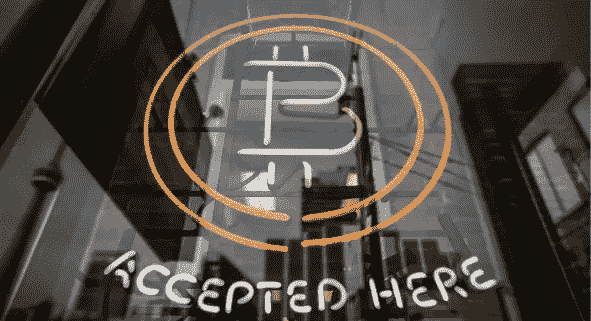

# 即将到来的货币革命背后的三大催化剂

> 原文：<https://medium.com/coinmonks/the-top-3-catalysts-behind-an-impending-monetary-revolution-85735af7e170?source=collection_archive---------0----------------------->

## 对金融和加密货币未来的广泛展望

## 宇宙大爆炸

2011 年夏天创造了历史，当时比特币[的价格飙升到了惊人的 32 美元。有涨必有跌，比特币价格不可避免地暴跌回 2 美元区间…](https://www.tradingview.com/x/YYwuPoWz/)