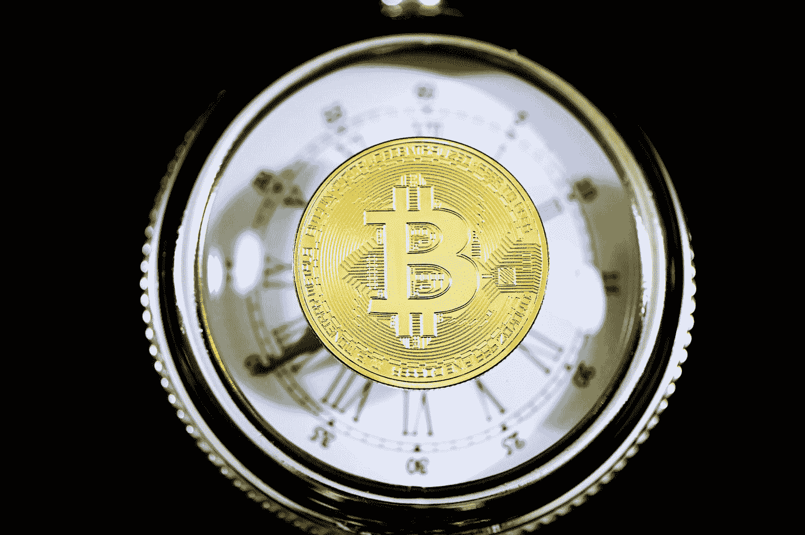

# 五大加密误解

> 原文：<https://medium.com/coinmonks/the-top-5-crypto-misconceptions-957bf208a54f?source=collection_archive---------5----------------------->

Photo by [Execution](https://unsplash.com/@executium?utm_source=medium&utm_medium=referral) on [Unsplash](https://unsplash.com?utm_source=medium&utm_medium=referral)

你对一个话题越有经验，当影响广泛的媒体复制虚假事实，故意欺骗读者群以获得关注时，你就越恼火。你可能很熟悉这个:假新闻。

无论如何，作为一个长期的密码专家，我对 80%的文章感到恐惧。