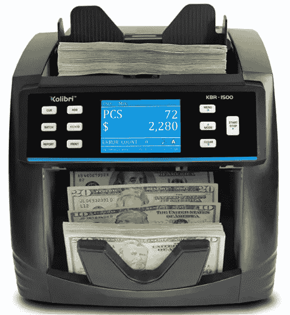

# 我每月被动收入超过 3，660 美元的 7 大工具

> 原文：<https://medium.com/coinmonks/the-top-7-tools-i-use-to-make-3-660-per-month-in-passive-income-9155ff7b883b?source=collection_archive---------0----------------------->

我在 Medium 上写得越多，在 YouTube 上发布的视频越多，我看到的想在网上赚钱的人就越多。

You’ll need a money counter with these methods!

然而，大多数人似乎都被那些能让他们现在获得尽可能少的*金额的应用程序/网站所吸引，而不是集中他们的努力(和前期的一点钱)来获得更多的利润…*