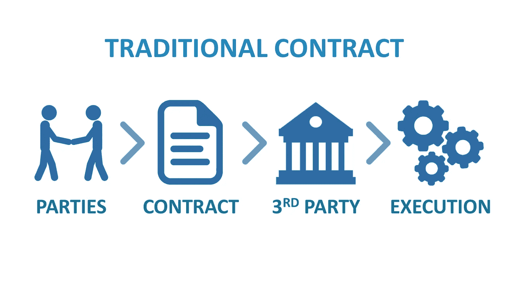
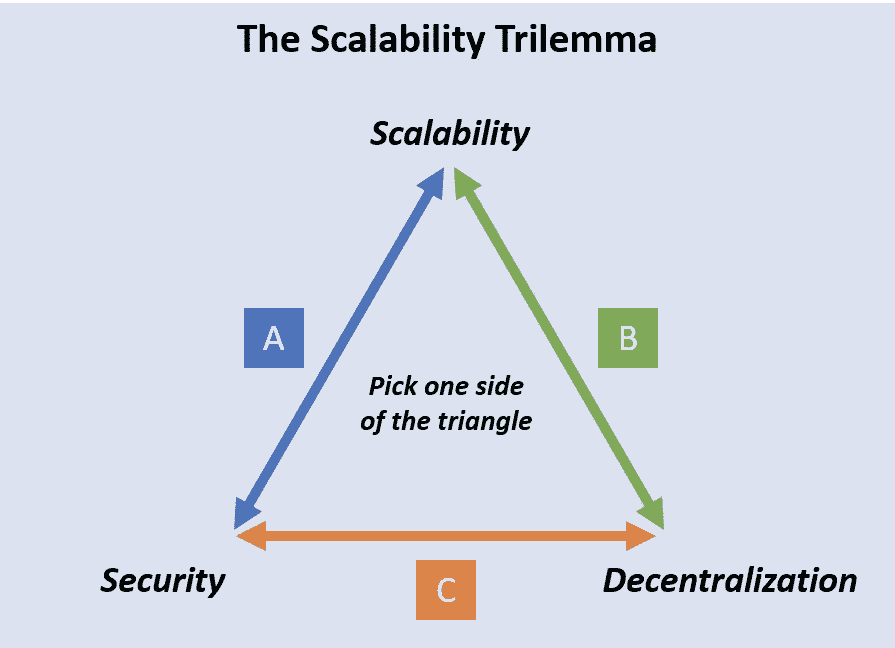
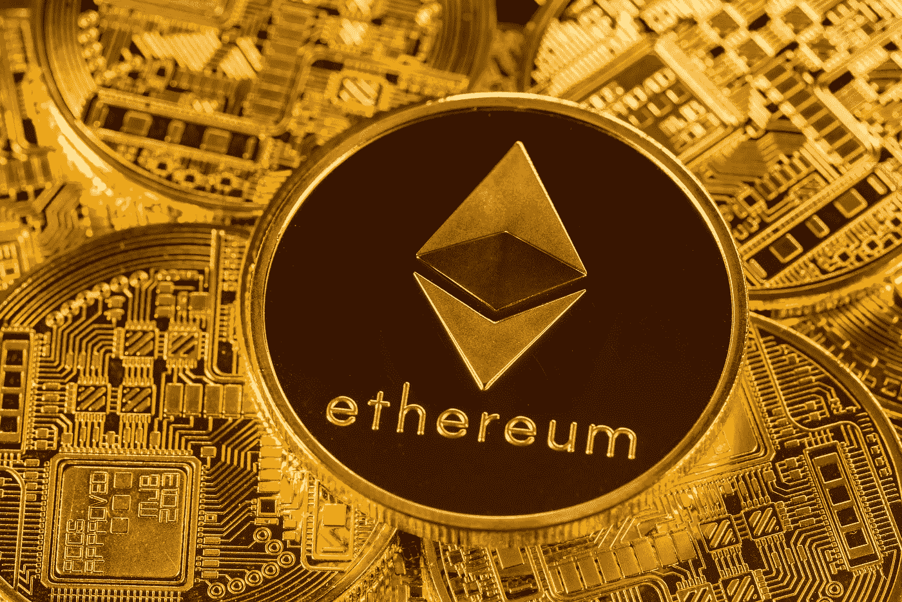
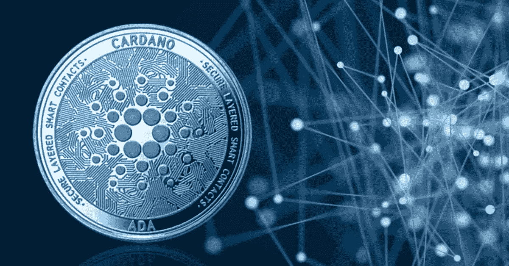
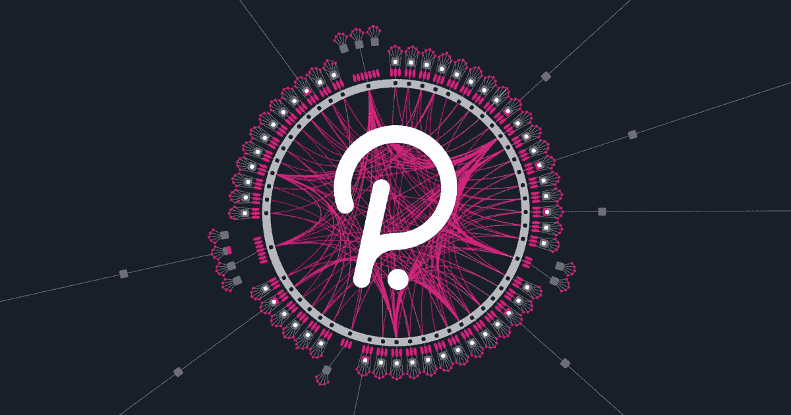
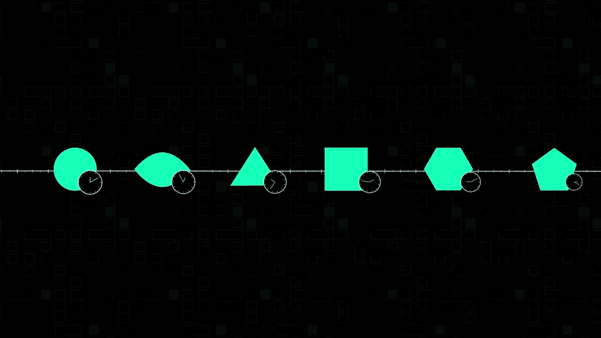
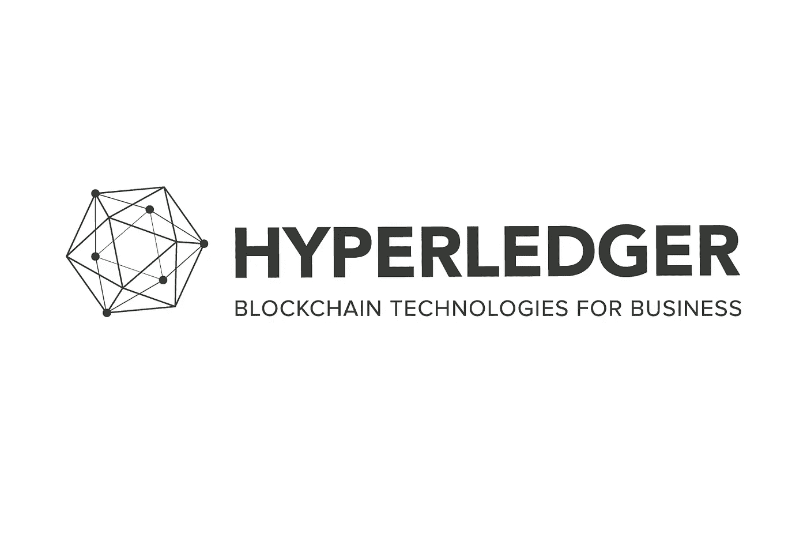

# 五大智能合约平台(2021 年 11 月)

> 原文：<https://medium.com/coinmonks/the-top-five-smart-contract-platforms-november-2021-72a9128a2b4f?source=collection_archive---------0----------------------->

如果你一直关注加密货币新闻，那么你肯定听说过“智能合约”这个词。以下是对一些主要智能合约平台的简要分析，它们的差异以及它们的价值所在。

# 什么是智能合同？

智能合约只是存储在区块链上的**程序，当预定条件满足时执行**。它们通常用于自动执行协议，以便所有参与者可以立即确定结果，而无需任何中间人的参与或时间损失。

一个有用的类比是自动售货机。典型的自动售货机在执行其功能之前需要满足某些条件。在这种情况下，正确的条件是必须插入正确数量的零钱。一旦发生这种情况，它会给你一瓶汽水，也就是说，执行它的功能。

# **真实世界用例**

智能合同已经改变了艺术界的面貌，艺术家们现在可以从他们所有的数字艺术作品转售中获得版税。这是一个聪明的合同在工作中的例子。从现在到时间结束，每次购买或出售数字资产时，销售价格的预定百分比被直接发送到创作者的钱包中。

First 5000 Days by Beeple

由于游戏行业智能合约的实施，您可以保存游戏内购买的内容，将其出售给其他玩家，或将您的购买内容转移到其他支持的游戏中。

智能合同可以用来提高政府选举的诚信，降低选举成本，加快计票过程。他们还能够验证选民的身份，以防止多重投票。

智能合约在房地产、金融和保险领域还有许多其他用例。

# **没那么容易**

众所周知，智能合约平台都遭遇了同样的“三难困境”，即安全性、去中心化和可扩展性。没有人知道如何在不牺牲其中一项的情况下，将这些特性同时整合到他们的平台中。

今天，有许多不同的区块链提供了智能合约的效用。它们在架构、功能、能耗和治理方面有很大不同。以下是一些大人物的名单；

# **以太坊**

智能合约的 OG 早在 2015 年就开创了这项技术，直到最近一直是唯一一个拥有完整功能的平台。因此，以太坊受益于“先发优势”,目前几乎 80%的 Dapps(分散应用程序)运行在以太坊网络上。

以太坊的创始人创造了他们自己的编码语言“Solidity ”,将智能合约编程到网络上。与其他平台相比，通过令人信服的书面规则、明确定义的开发指南和自己的编码语言，在 Etheruem 上部署智能合约和 Dapps 被证明是非常容易的

以太坊仍然使用工作证明(PoW)一致算法来验证交易。PoW 是一种在网络上达成共识的方法。PoW 通过要求每个参与节点贡献计算能力来求解方程，从而防止网络上的恶意活动。该方法因其高能耗和较差的可扩展性而受到批评，但在维护网络的完整性方面非常有效。

ETH 2.0 原本计划在 2019 年使用新的利益证明(PoS)共识算法发布，但该项目的推出出现了明显的延迟，目前预计要到 2022 年才能完成。当前的天然气费用使得许多人不再使用以太网，这为许多竞争者打开了大门，所谓的“以太杀手”也获得了一些市场份额。

需要指出的是，以太坊的团队正在尝试实现一些从未实现过的东西，即解决安全性、去中心化和可伸缩性的三难问题。正如我们将在后面的列表中讨论的，许多所谓的 ETH 杀手至少在这些特性中的一个上妥协，以达到他们的高结果。

创始人:维塔利·布特林

**协议:**工作证明

**优点:**标准化、安全性、支持、去中心化

**缺点:**成本、速度、可扩展性

# **卡尔达诺**

Cardano 旨在通过其利益证明(PoS)共识算法解决可扩展性、互操作性和可持续性问题。这个平台是由以太坊的创始人之一查尔斯·霍斯金斯创建的。他有先见之明，看到以太坊将进一步扩展的问题，并决定必须从头开始建立一个新的解决方案。

Cardano 的 PoS 算法要求节点在网络上加入 ADA，以便参与验证交易。PoW 使用计算能力作为衡量一个节点对网络有多大影响的标准，而 PoS 则不同，它使用 ADA 的值作为决定因素。

与以太坊和比特币不同，Cardano 不允许每个人同时开采新区块，而是由网络选举“槽头”来开采下一个区块。随着更多的用户进入网络，可以添加更多的插槽，这意味着 Cardano 可以在扩展时扩展并保持网络速度。

该项目在非洲有一个巨大的倡议，其目标是为 500 万埃塞俄比亚学生提供数字身份证，这些身份证与他们的学术记录相关联，这些记录将被托管在卡达诺区块链上。

Cardano 因其缓慢、有条不紊且经过同行评审的平台建设方式而受到褒贬不一。期待已久的“阿隆佐”智能合约更新于 9 月 12 日发布，现在允许开发者运行普路托斯支持的智能合约。然而，一些人认为 DApps 在网络上的全面部署仍然遥遥无期。

创始人:查尔斯·霍斯金斯

**协议:**股权证明

**令牌:**阿达

**优点:**可扩展性，环保

**缺点:**进展缓慢

# **波尔卡多特**

波尔卡多特更像是一个区块链生态系统，而不是一个个体链。它是由以太坊的另一位创始人加文·伍德创建的。该平台特别关注互操作性。

目前，在元宇宙有许多相互竞争的区块链在运行，它们没有相互通信的能力。Polkadot 旨在通过弥合个体链之间的差距来解决这一问题。它被称为“零层解决方案”。

与其他协议相比，Polkadot 具有独特的设计。波尔卡多特的一个显著特点是使用副链，副链是独立的区块链，与中央“接力链”平行。总共将有 100 个可用的 parachain 插槽，每个插槽都将被拍卖给希望在 Polkadot 平台上启动的项目。

这些副链与中央中继链连接起来，以批准共识，同时还允许开发人员在每个单独的链上创建和维护他们自己的定制治理模型。

草间弥生是波尔卡多特测试网络，在波尔卡多特上线之前，区块链可以在这里进行一次试运行。这有助于项目在主网络上启动之前进行实验并修复任何错误。

Polkadot 的整体架构无疑是密码行业向前迈出的一大步，所以如果 Polkadot 成为未来顶级智能合约平台之一，请不要感到惊讶。

创始人:加文·伍德

**协议:**利害关系证明

**令牌:**圆点

**优点:**互操作性、可伸缩性、实验性

**缺点:**可用的链槽数量有限

**定义特征:**副链

# **索拉纳**

自 2017 年创立以来，Solana 迅速崛起，特别是在去年，现在按市值排名第五大加密货币。它上升的原因之一是它的速度。索拉纳很快，我是说真的很快。该协议的吞吐量为每秒 50，000 个事务(TPS ),以太坊可以处理大约 13 个 TPS！索拉纳也非常节省，交易费目前约为 0.001 美元。

Solana 通过使用历史证明(POH)协议来验证其网络，从而实现了这一速度。在处理事务时，Solana 使用一种称为可验证延迟函数(VDF)的东西，这是一种加密时间戳，可以向节点证明某个事件在某个时间发生在区块链上。每个节点都有密码时钟，它们可以使用密码时钟来验证交易，而无需相互通信，这大大降低了所需的计算能力。

Proof of History

由于其高速和可扩展性，Solana 正在成为游戏 NFT 领域的主要平台。然而，该网络也有一些缺点，它只有 200 个节点，因此与以太坊之类的网络相比，它在去中心化方面受到了影响。

**创始人:**阿纳托利·雅卡文科

**协议:**历史证明

**令牌:**索尔

**优势:**速度、可扩展性、成本

**缺点:**权力下放

**竞争优势:**速度

# **总账结构**

由 Linux 基金会和包括 IBM、J.P. Morgan 和 Intel HyperLedger Fabric 在内的 30 位企业联合创始人于 2015 年创建，是为企业或 B2B 使用而创建的。HLF 是一个“许可区块链”,意味着用户必须验证他们的身份才能使用该平台。这对那些必须遵守数据保护法的公司尤其有吸引力。这意味着没有参与某项交易的参与者将不会在他们的账本上看到它。这与其他完全透明的区块链有很大不同。Hyperledger 独特的模块化架构旨在实现可扩展性和广泛的使用案例。

**创始人:** Linux 基金会

**协议:**可插拔机制

**优点:**开源、免费、保密、安全

缺点:没有代币系统

**竞争优势:**获得许可的参与者

# **结论**

这个列表只是略述了智能合约领域的表面，还有很多其他优秀的平台，我都挤不进去。你最喜欢的智能合约平台是什么，为什么？下面评论。

> 加入 Coinmonks [电报频道](https://t.me/coincodecap)和 [Youtube 频道](https://www.youtube.com/c/coinmonks/videos)了解加密交易和投资

## 另外，阅读

*   [OKEx vs KuCoin](https://blog.coincodecap.com/okex-kucoin) | [摄氏替代度](https://blog.coincodecap.com/celsius-alternatives) | [如何购买 VeChain](https://blog.coincodecap.com/buy-vechain)
*   [AscendEx 保证金交易](https://blog.coincodecap.com/ascendex-margin-trading) | [Bitfinex 赌注](https://blog.coincodecap.com/bitfinex-staking)
*   [最好的卡达诺钱包](https://blog.coincodecap.com/best-cardano-wallets) | [Bingbon 副本交易](https://blog.coincodecap.com/bingbon-copy-trading)
*   [麻雀交换评论](https://blog.coincodecap.com/sparrow-exchange-review) | [纳什交换评论](https://blog.coincodecap.com/nash-exchange-review)
*   最好的[加密税务软件](/coinmonks/best-crypto-tax-tool-for-my-money-72d4b430816b) | [硬币追踪评论](/coinmonks/cointracking-review-a-reliable-cryptocurrency-tax-software-5114e3eb5737)
*   [Stackedinvest 评论](https://blog.coincodecap.com/stackedinvest-review) | [北海巨妖评论](/coinmonks/kraken-review-6165fc1056ac) | [bitFlyer 评论](https://blog.coincodecap.com/bitflyer-review)
*   最佳[加密借贷平台](/coinmonks/top-5-crypto-lending-platforms-in-2020-that-you-need-to-know-a1b675cec3fa) | [杠杆令牌](/coinmonks/leveraged-token-3f5257808b22)
*   最佳[加密制图工具](/coinmonks/what-are-the-best-charting-platforms-for-cryptocurrency-trading-85aade584d80) | [最佳加密交易所](/coinmonks/crypto-exchange-dd2f9d6f3769)
*   [比特币基地僵尸程序](/coinmonks/coinbase-bots-ac6359e897f3) | [AscendEX 审查](/coinmonks/ascendex-review-53e829cf75fa) | [OKEx 交易僵尸程序](/coinmonks/okex-trading-bots-234920f61e60)
*   [如何在印度购买比特币？](/coinmonks/buy-bitcoin-in-india-feb50ddfef94) | [WazirX 评论](/coinmonks/wazirx-review-5c811b074f5b)
*   [隐翅虫替代品](/coinmonks/cryptohopper-alternatives-d67287b16d27) | [HitBTC 审查](/coinmonks/hitbtc-review-c5143c5d53c2)
*   [折叠 App 审核](https://blog.coincodecap.com/fold-app-review) | [Kucoin 交易机器人](/coinmonks/kucoin-trading-bot-automate-your-trades-8cf0ca2138e0) | [Probit 审核](https://blog.coincodecap.com/probit-review)
*   [如何匿名购买比特币](https://blog.coincodecap.com/buy-bitcoin-anonymously) | [比特币现金钱包](https://blog.coincodecap.com/bitcoin-cash-wallets)
*   [40 个最佳电报频道](https://blog.coincodecap.com/best-telegram-channels) | [喜美元评论](https://blog.coincodecap.com/hi-dollar-review)
*   [折叠 App 审核](https://blog.coincodecap.com/fold-app-review) | [StealthEX 审核](/coinmonks/stealthex-review-396c67309988) | [Stormgain 审核](https://blog.coincodecap.com/stormgain-review)
*   [购买 PancakeSwap(蛋糕)](https://blog.coincodecap.com/buy-pancakeswap) | [俱吠罗评论](/coinmonks/coinswitch-kuber-review-1a8dc5c7a739)