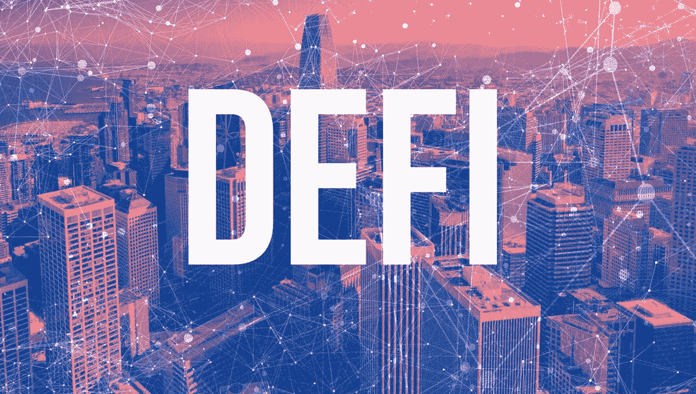
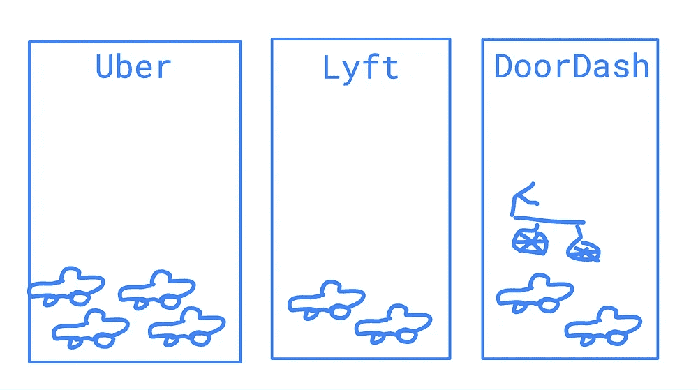
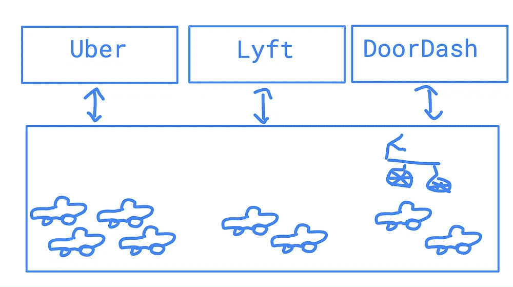
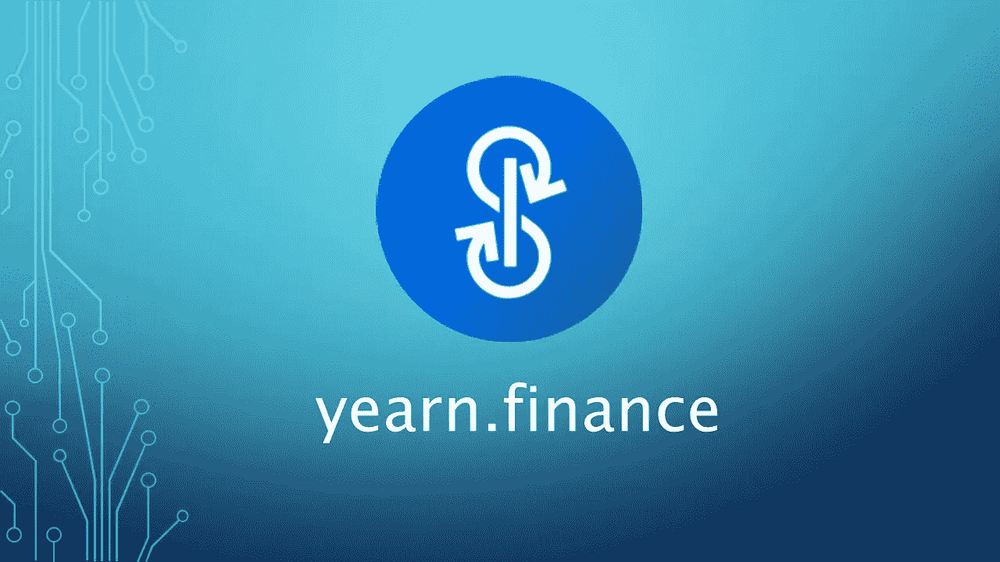

# DeFi 的真正力量:可组合性

> 原文：<https://medium.com/coinmonks/the-true-power-of-defi-composability-14fe8355e0d0?source=collection_archive---------0----------------------->

## 为什么像 DeFi 这样的开放金融平台会创造一个我们从未见过的金融新世界

Source: [Forbes](https://www.forbes.com/sites/investor/2020/08/14/defi-welcome-to-the-crypto-revolution/)

和往常一样，这篇文章是为教育目的而写的。这既不构成财务建议，也不构成交易建议。过去的表现并不代表未来的结果。

*不要投资超过你能承受的损失。这不是财务建议；总是自己做研究:)*

调查 100 名密码爱好者，关于 DeFi 最有趣和最引人注目的部分是什么，你会得到大量的答案。

有些人会说去中心化——废话。我们正在重新想象没有任何中介的金融系统，摆脱对第三方拥有我们的数据和资金的依赖。

有人会说它是全球性的。由于缺乏中介，我们可以自由地向世界上的任何人汇款，也可以从世界上的任何人那里收款——创造了一个真正的全球经济，这是互联网在近 50 年前所想象的。

**对我来说，最有趣的事情是分散式金融应用的可组合性。**

可组合性。我在我的几篇博文中多次提到这个词。现在是时候花些时间去挖掘它的含义了。

这是来自维基百科的定义:

> 可组合性是一个系统设计原则，它处理组件之间的相互关系。高度可组合的系统提供了可以以各种组合来选择和组装的组件，以满足特定的用户需求。

用技术语言来说有点晦涩，但是可组合系统是由可以相互操作的部分组成的系统。

另一个大词“对不起”——可以在不同系统之间公开通信的部件，因此可以换进换出。

所以基本上是乐高。

在 DeFi 中，可组合性是应用程序和协议以一种无权限的方式相互交互的能力——这意味着它们不断地相互对话，并利用彼此的代码，从而利用彼此的效用。

由于 DeFi 的开源性质，这些应用程序相互利用，产生协同效应。

**应用程序可以组合并形成从未被认为可能的新形式的金融服务。**

基于我们的乐高类比，DeFi 应用程序本质上是金钱乐高。

您可以挑选哪个 DeFi 应用程序组合在一起，形成一个全新的金融产品。

正因为如此，以太坊通常被称为[无限机器](https://www.coindesk.com/ethereum-building-internet-of-value)——因为它是一张空白的画布，具有无限的可能性，因为 DeFi 应用程序可以组合。

# 开放的力量

在我们深入到 DeFi 的可组合性之前，我想简单地谈谈为什么开放是如此强大。

想想我们现在生活的世界，它大部分是由带有“围墙花园”思维的网络 2 公司建造的。

这些公司——谷歌、Facebooks、paypal——努力争取你的关注。他们投入数十亿美元让你在他们的平台上注册，所以他们不会这么轻易放你走。

他们建立了一个完整的应用生态系统，让你留在他们的网络中。

你想寄钱吗？使用 Venmo—您所有的朋友都在这里。哦，顺便说一下，你不能向我们封闭网络之外的人汇款，所以没有现金应用程序或 Zelles。只要告诉你的朋友加入贝宝！顺便说一下，我们还为您提供许多其他服务。

你想分享一个迷因吗？在 Instagram 上这么做太容易了——只需 DM 你的好友！如果他们不是 Instagram，就告诉他们加入。否则，你将不得不截屏这个迷因，并将其发送到其他地方。

每一个新的社交媒体平台都是一个全新的社交图谱。您不能将您的关注者和关系带到另一个应用程序。

每一个新的市场都是一个新的冷启动问题，寻找大量的买家和卖家。

因为一切都被封闭了。没有人愿意分享他们的用户。

现在想象一下如果事情是开放的。你可以把 TikToks 发给你的 Instagram 好友。你可以在人们选择的任何钱包上，用任何货币，通过任何网络支付。

抛开软件，想象一下——不再是优步和 Lyft 有各自的司机，DoorDash 和 Postmates 有各自的送货员——而是有一个从 A 点到 B 点的全球人才库，应用程序可以将从 A 点到 B 点的产品放在这个全球运输库中，竞标最佳价格。

Fragmented Web2 (left) vs. open, interoperable Web3 (right)

这在 Web2 社交媒体平台的早期起到了一定的作用。

我们和朋友们以及 Farmville 一起玩文字游戏，我们所有的脸书朋友都在那里。你可以在 Twitter 上分享这些游戏的瞬间，你甚至可以在 Twitter 上分享 Instagram 照片。

可以在任何地方交互操作的内容和朋友的全球提要。

然后，脸书意识到，他们最好通过向受控制的用户群投放广告来赚钱，并关闭了他们的 API——阻止其他应用利用其丰富的社交图。

让我们换一种方式来描述它。想象一下，如果像 GPS 这样的开放网络是由私人网络公司建立的。你的 iPhone 可以从苹果卫星上获得 GPS，但它的覆盖范围会根据你每月的手机计划而有所不同。每个公司都有自己的 GPS，只适用于自己的产品。

# DeFi 是开放金融

DeFi 的美妙之处在于新一批疯狂的应用程序，它们将多个应用程序整合成一个全新的、前所未见的金融产品。

比如[向往](http://yearn.finance)。

向往是一款汽车投资产品。人们把钱放在渴望收益的地方。在后端，渴望使用这个投资组合，并把它们放入其他 DeFi 协议，以产生收益。

“渴望”将资金放入像“复合”这样的贷款协议，像 Sushiswap 或 Curve 这样的流动性池。它本质上抽象了这些其他金融产品的投资和最优再平衡。

Alchemix 建立在渴望之上。它将资金投入到渴望获得收益，当资本获得收益时，Alchemix 允许人们以分配的资本作为抵押贷款，而不是偿还贷款，Alchemix 使用渴望的收益来偿还本金+利息。

震惊了。

[丝带金融](https://ribbon.finance/)怎么样？

它的 Theta Vault 采用有担保的买入策略。通常在备兑买入中，你必须持有标的资产——除了持有之外，别无他法。

有了 Ribbon，它的金库还可以借出另一种协议(如 Compound)的基础抵押品，并产生收益。因此，你在买入期权，并在基础资产上产生贷款收益率🤯🤯

所以同样的资产收益翻倍。难怪 DeFi 能产生高达 100%以上的年收益率。

因为可组合性，有太多荒谬可怕的策略可以用 DeFi 实现。

用代币做赌注，然后用这些抵押品来获得贷款。增加一个指数的流动性，并使用该流动性投资另一个协议以赚取收益。

借出一个代币，再取出同样的代币作为贷款，基本上是增加了你获得资本的途径。

**同一基础资产的倍增收益率。相当疯狂的东西。**

每天都会出现越来越多的用例。这就是可组合性的力量——成千上万疯狂聪明的开发人员可以无限地进行创新。

如果你认为这篇博文值得你花 5 分钟来阅读，请在下面鼓掌(最多 50 次)或者与一个会从这篇内容中受益的朋友分享。非常感谢！

> 加入 [Coinmonks Telegram group](https://t.me/joinchat/uiLERCQL1fQ5ZjA1) 并了解加密交易和投资

## 另外，阅读

*   [什么是融资融券交易](https://blog.coincodecap.com/margin-trading) | [成本平均法](https://blog.coincodecap.com/dca)
*   最好的[加密交易机器人](/coinmonks/crypto-trading-bot-c2ffce8acb2a) | [网格交易机器人](https://blog.coincodecap.com/grid-trading)
*   [3 商业评论](/coinmonks/3commas-review-an-excellent-crypto-trading-bot-2020-1313a58bec92) | [Pionex 评论](/coinmonks/pionex-review-exchange-with-crypto-trading-bot-1e459d0191ea) | [Coinrule 评论](/coinmonks/coinrule-review-2021-a-beginner-friendly-crypto-trading-bot-daf0504848ba)
*   [AAX 交易所评论](/coinmonks/aax-exchange-review-2021-67c5ea09330c) | [德里比特评论](/coinmonks/deribit-review-options-fees-apis-and-testnet-2ca16c4bbdb2) | [FTX 交易所评论](/coinmonks/ftx-crypto-exchange-review-53664ac1198f)
*   [n 平均零点评审](/coinmonks/ngrave-zero-review-c465cf8307fc) | [Phemex 评审](/coinmonks/phemex-review-4cfba0b49e28) | [PrimeXBT 评审](/coinmonks/primexbt-review-88e0815be858)
*   [by bit Exchange Review](/coinmonks/bybit-exchange-review-dbd570019b71)|[bit yard Review](/coinmonks/bityard-review-7d104239be35)|[coin spot Review](https://blog.coincodecap.com/coinspot-review)
*   [3 commas vs crypto hopper](/coinmonks/3commas-vs-pionex-vs-cryptohopper-best-crypto-bot-6a98d2baa203)|[赚取秘密利息](/coinmonks/earn-crypto-interest-b10b810fdda3)
*   最好的比特币[硬件钱包](/coinmonks/the-best-cryptocurrency-hardware-wallets-of-2020-e28b1c124069?source=friends_link&sk=324dd9ff8556ab578d71e7ad7658ad7c) | [BitBox02 回顾](/coinmonks/bitbox02-review-your-swiss-bitcoin-hardware-wallet-c36c88fff29)
*   [莱杰 vs n rave](/coinmonks/ledger-vs-ngrave-zero-7e40f0c1d694)|[莱杰 nano s vs x](/coinmonks/ledger-nano-s-vs-x-battery-hardware-price-storage-59a6663fe3b0) | [币安评论](/coinmonks/binance-review-ee10d3bf3b6e)
*   [加密复制交易平台](/coinmonks/top-10-crypto-copy-trading-platforms-for-beginners-d0c37c7d698c) | [Coinmama 评论](/coinmonks/coinmama-review-ace5641bde6e)
*   [CoinLoan 评论](/coinmonks/coinloan-review-18128b9badc4) | [YouHodler 评论](/coinmonks/youhodler-4-easy-ways-to-make-money-98969b9689f2) | [BlockFi 评论](/coinmonks/blockfi-review-53096053c097)
*   最好的[加密税务软件](/coinmonks/best-crypto-tax-tool-for-my-money-72d4b430816b) | [硬币追踪评论](/coinmonks/cointracking-review-a-reliable-cryptocurrency-tax-software-5114e3eb5737)
*   最佳[密码借贷平台](/coinmonks/top-5-crypto-lending-platforms-in-2020-that-you-need-to-know-a1b675cec3fa) | [杠杆令牌](/coinmonks/leveraged-token-3f5257808b22)
*   [block fi vs Celsius](/coinmonks/blockfi-vs-celsius-vs-hodlnaut-8a1cc8c26630)|[Hodlnaut 审核](/coinmonks/hodlnaut-review-best-way-to-hodl-is-to-earn-interest-on-your-bitcoin-6658a8c19edf) | [KuCoin 审核](https://blog.coincodecap.com/kucoin-review)
*   [Bitsgap 审查](/coinmonks/bitsgap-review-a-crypto-trading-bot-that-makes-easy-money-a5d88a336df2) | [Quadency 审查](/coinmonks/quadency-review-a-crypto-trading-automation-platform-3068eaa374e1) | [Bitbns 审查](/coinmonks/bitbns-review-38256a07e161)
*   [埃利帕尔泰坦评论](/coinmonks/ellipal-titan-review-85e9071dd029) | [赛克斯斯通评论](/coinmonks/secux-stone-hardware-wallet-review-15-discount-coupon-2020-7577032faa6e)
*   [本地比特币评论](/coinmonks/localbitcoins-review-6cc001c6ed56) | [加密货币储蓄账户](https://blog.coincodecap.com/cryptocurrency-savings-accounts)
*   最佳[区块链分析](https://bitquery.io/blog/best-blockchain-analysis-tools-and-software)工具| [赚比特币](/coinmonks/earn-bitcoin-6e8bd3c592d9)
*   [加密套利](/coinmonks/crypto-arbitrage-guide-how-to-make-money-as-a-beginner-62bfe5c868f6)指南| [如何做空比特币](/coinmonks/how-to-short-bitcoin-568a2d0b4ae5)
*   最佳[加密制图工具](/coinmonks/what-are-the-best-charting-platforms-for-cryptocurrency-trading-85aade584d80) | [最佳加密交易所](/coinmonks/crypto-exchange-dd2f9d6f3769)
*   [如何在印度购买比特币？](/coinmonks/buy-bitcoin-in-india-feb50ddfef94) | [瓦济克斯评论](/coinmonks/wazirx-review-5c811b074f5b)
*   [印度比特币交易所](/coinmonks/bitcoin-exchange-in-india-7f1fe79715c9) | [比特币储蓄账户](/coinmonks/bitcoin-savings-account-e65b13f92451)
*   [CoinDCX 点评](/coinmonks/coindcx-review-8444db3621a2) | [加密保证金交易交易所](https://blog.coincodecap.com/crypto-margin-trading-exchanges)