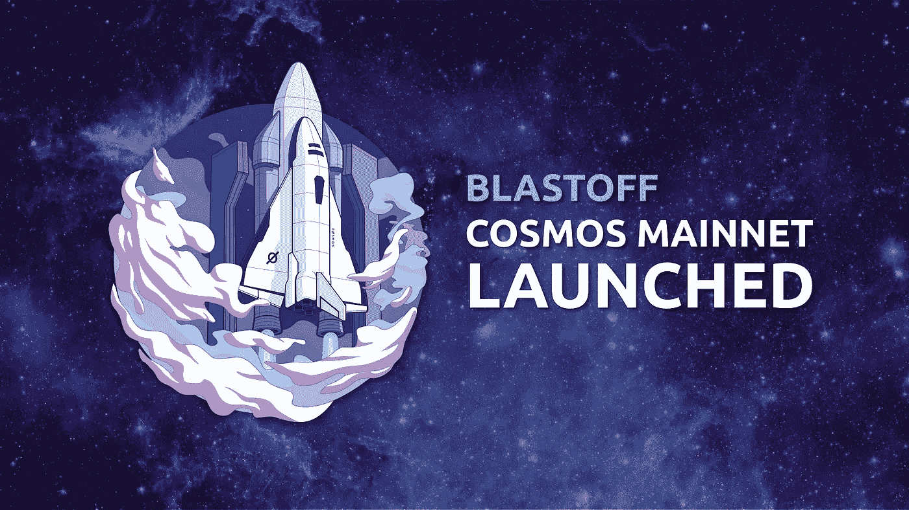
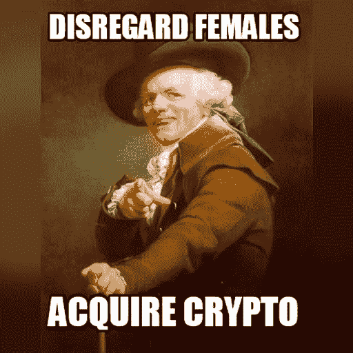
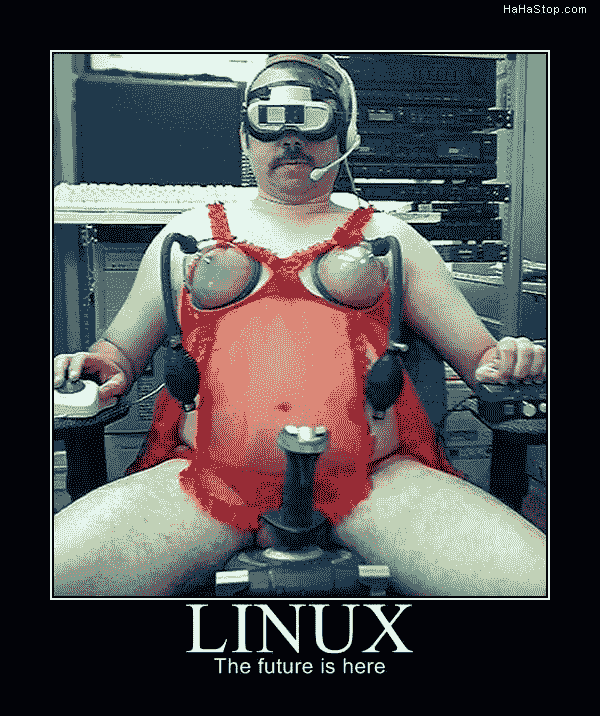
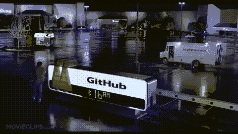
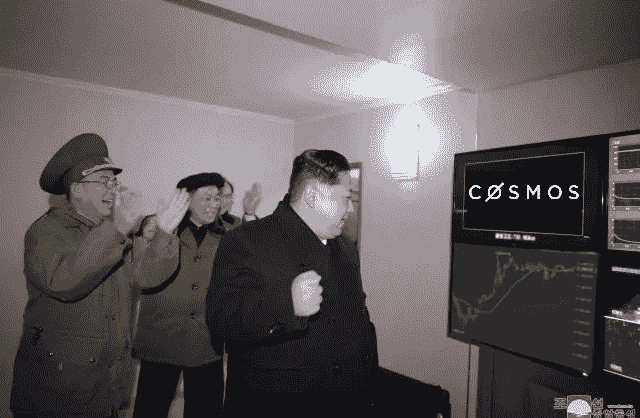
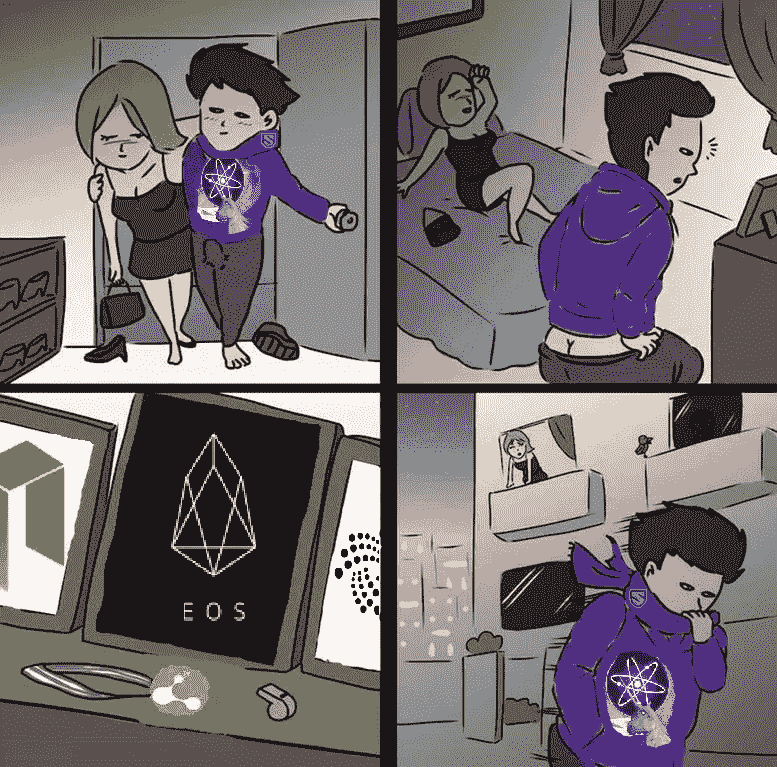
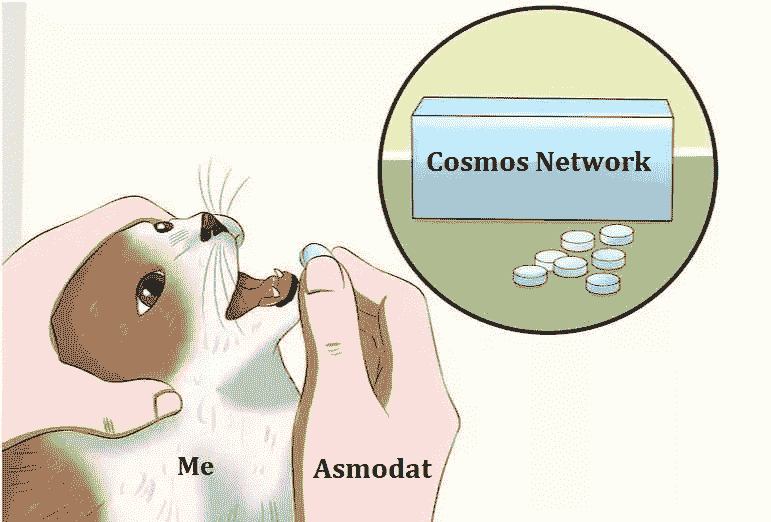

# 真正白痴的终极宇宙代表团指南

> 原文：<https://medium.com/coinmonks/the-ultimate-cosmos-delegation-guide-for-real-idiots-87ebc6518145?source=collection_archive---------0----------------------->



Phew! If I didn’t know better, I would have thought this an AAA space game.



Cosmos 的第一个中心已经启动，这意味着原子现在可以被委托，因为几天甚至是可转移的，这意味着许多人会问自己“我如何委托我新获得的货币来获得一些利息？”。

这篇文章由 3 部分组成，A)我将做一个简短的介绍，并尝试用糟糕的笑话和相关的意象来降低格调。b)我将尝试解释如何为委托选择正确的验证器，C)我将给出一个如何委托的明确指导。对于大多数读者来说，这不会是一个有趣的部分，因为它更容易与莱杰纳米和大多数人会走这条路有足够的教程存在。但对于其他一些人来说，学习如何使用 Cosmos 进行离线交易签名是有意义的。



A typical Cosmos validator in preparation of uploading his consciousness to the cloud.

**A)** 由于我们并不都是迫不及待地最终将自己的意识上传到云端的 Linux 专家，所以我们会被题目的复杂程度弄得不知所措。这就是为什么我试着为真正的白痴写这个指南。

要理解委托，首先应该理解宇宙。一年多前我写了一篇关于这个的文章( [Cosmos / Tendermint 为真正的白痴解释](/coinmonks/cosmos-tendermint-explained-for-real-idiots-ab4305cbb41))，这可能是一个很好的条目。否则，如果你明白为什么宇宙，让我们想想为什么委托？授权者的主要任务是在验证者之间分配投票权。这使得 Cosmos 去中心化。不仅仅是 100 个验证者在做他们的事情，所有其他的原子持有者也可以参与共识，但不是通过运行服务器，而是通过控制验证者。因此，最重要的是明智地选择验证者，如果他们表现不佳，就从他们手中收回股份。装坏有不同的颜色和力度。最糟糕的是双重签名，本质上是企图偷钱，不太糟糕的是离线和不参与共识，也有错过的块，这不是最佳的，但它可以偶尔发生，但如果验证器没有错过块，这是一个好迹象。不同颜色的是验证器的行为。双签名和错过的块是由网络自动测量的，是非常透明的，让我们称之为硬搞砸了。行为方面的事情，让我们称之为软失误，主要是如果生态系统中的验证者的行动和决定，而这不是由网络自动测量的。一个极端的例子是建立卡特尔。例如，如果最大的 3 个验证器联合起来，可以停止网络。这对生态系统非常不利，但是这三个验证器可以解决这个问题。例如，他们可以做空原子，停止网络运行，等到价格暴跌时卖出卖空股票。授权者的工作是从这些人那里拿走授权，并支持所有其他人，这样他们就会失去投票权，直到他们再也不能形成卡特尔。另一件事可能是他们阻碍了新软件的开发和升级，因为这对他们没有好处，尽管这对整个生态系统是有益的。一个典型的例子是比特币矿工，他们不想有更大的块大小，以保持较高的交易费用。因此，有许多可能的情况，授权者的工作是检测它们并增强透明度。这就是为什么 Cosmos 中的去中心化超过 100 个验证器。



Live footage of the cosmos launch on March 13th

那么，一个人如何成为授权者呢？如果你是一个 Atom 持有者，你所要做的就是将你的 Atom 委托给一个或多个验证器。如果你不是原子持有者，你必须事先获得原子(像往常一样，这不是投资建议，要注意南海泡沫，等等。).委托意味着你的原子在 3 周内不能被转移，但是你可以立即重新委托给其他验证者。因此，如果你是日内交易者，或者计划很快卖掉你的原子，那么授权是没有意义的，但是如果你想 HODL，授权是显而易见的。但是授权有什么好处呢？首先，你可以在 Cosmos hub 上对治理提案进行投票，这很好，因为每个人都喜欢发表意见。但最好的部分是，随着时间的推移，你会收到原子。这种兴趣、回报或膨胀极大地刺激了委派和运行验证器，这也是我们想要长期委派的原因。那么这些免费的钱是如何运作的呢？它由两部分组成，第一部分是每年的通货膨胀，第二部分是交易费用。听起来像比特币，是的，它是相似的，但对于比特币来说，每年的通货膨胀越来越少，直到只剩下费用。但是为了便于类比，在 PoS 系统中下注硬币(委托)就像在 PoW 系统中采矿一样。当然有区别，首先，你不能把你的赌注用在其他硬币上，这在很多情况下对矿工有效。你不能只生产更多像 GPU 这样的矿工，你必须从其他持有者那里购买原子来增加你的“采矿”能力。作为委托人，你不需要任何技术知识，只有验证者需要。好吧，你也可以投资一个矿业基金，那么你也不需要技术知识，但你支付的保费往往是荒谬的。然而，本文不是关于比较功率和位置，这可能是另一个故事的有趣主题。



Of all successful communist countries the most successful of them has a very successful leader who appreciates successful crypto projects like Cosmos.

因此，让我们来看看这两个部分，首先是费用，这很容易解释:每当有人发送交易时，必须支付一笔费用，这笔费用给所有的赌注者。如果你参与了创建新区块的过程，那么你将获得与你的股份成比例的费用份额。委托人和验证人都参与了这个过程。这是否意味着验证器通过运行节点来完成所有的工作，而删除器仍然得到相同的结果？嗯，不，是有佣金的，是由验证者收取的。根据您选择的验证者，验证者将获得您奖励的一部分，例如 10%。我们将在本文中非常广泛地讨论这个委托。因此，费用很容易解释，但很难预测，因为没有人知道在接下来的几个月里会有多少交易被发送到 Cosmos hub。通货膨胀的情况不同。目标通货膨胀率为每年 7%。这是不是意味着你可以得到 7%的股份？不。这是一个目标值，当 66.6%或更多的原子被标桩时就达到了。有很好的理由，为什么宇宙网络希望有 66%的原子被锁定，但这不是本文的目的来解释拜占庭容错。为此，最好读一下我在顶部链接的介绍性文章。因此，万一有少于 66%的原子被堆叠，那么膨胀就会上升，最多到 21%。然而，从长远来看，我们应该期望有 66%的股份。这里带回家的信息是:7%的通货膨胀将是我们在未来看到的。但是有一些重要的事情:膨胀是关于所有的原子，不仅仅是有桩的硬币，还有未粘结的原子都是膨胀的。与桩原子相反，来自未键合原子的膨胀原子不是给它们的持有者，而是给其他桩原子。因此，即使 66.6%被押下，通货膨胀率为 7%，那么押下的原子的利息也不是 7%，因为有 33.3%的原子没有被押下，但给了押下者通货膨胀的原子。这意味着在 66.6%时，押在原子上的利率是 10.5%，也就是 7% + 3.5%，66.6%的通货膨胀，加上其余 33.3%的通货膨胀。我试图用措词来保持它的清晰，但是在这个例子中这并不容易。所以膨胀是原子如何随着时间变得更多，而利息是你实际上从成键原子中得到的。在宇宙中，对于成键/成桩原子来说，利息总是高于膨胀。永远不会有所有的原子被堆叠，所以 7%更像是下限，而不是预期值。下一个例子，让我们假设 50%的原子被押下，那么通货膨胀率是 10.5%，因为 66%押下的目标没有达到，通货膨胀率增加，高于 7%。此外，一半的原子是堆叠的，另一半是未结合的，这使得膨胀从这些未结合的原子到堆叠原子的持有者。这使得每个键合原子的净利率为 21%。好消息是，事情变得更加复杂了。这样的情况下你会得到 21%吗？不，不是作为委托人，因为你必须委托给验证人，这些费用是佣金。如果他们收 10%，你得到 18.9%的净利息，如果他们只收 5%，你得到 19.95%。但也有验证者，他们不收取佣金，然后你得到全额。是不是说 1 年后你多了 21%的收入？嗯，除非验证器没有被砍。Slashing 是一种机制，在这种机制中，验证者会因为不良行为而受到惩罚，而委托者也会受到惩罚，但不会太重。这是驱使授权者挑选运行稳定服务器的好的验证者的机制。不要太害怕，网络运行一个多月了，还没有发生砍杀。所以这不会是经常发生的事件。



A rather typical experience for Atom hodlers

几乎疯了？没那么快，变得更复杂了！好，如果验证器没有双重签名，没有被监禁，等等。，那么 1 年后我有这个例子的 21%？是的，但是也有复利这个甜蜜的概念。当这一年还在继续的时候，你可以在获得奖励后将奖励债券化，获得复利。你说复利？更 gainzzzz？是的，但是你不能每两分钟做一次，因为分配你的奖励需要一些小费用。同样，如果你每天或每周做一次也不会有太大的变化。但好消息是，这些都是让事情变得复杂的因素，现在我们可以开始把所有的碎片放在一起。首先，有一个总的膨胀率，你不能真正改变它，它取决于成键原子和未成键原子的总比例。当然，这影响了我们的决定，无论我们是想委托原子，交易还是摆脱它们。但是一旦我们决定授权，就不再有什么能改变我们的决定。所以万一这句话之前的整段话让你觉得“见鬼，什么叉子？我不知道这对我来说是不是太复杂了”，那么不要担心，这主要是为了那些好奇想知道的人，当你想获得回报时，你不需要用心去了解。接下来是唯一真正重要的事情。所以问题是，你想选择哪个验证器来委托呢？一些验证者有很高的佣金，一些有很低的佣金，在这里我们对我们的决定有真正的影响力。佣金越低，我们从委托原子中得到的好处越多，但是还有其他事情要考虑，这些事情通常是相互排斥的。接下来是验证器的自结合原子。原则上，您希望在这里选择一个较高的值，因为这意味着验证器会有很多损失。如果有人自己将价值 1000 万美元的原子委托给他的验证节点，那么很明显，花费 1 万美元用于安全性是显而易见的。如果你自我绑定了价值 5000 美元的原子，那么有人可能不会为它的安全性花费 10000 美元。道理很简单，你失去的越多，你就越需要投资来保护你的系统。因为如果你搞砸了，你会失去你的原子。有点类似的是验证者的记录，赌注游戏的赢家显然比你从未听说过的验证者有更好的记录。因此，我们可以清楚地看到，人们必须在安全性和盈利性之间找到平衡。仅仅为了避免佣金而选择一个绑定了 1 个原子的验证器，并且没有证据证明该节点是安全的，这是没有意义的。让我们假设净利率是 10%，那么在 0%佣金的 1 年后，我们有之前的 110%，但因为我们选择了最不安全的验证器，它被削减了 2 次，例如 1%，那么 1 年后我们有 107.8%。相比之下，另一个验证者可能收取 10%的佣金，但没有被削减，那么我们在 1 年后有 109%，所以这在经济上更有意义，即使我们支付佣金。但这些只是例子。没有人知道坏的验证器多久会被砍掉一次，以及什么在经济上有意义。但为了更好地理解，让我们举几个例子:

**a)** [**原子桑德勒**](https://www.mintscan.io/validators/cosmosvaloper1cql9ska0xl2rkg6gcv0np4333gn6fygs55asrs)这是一个高佣金(25%)、高自结合(~450k 原子)、无跟踪记录验证器的例子。坦白地说，Atom Sandler 这个名字很有趣，因此人们应该将一些原子委托给这个验证器。但是然后佣金真的很高，所以要看，你怎么评价这个伟大的名字。

**b)** 这里我们可以看到，我们得到了相同的特征，但是佣金低得多，而且没有双关语

**(c)**[**BouBouNode**](https://www.mintscan.io/validators/cosmosvaloper1eh5mwu044gd5ntkkc2xgfg8247mgc56fz4sdg3)这里我们有另一个对比，这个验证器的佣金也很低(6.1%)，但它几乎没有任何风险，只有 2700 个原子，更有趣的是，它声称由人工智能运行，人们不应该信任人类。当一个人点击他们已经关闭一个月的网站时，这个笑话变得更有趣了。

**d)**[**cert us One**](https://www.mintscan.io/validators/cosmosvaloper1qwl879nx9t6kef4supyazayf7vjhennyh568ys)这个拥有巨大的委托(8.7M)，即使自委托相当低(55k)。此外，12.5%的佣金并不算低，所以人们可能会问自己，为什么他们有这么多代表团？答案是跟踪记录。Certus One 的两个家伙对于宇宙基础设施就像波格丹诺夫对于比特币价格一样。他们是阿尔法和欧米加。如果他们进入一个房间，每台电脑都会识别他们的存在，并开始振动和发出明亮的光。我这是什么意思？他们赢得了赌注游戏，他们关于如何运行宇宙验证器的指导是最好的。这意味着许多人认为它们提供了最好的安全性。


Please, of all the things you can do with your money, please delegate your money to this person. This is not investment advice, but do it!

**e)** [**锡卡**](https://www.mintscan.io/validators/cosmosvaloper1ey69r37gfxvxg62sh4r0ktpuc46pzjrm873ae8)
这里我们有所有极端中的最后一个。非常低的自我委托(28k)，非常高的委托(4.7M)和 0%的最低佣金。因此，这可能是其中一个例子，佣金很低，对验证者来说，没有那么多损失…然而天气晴朗，见上图，他是宇宙研究人员之一，所以，像许多疯狂的科学家一样，他是绝对值得信赖的。此外，他认为以太坊经典是真正的交易。老实说，我已经把我所有的钱委托给他了。

所以我希望我能在这里把事情说得更清楚一点。没有最佳选择，每个验证器都有自己的特点。然而，大多数人都想选择最安全的验证器，这样他们就不会损失任何钱。这是聪明的，有意义的，因为加密是易变的，我们不需要额外的风险。然而，有一种普遍的误解，认为只有一个最好的验证器可以安全地委托。安全委托的最佳验证器是所有的验证器。如果你把钱分散到所有的验证者身上，风险是最低的。也许可以去掉 1 个原子作为自我委托，但是如果你分布在许多验证器中，那么丢失所有原子的风险是不存在的。请记住，如果 33%的验证器出错，这个链就会停止。所以如果你想绝对安全，那就尽量分。如果你想有一个很低的佣金，在那些低佣金的人之间分配。如果你想帮助网络去中心化，也可以在许多人之间分配。不幸的是，这比一次点击需要更多的工作，但是的，请节省 10 分钟，当投资…


This is basically how the world works in a single image.

我现在试着总结一下这篇文章最重要的部分:

1.  你得到费用和膨胀的原子。这很复杂，我们无法真正影响它，但如果我们入股，每年 7%是有保证的，9%是可能的。
2.  我们可以影响验证器的选择，从而得到我们的委托。多样化是安全的，低佣金带来高收益，高自我授权和良好的跟踪记录是很好的验证。自己做研究。不要阅读给你建议和他们自己的秘密验证的过长的文章。嗅嗅验证器的屁股。如果他们闻起来不错，委派。不，说真的，不要嗅烟蒂，但也许可以和每个验证者共进晚餐，然后做出你的决定，或者只是因为有太多的选择而抓狂。这不是投资建议。我已经说过了吗？现在这很重要，我不住在美国，我不知道我是否有必要这么说，但是请把你的钱委托给西卡，他很好。这不是投资建议。


This gif speaks for itself.

现在我来看最后一部分，在这一部分，我会试着解释如何通过离线和在线的电脑来授权，这样你的密钥就永远不会暴露。你也可以使用这种技术来发送和接收你的原子，你也可以在线投票。您所要做的就是在步骤 6 中更改命令。所以现在我将展示我如何使用离线和在线计算机进行委托，其中我的私钥从不离开离线计算机。这是一个非常特殊的解决方案。如果你有一个账本 Nano，那么使用它会容易得多，并遵循如何使用账本 Nano 的指南( [*如何在账本上存储你的宇宙原子，并通过命令行*](/cryptium-cosmos/how-to-store-your-cosmos-atoms-on-your-ledger-and-delegate-with-the-command-line-929eb29705f) )进行委托。然而，有些人不想买一个分类账，必须处理许多帐户或希望能够编程代码，这是不可能通过图形用户界面(GUI)。对我来说，这甚至更有意义，因为我从事一个使用 cosmos-sdk 的项目，无论如何非常了解 CLI 是很重要的。所以如果你想走脏手的路线，它来了。这个命令行界面(CLI)如何工作的最佳来源是[https://cosmos . network/docs/cosmos-hub/delegator-guide-CLI . html](https://cosmos.network/docs/cosmos-hub/delegator-guide-cli.html)。

**明确的内容(这是指明确的指示，而不是你所想的):**

**第一步**
安装 Linux。我在生活中使用过几个 Linux 发行版，并且在 3 个不同的发行版上使用过 Cosmos，但是我不是 Linux 专家(识别一个人不是 Linux 专家的最安全的方法是如果他自称是 Linux 专家，这就像量子力学，如果你认为你理解它，那么你就不理解)。对我来说，这不是一个宗教，所以我不在乎，我只是想要一个工作的操作系统。对于许多尖端的 IT 软件项目来说，Linux 是唯一有效的操作系统，这也适用于 Cosmos。所以弄 Linux，从我试过的来看，Antergos 是最简单的。你也可以使用 Ubuntu，这需要更多的设置工作。在这种情况下，我更喜欢 Antergos，因为它安装 Arch Linux 简单快捷。你所需要做的就是用 [*蚀刻机*](https://antergos.com/try-it) 把活的 ISO 刻录到 u 盘上，然后安装到你要用的磁盘上。在我们的例子中，我们需要两个磁盘，一个用于从不接触互联网的计算机，另一个用于广播消息的计算机。作为桌面管理员，我选择 XFCE，但是你也可以选择 Gnome，KDE 或者任何你喜欢的。安装 Antergos 并启动后，你唯一要安装的就是 Go。只需使用 Antergos 自带的添加/删除软件程序，安装 Go 即可。如果你决定使用其他发行版，比如 Ubuntu，那么你需要检查 go 版本是否是最新的，通常不是，对于 Cosmos，你需要找到包含最新 Go 版本的库。
*更新*本文发布后不久，Antergos 就停产了。所以在这里你可以看到我是一个多么专业的 Linux 专家。然而，我尝试了同样的指示与曼哈罗和它的工作。所以建议用 Manjaro 代替 Antergos。

**第二步
安装 Cosmos。我们遵循本指南的[*，*](https://cosmos.network/docs/cosmos-hub/installation.html)*但是我们必须将 bash_profile 更改为 bashrc，因此命令更改为:***

```
*mkdir -p $HOME/go/bin
echo "export GOPATH=$HOME/go" >> ~/.bashrc
source ~/.bashrc
echo "export GOBIN=$GOPATH/bin" >> ~/.bashrc
source ~/.bashrc
echo "export PATH=$PATH:$GOBIN" >> ~/.bashrc
echo "export GO111MODULE=on" >> ~/.bashrc
source ~/.bashrc*
```

*之后，我们运行 cosmos 特定的命令:*

```
*mkdir -p $GOPATH/src/github.com/cosmos
cd $GOPATH/src/github.com/cosmos
git clone [https://github.com/cosmos/gaia.git](https://github.com/cosmos/gaia.git)
cd gaia && git checkout master
make install*
```

*最后，检查版本是否正确显示:*

```
*$ gaiad version --long
$ gaiacli version --long*
```

*在这里你应该看到当前的 cosmos 版本，这取决于你什么时候看这篇文档，目前(2019 年 4 月)cosmos-sdk: 0.34。现在我们已经安装了宇宙。太好了。*

**

*This boy signs all his transactions offline.*

***第三步
配置 Cosmos。现在我们需要设置 Cosmos，以便它连接到 Cosmos hub。只是为了澄清:宇宙是区块链的网络，它的第一个枢纽是宇宙枢纽，那里有我们想要委派的原子。现在，我们既可以设置自己的节点，也可以连接到另一个节点，后者更简单，符合我们的目的:***

```
*gaiacli config node [https://cosmos.chorus.one:26657](https://cosmos.chorus.one:26657/)*
```

*我们还需要将信任节点设置为 true，并指定 cosmos hub 的 chain-id:*

```
*gaiacli config trust-node true
gaiacli config chain-id cosmoshub-3*
```

*然后，我们可以使用以下命令测试配置:*

```
*gaiacli query staking validators*
```

*如果一切顺利，应该会出现一个验证器列表。如果这不起作用，最有可能的是 cosmos.chorus.one 地址不再有效，你应该谷歌一下 Cosmos hub 的公共节点。*

***第四步** 获取宇宙账号。您可以在脱机计算机上执行此操作。所以你必须重复第一步和第二步。步骤 3 是不必要的，因为没有互联网。一旦我们在离线计算机上安装了 cosmos-sdk，我们就断开它与互联网的连接，并输入以下命令:*

```
*gaiacli keys add horst*
```

*现在我们必须指定一个密码，该密码仅用于在这台脱机计算机上本地存储密钥。接下来是重要的部分，24 个单词的助记符和地址。助记符是你宇宙地址的秘密。别弄丢了。事情就是这样。传输时请保持加密。无论何时你想转到这个地址都需要这个地址。我们应该注意到它，并将其传输到在线计算机。*

***第五步**转移你的原子。在这一步中，我们需要将原子转移到离线生成的地址。无论你在哪里，把它发送到你在第四步中记下的地址，它将是类似于 cosmos1abcde123…*

***第六步**
生成交易。在这一步中，我们生成委托事务。为简单起见，我们将该地址称为 cosmos1abcde123，我们选择的验证器是 cosmosvaloper1xyz。我们在联机计算机上输入以下命令:*

```
*gaiacli tx staking delegate cosmosvaloper1xyz 1000000uatom --from cosmos1abcde123 --gas auto --gas-prices 0.025uatom --gas-adjustment 1.5 --generate-only > unsignedBond.json*
```

**

*A dog doing research for you. That’s why you should do your own research (DYOR)*

*gaiacli 是我们已经安装的程序，其余的都是参数。tx staking delegate 是一个特定的命令，它需要两个参数，一个是获得委托的验证器，另一个是要委托的数量。在本例中，我们指定了 1 个 atom = 1000000utaom。在此之后，标记将会出现，from 是您自己的地址，gas auto，gas-prices 0.025 和 gas-adjustment 1.5，以便完成交易并支付足够的费用。— generate-only 表示只生成事务，不签名，不广播。> unsignedBond.json 是最后一部分，它不是特定于 Cosmos 的，而是特定于 Linux 的，它将结果写入给定的文件。因此，事务保存在 unsignedBond.json 中。另外，我们希望通过输入以下命令找到我们在脱机计算机上需要的两个参数*

```
*gaiacli query account cosmos1abcde123*
```

*我们将得到一个带有 sequence 的响应，它应该是 0，因为这个帐户和帐号没有进行过任何交易，这个帐号是我们需要注意的一个数字，为了简单起见，我们假设是 1337。*

***第七步**
签约交易。我们将 unsignedBond.json 转移到脱机计算机上。如果你的妄想症很严重，那么你可以通过铅笔来传输，但是如果你能控制你内心的恶魔，u 盘也很好。传输完文件后，我们输入*

```
*gaiacli tx sign unsignedBond.json --from horst --offline --chain-id cosmoshub-2 --sequence 0 --account-number 1337 > signedTx.json*
```

*将来，每当我们签署下一条消息时，序列将增加 1，并且该帐户的帐号将始终保持不变。如果你得到的签名验证失败，那么在大多数情况下 cosmoshub-2 是错误的，序列或帐号。我们还必须输入我们为 horst 指定的密码。再次> signedTx.json 将结果写入这个 json 文件。*

***第八步** 广播交易。这是最后一部分，我们将 signedTx.json 从离线计算机转移到在线计算机并输入*

```
*gaiacli tx broadcast signedTx.json*
```

*这是最后一步，要么成功了，我们可以在 mintscan，hubble，stargazer 或类似的东西上看到交易，要么在大多数情况下气体会太低，然后我们必须重新开始，增加序列，提供更多的气体，离线签名并再次广播。如果成功了，恭喜你，你成功了。*

*如果你读到这一行，我给你互联网特别关注奖。有一次我读到一篇文章，解释了如何成为一个成功的媒体文章作者。最重要的信息是写小文章，可以在 5 分钟内读完。正如你所看到的，我没有遵守这条规则，这是我个人试图通过写需要 10 分钟以上阅读的文章来克服人类的局限性。为了表示感谢，我现在回答一些常见问题:*

**

*Looking deep into these eyes, you can see the reflexion of prices moving up*

***问:宇宙的流通供应量是多少？***

*我已经在 Reddit 和 Telegram 上问了这个问题，10 秒钟后我没有得到回答，我离开了频道，这是你获得社区成员的最后机会。回答我的问题。为什么这个问题一直提这么久？
**答:**对不起，我马上回答，我知道，这个答案就藏在宇宙深处的某个地方。比如这里的[](/cryptium-cosmos/how-to-store-your-cosmos-atoms-on-your-ledger-and-delegate-with-the-command-line-929eb29705f)*:目前 238M 中有 120M 是保税的。2.38 亿个原子中也有 10%归属于他们，所以只有 2.12 亿个原子真正能够流通。现在的问题是，如果你把成键原子计入循环供应量。事实上，它不是流通的，但它可以在 3 周内流通，人们使用流通供应来确定一个项目的实际价值。所以关于这个，应该算进去。[*coin gecko※*](https://www.coingecko.com/en/coins/cosmos/usd)， [*Coinmarketcap 不知道*](https://coinmarketcap.com/currencies/cosmos/) ，那么让我们看看，我不知道，宇宙的终极命运是一个类似的复杂话题。**

**问:ICO 的价格是多少？听说过 0.1 美元，x30 还是 x40 real？这是骗局！
**不不不，这是真实的。**我妻子仍然不相信我。事实上，这不是一个 ICO，而是一个筹款活动，这是两年多前的事了。所以，请记住，在现实生活中，两年是 200 年。想象一下，如果你在 200 年前投资苹果，x30 会有多么不起眼…**

****问:我能成为验证者吗？**
**答:**对，请看[这个](https://kb.certus.one/)**

****问:什么时候**会实现 **IBC** ，interblockchain 特性？据我所知，在夏天，一个更典型的回答是“一个月后！”**

****问:当币安？**
答:**

****

**问:为什么你在这里放了这么多荒谬的图片？
**答:****

****

> **[直接在您的收件箱中获得最佳软件交易](https://coincodecap.com/?utm_source=coinmonks)**

**[](https://coincodecap.com/?utm_source=coinmonks)**