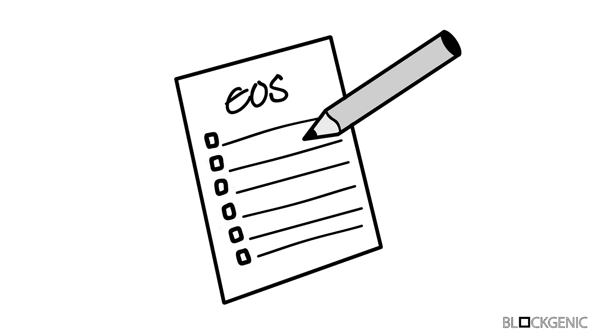

# 终极 EOS 指南

> 原文：<https://medium.com/coinmonks/the-ultimate-eos-guide-143d5e59e68d?source=collection_archive---------1----------------------->

在过去的几个月里，许多 EOS 块生产者和 EOS 爱好者创造了内容，以帮助每个人理解和使用 EOS，包括美国，但它可能很容易错过一些内容。这就是为什么我们汇集了所有这些伟大的指南，文章，钱包和工具包，使最终的 EOS 指南。

我们将指南分为以下几类，每一类都有自己的子类别:

*   EOS 基础
*   EOS 治理
*   钱包、工具包和块浏览器
*   开发者指南
*   其他宝贵资源

# EOS 基础知识-

## EOS 帐户

**EOS 账号:如何工作如何通过 block genic**
[https://medium . com/@ block genic/EOS-Accounts-How-They-Work-How-To-Get-One-87019 c 0 f 7 BC 7](/@blockgenic/eos-accounts-how-they-work-and-how-to-get-one-87019c0f7bc7)
**EOS 账号和权限通过 block genic**
[https://medium . com/block genic/EOS-Accounts-and-Permissions-Visualized-677 fc9 c 144 e 4【T10](/blockgenic/eos-accounts-and-permissions-visualized-677fc9c144e4)

## 堆叠和取消堆叠 EOS

**如何通过 Genereos**
[在 eos 区块链上下注和取消下注您的代币 https://help desk . EOS toolkit . io/HC/en-us/articles/360013090031-如何在 EOS 区块链上下注和取消下注您的代币](https://helpdesk.eostoolkit.io/hc/en-us/articles/360013090031-How-to-Stake-and-Unstake-your-Tokens-on-the-EOS-Blockchain)

## 为制作人投票

**如何通过 Genereos**
[为 Block 生产者投票 https://help desk . EOS toolkit . io/HC/en-us/articles/360012862312-如何为 Block 生产者投票](https://helpdesk.eostoolkit.io/hc/en-us/articles/360012862312-How-to-Vote-for-Block-Producers)
**Block genic 安全命令行投票指南**
[https://medium . com/Block genic/Guide-To-Secure-Command-Line-Voting-on-the-EOS](/blockgenic/guide-to-secure-command-line-voting-on-the-eos-mainnet-ddcc3fbe0db)

## EOS 代理投票

**EOS 代理投票:您需要知道的一切**
[https://media . com/blockgenic/EOS-Proxy-Voting-您需要知道的一切-e4c9783249e3](/blockgenic/eos-proxy-voting-everything-you-need-to-know-e4c9783249e3)

## EOS 帐户权限

**EOS 权限管理通过 blockinging**
[https://media . com/blockinging/EOS-权限管理-2c0c1634fe39](/blockgenic/eos-permission-management-2c0c1634fe39)
**EOS 帐户和权限通过 blockinging**
[可视化 https://media . com/blockinging/EOS-帐户和权限-可视化-677fc9c144e4](/blockgenic/eos-accounts-and-permissions-visualized-677fc9c144e4)
**权限在 EOS 中如何通过 EOS Cafe Block 工作**

## EOS 账户资源

**什么是 CPU？什么是内存？区块链 EOS 是如何利用这些资源的？作者:EOS Asia** 

## 空投

**通过 Genereos** [传输 EOS 和 Airdrop 令牌 https://desktop . EOS toolkit . io/HC/en-us/articles/360012849792-Transfer-EOS-Airdrop-token](https://helpdesk.eostoolkit.io/hc/en-us/articles/360012849792-Transfer-EOS-and-Airdrop-Tokens)

## 空气抓取器

**如何通过 Genereos**
[申请 aircrabs https://服务台. EOS toolkit . io/HC/en-us/articles/360013714051-如何申请 aircrabs](https://helpdesk.eostoolkit.io/hc/en-us/articles/360013714051-How-to-Claim-Airgrabs)

## 其他的

**如何将您的 eos 移出交易所并通过阻止使用**
[https://media . com/blocking/如何将您的 EOS 移出交易所并使用它-bc0f83ea9326](/coinmonks/how-to-move-your-eos-off-exchanges-and-use-it-bc0f83ea9326)

# -EOS 治理-

## EOS 治理已解释

**被默蒂·塔布罗** [https://eosbootcamp.com/course/the-governed-blockchain/](https://eosbootcamp.com/course/the-governed-blockchain/)
**统治的区块链通过封锁**
[深入到 EOS 治理的状态](/blockgenic/a-deep-dive-into-eos-governance-49e892eeb4a2)

## 什么是 ECAF

**ECAF 官方网站** [https://eoscorearbitration.io/](https://eoscorearbitration.io/)
**EOS 治理状态及 ECAF 通过 EOS New York**
[https://media . com/EOS-New-York/The-state-EOS-government-ecaf-regar bit-401 c 073d 622d](/eos-new-york/the-state-of-eos-governance-ecaf-regarbiter-401c073d622d)

## EOS911

**EOS911 官方网站**
[https://eos911.io/](https://eos911.io/)
**介绍 EOS 911 紧急事件-通过 https://stee MIT . com/EOS/@ EOS 42/Introducing-EOS 911-紧急事件-证明被黑 EOS 帐户对创世快照的所有权-快照**

# -钱包，工具包和积木探险者-

## 钱包:

**散点**
[https://get-scatter.com/](https://get-scatter.com/)
**硬件钱包 by liquid EOS:** [https://github.com/bancorprotocol/eoshwwallet](https://github.com/bancorprotocol/eoshwwallet)
**钱包 by grey mass** [https://github.com/greymass/eos-voter](https://github.com/greymass/eos-voter)
**钱包 by EOS 权威:** [https://eosauthority.com/wallet](https://eosauthority.com/wallet)
**Simpleos 钱包 by EOS Rio:** [https://web.eosrio.io/simpleos/](https://web.eosrio.io/simpleos/)
[https://github.com/tarassh/fairy-wallet](https://github.com/tarassh/fairy-wallet)
**在 eos 上设置你的账本硬件钱包** [https://eosbootcamp . com/course/Setting-Up-Your-Ledger-Hardware-Wallet-On-EOS/](https://eosbootcamp.com/course/setting-up-your-ledger-hardware-wallet-on-eos/)
**如何通过 EOSphere 构建 EOS 硬件钱包** [https://eosbootcamp . com/course/How-to-build-an-EOS-Hardware-Wallet/)](https://eosbootcamp.com/course/how-to-build-an-eos-hardware-wallet/)

## 工具包:

**EOS Toolkit by Genereos** [https://eostoolkit.io/home](https://eostoolkit.io/home)
**Myeoskit by EOS Asia:** [https://www.myeoskit.com/](https://www.myeoskit.com/)
**Toolkit by frances OS** [https://tools.franceos.fr/](https://tools.franceos.fr/)

## 块浏览器:

**Bloks.io by EOS CAFE 和 HKEOS** https://www.bloks.io/
**EOS Tracker** [https://eostracker.io/](https://eostracker.io/)
**EOS Flare** [https://eosflare.io/](https://eosflare.io/)
**Cypherblock** [https://www.cypherblock.io/](https://www.cypherblock.io/)
**EOSQ by EOS Canada** [https://eosq.app/](https://eosq.app/)

# -开发者指南-

## 一般 EOS 开发:

**EOSIO 官方开发者门户**
[https://developers.eos.io/](https://developers.eos.io/)
**EOSIO 栈交换** [https://eosio.stackexchange.com/](https://eosio.stackexchange.com/)
**EOSIO 入门教程按块。一个** [https://battles.eos.io/](https://battles.eos.io/)
**由 Blockgenic** [用 EOSIO 构建 Dapps https://medium . com/block genic/Building-Dapps-With-EOS-io-uw-workshop-29 EC 6 fcbd 505](/blockgenic/building-dapps-with-eos-io-uw-workshop-29ec6fcbd505)
**EOS 开发者视频演练由 EOS sphere** [https://eosbootcamp . com/course/Video-walk throughsIO、Mongo 和 Angular 由 gau tam Anand](https://eosbootcamp.com/course/video-walkthroughs-for-developers/) [https://eosbootcamp . com/course/building-real time-apps-using-node-socket-IO-Mongo-and-Angular/](https://eosbootcamp.com/course/building-realtime-apps-using-node-socket-io-mongo-and-angular/)
**node . js 由 gau tam Anand** [https://eosbootcamp.com/course/node-js/](https://eosbootcamp.com/course/node-js/)

## EOS 智能合同开发:

**EOSIO 智能合约教程 by block genic** [https://medium . com/block genic/EOS io-Smart-contracts-Tutorial-f 22 C3 bb 364d 9](/blockgenic/eosio-smart-contracts-tutorial-f22c3bb364d9)
**EOS 应用开发 by EOS New York** [https://eosbootcamp.com/course/eos-application-development/](https://eosbootcamp.com/course/eos-application-development/)
**EOS 智能合约安全终极指南 by block geeks** [https://block geeks . com/guides/ultimate-guide-to-EOS](https://blockgeeks.com/guides/ultimate-guide-to-eos-smart-contract-security/)

## EOS 测试网:

**EOSIO 单节点 Testnet Setup by block genic** [https://medium.com/coinmonks/test-4fbd38fdc4e8](/coinmonks/test-4fbd38fdc4e8)
**EOS io 单节点 Testnet Setup On Windows by block genic**
[https://medium . com/@ block genic/EOS io-Single-Node-Testnet-Setup-On-Windows-ae7a 59900 e69](/@blockgenic/eosio-single-node-testnet-setup-on-windows-ae7a59900e69?source=user_profile---------30------------------)
**EOS io 单节点 Testnet Setup On Mac OS by block genic** 

# -其他宝贵资源-

我们已经包括了所有不属于以上任何一类，但仍然非常有用的文章、指南或网站。这里所有的链接都有一个简短的描述，所以你知道这篇文章、指南或网站是关于什么的。

**EOS boot camp by EOS Dublin** 来自不同区块生产商和其他社区贡献者的大量 EOS 相关课程。
[https://eosbootcamp.com/](https://eosbootcamp.com/)

**EOS help desk by Genereos** 出色的 EOS 资源，不仅包含大量教程，还包含所有 [EOSToolkit](https://eostoolkit.io/home) 功能的指南。
[https://eostoolkit.io/home](https://eostoolkit.io/home)

**all thingseos by EOS Arabia** 非常全面的列举了大量的 EOS 工具和项目。http://allthingseos.com/

**EOS Go by EOS Asia** 各种 EOS 相关项目和内容的集合，更多内容即将推出。
https://www.eosgo.io/

**Block genic 为 EOS 块生产商提供的企业安全框架**
关于如何为 EOS 块生产商创建企业安全框架的高级指南。
[https://medium . com/block genic/enterprise-security-frameworks-for-EOS-block-producers-59 bc9d 1773 E4](/blockgenic/enterprise-security-frameworks-for-eos-block-producers-59bc9d1773e4)

# 我们的社交

区块制作者名称:' blockgenicbp'
[网站](https://blockgenic.website/)
[推特](https://twitter.com/blockgenic)
[Youtube](https://www.youtube.com/channel/UCXTaehuAs3UWKnMVnT71MMQ)
[Reddit](https://www.reddit.com/user/blockgenic)

*   我们可能错过了指南、钱包或工具包。这些都不是个人代言。如果您希望看到添加的内容，请留下评论。使用以上链接，风险自负*

*由* [*写成【Yannick Slenter】*](https://www.linkedin.com/in/yannick-slenter/)*为* [*块状*](https://blockgenic.website/)

> [在您的收件箱中直接获得最佳软件交易](https://coincodecap.com/?utm_source=coinmonks)

