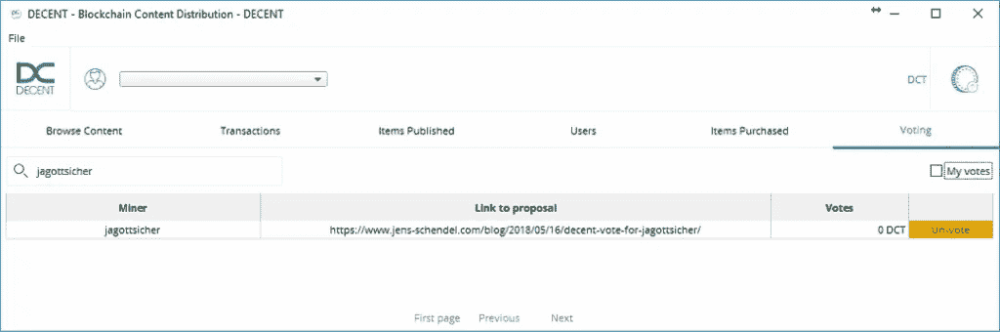

# 如何设置一个像样的采矿见证节点的终极指南(对新手和专业人士而言)

> 原文：<https://medium.com/coinmonks/the-ultimate-guide-for-both-dummies-and-pros-how-to-setup-a-decent-mining-witness-node-f59be5d7e09d?source=collection_archive---------8----------------------->


**本指南面向对 linux 有经验、了解 shell(我用的是/bin/bash)并希望运行一个** [**体面的**](https://decent.ch/) **的热心的业余爱好者和专业人士，见证 node❔**

# 艺术一:停止采矿，开始见证！

[体面的](https://decent.ch/)提供了一个先进的区块链生态系统来帮助你构建去中心化的应用。他们开发了 [**DCore**](https://dcore.io/) : **一个完整的环境，开发者可以在上面创建一个区块链**。


由于一旦从 bitshares/Graphene 中分离出来，正派就会使用委托股权证明(DPoS)共识机制，而不是工作证明(例如比特币)。因此，挖掘并没有被定义为在不断变化的限制下寻找块散列的解决方案的计算竞赛。相反，体面的 dpo 投票单个节点，给他们一个机会来构建块。为此，一个人的节点需要创建一个挖掘对象，并被投票“见证”——因此要用实际的事务构建块，并对它们进行签名。当然，这样的系统不支持“来去自由”的行为，而是需要一个节点保持 24/7 在线。

在 exchange 中，DPoS 比任何 PoW 系统都要快得多，扩展性也好得多。在最好的情况下，它总是会扩展其限制，每秒可以处理数千个事务。因此，它变成了一个支持在虚拟的去中心化机器上实时处理事务的系统。

我找不到一个简单易懂的分步指南，它用简单的英语解释了一切，还提供了一些背景知识——所以我收集了所有的信息，进行了研究，学习，现在想与你分享。长话短说:我编写了设置一个像样的见证节点并运行它的最终指南！

如果您已经有一个来自 ICO 的帐户和一个编译了 wallet_cli 的运行 decentd，您可以直接跳到第三部分。


# 第二部分:硬件和环境为您的体面证人

这是我的第一个绊脚石，建立体面的证人节点。你需要保持 24/7 在线，并且在同一个 IP/域下可达，长时间不重启 decentd(守护进程)。

一切的基础应该是 linux (Debian 或 Ubuntu 16.04)，但也有一些硬件要求，如果你想遵循更复杂的方式(编译)。我在这里只轻轻触及这个话题，因为如果它不起作用，它很容易成为一些“工作密集型”和令人沮丧的初学者和专业人士。用 docker 设置版本还有第二个简单得多的方法(稍后会详细介绍)。

对于编译和 by docker 容器化版本，您需要具备 linux 和软件/硬件经验，以满足以下推荐要求:

*   Linux 内核>版本 4
*   4 核
*   16 GB 内存
*   500 兆硬盘
*   合理的交换空间量(假设 RAM + 100 MB)

用 openVZ 虚拟化的 VPS 不能工作！内核版本太低，通常这些产品不支持真正的交换空间，只支持 2.6.x 内核，不能正确编译代码，也不能运行 docker。**你可以用“uname-r”**检查你的内核版本。

# 编译(从头开始构建)

你可以在 github 上找到[体面网络的来源。如果你想从头开始，你也可以试着按照](https://github.com/DECENTfoundation/DECENT-Network) [texxi 在 steemit](https://steemit.com/decent/@texxi/decent-mining-setup-and-ressources-shortcut) 上的指示(有点过时)。在这一点上，我只会给你一个一般的描述和共同的建议。

使用 git 你可以从源代码派生，但是为了编译你需要特殊版本的 libboost (1.60) 。所以你需要安装 libboost 版本，并把它放在你的#path 中，或者在开始的时候为你的系统编译 libboost。这里我也看到了开发人员的一个障碍，因为您需要将您的环境与其他项目分开，并且您需要关注版本控制。如果你没有这方面的经验，那会变得相当困难。

**我只能强烈建议在为构建和制作准备好环境后，为体面设置您自己的用户。**

顺便说一句:[正派的](https://decent.ch/) DCore 是一个复杂的、远未开发的项目，对于初学者来说，编译需要很长的时间和很高的挫折承受力以及强烈的学习意愿。

# docker 化版本—使用 docker 容器

在 github 上，一个开发者给我介绍了一个简单得多的版本。在此非常感谢[Marian-正派-ch](https://github.com/marian-decent-ch) 对准备一些测试容器和介绍 docker 的支持。我猜你是正派团队页面上的[玛丽安·凡德卡](https://decent.ch/en/team/)。还要感谢马克·彼得·曼塞尔(Mark Peter Mansell),他正努力完成一份合适的文档。我希望我的傻瓜指南可以显示出新手开发者的障碍在哪里，他们还不熟悉石墨烯家族。

对于 docker 的使用，我只给你一个普通的介绍，但是我在 windows 和 linux 上都试过。两者都工作得非常好。我推荐 portainer 或 kitematic 这样的 docker gui。这并不是真正需要的，但可以让事情变得更容易处理。

## 什么是码头工人？

docker 将运行应用程序所需的一切都放在一个容器中，并使它可以在不同的操作系统或环境中执行。想象它像一个模拟器，但它更像一个盒子里的虚拟机，这个盒子与外部世界连接，如网络、终端和对 RAM、CPU 内核和卷的访问。

已经准备好的 docker 容器的主要来源是 hub.docker.com，在那里你可以找到真正的像样的容器，当我开始研究像样的容器时，它们看起来更好更稳定。您将需要带有 decentd 和 wallet_cli 的容器。现在不需要下载它们。docker 将在稍后自动完成，并在第一次启动时完成所有必需的依赖项。请注意，您的服务器上需要一个工作的 docker 环境。CE 版还可以。如果你使用的是 ubuntu 16.04，你可以按照这些说明(有些复杂)或者你可以让 docker-script 做所有的工作:

```
curl -fsSL [get.docker.com](http://get.docker.com/) -o get-docker.shsh get-docker.sh
```

docker 在后台启动它的守护进程，这个程序捕获你的 docker 命令并执行容器。如果您只想快速检查 docker 是否正确设置为托管合适的容器，您可以打开一个终端，分别是两个终端和

```
docker run --rm -it --network=host decentnetwork/decentd decentd
```

和

```
docker run --rm -it --network=host decentnetwork/cli_wallet cli_wallet
```

您可以启动守护程序和 wallet_cli。

请注意，decentd 首先需要与网络同步。实际上有超过 500 万个块，所以需要一些时间。
另请注意，wallet_cli 将仅连接到同步守护程序。

作为一个小测试，这是可以的。现在可以用 CTRL+C 停止守护进程。由于 docker 用-rm 选项启动了容器，所以在停止容器后，所有的工作都会消失。

**请注意，我使用的是根用户权限，**，但是创建一个新用户，grand sudo 权限，禁止根用户权限，让服务器准备好抵御暴力攻击，设置防火墙，还要安装 **fail2ban** 等等。请不要忽视保护您的服务器！

无论如何，我为正派创造了一个空间来存储它的数据。如果你也想这样做，你必须在路径的开头添加你的主目录。

```
mkdir /scratch/decent
```

(这为体面的数据创造了一些临时空间。我从建立和使用我自己的[闪电钱包](https://www.jens-schendel.com/blog/2018/05/08/meine-erste-bezahlung-von-bitcoin-mit-lightning-%e2%9a%a1-network-auf-dem-mainnet-wp-http-bit-ly-2eduavh-%e2%80%8b/)中窃取了这个想法。)

打开两个终端。一种是启动守护进程。如果你不使用 docker，你可以把它放在自己的屏幕上。这里不需要，我将坚持使用 dockerized 版本。

```
docker run -it -v /scratch/decent:/root/.decent --network=host decentnetwork/decentd:latest decentd
```

这使得 docker 下载最新的镜像并在其中运行守护进程，但是映射内部文件夹/root/。体面到外部目录/scratch/体面。所需的文件夹，我们稍后会访问。你不需要关心网络。容器声明并转发所需的端口，以便连接到适当的网络，并且远程过程调用可以到达这些端口。

在终端上，你可以看到守护进程与网络同步。在没有-rm (remove)选项的情况下启动并映射工作目录之后，您甚至可以关闭终端，或者使用 CTRL+C 停止守护进程，或者停止/启动/重新启动整个容器，而无需从头开始重新索引或重新同步。此外，docker 容器的 ID 将保持不变(稍后更多)。

启动 wallet_cli 容器的时间。**请注意，你最好让守护进程先同步**。你可以在[explorer . deadline . ch](https://explorer.decent.ch/)比较积木高度。然后，在第二个终端中，您用

```
docker run -it -v /scratch/decent:/root/.decent --network=host decentnetwork/cli_wallet:latest cli_wallet
```

如您所见，cli 使用相同的文件夹和网络。按一下 RETURN 键，您会看到类似“NEW > > >”的提示，这表明 wallet_cli 是第一次启动，并正确连接到守护程序。

**祝贺您——您拥有了一个运行良好见证节点的运行环境。**

请注意，从这里开始，您还可以使用您喜欢的 docker gui(如 kitematic 或 portainer)来启动/停止容器。如果您意外关闭了外壳或终端，您可以再次登录并使用

```
docker ps
```

您可以找到正在运行的容器列表。

如果您想接管正在运行的容器的标准输出，您可以使用

```
docker attach *docker_id*
```

如果您想将另一个 shell 放入一个正在运行的 docker 容器中，您可以使用

```
docker exec -i -t docker_id /bin/bash
```

现在，请跟我进兔子洞——我们会见到爱丽丝。


# 第三部分:设置账户、体面见证节点和投票

如上所述，是时候抓住机会，跟着爱丽丝越来越深入兔子洞了。虽然第一部分和第二部分对于几乎任何 linux 系统管理员来说都很容易完成，但是接下来的部分就有点难了。你必须记住，即使你已经体验过比特币等其他区块链，这也是不同的。如果你是一个拥有 bitshares/Graphene 的专业人士，这根本不是一个挑战，如果你已经为 DASH 或基于 DASH 的开发设置了 masternodes，如超级保存和超级安全的[clave](https://www.craveproject.net/)，你会发现在体面中设置见证节点的差异和相似之处。

从现在开始，我只会粗略地评论一下正在发生的事情，所以系好安全带——我们开始吧:

*请在你的桌面上准备一个文本文件来复制&粘贴——你会需要它的！如果你没有复制数据就失去了连接，全世界的人都会听到你的咒骂。所以最好给自己准备一份你正在做的事情和结果的副本。*

现在，使用已经打开的 wallet_cli 切换到 shell。它应该用“新兵种”来迎接你。你必须输入一个新的密码，然后用

```
unlock yourpassword
```

提示符变为“解锁> > >”

现在我们将导入您的帐户名和私钥(您应该已经准备好了，您的文本文件是临时存储它的好地方)。

```
import_key decentgousername privkey
```

如果工作正常，则返回 TRUE。现在我们的钱包觉得对你的帐户负责，并通过它访问体面的区块链。我们为它创建了三组新的密钥。哪个好用三次

建议 _ 大脑 _ 键

每次作为回报，您都会获得一个新创建的作为 json 对象的键集，并将其复制到您的文本文件中。相似的

```
{
"brain_priv_key": "here are the text phrases","wif_priv_key": "privkey","pub_key": "pubkey"}
```

我现在称它们为调 1 到调 3。使用这些密钥，您现在将注册一个完整的新帐户，但您可以在两者之间选择一些东西:

```
register_account new_username publickey1 publickey2 decentgousername true
```

这意味着:你用新用户名*用户名*注册一个新账户，用你的用户 *decentgousername* 的*公钥 1* 和*公钥 2* 签名。

作为回报，您再次获得一个 json 对象，声明新的用户帐户信息。将其复制到您的文本文件中！这是您将为其设置矿工的帐户。目前重要的只是名字。这将是其他人以后可以投票的名字，并将出现在“矿工名单”中——据我所知，但后来有另一个用户名可能是为了这个。反正我选一样的。

下一步在我写作的时候已经过时了，但我还是提到了它，因为它至少是可能的，它在未来又变得相关了。过去，需要在采矿机上“存放”一些 DCT。我读了一些关于 3 DCT 后来约 50 DCT，并只要求体面的电报频道最终拿出，这实际上你不需要发送任何 DCT 到矿工帐户。如果你以后不得不这样做:

```
transfer decentgousername new_username 50.00 DCT "memo" true
```

也就是说从您的 Decentgo 帐户向您新注册的帐户发送 50 DCT。费用会从您的帐户余额中扣除，而不是从您发送的金额中扣除。“备忘录”是你选择的可选注释。

如果需要发送 50 DCT(或其他内容),那么结果会是一个 json 对象，它陈述了发送到区块链的所有需要的信息。收到。

下一步是将新帐户导入您的钱包。这对我来说很难理解，因为我只是用我的钱包创造了它。B **ut 创建账户并不意味着拥有它**。也许你为你的朋友创建了一个——不管是什么原因，你需要导入它。我们已经知道它是如何工作的:

导入密钥新用户名密钥 2

您导入新帐户并用 pivkey2 签名，PIV key 2 是您已经创建的帐户之一。授予你这种许可并使其可验证。结果应该为真。

现在我们在另一个终端上用 CRTL+C 关闭守护进程，这也关闭了 wallet_cli。注意:之前不要锁钱包。在这个过程中的任何时候都不要锁定它——我那样做了，并且再次失去了对登录的控制。就让 wallet_cli 容器死掉吧。我们稍后重启。在守护程序终端上或者在一个新的终端上

/root/。体面/数据/体面/配置. ini

分别是(取决于您的访问 shell):

/scratch/decody/data/decentd/config . ini

然后用你最喜欢的文本编辑器打开它。我的是纳米。因此

```
nano /root/.decent/data/decentd/config.ini
```

完成任务。nano 的优势在于，在 ssh shell 上，通过 putty，您可以右键单击文本文件进行复制粘贴。所以很容易复制

```
private-key = ["pubkey2","wifprivkey2"]
```

在文件的末尾。不言自明。

用上面的 docker run 命令重启两个容器——当然首先是守护进程。如果你已经安装了 docker gui，也可以随意使用它来重启容器，在外壳上用“docker ps”和“docker attach yxz”再次连接到 docker 外壳。让我们假设您已经这样做了，那么您现在可以为您的新用户创建所谓的 miner 对象。

```
create_miner username "proposal URL" true
```

什么是提案 URL？任何网址，你可以炫耀你为什么和如何设置你的矿工。请准备一个网站、博客、steemit、twitter 或任何可到达的 URL 来解释你的节点、你的意图以及你是否喜欢你的意识形态。在 DPoS 系统中，像体面的验证和块构建节点实际上是分散的。比特币需要 PoW 共识机制，但 PoW 和 PoW/PoS-Hybrids 都有集中化的趋势。我的两分钱。甚至 DASH-like masternode 系统也以更高的价格提供某种 VIP 服务(更快、更安全、更匿名)。但这种费用就像某种投资“利息”,因为作为早期采用者/投资者的风险而被证明是合理的。与此同时，DASH 的价值如此之高，以至于新手运营 masternode 的价格是一个很高的壁垒。因此，价值流向已经聚集的价值——集中。这种囤积导致了 HODL 态度，这种态度阻碍了创新，但在像正派这样基于比特币/石墨烯的 dpo 上，创新可以变得绚丽多彩，新的商业概念出现并活跃起来。不像卡什支持者(我不会在这里放弃名字，但你知道我在说谁)，他们把采矿视为印钞机，他们把爪子伸进去，在任何情况下都不想放弃。照明网络预见到这一点，并坚持向前发展。但是很抱歉意识形态的咆哮，回到主题。

作为创建 miner 的回报，您将获得一个 json 对象，其中包含创建的事务数据。下一个和最后一个(！)第一步是将我们的 miner 的签名密钥更改为第三个密钥，以“断开”之前创建帐户和 miner 对象时使用的密钥。有了它，我们就能拿到矿工证了！

```
update_miner username "proposal URL" publickey3 true
```

应该很清楚了。为了让见证运行起来，我们需要再次编辑 config.ini 并添加

```
enable-stale-production = trueminer-id = "1.4.X"
```

在文件的最后，你从最后一个 json 返回的 miner-id(你把它保存在你的文本文件中！)

注意:miner-id 不是 miner_account！它实际上从 1.4.x 开始，而不是从 1.2.x 开始！

**重启守护容器！搞定了。**

# 有那么难吗？

对我来说是的。不是手术本身，而是要弄清楚这一切——即使和体面有良好的关系。

您可以登录 decentgo 客户端查看结果，并在 decentgo 同步后查看“投票”部分。如果你钱包里有 DCT，你已经可以投票给你的节点了——或者更好的是我的(jagottsicher)。

**如果你喜欢这篇文章，并发现它有用，那么无论如何请为我的节点投票吧！我所有的写作都没有担保，你要自担风险。但是，我认为这是运行一个体面的见证节点的最终指南。一个种子节点应该非常相似，可能你想创建一个种子对象。**

我花了几天时间才弄明白这一切，但我不希望你只是复制粘贴大量代码而不理解它。希望我的评论对你有帮助。对我来说，体面的电报组是一个很好的支持来源——甚至创始人也联系我并提供帮助 github 也很有用。对于中文(普通话)开发人员来说，可能有更多的资源，因为许多像样的和核心的开发人员都在中国，并且做得非常好，但是英文文档却受到了影响，可能有些必要。这是我用英语而不是我的母语德语写这个小指南的另一个原因。



现在:

**请为我在体面上的节点投票！**

```
vote_for_miner username jagottsicher true true
```

如果你已经是体面代币(DCT)的骄傲拥有者，那么你也可以切换到体面的全新[在线投票工具](https://voting.decent.ch/)。

在我自己的网站上，你可以读到我的节点和[我打算运行一个体面的见证节点](https://www.jens-schendel.com/blog/2018/05/16/decent-vote-for-jagottsicher/)。