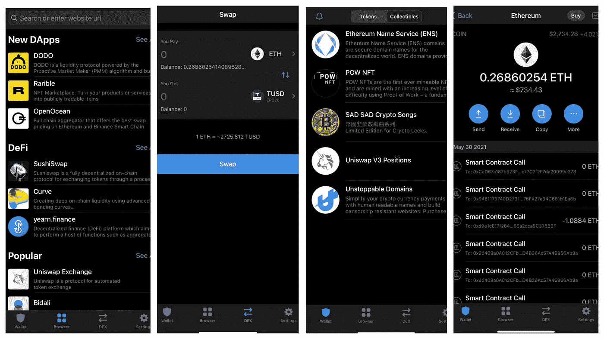

# 加密货币钱包终极指南(1)

> 原文：<https://medium.com/coinmonks/the-ultimate-guide-in-choosing-cryptocurrency-wallets-1-d8ae5b49a957?source=collection_archive---------1----------------------->

## 6 款安全易用的加密钱包的详细比较

# 概观

大家好！自从我写上一篇文章已经有一段时间了，因为 DeFi 空间让人们每天都很忙。作为一个重度用户，我想写这篇文章来分享我对选择加密钱包的看法。我将主要关注*移动*和*非保管*钱包(意味着你可以完全控制你的私人钥匙)，因为我认为这是日常与区块链互动的最安全和最方便的方式。我们开始吧！:)

# 快速表格摘要

我们将在下面解释每个钱包的细节。如果你觉得有帮助的话，可以和你的朋友分享这两张表。

# 比较指标

以下是我在选择钱包时会考虑的几个要点:

1.  **安全**:我钱包里的资金安全吗？我可以通过持有我的私钥来完全控制我的资金吗？钱包提供商可以用我的私钥做恶意的事情吗？
2.  **易用性**:钱包是否直观易用？这样我就不会不小心按下一个奇怪的按钮，失去我所有的资金？
3.  **便利性**:钱包里有 DApp 浏览器吗？使用钱包发送交易有多方便？每当我想兑换不同的区块链时，我必须持有特定的本币吗？
4.  **兼容性**:我能使用钱包与我想要的任何区块链互动吗？或者我需要下载许多不同的钱包来和一个特定的区块链互动？
5.  **功能**:有没有钱包独有的额外炫酷功能？例如，一些钱包提供更好的赌注利率，以保持增长你的密码，同时锁定在钱包。一些钱包还提供直接从法定到加密的购买，以及一页纸投资不同的 DeFi 产品。

# 比较

## 1.[元掩码](https://metamask.io/)

一个最著名和最受欢迎的钱包，提供任何定制

> **安全**:*★★★★*

种子短语和私钥用您的密码加密。您可以完全控制您所有的私钥。只有当黑客能够完全访问你的电脑**和**密码时，你的资金才会有风险。

> **可用性**:*★★☆☆*

这个钱包不是为新手设计的，需要用户有中等水平的知识才能充分利用它。例如，用户必须知道如何正确控制自己的私钥，并确保不要在恶意网站上连接钱包。此外，许多自定义资产不会自动显示在 wallet 中，除非您在此手动添加令牌地址。

> **便利性**:*★★☆☆*

虽然它的钱包里有 DApp 浏览器，但它需要你有本地货币才能与区块链互动。例如，如果你想同时与以太坊、多边形、索拉纳、BSC 和 Tron 互动，你将不得不在钱包中放少量的 ETH、MATIC、SOL、BNB、TRX。

> **兼容性**:*★★★☆*

它是我最喜欢的钱包，因为它的兼容性最好！你可以在 MetaMask 上与**任何** EVM 兼容区块链进行交互，只要你有网络 RPC URL(见本指南添加自定义网络[此处](https://metamask.zendesk.com/hc/en-us/articles/360043227612-How-to-add-custom-Network-RPC-and-or-Block-Explorer))。最棒的是，你可以添加任何资产，包括你自己发行的 NFT，显示在钱包中。但是，其他与 EVM 不兼容的区块链如 Flow 和 Solana 不能添加到 MetaMask 中。

> **功能**:*★★☆☆*

用户可以在 app*(Apple Pay/Wyre/Bank)*中用 fiat 购买 crypto。此外，最近发布的[互换功能](https://metamask.io/swaps)可以从分散交易所获得最佳价格*(收取 0.743%的费用)*。除此之外，只有基本的功能，如传输、接收、浏览 DApps 和显示资产。

(Screenshots from the MetaMask app :D)

## 2. [Blocto](https://blocto.app.link/register?ref=TETWVL)

最人性化的零交易费钱包之一，主移动钱包与[流量区块链](https://docs.onflow.org/flow-token/available-wallets)交互。

> **安全**:*★★★★*

保管和非保管选项都可用，因此如果您选择非保管模式，安全性与 MetaMask 相同。

> **可用性**:*★★★★*

这款钱包是专为加密新手设计的。当你进入 DApp 浏览器时，它会显示一个常用的 dapp 列表，这样用户就不需要记住网站的网址，也不需要潜在地导航到错误的网址。在令牌页面上，您也不需要知道如何“切换网络”来接收不同区块链上的令牌。您可以在一个屏幕上查看所有资产。

> **便利性**:*★★★★*

除了拥有 DApp 浏览器之外，它 ***用 Blocto 积分为你支付所有区块链*** 的交易费用！一旦[注册](https://blocto.app.link/register?ref=TETWVL)，您将获得 3000 **免费**积分发送交易，意味着您可以零成本试用 DApps！区块链新手不一定要懂原生货币的使用。

> **兼容性**:*★★☆☆*

由于它不是为高级加密用户设计的，你不能随意添加其他区块链到应用程序中。目前支持*以太坊*、*币安*、*智能链*、*创*、*流、*、*索拉纳(即将)*。您也不能添加自定义资产。所有令牌和 NFT 只能由 Blocto 团队列出。这是为了防止新手不小心碰到未知的代币或区块链。还要注意，创建以太坊账户非常昂贵，因为它是一个[智能合约钱包](https://docs.blocto.app/technical-documents/contract-wallet)。

> **功能性**:*★★★★*

这是**唯一的**软件钱包，用于流量区块链到[赌注代币](https://docs.onflow.org/staking)(通过锁定 app 中的代币赚取流量)[互换](https://guide.blocto.app/article/bloctoswap-tutorial)(交换流量& tUSDT)，并显示 NFTs(在[对](https://www.versus-flow.art/)上展示你的 NFTs，也许将来还有 NBA 的 Top Shot)！所以如果你想和心流互动，没有第二种选择。同时，它允许用 fiat ( [Moonpay](https://guide.blocto.app/article/moonpay-buy-your-first-crypto-with-blocto) )购买密码。

(Screenshots from the Blocto app :D)

## 3. [imToken](https://token.im/)

每月活跃用户最多的钱包(可能比 MetaMask 还多！)、亚洲用户(有微信支持)、功能丰富。

> **安全**:*★★★★*

类似于 MetaMask，它允许您完全控制您的私钥。

> **可用性** : *★★★☆☆*

由于这个应用程序不是为新手设计的，它有更多的高级设置，这可能会令人困惑。例如，您需要使用侧边栏切换到不同的区块链来与之交互。然而，它比 MetaMask 更好，因为它可以自动检测和显示您拥有的任何类型的资产，您可以选择是否在应用程序中显示。它还有一个丰富的 DApp 浏览器主屏幕，按类别显示许多常见的应用程序。

> **便捷度**:*★★☆☆*

用户必须持有本国货币才能与不同的区块链进行交易。

> **兼容性** : ★★★★

它们提供了很好的兼容性，用户可以像在 Metamask 中一样添加定制的网络 RPC。最棒的是，默认情况下，他们有超过 10 个区块链网络可供使用，而不需要用户自己添加这些 RPC 网络。(参见本[指南](/imtoken/connect-to-layer-2-and-many-more-custom-networks-on-the-new-imtoken-d44274446817)添加自定义网络)

> **功能**:*★★★★*

这个钱包在一个应用程序中包含了最丰富的功能之一。不仅可以直接在 app 中下注和互换代币( [Tokenlon](https://tokenlon.im/) )，还可以看到每项资产的最新市价！

(Screenshots from the imToken app :D)

## 4.[数学钱包](https://mathwallet.net/)

默认情况下，支持大多数区块链(超过 65 种类型)的钱包。

> **安全**:*★★★★*

类似于 MetaMask，它允许您完全控制您的私钥。

> **可用性**:*★★★☆*

同样，这个钱包是为那些希望能够与各种区块链互动的高级用户准备的。它比 MetaMask 更好，因为您不需要自己手动添加许多区块链 RPC URLs。一键之遥！与 imToken 类似，它在浏览器中显示了一长串命令 DApps。

> **便利性**:*★★☆☆*

用户必须持有本国货币才能与不同的区块链进行交易。

> **兼容性**:*★★★☆*

它支持我听说过的大多数类型的区块链*(除了 Flow，Flow 只在 Blocto 上)*。但是，您也不能添加自定义网络。

> **功能**:*★★★★*

他们有一个非常有趣和有用的功能——[跨链互换](https://mathwallet.medium.com/math-wallet-supports-cross-chain-exchange-e2e0bdecb854)，你可以在不同的区块链之间直接交换代币。除此之外，他们有一个新闻标签显示加密世界的最新趋势。

(Screenshots from the MathWallet app :D)

## 5.泽里昂

在一个地方管理不同连锁店的整个 DeFi 投资组合的应用程序。

> **安全**:*★★★★*

类似于 MetaMask，它允许您完全控制您的私钥。

> **可用性**:*★★★★*

当我想查看我所有的 DeFi 头寸时，我首先想到了这个应用程序！我使用过 [InstaDApp](https://instadapp.io/) 、 [ApeBoard](https://apeboard.finance/) 等，发现这个应用和 [Zappar](https://zapper.fi/) (还没有应用)支持不同区块链上大多数类型的 DeFi 资产。它还显示实时价格，利润和损失，价格折线图，给你一个如何投资组合的概览。

> **便利性**:*★★☆☆*

该应用程序中没有 DApp 浏览器。当您点击交换令牌等功能时，它会将您重定向到 imToken 以确认并执行交易。因此，你将不得不以 imToken 持有本国货币。

> **兼容性** : *★★★☆☆*

虽然它可以显示不同区块链上的大多数资产，但有时无法获取币安智能链和多边形上的所有 DeFi 资产。

> **功能性**:*★★★★*

它拥有最全面的 DeFi 产品和代币投资仪表板！比如你可以通过 app 中的快捷方式获得最近每个 token 如何增长的概览，购买 DeFi 指数(比如 [DPI](https://www.indexcoop.com/dpi) )，存入[曲线](https://curve.fi/)池(后来重定向到 imToken 完成交易)！

(Screenshots from the Zerion app :D)

## 6.信任钱包

最适合极简生活方式的钱包

> **安全**:*★★★★*

类似于 MetaMask，它允许您完全控制您的私钥。

> **可用性**:*★★☆☆*

这个应用程序也是为像 MetaMask 这样的高级用户准备的。

> **便利性**:*★★☆☆*

DApp 浏览器在应用程序中。然而，你仍然需要有本国货币。

> **兼容性** : *★★★☆☆*

支持超过 35 种类型的区块链。但是，您不能向应用程序添加额外的区块链网络。

> **功能**:*★★☆☆*

类似于 Blocto，它允许用[月付](https://guide.blocto.app/article/moonpay-buy-your-first-crypto-with-blocto)进行加密购买。它还直接在应用程序中提供代币交换和 [BNB 赌注](https://community.trustwallet.com/t/bnb-staking-with-trust-wallet/113243)(出于某种原因，我不能在 iOS 应用程序上下注)功能。除此之外，只提供基本功能

(Screenshots from the Trust Wallet app :D It also has light mode)

# 包裹

现在，您已经大致了解了 6 款不同的手机钱包，以及它们在**安全性**、**可用性**、**便利性**、**兼容性**和**功能性**方面的对比。一个旁注是，虽然所有钱包都在**s*safety*中排名 5 星，但以上都是“ *hot* ”(软件)钱包，安全性不如“ *cold* ”(硬件)钱包如 [Ledger](https://www.ledger.com/) 。你应该只把你经常使用的资产放在热钱包里。**

在下一个帖子里，我会再覆盖 5 个钱包，包括**银色**、**Crypto.com**、 **TokenPocket** 、**硬币 98** 、**和**1 英寸**。随时推荐你最喜欢的钱包给我复习！**

感谢您抽出时间阅读。欢迎任何建议，如果有任何不清楚的地方，请随时指出来。下次见！:)