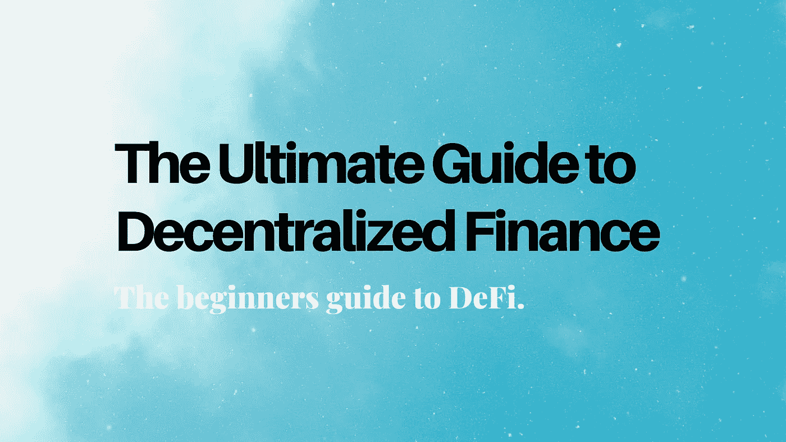

# DeFi(分散金融)终极指南

> 原文：<https://medium.com/coinmonks/the-ultimate-guide-to-defi-decentralized-finance-602d622ee6cb?source=collection_archive---------0----------------------->

## 你需要知道的关于 DeFi 初学者的一切。

本指南的结构旨在为初学者提供分散融资的概述。首先，我将对 DeFi 和支持开放金融系统的属性进行解释。接下来，我将进入分散金融的概念和术语。

请随意跳到您最感兴趣的部分，但我们建议通读整个指南，以全面了解分散式财务协议和应用程序如何协同工作。**注意**:这并不详尽，但作为以太坊 DeFi 生态系统的具体例子的有力介绍。

**Advancing Web 3.0** 是一份[周刊简讯](https://advancingweb3.substack.com/)，内容涉及加密货币、分散金融( [DeFi](https://consensys.net/blog/news/2019-was-the-year-of-defi-and-why-2020-will-be-too/) )以及塑造下一个互联网时代的技术。欢迎来到流血边缘。欢迎来到 Web 3。不要落后，订阅吧。

## 目录

*   什么是分权金融？
*   分散融资 defi 如何工作？
*   分散金融有用吗？
*   有多少资金被锁定在分散财务应用程序中？
*   什么是 stablecoins？
*   密码借贷
*   什么是 DEX(分散交换)？
*   什么是预测市场？
*   什么是不赔钱彩票？
*   什么是合成资产？
*   拒绝付款
*   银行业的定义:什么是分散化银行？
*   神谕是什么？
*   如何参加 DeFi？
*   其他常见问题

## 什么是分散金融/开放金融？

分散金融——或开放金融——是指从今天的封闭金融系统向基于可互操作、可编程和可组合的开放协议的开放金融经济的范式转变。

以太坊正在创造一种新经济，将区块链技术和加密货币与当前的金融系统相结合。DeFi 不是要从零开始创建一个新系统，而是要使现有系统民主化，并使用开放协议和透明数据使其更加公平。

## 分散金融如何运作？

分散式金融利用以太坊区块链的三个关键原则，对现有的金融体系进行改革，赋予个人权力并提供更大的金融自由。

## **1。可互操作**

当前的金融系统由围墙花园(如金融机构)组成，具有有限的可转让性或双向准入。在互操作性可行的地方，它被中间人和寻租者所控制。开放金融的定义是能够在一定程度的透明度下协同工作、功能互补的平台。

## **2。可编程**

比特币创造了一种不受政治影响的自主资产，彻底改变了货币。以太坊使新型金融工具和资产比现有的产品和服务更具可定制性。数字资产和证券将开创金融机制和增长的新时代。

## **3。可组合**

可组合性指的是某种东西可以被选择并以多种组合方式组装的概念(例如乐高)。以太坊通过成为 Maker、UMA、Augur、Compound 等其他协议的协议，展示了可组合性的价值。

## 分散融资有用吗？它将如何影响世界经济？

分散金融通过使用区块链技术，消除中介和准入壁垒，为世界上任何人提供传统金融服务。诚然，DeFi 应用和服务有潜力为欠发达国家或经济不稳定国家的公民提供更大的好处。然而，DeFi 的好处仍然可以被发达国家的人们所认识，特别是在获得贷款、投资新资产和新的创收模式方面。

## 有多少资金被锁定在分散财务应用程序中？

分散财务中使用的一个常见指标是被应用程序和协议“锁定”或使用的资金量。类似于银行和大公司如何利用资本创造价值数万亿的金融产品和衍生品，以太坊协议利用资本为去中心化的金融产品和应用创造价值。储存在这些协议中的资本金额(乙醚、美元、其他资产)被称为“锁定定义”金额。虽然锁定在美元数字中的金额相对来说没有意义，但是根据以太或其他加密资产锁定的金额可以表示 defi 协议的增长。

## 什么是 Stablecoins？

稳定货币是相对于目标价格(如美元)保持稳定价值的加密资产。在过去的两年中，出现了多种稳定的内容。

**稳定的硬币有哪些种类？**

以下是一些稳定的图标类型:

*   法定抵押——由一种或一篮子货币支持
*   加密抵押——由加密资产支持，最常见的是乙醚
*   资源支持——由另一种资产(如黄金)支持的稳定货币
*   混合型号—结合上述任何一种或添加其他属性以保持稳定性的型号

开发中的大多数稳定信贷集中在法定抵押模式，因为它更容易稳定和整合到现有的金融系统中。银行和金融机构可以更容易地使用以单一货币或一篮子货币计价的稳定币，而不是由比特币或以太网等加密货币支持的稳定币。

许多公司都在试图创造可以在世界范围内使用的稳定代码。脸书正在为天秤座做准备。沃尔玛正在为沃尔玛硬币做准备。比特币基地发行了 USDC，在 80 多个国家发行。币安最近宣布了它的 stablecoin 计划 Venus。摩根大通为机构客户之间的交易结算创造了一种数字资产。全球各地的机构都认识到稳定货币的潜在影响，国际货币基金组织(IMF)的声明“稳定货币是对银行和现金的威胁”就是明证。

在过去几年中，加密抵押的稳定币，如戴稳定币，已经取得了相对的成功。Dai 是为最大程度的去中心化而设计的，这样它就不会被任何一个或一组实体所控制。MakerDAO 基金会负责设计和开发操作 Dai stablecoin 的协议，它使用一种称为 Maker (MKR)的独立令牌，帮助 Dai 保持其价格挂钩。

## 什么是密码借贷协议？

分散融资的一个突破性用例是在没有可信方或中间人(如银行或大公司)的情况下获得贷款的能力。MakerDAO 是首批让任何地方的用户都能获得贷款的应用程序之一。制造者金库要求存放乙醚，然后把戴借给使用者。有一点需要注意的是，用户需要保持至少 150%的抵押率——因此，如果你以 162 美元/ETH 的价格将 1 ETH 放入制造商金库，如果 ETH 跌破 89 美元，CDP 将自动清算。虽然这种类型的贷款需要预先存入更多的资本，但它允许个人保留其基础资产(以太)。因此，想象一下这样一种情况，你可以存放某种你打算持有一段时间的资产，比如标准普尔 500 指数或者你的 401k 的一部分。有了这种类型的贷款结构，你就可以从你的资本中获得贷款，而不必卖掉它。虽然这对于借入大量资金不是特别有用，但它有可能帮助个人借入少量资金。

最近，更多类型的借贷协议建立在以太坊之上，包括 Compound、Fulcrum、Aave 等等。Compound 和 Fulcrum 都创建了资金池，允许用户借出或借入包括戴、(比特币基地的稳定币)、以太等在内的加密资产。

密码借贷协议从本质上打破了获取资本的障碍。在传统金融体系中获得贷款需要去银行并满足必要的要求(信用评分、工作等)。通常情况下，这些要求会伤害到最需要贷款的人，如个体经营者、学生、当地企业家或被剥夺权利的社区成员。获得资本是能够获得财务自由的基本先决条件，而财务自由往往受到传统机构的保护和控制。

## 我如何获得加密贷款或赚取加密货币的利息？

任何人都可以通过下载[元掩码](https://metamask.io/)或其他加密货币钱包来利用复合协议。[达摩](https://www.dharma.io/)——一家最初与 Compound 竞争的公司——现在利用 Compound 的协议为其客户提供尽可能最好的利率。达摩通过其“智能钱包”来实现这一目标，智能钱包会自动将客户的资金存入复合协议。

最近，许多加密货币交易所，如币安，也开始为各种加密资产提供借贷服务。虽然使用加密货币交易所将被归类为比复合货币更集中的选择，但它可能不如传统银行集中，因为币安和其他交易所正在利用分散的稳定货币和不受单一国家控制的加密资产(例如美元)。

这些不同的协议展示了可组合性的力量:1) Dharma 通过 2)利用 Compound 的开放协议提供了一个开放平台，3)主要借出和借用由 MakerDAO 的协议创建的 Dai stablecoin，4)所有这些都在以太坊之上。欢迎来到新的金融体系。

## 最好的加密贷款/支付利息的公司和协议是什么？

你可以在像 [DefiPrime](https://defiprime.com/defi-rates) 这样的网站上找到最优惠的价格，这些网站跟踪许多 DeFi 协议。

然而，除了追逐最佳利率，还有更多挑战借贷。在使用贷款协议之前，您应该考虑许多因素，包括智能合约的风险和汇集的流动性。

为了帮助社区中的个人和新用户，ConsenSys 创建了 [DeFi 评分](https://defiscore.io/)，这是一个用于衡量平台风险的单一、一致的可比值，基于包括智能合同风险、抵押和流动性在内的因素。DeFi 评分是一个量化无许可贷款池风险的框架。最初由 ConsenSys 的[团队构思，该项目现在是开源的，并对社区](https://defiscore.io/about)[贡献](https://defiscore.io/contribute)开放。

在决定贷款的协议/公司之前，你应该评估所有这些因素。

## 什么是 DEX(分散交换)？

金融体系通过开放市场运作，需要稳健的交易和价值转移机制。到目前为止，加密资产交易领域主要由几个大玩家主导，主要是比特币基地、北海巨妖、双子星、Bitstamp、Bitfinex 和币安。所有这些交易都是集中的，因此由一群个人或公司控制。

分散交易所提供了一种新的交易和交换资产的模式，不需要依赖单一的中介或寡头垄断(由少数个人/公司控制)。

[Uniswap](https://uniswap.io/) 今年作为[去中心化交易所(DEX)](https://defipulse.com/) 出现，用于以非中介方式交易加密货币。Uniswap [报告称](https://twitter.com/UniswapExchange/status/1197931860648775680?s=20)在 2019 年 11 月的 24 个月内交易量超过 800 万美元。Uniswap 目前[占所有 DEX 交易量的 33%](https://etherscan.io/stat/dextracker) ，超过了 IDEX 和凯博。另一个分散的交易所 dYdX 开发了一个结合交易、借贷的平台。dYdX 分散交易所为其用户汇总多个交易所的现货价格和贷款流动性。其他分散交换或协议包括 [0x](https://0x.org/) 、 [AirSwap](https://www.airswap.io/) 、Bancor、Kyber、IDEX、Paradex 和 Radar Relay。

区块链分析公司 [Alethio](https://aleth.io/) 创建了 [DEXWatch](https://dex.watch/) 来监控分散的交易所活动，包括代币、交易员和交易。DEXWatch 显示分散式 exchange 活动的图形和图表。

## 什么是预测市场？

预测市场是一个平台，让个人能够对事件、游戏、选举等的结果下注或赌博。 [Predictit](https://www.predictit.org/) 是最知名的预测市场应用程序之一，尽管不同国家的用户不允许创建账户和使用该应用程序。世界各地的许多司法管辖区不允许个人在特定事件上赌博或下注，包括选举、体育、司法结果和其他有争议的事件。

以太坊使预测市场能够在管辖范围之外运作，提供了一个真正的预测市场，世界各地的每个人都可以访问。为什么这很重要？预测市场平台和应用程序依靠“群众的智慧”来决定任何结果的概率。这一概念基于已被证实的科学证据，表明在预测一般事件的结果时，大量的人(大众)几乎总是比单个专家更准确。

## 以太坊上有哪些预测市场？

[auger](https://www.augur.net/)是一个预测市场平台，任何个人都可以在其中创建或押注一个市场(游戏、事件、选举)。运行在以太坊区块链之上的 Augur 协议允许个人买卖一个潜在结果的股份。

Numerai 的股票预测锦标赛中，数据科学家为股票市场交易创建模型，要求数据科学家以 NMR 令牌的形式用个人资本赌自己的预测。然后，数据科学家根据他们预测的准确性和投入的资金量获得奖励。越有信心，个人越愿意在他们的交易模式上下赌注。

此外，Numerai 还创建了 [Erasure](https://erasure.xxx/) 协议，该协议提供了一个数据市场，在这个市场中，个人可以使用他们的特定知识来出售关于世界的预测或信息，这些预测或信息是透明的，并且可以通过合同强制执行。数字锦标赛和擦除市场为任何个人提供了基于其技能或独特的个人知识赚取收入的机会。

## 预测市场是如何运作的？

例如，市场创造者可以创造市场:“哪支球队将赢得冠军联赛？”

市场的创建者可以定义一组可能的结果，如“尤文图斯”或“皇家马德里”，在开始时，这些选项被分成股份，所有股份的总和为 1.00 美元，或 100%的概率。拥有一份获胜股票可获得 1.00 美元。例如，如果皇家马德里队有 51%的机会获胜——他们确实赢了——每个皇家马德里队的股东将获得每股 1 美元。

## 什么是不赔钱彩票？

无损失彩票是指参与者不损失其初始投资的标准彩票。无损失彩票汇集所有购买彩票的钱，并将这些钱投资到某种类型的资产中。然后，资产在预定时间内的回报将分配给赢得彩票的人。

[PoolTogether](https://www.pooltogether.com/) 是一种基于以太坊的无损失彩票，允许个人使用 Dai 购买彩票。PoolTogether 允许任何人用 Dai 购买彩票，然后在一定时期(周、月、年)内以复利持有收益(产生利息)。彩票的赢家将获得所有集合资金的累计利息，其他人(输家)将收回他们的原始资金。

虽然无损失彩票限制了任何个人可能赢得的金额的上限，但这种类型的彩票防止了许多个人在彩票赌博时遭受的慢性损失。

## 什么是合成资产？

合成资产并不是分散金融所独有的。大多数人现在都知道 2008 年金融住房危机为什么会发生:大银行持有大量抵押贷款支持证券(债券、金融产品等)，然后创造新的衍生品和合成证券，主要用于投机抵押贷款和住房市场。当房地产市场崩溃时，所有抵押贷款支持证券的价值连同大部分合成资产一起崩溃，这些资产是以某种方式从其他证券衍生而来的。

然而，这并不是说投机的工具和金融机制天生就是坏的。投机工具和机制是任何新资产类别的重要组成部分，尤其是一种旨在成为开放金融体系基石的资产。2008 年的金融危机在某种程度上更加激烈，因为很多信息——从债券评级到资产定价——都被不透明的中央实体所控制。以太坊的一个重要方面是这些协议是开放的，任何人都可以访问。

目前，各公司正在创建协议，这些协议将允许创建由智能合约编码的合成资产和衍生品。UMA(Universal Market Access)正在创建一个衍生品平台，为金融产品提供标准化合约。另一家加密公司 [Synthetix](http://synthetix.io/) 正在开发一种协议，能够创建和发行加密货币、法定货币和商品等合成资产。

开源协议提供的合成资产和衍生品将为寻求对冲风险、分散资本配置和寻找提高投资回报机制的投资者创造价值。使用加密资产可以创造的衍生品种类没有限制。例如，已经有超过十几个由其他 DeFi 协议创建的 Dai 版本[。以太坊的数据透明性，加上在其他基于以太坊的协议之上构建和运行的潜力，为分散化金融生态系统中的创造提供了无限的可能性。](https://github.com/jordanlyall/dai-universe)

## 拒绝付款

随着世界自然地转向数字原生支付，加密支付机制——最终可能成为互联网的原生货币——将更多地用于日常交易。以太坊自然允许任何人进行跨境支付或交易，而无需支付传统金融服务中常见的中介费用。

以太坊还支持小额支付，允许个人轻松进行汇款支付。如今，全球支付和汇款由许多中介机构执行，这些中介机构收取服务费。在国家之间发送 200 美元需要 2 到 7 天，全球平均成本为 6.94%。DeFi 可以简化支付和汇款流程，缩短结算时间，并显著降低全球用户的成本。

有哪些公司接受比特币和以太进行支付？

随着加密生态系统的扩张，越来越多的公司接受比特币、以太币或代币作为支付方式。用户可以在网上购物时赚取比特币。虽然你不能在亚马逊上用 ether 或 dai 支付，但未来几年将有更多公司提供这种选择。

## 什么是分散银行业务？

分散银行业务指的是混淆银行账户需求的概念。70%的菲律宾人没有银行账户，也没有支票或储蓄账户。这并不罕见，因为世界上数十亿人无法进入与更发达经济体相同的金融系统。

为没有银行账户的人提供银行服务需要物联网和区块链技术的结合，以便为每个人提供金融服务。DeFi 正在开发分散化银行的许多应用和服务，包括借贷、支付和投资。其他重要功能包括[身份](https://www.uport.me/)、[加密钱包](https://metamask.io/)、保险、数据存储等等，都是由更广泛的以太坊生态系统中的个人或公司开发的。

## 神谕是什么？

oracle 是为链上使用提供外部数据的任何系统。如果没有 oracle，以太坊上的智能合约将只能对链上数据执行操作。Oracles 扩展了智能合约的潜在用例，包括保险、金融和更强大的预测市场。

分散式 oracle provider， [Rhombus](https://rhombus.network/) 将 oracle 分为两大类:

*   先知是如何被激活的
*   神谕如何回应

用于运行 oracles 的 Rhombus API 具有可预测的、面向资源的功能，使您能够将智能合约与现实世界的数据联系起来。当像分散式金融应用程序那样分配大量资金时，访问准确可信的数据的能力至关重要。想了解更多关于甲骨文的信息，请访问 Ethereum.org。

## 你怎么能参加 DeFi？

如果你想参与或促进以太坊的采用，你可以从购买 Dai 开始，在你能/住的地方使用它。如果您是一名开发人员，请为致力于将 Dai 和 stablecoins 推向世界的开源项目和工具做出贡献。如果你是一个爱好者，教育你能做的人，把文章翻译成不同的语言。crypto 的独特之处在于它是一个开源的全球社区，每个人都受欢迎。

## 其他常见问题

区块链对世界经济有多重要？

区块链网络，特别是以太坊，将通过降低运营成本、消除中间商和创造新市场，从根本上改变世界经济的运行方式。显然，不可能预测十年后的未来，但是，区块链技术将成为商业功能和日常生活不可或缺的组成部分。阅读更多关于[区块链技术将如何影响各种全球行业](https://consensys.net/enterprise-ethereum/use-cases/)的信息，包括供应链管理、能源、政府、房地产等。

## 投资像戴和这样稳定的股票能获利吗？

Stablecoins 旨在通过保持恒定值来降低加密货币(即比特币、以太币)的不稳定性。因此，购买戴或并把它们放在你的钱包里不会导致价值的增加。然而，诸如 Compound 和 Fulcrum 之类的各种密码出借协议对出借诸如戴或之类的稳定密码提供了兴趣。因此，虽然你无法从价格不断上涨的稳定硬币中获利，但你可以通过出借你没有使用的稳定硬币来间接受益——就像你的银行为你在银行的现金存款提供利率一样。区别在于，银行提供非常低的利率，而贷款协议可以产生大约 4-9%的回报，具体取决于协议。使用任何加密贷款协议都有额外的风险，你可以在 Defi Score 上了解更多。

## 加密货币会分红吗？

大多数加密货币不支付传统意义上的红利。以太坊的原生加密货币 Ether 不分红，比特币也不分红。然而，安全令牌和其他金融加密资产可能会根据设计支付股息或授权所有者分享公司收入。

## 有比以太坊更好的 DeFi 区块链吗？

不。以太坊已经在去中心化的金融应用上建立了主导地位，部分是因为以太坊在 T2 的开发者数量是下一个区块链网络的 4 倍。虽然其他区块链网络已经获得了对赌博应用的使用，但是其他区块链的更集中的性质导致了较少的基于金融的应用。以太坊的去中心化特性确保了个人信任在其上开发的协议和应用程序。

## 金融服务中的区块链应用有哪些？

以太坊区块链实现了更加开放、包容和安全的业务网络、共享的运营模式、更高效的流程、更低的成本以及银行和金融领域的新产品和服务。它使数字证券能够在更短的时间内发行，单位成本更低，定制程度更高。数字金融工具可以根据投资者的需求进行定制，为投资者扩大市场，降低发行者的成本，并降低交易对手的风险。

**Advancing Web 3.0** 是一份[周刊简讯](https://advancingweb3.substack.com/)，内容涉及加密货币、去中心化金融( [DeFi](https://consensys.net/blog/news/2019-was-the-year-of-defi-and-why-2020-will-be-too/) )以及塑造下一个互联网时代的技术。欢迎来到流血边缘。欢迎来到 Web 3。

## 不要落后，订阅吧。

**关于作者:**我是 [Mason Nystrom](https://twitter.com/masonnystrom) ，一名作家，也是一名有抱负的天使投资人。之前，我在 ConsenSys 公司担任营销人员，主要负责 ConsenSys 公司及其投资组合公司的营销策略。在加入 ConsenSys 之前，我在 Gatecoin 担任业务分析师，这是第一家上市以太币的加密货币交易所，以太坊的本地加密货币。

我对比特币、以太坊、DeFi、Web 3.0 和所有加密技术充满热情。当我不写作或埋头于 crypto 时，我正在学习成为一名开发人员。

> [直接在您的收件箱中获得最佳软件交易](https://coincodecap.com/?utm_source=coinmonks)

*所表达的观点、信息和意见仅由作者个人所有，仅供参考，不作为买卖任何证券、加密资产或其他金融产品的建议或投资建议。*

