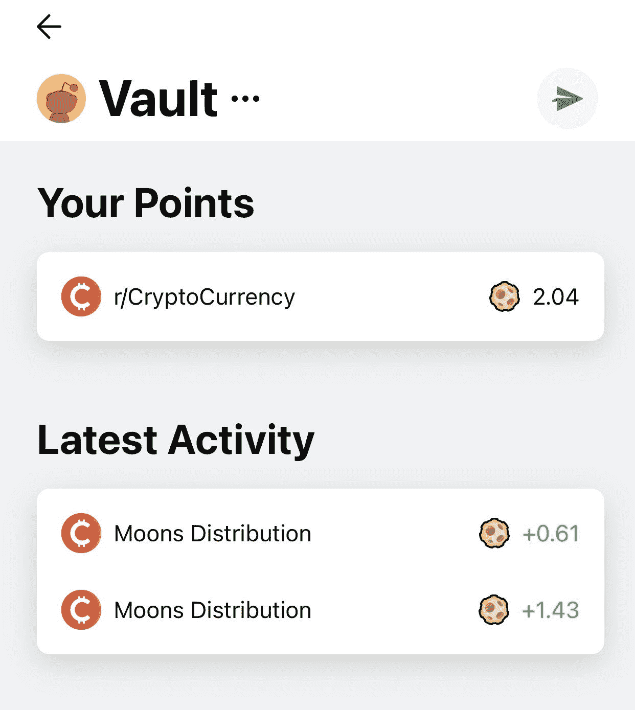
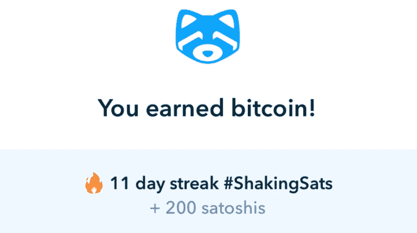

# 最终指南赚取免费，被动加密

> 原文：<https://medium.com/coinmonks/the-ultimate-guide-to-earning-free-passive-crypto-7b879aa3262e?source=collection_archive---------2----------------------->

## 一个几乎详尽的列表，列出了你可以累积 sat 的所有方法——被动的和免费的

## 介绍

如果你在密码领域呆过一段时间，你就会知道“堆积 sat”是这个游戏的名字。

当然，积累 sat 最简单的方法就是定期购买加密软件——这就是所谓的[成本平均法](https://blog.coincodecap.com/dca)。

但是，如果你目前没有工作，或者没有足够的可支配收入来定期存入你的加密投资组合，该怎么办呢？或者你有，你只是在寻找新的方式来补充你的投资。

无论你的情况如何，我已经编辑了一个我认为几乎详尽的列表，列出了你可以被动或免费获得加密的所有非技术途径。让我们开始吧。

# 完全被动的方法

## 勇敢的浏览器

*像平常一样浏览网页赚 BAT*

勇敢的 T4 浏览器是谷歌 Chrome 的克隆版，提供了更高的隐私和安全性。

当你用 Brave 浏览时，你会不时地收到小的、破坏性最小的广告通知(根据你的位置、市场状况和你选择的设置，最多每小时 5 条)。甚至不需要点击这些广告，Brave 就会奖励你他们的原生令牌，基本注意力令牌(BAT)，在撰写本文时价值 0.55 美元。

除了与 Chrome 几乎相同的用户界面，所有 Chrome 扩展都与 Brave 兼容，并且可以导入现有的 Chrome 设置(如书签、自动填充等)。).因此，如果你已经在使用 Chrome，几乎没有理由不切换到 Brave，并开始像平常一样浏览和工作，赚取一些密码！

## 预研究

*像平常一样通过网络搜索获得 PRE*

[Presearch](https://www.presearch.io/) 是一个由社区提供动力，面向社区的去中心化搜索引擎。

当您使用 Presearch 进行搜索时，您会得到他们的原生令牌 PRE，在撰写本文时该令牌的价值为 0.02 美元。每个搜索目前奖励 0.12 PRE，每天收入搜索上限为 30，让您有机会每天赚取高达 3.6 PRE。

预搜索可以被配置为你的浏览器的默认搜索引擎，使它成为一个无缝的，完全被动的方式来赚取，而你通常会搜索。无论出于什么原因，如果你不喜欢他们的搜索引擎提供的结果，只需点击一下鼠标就可以导航到谷歌搜索结果。

***(如果你使用我的推荐链接注册预搜索，一旦你获得 50 点预搜索，并且活跃了 30 天，我们都将获得免费的 25 点预搜索奖励:*******)****

## *吓唬*

**像平常一样获取浏览网页的数据**

**

*[Swash](https://swashapp.io/) 是一个浏览器插件，当你浏览互联网时，它会奖励你收集到的(非常有价值的)数据。*

*Swash 在后台被动而低调地运行，它会以其本机令牌 DATA 的形式为您累积奖励，在撰写本文时，该令牌的价值为 0.10 美元。*

## *返现卡*

**像往常一样通过菲亚特消费赚取加密费**

**

*许多加密平台现在提供(或即将提供)Visa 或 Mastercard 卡，在所有购买中提供现金返还。这些卡包括由[Crypto.com](https://crypto.com/cards)、 [BlockFi](https://blockfi.com/credit-card-waitlist/) 、 [Nexo](https://nexo.io/nexo-card) 、 [Mogo](https://www.mogo.ca/prepaid-visa-card-canada) (仅限加拿大)等提供的卡。*

*最受欢迎的加密返现卡是 Crypto.com Visa 卡，其功能相当于预付费借记卡。这意味着你可以用菲亚特加载它，使用菲亚特消费，并以其本国货币 CRO 获得现金返还。因此，如果你是一个霍德勒，请放心:你不需要花费加密在这里获得加密。相反，你可以被动地堆叠 CRO，同时像往常一样支出菲亚特！*

*除了根据你持有的 CRO 数量提供高达 8%的返现，Crypto.com 卡还拥有许多其他额外福利(也取决于你持有的数量)，包括机场休息室使用权和网飞、Spotify 和亚马逊 Prime 的全额返利。*

****(如果你用我的推荐代码和赌注注册红宝石钢卡或更高级别的卡，我们都将在 CRO 获得 25 美元的奖金:***[***https://crypto.com/app/wjh59rm27x***](https://crypto.com/app/wjh59rm27x)***)****

## *立桩标界*

**利用你的资产赚取利息**

**

*赌注是指锁定你的加密货币，以帮助维持基于赌注凭证(PoS)的区块链的运营。这样做，随着时间的推移，你会得到百分比回报——也就是说，远远超过银行利率的利息。*

*赌注可以在各种密码交易所和专用的赌注平台上进行。其中包括但不限于:[【比特币基地】](https://www.coinbase.com/staking)[【币安】](https://www.binance.com/en/defi-staking)[【北海巨妖】](https://www.kraken.com/en-us/features/staking-coins)[股权资本](https://www.stake.capital/)。*

## *放款*

**通过出借资产赚取利息**

**

*另一种赚取现有加密资产的方法是将它们借出。就像传统金融领域一样，借款人将支付贷款利息，你将获得被动加密。*

*[BlockFi](https://blockfi.com/crypto-interest-account) 和 [Celsius](https://celsius.network/earn-rewards-on-your-crypto) 是两个流行的加密平台，它们通过出借你的密码来提供高利息。*

****(如果您使用我的推荐链接注册了 Celsius，当您购买或转账价值 400 美元的密码时，我们都将获得 40 美元的比特币:***[***https://celsiusnetwork.app.link/102736a805***](https://celsiusnetwork.app.link/102736a805)***)****

## *池采矿*

**用你的 GPU/CPU 挖掘新的比特币**

**

*在撰写本文时，大约有 1880 万个比特币存在，但仍有大约 220 万个比特币有待挖掘。*

*虽然投资一个成熟的加密采矿钻机是一项技术和昂贵的努力，有初学者友好的软件，让你很容易使用你的硬件参与池挖掘。其中包括 [NiceHash](https://www.nicehash.com/) 、 [Honeyminer](https://honeyminer.com/) 和 [EasyMiner](https://www.easyminer.net/) 。*

## *提供流动性/低产量农业*

**通过为分散式交易所提供流动性，赚取荒谬的年百分比收益率(APY)**

**

*以太坊的效用催生了去中心化金融(DeFi)世界，这是一个没有银行和其他中介的无信任金融生态系统的开端。*

*DeFi 的基础是被称为分散交换(DEXes)的协议，它允许用户在密码之间交换。一些受欢迎的指数包括 [UniSwap](https://app.uniswap.org/#/swap) 、 [SushiSwap](https://app.sushi.com/swap) 和 [QuickSwap](https://quickswap.exchange/#/swap) 。*

*然而，为了使指数发挥作用，需要令牌对之间的流动性。这种流动性是用户提供的。*

*当你为 DEX 上的一对代币提供流动性时，当有人在这两个代币之间进行互换时，你将获得每笔交易费用的一部分。许多代币也会奖励你一个额外的代币，增加你的收入。*

*像 [Harvest Finance](https://harvest.finance/) 这样的收益聚合协议将获得额外的象征性奖励，并自动将其重新投资到流动性池中，帮助您节省汽油费，同时自动计算您的利息。*

*结果是天价的年收益率(APYs)让 BlockFi 的 7.5%相形见绌。*

*然而，请注意:DeFi 是现代的狂野西部。它不受监管，本身就有风险。诈骗协议和黑客攻击已经导致数百万美元的用户资金损失。自己做研究，远离高得离谱(且明显不可持续)的产量农场(如提供 100 万 APY 的农场)，投资风险自担。*

## *持有支付股息的代币*

**通过霍德林赚取密码**

**

*外面有很多代币可以支付你去 HODL 的费用。这通常是通过在指定的钱包上下注或者通过将一部分交易费重新分配到代币持有者的钱包中来实现的。*

*分红代币的例子包括 [KMD](https://komodoplatform.com/en/) 、 [KCS](https://www.kucoin.com/) 、[尼奥](https://neo.org/)，以及[蒙克](https://munchproject.io/)和[快乐](https://www.thehappycoin.co/)等慈善代币。*

# *半被动/主动方法*

## *Reddit 月亮*

*通过在/r/CryptoCurrency 上发表评论和帖子来赚取月亮*

**

*月亮是全球最活跃的在线加密货币社区之一 [/r/cryptocurrency](http://reddit.com/r/cryptocurrency) 的官方标志。在撰写本文时，每个月亮价值 0.10 美元。*

*只需在/r/cryptocurrency 上赚取 karma(即，通过评论和发帖获得 upvotes)，你将获得 subreddit 每月月亮分布的一部分，与你相对于其他用户的 karma 成比例。你得到的支持越多，你得到的就越多。*

*申领您的月亮需要使用官方的 reddit 移动应用程序。从这里，您可以选择在社区内使用代币(例如，给用户小费、显示信誉、投票)，或者将代币发送到外部钱包以换取其他代币和硬币。*

## *比特币基地·欧文*

**完成比特币基地的小测验获得密码**

**

*[比特币基地](https://www.coinbase.com/earn)，最受欢迎的密码交易所之一，提供了一个很酷的功能，你可以通过观看视频和完成测验获得各种免费的密码。*

*偶尔更新，这些测验旨在向初学者介绍加密领域的不同项目。当你学习一个特定的硬币或代币时，你会遇到几个选择题，每个选择题都有无限的尝试次数。当你答对时，你将获得你刚刚学到的硬币或代币作为奖励。*

## *韦纳诺*

**访问特定地点赚取 NANO】**

**

*把 [WeNANO](https://wenano.net/) 想象成 Pokemon Go，但是对于 crypto。*

*使用他们的应用程序，你可以收集免费的 NANO 目前价值 3.32 美元-用于访问现实生活中的某些“景点”。*

## *折叠每日旋转*

**每日纺车赚 BTC**

**

*[Fold](https://foldapp.com/) 是一个应用程序，当你通过他们的应用程序购买礼品卡时，可以提供比特币返现，以及返现 Visa 卡。*

*它还包括一个名为“每日旋转轮”的功能，只要每天签到一次并点击“旋转”，就可以获得免费的 sat 或其他应用内的额外待遇。*

*虽然你不能保证每次旋转都能赢得 sat，但你*保证(在撰写本文时)每 7 天连续旋转 250 次 sat。每天抽出几秒钟，这并不算太糟糕。**

## *Shakepay(仅限加拿大)*

**通过每天摇你的手机获得 BTC**

**

*[Shakepay](https://shakepay.com/) 是一个加拿大移动加密平台，号称是“加拿大人买卖比特币最简单的方式”。*

*它拥有一个极简、简洁的用户界面，确实对初学者很有吸引力，通过它的 ShakingSats 功能进一步刺激用户返回。每天一次，你可以(真的)摇动你的手机来获得免费的 sat。*

*在撰写本文时，ShakingSats 奖励从 100 个 s at 开始，每天增加 10 或 5 个，最终达到 1000 个(你需要 200 天才能达到)。之后每天会收到 1000 个摇一摇的 sat。如果你错过了一天，你将从 100 开始。*

*要获得 ShakingSats 的资格，你需要被推荐或推荐其他人使用该应用程序。如果推荐人在注册后 30 天内购买了至少价值 100 加元的密码(一次或多次交易),推荐人和推荐人还可以获得 10 美元的比特币奖励。*

****(如果需要引荐链接才能开始摇，随意用我的:*******)*****

## **发布 0x**

***赚取博客和小费的密码***

****

**Publish0x 是一个类似媒体的平台，用于写关于 crypto 的博客。**

**Publish0x 的收入是由用户提示驱动的。然而，与传统的小费不同，这笔钱实际上并不是从给小费者自己的口袋里掏出来的；相反，Publish0x 本身提供了资金。**

**此外，小费可以调整，这样小费者也可以把钱*放进自己的口袋*。使用滑动比例，给小费者可以选择从给写信者 100%到只给 20%的小费(另外 80%给小费者)。**

**因此，即使你不是一个很好的作家，你也可以使用 Publish0x 赚取一点额外收入，同时通过该网站广泛的信息内容了解 crypto。在撰写本文时，付款以 AMPL(0.94 美元)和 IFARM(91.36 美元)的形式获得奖励。**

## **龙头**

**完成验证码后获得密码**

****

**水龙头是给你微小的密码滴(因此，“水龙头”)的网站，基本上什么也不做(除了完成验证码)。**

**水龙头在让你再次要求之前让你等待的干预时间长短不一，从每天到每 5 分钟不等。大多数要求你达到一定的密码量(例如，20，000 个 sat)才能将你的收入存入你自己的钱包。**

**过去，水龙头曾经免费赠送整枚比特币。如今，数量是如此之少，他们可能不值得你的时间。不过，如果你是一个日复一日花大量时间在互联网上的人，偶尔访问这些网站可能不会有什么坏处。**

**一些受欢迎的水龙头包括[free bitco . in](https://freebitco.in/?op=home#)[trust dice](https://trustdice.win/faucet)和[fire 水龙头](https://firefaucet.win/faucet/)。**

# **我错过什么了吗？**

**请在下面的评论中告诉我！**

****披露:关联链接包括在内****

> **加入 [Coinmonks 电报频道](https://t.me/coincodecap)，了解加密交易和投资**

## **也阅读**

** [## 2021 年 17 款最佳加密交易机器人(免费和付费)

### 2021 年币安、比特币基地、库币和其他密码交易所的最佳密码交易机器人。四进制，位间隙…

medium.com](/coinmonks/crypto-trading-bot-c2ffce8acb2a)  [## 存储比特币的最佳加密硬件钱包[2021]

### 保管您的数字资产很容易，但找到正确的存储方式却是一项繁琐的任务。在线钱包有一个风险…

blog.coincodecap.com](https://blog.coincodecap.com/best-hardware-wallet-bitcoin)**