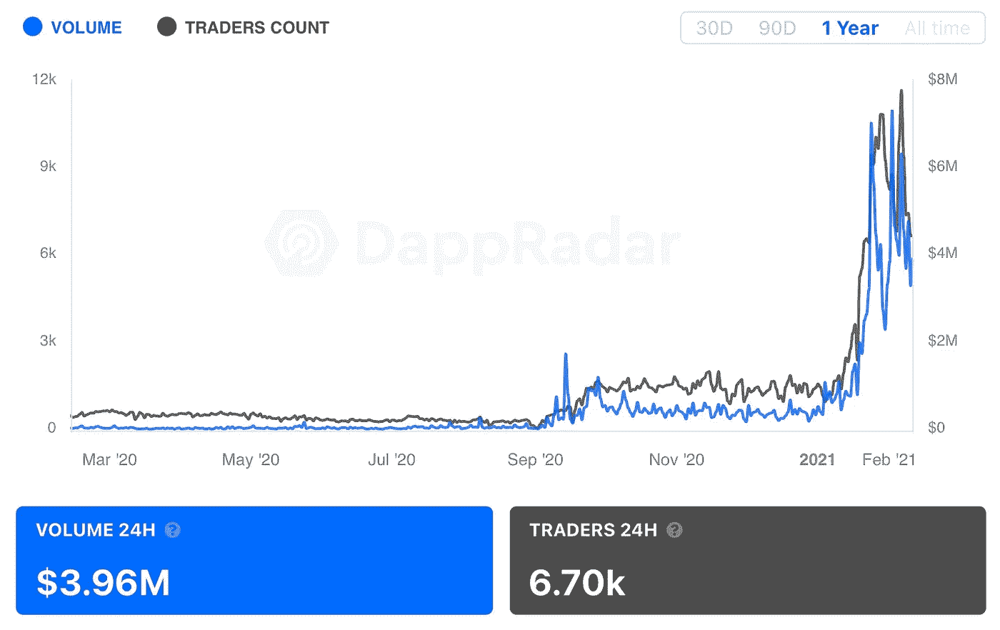
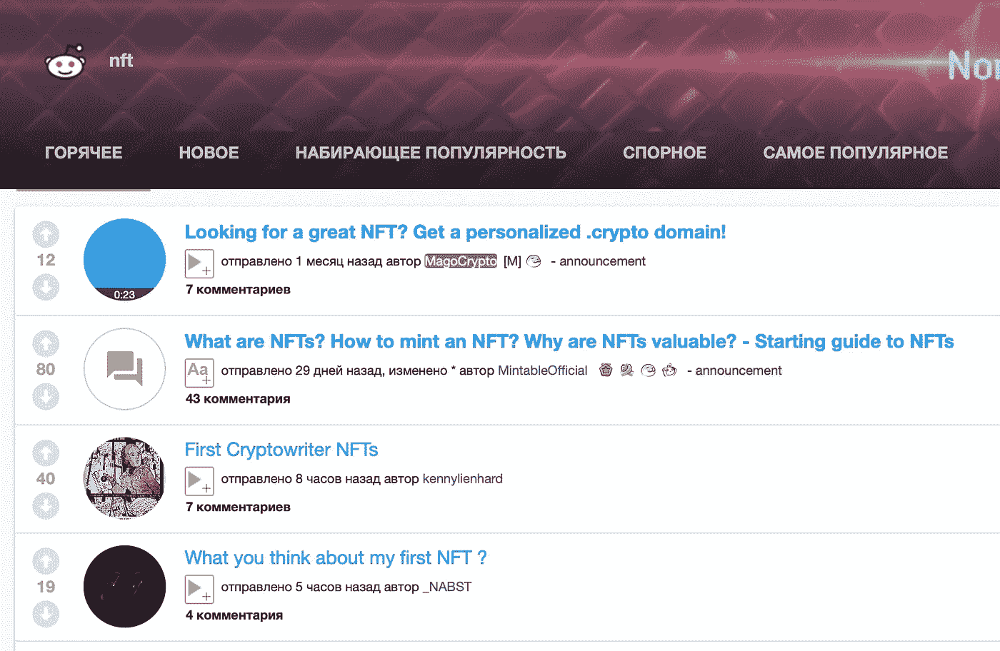
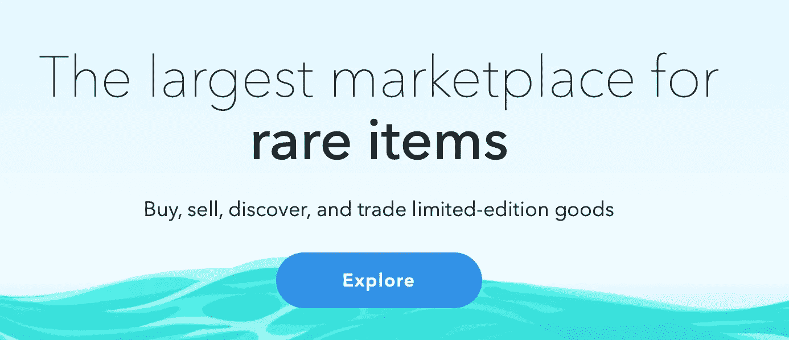
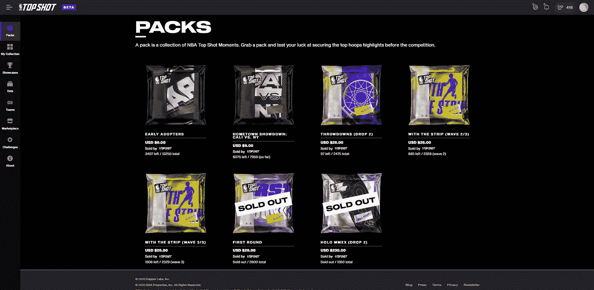
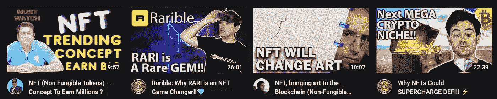

# NFT 营销和推广终极指南

> 原文：<https://medium.com/coinmonks/the-ultimate-guide-to-nft-marketing-and-promotion-b13c9b02aa3d?source=collection_archive---------0----------------------->

NFT (Non Fungible Tokens) Marketing and Promotion Guide

NFT 代币越来越受欢迎了。创建、销售和交换各种数字项目、艺术品、游戏物件和其他事物的能力吸引了大量的收藏家和交易商，以及在该领域工作的项目、艺术家和开发者。例如，以太坊上的 NFT 市场在 2021 年 1 月增长了 10 倍。

NFT market size

许多人把不可替代代币的趋势与普通代币的趋势联系在一起。事实上，许多密码爱好者和 DeFi 专家对这个领域非常感兴趣。我确信这种趋势只会增长，NFT 将会发现大量不同的用例。NFT 可能会改变不止一个行业，以及我们在虚拟和现实世界中与许多事物的互动方式。

我已经写过什么是 NFT 以及如何发行你的 NFT 代币。假设您创建了自己的 NFT 项目。今天我想详细谈谈如何为你的 NFT 项目进行推广和营销公司，如何让世界听到并对你的不可替代的令牌感兴趣。

[我参与了大量的项目](http://x10.agency/?ref=hackernoon.com)，我看到了一些我想分享的模式和必要的东西。

# 1.NFT 理念及其实现

作为一个基础，我们将把你有一个强有力的、有趣的想法和它的实现作为事实。我们不会在这一点上做进一步的阐述，我们会假设默认情况下你的项目在所有参数上都值得大量关注，包括技术实现、良好的文档和演示、网站和其他必要的文档，这取决于项目。

# 2.NFT 社区项目

对于大多数加密项目来说，社区是至关重要的。NFT 也不例外。你的主要社区是那些支持你、宣传你、投资你和购买你的非功能性食物的人。

让我们来谈谈如何建立一个初始社区

# SMM 代表 NFT

一定要利用你的社交网络。理想的做法是以这样一种风格来引导他们，让一些帖子成为病毒式传播。NFT 不仅是关于精通密码的人，也是为了普通观众。这将是一个很好的介绍，让人们了解为什么他们必须为一些数字图像/作品付费，以及它的真正价值是什么。作为一个标准，我们建议我们的客户管理:脸书，Twitter，Medium，Reddit，LinkedIn(可选为企业页面)

# NFT 社区的电报和不和谐聊天

如果 Telegram 已经是加密项目社区的一个已建立的通信渠道，那么 Discord 就是一个很好的选择。在同一个频道内创建不同的聊天很方便，这绝对是一个巨大的优势。此外，NFT 产业与博彩业非常相似，不和谐就是为博彩业而产生的。

Discord for DeFi/NFT projects

然而，就加密用户数量而言，Telegram 仍然是“头号”平台。因此，我们仍然建议创建两个通道，从 Telegram 开始(但在某些情况下，先选择 Discord 也是有道理的)。确保从项目聊天中交流的团队是有能力的，有礼貌的，对项目很了解，在 FAQ 上工作，并及时回应问题和反馈。通常，用户认为支持团队是项目的代言人。

# NFT 社区参与

我们总是建议你在各种平台上围绕自己创造一个话题——这不仅有助于推广，也有助于从社区获得足够的反馈。如果你在 BitcoinTalk、Reddit、Telegram、Twitter 等网站上有多个账户，这很好。不要忘记，你不应该传播垃圾邮件和洪水，并在那些相关的对话中，提到你的项目，并询问社区对它的意见。通常，这样的策略，除了一个新鲜的外观，还可以为社区带来新的参与者。

NFT Reddit

总的来说，下面描述的所有其他推广方法也在以这样或那样的方式增加社区，但我把它们单独挑出来，因为它们也负责其他任务。

# 3.NFT 市场和列表

已经有了市场，各种 NFT 项目可以出售他们的想法和代币。它们是多种多样的，所以尽量选择适合你项目特点的(如果有的话)。

NFT Marketplaces

例如，在最大的 NFT 市场中:

*   [OpenSea](https://opensea.io/?ref=hackernoon.com)
*   [超级罕见](https://superrare.co/?ref=hackernoon.com)
*   [稀有](https://rarible.com/?ref=hackernoon.com)
*   [制作者放置](https://makersplace.com/?ref=hackernoon.com)

了解你可能喜欢哪个市场，或者创建你自己的市场。在第二个选项中，不要忘记把你自己的市场放在各种 NFT 市场和项目列表中。你也可以在像 NFT 猎人这样的追踪器上列出你的项目。

# 4.界面。协作

一个小提示:试着做一个最方便和最实用的界面，通过它用户可以买卖你的 NFT。例如，为了这个目的，我的团队中有一个专门的 UX/UI 专家，他评估我们客户的特定服务的可用性。理想情况下，即使是一个远离加密的用户也应该明白如何简单地买卖，而不需要了解 ERC-721 或其他标准、区块链和任何相关的东西。一个很好的例子就是“心流项目”在它的 [NBA 顶级镜头](https://www.nbatopshot.com/?ref=hackernoon.com)中的表现。

NBA TopShot NFT

“心流”的另一个显著特点是高调的合作:比如 NBA 和 UFC。大多数收藏家甚至可能还不知道他们购买了 NFT。这是一次非常成功的入职。

# 5.NFT 的 AMA 会议

AMA 会议进行得非常顺利。他们帮助向社区介绍项目，更深入地理解概念，见项目领导和执行人员，他们如何回应，他们的计划是什么。

首先，你应该在大型电报聊天和 YouTube 频道上举办 AMA 会议，为自己吸引新用户。然后，在 Telegram 和 Discord 中，在您的社区内进行内部 AMAs。

*一个小提示:不要忘记为社区准备有趣的奖励，这样 AMA 进程会更有吸引力，会有更多的人参与进来(也有更多的方法来推广这种 ama)。*

# 6.NFT 的影响者(KOL)

与意见领袖和有影响力的人一起做广告很重要，但并不总能带来立竿见影的效果。通常，有影响力的受众需要在成为你所在社区的一员之前，在其他地方听说过你(尤其是在他谈论你之前)。有时候，影响者本身不会带来很多新的受众，但对于老受众来说，这是一个优势——意见领袖谈论他们关注的项目。总是试图在影响者要求的价格和他的视频下的观看/评论数量之间找到最佳选择。一般来说，这个工具不会是多余的。

NFT influencers

# 7.NFT 公关

当然，媒体对你的报道越多越好。尝试进入不同的出版物和不同的格式——从关于你的项目的完整文章到其中的提及、采访和引用。除了加密媒体之外，您还可以使用一般媒体，这取决于项目的具体情况。你也不应该期待立竿见影的效果。这是维护声誉的必要措施，只有这样才能吸引新的社区。

# 8.NFT 的横幅

对于一些项目来说，横幅广告非常有用。你可以在像 CoinTelegraph、CoinGecko 等大型网站上放置横幅广告，也可以在更多专注于 NFT 的小众网站上放置。这不是首要措施，但如果有额外的预算，那么至少尝试一下。

# 结论

你也可以为 NFT 项目想出更多个性化和非标准的推广方式，但一切都取决于特定项目的具体情况。

然而，正如我们在开始时所说的，不可替代的代币有可能会改变整个行业。所以，如果你给自己选择了这样一条路，那就让尽可能多的人知道吧！

*同时，如果你对 NFT 有任何疑问，或者你是一个 NFT / DeFi / crypto 项目，想知道更多如何推广你的项目，你可以随时通过*[*Telegram(@ baloyan)*](http://t.me/baloyan?ref=hackernoon.com)*或* [*LinkedIn 联系我。*](https://www.linkedin.com/in/sbaloyan/?ref=hackernoon.com)

# 查看我以前的文章:

*   [**营销 DeFi 项目终极清单**](https://hackernoon.com/the-ultimate-checklist-for-marketing-defi-projects-f71a3wod?ref=hackernoon.com)
*   [**如何发行不可替代代币(NFT)**](https://hackernoon.com/issuing-non-fungible-tokens-nfts-a-how-to-guide-ckj3wz2?ref=hackernoon.com)
*   [**如何在 UniSwap 上列出您的 DeFi 令牌**](https://hackernoon.com/how-to-list-your-defi-token-on-uniswap-d4s3w7s?ref=hackernoon.com)
*   [**中国新国家加密货币如何改变一切**](https://hackernoon.com/how-chinas-new-national-cryptocurrency-changes-everything-sc4032eq?ref=hackernoon.com)
*   [**2021 年密码产业 6 大预测**](https://hackernoon.com/6-predictions-for-crypto-industry-in-2021-without-trading-5f2b3z8c?ref=hackernoon.com)

> 加入 Coinmonks [电报频道](https://t.me/coincodecap)和 [Youtube 频道](https://www.youtube.com/c/coinmonks/videos)获取每日[加密新闻](http://coincodecap.com/)

## 另外，阅读

*   [密码电报信号](http://Top 4 Telegram Channels for Crypto Traders) | [密码交易机器人](/coinmonks/crypto-trading-bot-c2ffce8acb2a)
*   [复制交易](/coinmonks/top-10-crypto-copy-trading-platforms-for-beginners-d0c37c7d698c) | [加密税务软件](/coinmonks/crypto-tax-software-ed4b4810e338)
*   [网格交易](https://coincodecap.com/grid-trading) | [加密硬件钱包](/coinmonks/the-best-cryptocurrency-hardware-wallets-of-2020-e28b1c124069)
*   [最佳加密交易所](/coinmonks/crypto-exchange-dd2f9d6f3769) | [印度最佳加密交易所](/coinmonks/bitcoin-exchange-in-india-7f1fe79715c9)
*   [面向开发人员的最佳加密 API](/coinmonks/best-crypto-apis-for-developers-5efe3a597a9f)
*   最佳[密码借贷平台](/coinmonks/top-5-crypto-lending-platforms-in-2020-that-you-need-to-know-a1b675cec3fa)
*   杠杆代币的终极指南
*   [加密交易的最佳 VPN](https://coincodecap.com/best-vpns-for-crypto-trading)
*   [火币的加密交易信号](https://coincodecap.com/huobi-crypto-trading-signals) | [HitBTC 审查](/coinmonks/hitbtc-review-c5143c5d53c2)
*   [TraderWagon 回顾](https://coincodecap.com/traderwagon-review) | [北海巨妖 vs 双子座 vs BitYard](https://coincodecap.com/kraken-vs-gemini-vs-bityard)
*   [如何在 FTX 交易所交易期货](https://coincodecap.com/ftx-futures-trading)
*   [OKEx vs KuCoin](https://coincodecap.com/okex-kucoin) | [摄氏替代品](https://coincodecap.com/celsius-alternatives) | [如何购买 VeChain](https://coincodecap.com/buy-vechain)
*   [3 commas vs . Pionex vs . crypto hopper](https://coincodecap.com/3commas-vs-pionex-vs-cryptohopper)
*   [如何使用 Cornix 交易机器人](https://coincodecap.com/cornix-trading-bot)
*   [Bitget 回顾](https://coincodecap.com/bitget-review) | [双子座 vs BlockFi](https://coincodecap.com/gemini-vs-blockfi) cmd| [OKEx 期货交易](https://coincodecap.com/okex-futures-trading)
*   [用信用卡购买密码的 10 个最佳地点](https://coincodecap.com/buy-crypto-with-credit-card)