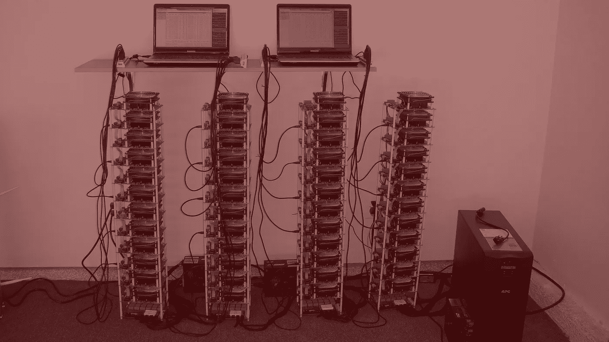

# 你理解加密货币及其工作原理的终极指南——你应该成为它的一部分吗？

> 原文：<https://medium.com/coinmonks/the-ultimate-guide-to-understanding-cryptocurrency-and-how-it-works-should-you-be-a-part-of-it-fe3a448c7a72?source=collection_archive---------2----------------------->

人们谈论加密货币，好像他们明白它是什么，但在真正的意义上，他们并不明白。不久前，许多金融机构都在投资研究加密货币。

在本指南中，我将向您解释什么是加密货币，它的起源，它是如何工作的，以及为什么您应该使用它。我还会介绍一些著名的加密货币。

# **什么是加密货币？**

我可以告诉你，加密货币是未来的货币，或者我应该说是下一代货币？是的，这是货币的未来，如果有人明白的话。

加密货币是一种数字货币或货币，设计为高度安全且大多匿名。使用加密货币时，您可以放心，您的交易是安全的，并且您的地址(不像在银行账户中)永远不会被泄露。没有黑客的威胁。

**加密货币的起源**

不是每个人都知道这一点，但用最直白的方式说，加密货币的诞生是另一项发明的错误的结果。第一种、也是最著名的加密货币比特币的发明者从未打算创造一种货币。

2008 年，中本聪，这位不知名的比特币发明者称，他正在开发一种“点对点”电子现金交易系统，以避免重复消费。

Satoshi 成功地发明并创建了一个分散式交易系统，成功地完成了许多人在 20 世纪 90 年代未能完成的事情。这是一项独一无二的发明，已经开始彻底改变我们的交易方式。

Satoshi 目睹了许多发明家试图创造一个集中的数字现金系统，但都悲惨地失败了。我们会说，他不想掉进同一个坑，所以他用了不同的路线。正如他们所说，如果你要取得不同的结果，你必须改变公式。于是 Satoshi 决定开发一个去中心化的系统，这就导致了加密货币的诞生。

为了进行数字现金交易，需要有一个账户，由某人拥有，并且有足够的余额。这些帐户由一个中央服务器控制，其中保存了所有帐户的详细信息，包括余额和过去的交易。作为账户持有人，你无法控制它。

创建数字货币系统的主要目的过去是，现在仍然是消除实体的重复支出，并让世界控制他们的货币和控制他们如何交易的权力。这在集中式服务器系统中是无法实现的。

但是加密货币使之成为可能。

在分散式系统中，不需要中央服务器。简单来说，就是点对点。网络中的每个对等点都有一个所有事务的列表。他们有权力检查和批准购买，确保它是安全的，没有双重消费的企图。

为了使交易有效，对等体之间需要达成共识。如果他们没有一个协议，中央服务器必须找到一种方法，使协议到位，交易得到确认。

这是针对集中式服务器系统的。

那么，在没有中央服务器的地方，怎么可能达成共识呢？中本聪通过加密货币使之成为可能。许多人认为这是不可能的。他设计了这个系统，交易被确认不是因为有一个共识，而是如果他们匹配。

# **加密货币是如何工作的？如何确认交易？**

这是管理加密货币世界的机制。

任何像以太坊或比特币这样的加密货币都是由对等网络组成的。所有过去的事务记录被分发给网络上的每个对等体。他们可以在区块链上查看每个账户的详细信息。

要定义一个加密货币交易，假设 Sam 向 Nzilili 转账 100 个比特币。Sam 将使用他的公钥/私钥(公钥加密)进行签名，以完成交易。在他签名后，交易细节从他的帐户传递到网络上的每个其他对等点，这被称为对等交易。同行批准交易，矿工确认交易。然后 Nzilili 的钱包里会有他的比特币。

签名后，详细信息会立即在整个网络中传递。实时的。然而，确认需要一定的时间才能完成。如果没有得到确认，加密货币交易将被视为不完整。只有一个矿工能证实区块链的交易。

现在，在确认之后，这只能由矿工来完成，交易变成了一块石头，或者说是一块石头。它成为过去不可变事务的一部分。事务(块)加入区块链，您不能更改它。没有人可以，即使是矿工。一旦交易被确认，即使是比特币的创始人 Satoshi 也不能撤销交易。

为了向网络上的对等体显示交易已被确认，矿工将其标记为合法，并将其传播到所有节点(系统上的计算机)。每个节点都将这个块添加到其数据库中，现在它成为区块链的一部分。

该系统对矿工确认交易进行奖励，我们可以说这是加密货币交易中最重要和最关键的部分，具有给定加密货币的令牌，例如以太坊或比特币。

# **你能当矿工吗？**

这个问题最有效的答案是肯定的！每个人都可以成为矿工。这主要是因为加密货币系统没有将这项任务具体委托给任何人。这是一个分散的系统，因此没有中央权威来管理它的功能。

然而，由于缺乏一个管理该系统的中央实体，中本聪建立了一个防御机制，以确保没有任何一个统治机构能够滥用该系统。举个例子，一个给定的实体伪造了成千上万的交易，并把它们传播给了他创建的同行。

加密货币系统会立即崩溃。

因此，为了确保这种情况永远不会发生，Satoshi 制定了一些规则，或者说是一种状态，即矿工必须在他们的计算机上投入一些工作。

矿工们需要找到一种加密函数的产品，把新的区块和它的前身连接起来。加密产品被称为散列。

这个过程被称为工作证明。

您不必对工作证明机制有太多的了解；你应该注意到，这是矿工为赢得代币奖励而努力解决的密码难题的基础。

一旦矿工找到了解谜的方法，他们现在可以将它转换成一个方块，它就有资格成为区块链的一部分。

在比特币中，密码难题被称为 SHA 256 哈希算法。在解决这个难题后，矿工获得了创建 coinbase 交易的权利，作为回报，他们可以获得给定数量的比特币。

这就是加密货币挖掘的方式，只有在解决了 SHA 256 难题之后，你才能说你已经创建了一个有效的比特币。

现在，投资是这样进来的。为了能够解决这个相对复杂的密码难题，你需要一台超级强大的计算机。在给定的时间内，你还可以获得一定数量的代币。

Satoshi 没有给任何同行留下绕过这条规则的漏洞，因此只有少数人能够设法进行第一手挖掘。超级强大的计算机相当昂贵，不是每个人都能买得起的。出于这个原因，许多加密货币交易商只是经纪人，购买和销售。

# **你为什么更喜欢加密货币而不是法定货币？**

如果你密切关注比特币，作为最受欢迎的加密货币之一，它比你在普通银行账户中的余额更多。你的银行账户余额只是你在数据库中看到的条目。数据库是由你不了解的人和规则控制的。当你发现即使是你在银行里打交道的人也对管理你的钱的规则一无所知时，不要感到震惊。

加密货币不同，交易是在一个去中心化的系统上进行的，没有单一的实体负责整体控制，也没有规则。交易由 match 执行，而不是传统银行的那套规则。

让我们看看为什么你应该更喜欢加密货币而不是法定货币的一些原因。我们将看看加密货币的突出特性。

# **1。** **快速无边界**

交易几乎实时执行。矿工最多需要两分钟来确认交易。由于区块链是来自世界各地的许多节点(计算机)的连接，您的地理位置对您的交易完全没有影响。当你在肯尼亚时，你可以从英国的买家那里购买，而不需要支付汇率。

# **2。** **不可逆**

一旦交易被标记为合法，它就完全不可改变。交易一经确认，任何人都不能撤销。不是批准它的矿工，甚至不是发明比特币(最流行的加密货币之一)的中本聪。

# **3。** **安全**

加密货币通过使用公共密钥的加密系统安全锁定。如果你不拥有那个钱包，你就不能从里面转移比特币。句号。加密货币地址使用强大的加密技术和大量的数字，这使得即使是技术高超的黑客也不可能破解该方案。

你可以担心外星人袭击地球，而不是有人泄露你的比特币地址。

# **4。** **化名**

这是我最喜欢的加密货币的交易属性。没有任何东西将我与我的加密货币交易联系起来。连地址都没有。我可以把比特币发给我的隔壁邻居，他不会知道是不是我发的。

# **5。** **无权限**

加密货币没有看门人。你不需要征得任何人的同意。它只是一个软件，任何人都可以下载，安装在他们的电脑上，并开始交易。任何人都可以发送和接收比特币或任何其他加密货币。

# **常见的加密货币**

加密货币对全球经济产生了如此巨大的影响，连中本聪都不敢想象。我们可以说，这主要是由于其革命性的属性，推翻了法定货币。

虽然比特币是世界上第一种加密货币，但已经出现了许多其他加密货币。有些已经变得太受欢迎，而其他人仍然在努力坚持自己的立场。

以下是一些常见的美元现值。

# **1。** **比特币——6846.92 美元**

这是 2009 年由匿名大师中本聪发明的第一种加密货币。它也是全球交易量最大的。Satoshi 也是创造比特币区块链的同一个人。

# **2。** **以太坊——380.78 美元**

这在价值和受欢迎程度上都排在比特币之后。区块链以太坊由 Vitalik Buterin 于 2015 年创建，使用一种名为以太的货币代币。以太坊因其灵活性而广为人知，允许开发者创建其他链。我们可以称它为区块链发射台。

以太坊不仅可以用来处理日常交易，还可以用来方便其他复杂的合同和程序。主要用于开发众筹项目。

# **3。** **莱特币——118.52 美元**

这是继比特币之后的第一批加密货币。如果比特币是黄金，它就被称为白银。它在设计上类似于比特币，但发展速度稍快，为更多创新让路。

莱特币已经发展到允许更快的支付，并适应更多的交易。

# **4。** **纹波——0.4924 美元**

Ripple 于 2012 年发明，不仅用于加密货币交易跟踪，还服务于包括银行业在内的许多其他行业。

与其他存储和交换价值的加密货币不同，Ripple 更像是一种保护系统免受垃圾邮件攻击的令牌。

我们可以说它是加密货币中最讨厌的，也是最不受欢迎的。许多人将其称为“非真正的”加密货币。

# 总而言之，我们会说…

加密货币市场正在飞速发展。几乎每天都有新的密码发明。那些尽早采用新发明的人会变得富有，而晚投资者会失去他们的钱，但不总是这样。

市场很脏。

但这一事实并不意味着加密货币会走向任何地方，不，它会留在这里。

加密货币正在彻底改变世界。已经发生了。人们正在将他们的法定货币转换成比特币，以避免未来货币波动时的贬值。许多部门正在采用区块链来改善服务提供。

加密货币正在改变世界。银行和其他金融机构正在失去控制。他们不喜欢，但是他们没有别的选择。

每一项发明都有革命性的承诺，但只有少数能经受住时间的考验。

您现在对加密货币及其功能有了更多的了解。你可以成为它给世界带来的变化的一部分，也可以站在一边看着。