# 密码交易和投资新手终极指南

> 原文：<https://medium.com/coinmonks/the-ultimate-newbies-guide-to-crypto-trading-and-investing-a52dcd5a2fc9?source=collection_archive---------8----------------------->

## 或者:如何在密码市场不破产

随着比特币在其他许多新人进入太空后达到历史新高。虽然这给散户投资者带来了巨大的机会，但如果你不知道自己在做什么，盲目投资，也会带来很大的风险。最大的危险是:你正在进入这些市场，并立即赚钱，认为这很容易——直到我们最终进入熊市，你做出情绪化的决定，这对大多数人来说都不会有好结果。

# 序

## 关于这篇文章

在这篇文章中，我想教你市场的基础知识(尤其是加密)，技术分析和风险管理。这将是一篇很长的文章，因为我不会只告诉你在 Y 美元购买 coin X，但我会详细说明为什么某些项目是有趣的。我也会教你自己找好入口的技巧。你不应该依靠另一个人的电话或一些私人电报组(他们都是骗局)来做出这些决定。如果你仔细阅读这篇文章，并遵循列出的例子，你会比 90%的市场参与者获得优势。我们还将探讨交易和投资之间的区别，最终，你将能够提出一个适合你的可能性和生活方式的长期积累财富的策略。你将要阅读的许多主题对投资者*和交易者*都是必要的。我们将在需要的地方解释不同之处。

如果你已经熟悉生态系统和技术分析，在文章的底部还有一个简短的总结。如果你对其中一个领域很熟悉，跳过相关部分或者直接跳到最后，如果你对两个领域都很熟悉的话。

## 关于我

我从 2017 年开始交易 crypto。你可以说我相对来说是这个领域的新手，但我经历了一个完整的市场周期，我赚了几十万美元，也赔了几十万美元。我基本上犯了所有可能的错误。虽然这是一次痛苦的经历，但我相信这对我成长和真正从这些错误中吸取教训是必要的。

如前所述，回想起来最大的问题是，当比特币突破 ATH 约 1100 美元时，我进入了市场，我很快成为了*的富人*。这是致命的，因为我认为我赚钱是因为我的行动，而不是我只是在牛市中。在我们深入讨论之前，你必须明白一件事:在牛市中，每个人都是天才。如果你在过去的 6 个月里随便投资了一个加密项目，你可能会获得 5-10 倍的回报。人们很容易陷入这种思维定势，认为这种情况会永远持续下去，尤其是当你第一次经历这种情况的时候。我以前经历过一个完整的市场周期，在几个月内损失了大量资金。

由于我们现在正处于前所未有的牛市，每个人都在赚免费的钱，许多人在 2017 年和我处于相同的情况——我觉得我有义务不仅警告你我们将再次进入熊市，而且让你做好最坏的准备，这样你不仅能在下一次熊市中生存下来，还能茁壮成长。

虽然我的交易量不再像 2017 年那样大(最近 30 天，币安的 BTC 成交量为 6)，但我做得相当好。从今年(2021 年)1 月到 3 月，我的加密组合增长了 800%。值得一提的是，我并没有简单地把钱投在一个 8 倍的随机项目上。每当我建仓时，我都有一个止损点和一个目标，我只会在有限的时间内持仓。在任何时候，我都尽量降低我的下跌风险，限制我可能损失的资本。这也意味着我失去了利润。我卖出，价格又上涨了 50%——但这没关系。我不再觉得我错过了什么。因为事实上，今年我已经在短短几个月内获得了 800%的收益。有人盲目持有他的硬币，自 1 月份以来，他的硬币涨了 20 倍，跑赢了我，但一旦我们进入熊市，我会跑赢他。此外，有一件事我终于明白了:市场意味着*无尽的机会*！你今天错过参赛了吗？你退出得太早了吗？现在不是去 FOMO 的时候(害怕错过)。不久之后会有另一个机会。正如沃伦·巴菲特所说:

> 规则一:永远不要赔钱。
> 规则二:永远不要忘记规则一

起初这听起来很愚蠢，但最终，这归结为风险管理。你做的每一笔投资，每一笔交易，你都在把钱置于风险之中。如果你的投资组合损失了 50%，你需要获得 100%的利润才能赚回来。如果有可能限制你可能损失的钱数，你必须让它们有价值。可能性很简单:技术分析和止损单。你只需要知道如何使用它们。对投资者来说，止损单的作用不如交易员重要，但以后会更重要。

# 先决条件

在我们开始之前，我还想先说一件重要的事情:

*在任何时候，你的投资都不应超过你能够承受的损失*。

我知道这听起来很老套，但是特别是如果你是这个领域的新手，你会犯错误。你会读到这篇文章，你会读到风险管理，你会认为你知道得更多。你*会*承担你不应该承担的风险，而你*会*亏损。这只是游戏的一部分。因此，如果这是你第一次进入这个市场，帮你自己一个忙，问问自己:如果你完全蒸发你的投资组合，你会没事吗？如果没有，你应该慢慢来，从小处开始，一旦你有信心，你可以增加赌注。

如果你有纪律和耐心，你可以在这些市场赚很多钱，并限制下跌风险。但是大部分新人都会有几次措手不及。如果你在情感上依恋金钱，并且已经下定决心要如何花钱，你也会做出情感上的决定。驱动这些市场的两种最强烈的情绪是贪婪和恐惧，无论何时你基于这些情绪做出决定，那都是错误的决定。贪婪会让你在牛市中走得更远，但它是你在上涨时不卖出的原因，恐惧是你亏本卖出头寸的原因，即使从技术角度来看这是不理性的。

你应该有一份稳定的收入，足够你过上舒适的生活，你不需要的东西都是你可以投入市场的钱。如果你每个月没有 500-1000 美元的资金投入市场而不影响你的生活方式，你要么赚更多的钱，要么降低你的生活水平。

# 交易与投资

在整篇文章中，你会看到我经常使用“交易”这个词。这并不意味着这些信息只适合交易者而不适合投资者。同样作为投资者，你本质上是在交易。唯一的区别是你交易的时间范围更大(后面会有更多)。这意味着，作为一个交易者，你进入交易，想在几天或几周内退出，作为一个投资者，你进入交易，想在几个月或几年内退出。对此有不同的看法，但这就是我们在本文中提到的。除此之外，在投资时，这些交易的执行还有其他不同之处，我们将在文章末尾用一个更具体的例子来说明。
当谈到交易时，我们*从不*提及交易日内行为(在同一天内买入和卖出)。这个领域由自动化交易机器人主导，这些时间框架内的信号变得越来越不可靠，因此在这些水平上盈利要困难得多。

# 为什么你需要了解技术分析

大多数进入这个领域的人投资项目纯粹是因为他们喜欢这个想法，甚至更糟:因为价格上涨。即使你通过更深入地研究这个项目来做一个基本的分析:记号经济学、CEO &团队、营销和技术——一切看起来都很好；这并不意味着你应该投资。

我知道技术分析对很多人来说听起来很无聊，但它对于为你的资产找到好的进场和出场是至关重要的，并帮助你保护你的资本。如果你愿意持有这些项目几年，经历一个-90%的周期，你可以不需要技术分析就可以做到，但如果你想保护你的资本，并最小化下行风险，你需要它。

我相信图表告诉了你需要知道的一切，但是即使你不同意，基本面分析和技术分析的结合会给你更好的结果。如果一个项目有非常好的基本面，但时机不好，他们在熊市周期开始时发布产品，这些基本面在中期是没有价值的。此外，你永远不会有所有的信息来真正知道资产是被高估还是低估。最有可能的是，你能在网上获得的信息已经被定价了。另一方面，技术分析可以给你基本面分析无法给你的洞察力。例如:如果你看到一个项目长时间以低价交易，几周内交易量不断增加，这表明有人掌握了内幕信息，并在积累(在较长时间内买入大量资产，而不影响价格)。尽管你永远也不会知道这些内幕信息是什么，但购买这项资产的风险/回报会变得更好，因为你已经知道有人在它身上下了大赌注。

所以让我们复习一下技术分析的基础知识。

# 技术分析

对于你所有的技术分析，我推荐使用 TradingView。你可以在这里找到 BTCUSD 图表[。你应该按照下面所有的例子，在那里摆弄 UI，试着熟悉它。以下所有示例都将基于 BTCUSD 图表。这有几个原因，我们将在后面的市场分析中更深入地讨论。就目前而言，只要知道比特币构成了整个加密市场总市值的最大部分，并且这个市场的每项资产都受到它的严重影响就足够了。不管你想买哪种资产，还是要分析比特币。既然我们无论如何都要做，这里是一个开始的好地方。](https://www.tradingview.com/chart/?symbol=BITSTAMP%3ABTCUSD)

## 蜡烛

你应该做的第一件事是选择蜡烛棒图作为你分析的基础。蜡烛线本身容易阅读，赏心悦目，本身就能给出好的进场和出场信号，尤其是在较高的时间框架内。

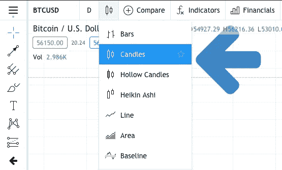

该下拉菜单旁边的时间框架设置为 **D** ，代表**日报**，意味着每根蜡烛代表一天的价格走势。

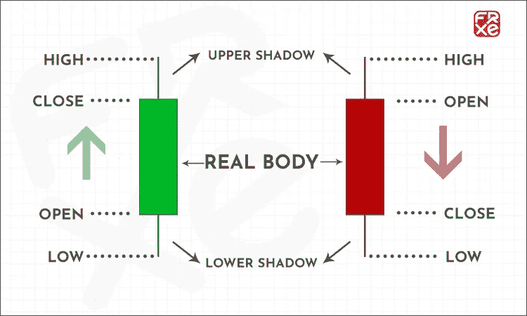

因此，如果一天从 10，000 美元开始，涨到 11，000 美元，下跌到 8，000 美元，最后涨到 9，000 美元，那么您就有:

开盘:10，000 美元
高:11，000 美元
低:8，000 美元
收盘:9，000 美元

因为收盘价比开盘价低，蜡烛线是红色的——所以这一天价格下跌了。如果收盘高于开盘，蜡烛是绿色的。绿蜡烛叫看涨，红蜡烛叫看跌。

有烛台模式，其中多根蜡烛表明看涨或看跌的后续行动。这里不想多赘述，因为以我的经验这些模式都不太靠谱，不过这里还是想举个小例子。

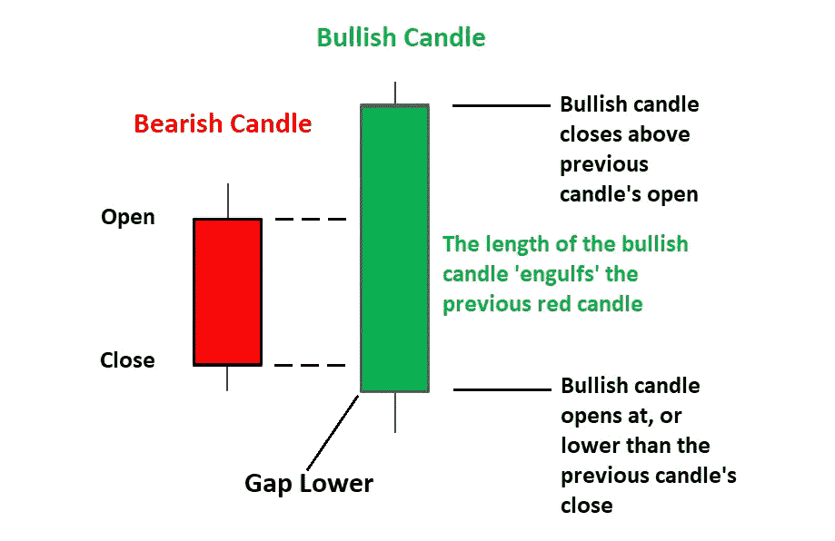

你在上面看到的是多头吞没蜡烛线形态。它表明价格看涨。下面你可以看到 BTCUSD 的周线图(每根蜡烛线显示一周的价格走势)。我们可以在 2017 年 11 月 6 日和 2017 年 11 月 13 日开始的几周内看到看涨的吞没模式。随后是 136%的价格移动到最后一个牛市周期的最终顶部。

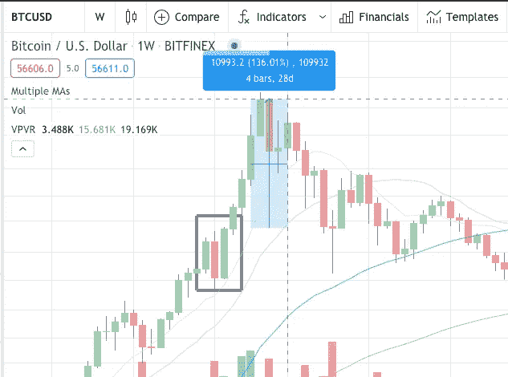

如果你想了解更多关于烛台图案的知识，可以在 [Investopedia](https://www.investopedia.com/articles/active-trading/092315/5-most-powerful-candlestick-patterns.asp) 上看看这篇文章。但是对于我们在这篇文章中提出的策略来说，它们并没有起到很大的作用。

## 时间框架

在左上角，你可以选择蜡烛的时间范围。

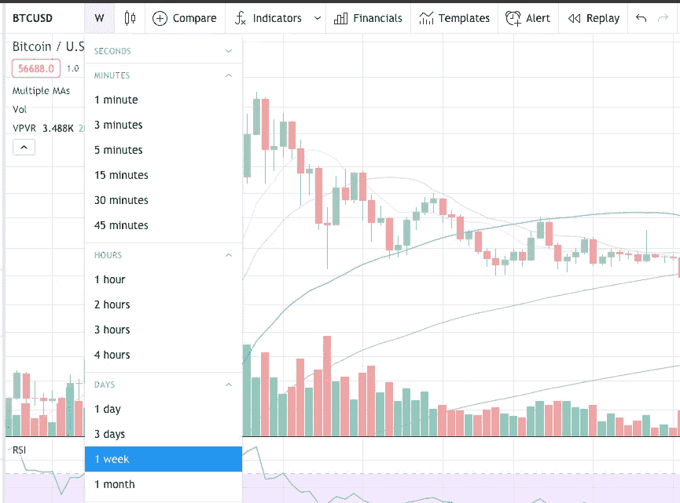

对于长期投资和确定整体趋势，你最好坚持周(W)和月(M)时间框架。对于交易和短线机会，你应该坚持日线(D)和 4 小时线(4H)。
一般来说，你应该交易更大的趋势。举例来说，如果前面的例子显示多头吞没了周线，因为 4H 图上有看跌信号，所以卖空是个坏主意。然而，如果你在 4H 图上看到买入机会，它与更高的时间框架上的信号一致，这应该给你更多的交易信心。如果你比较许多时间框架和指标，你总是会得到混合的信号，但是特别是如果你开始交易，你应该只在大趋势的方向上交易。

## 阻力和支持

在进场交易时，寻找进场和出场的最重要的概念是阻力和支撑。如果一个价格区间被多次测试，并且没有达到更高的高点，这个区域就会变得有阻力。一旦价格设法创造更高的高点，以前的阻力现在变成了支撑。当你想建仓时，突破阻力和再次测试支撑都是好的开始。

在下图中，你可以看到 2017 年牛市中的比特币，当时它在 2800 点水平被拒绝了几次。这一水平成为阻力，价格需要 4 次尝试才能突破这一阻力。在这个突破之后，这个水平成为新的和最重要的支撑位。41 天后，这个区域被重新测试，价格随后上涨——事实上比特币再也没有回到这些价格。

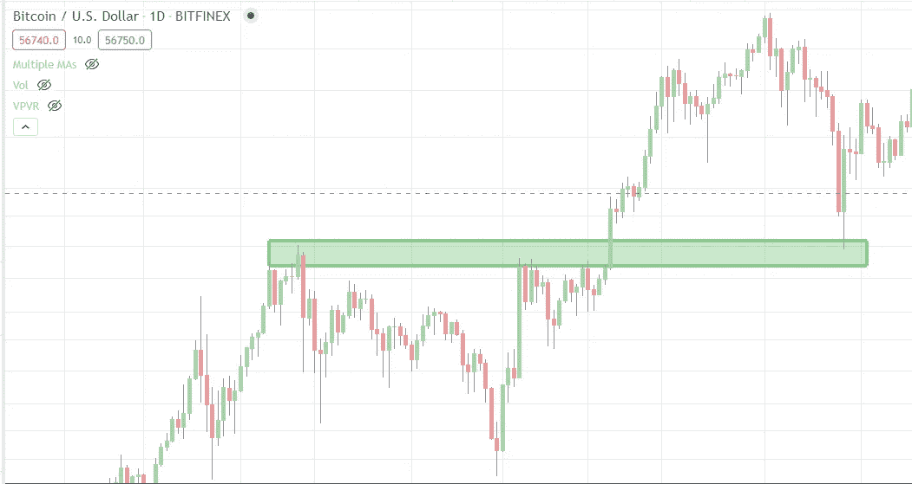

这些水平的支撑位和阻力位对进场交易特别有利，因为你可以在支撑位下方设置止损单(后面会详细介绍)。这意味着这是限制你下跌风险的最佳进场点。如果支撑位不成立，你将退出交易。

## 卷

另一个有用的指标是成交量。它代表了每根蜡烛线的交易金额。如果我们再看前面的例子，我们看到在重新测试之前的阻力(现在是支撑)时，成交量大幅增加。这通常表明趋势反转。如果一个资产下跌到支撑位，并且没有成交量的增加，那么它更有可能打破支撑位。

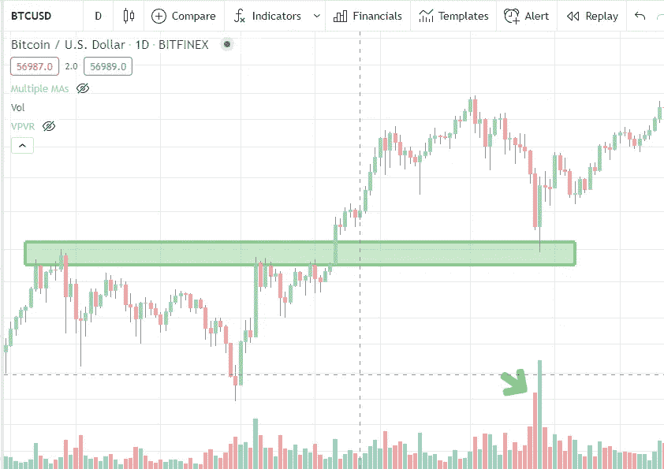

当我们突破阻力时，我们也希望看到成交量的增加。如果我们在成交量没有增加的情况下创造新高，这告诉我们买方已经筋疲力尽，我们可能接近局部顶部。

## 移动平均线

大概这篇文章最重要的指标就是均线(MA)。下图中你看到的蓝线是 20MA——这意味着它是最后 20 根蜡烛线的平均价格。均线也经常表现为支撑和阻力。在 BTCUSD 的周线图上，你可以看到 20MA 是贯穿 2017 年整个牛市的支撑。每次价格触及 20MA 时，都是交易的绝佳时机。一旦蜡烛在它下面熄灭，我们就进入了熊市周期。你也可以看到，一旦我们跌破，20MA 成为来年的阻力。

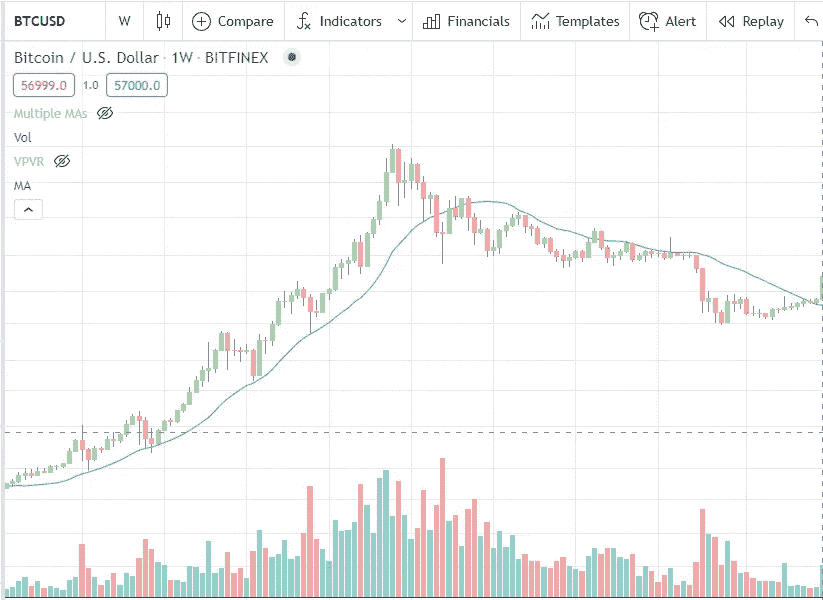

当您使用不同的时间框架时，您可能还需要使用另一种 MA 长度。一个好的建议是使用指示器，例如*多重均线*来同时显示不同长度的均线。通常倾向于阻力/支撑的长度是 10，20，50，100 和 200。

## 相对强度指数

相对强弱指数(RSI)是一个流行的动量振荡器，它易于阅读，对寻找好的进场点特别有用。RSI 显示为一个独立的图形，数值介于 0 和 100 之间。一般来说，低于 30 的值表明超卖的条件和良好的入场。数值高于 70 意味着我们处于超买状态。

在下面的 BTCUSD 周线图中，你可以看到从 12 月 10 日开始的一周内，RSI 触及 30，这是上一次熊市的绝对底部。

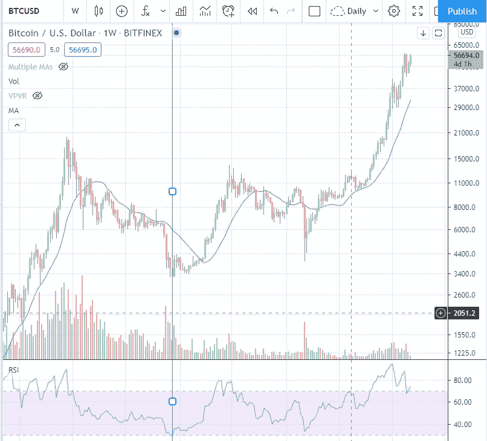

当然，周线图上的 30 RSI 比日线图上的 30 RSI 更适合长期进场。一般来说，你选择的时间越长，信号越重要。对于希望建立长期头寸(如 1 年)的投资者来说，周线图上的低 RSI 可能是一个很好的指标。

下面你会看到 BTCUSD 日线图和一条垂直线，每当 RSI 达到 30 以下。在牛市期间，到达下一个局部顶部需要 5-7 周时间。在熊市期间(一旦周线价格低于 20 毫安时)，该指标仍然是一个很好的买入信号，但下一个局部顶部将在 2-4 周内达到。所以在熊市中，你仍然可以持有现货，但你应该持有更短的时间。

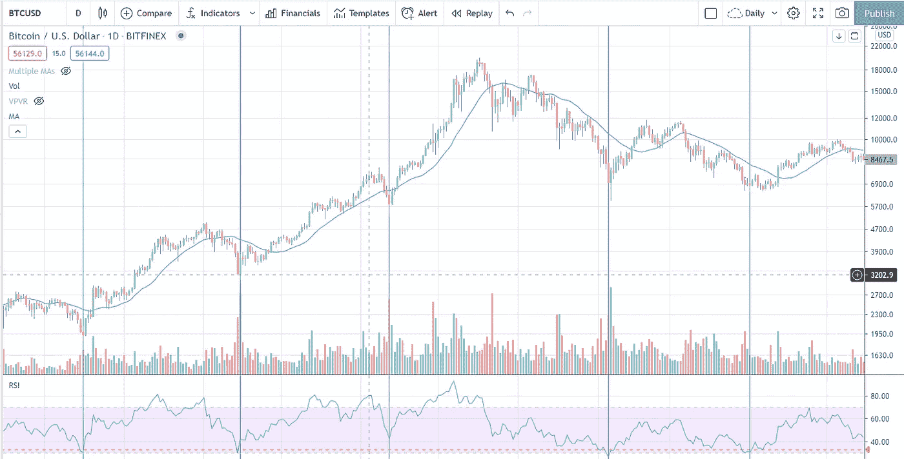

RSI 在分析 BTCUSD 时非常有用，它能给出可靠的好的进场信号。在寻找出口时，这个指标就没那么有用了。在牛市中，比特币和其他加密资产可能会处于超买状态数周甚至数月。然而，如果你看到价格在上涨，而 RSI 在下跌，你就发现了所谓的看跌背离。正如你在下面的例子中看到的，这可能是一个短期趋势反转的好指标。你可以利用这一点来退出你的位置，并尝试以更低的价格重新进入。在这个例子中，周线图上的缺点给出了一个可能的重新进入点，正好是我们之前看到的 20MA 附近的前一个电阻。

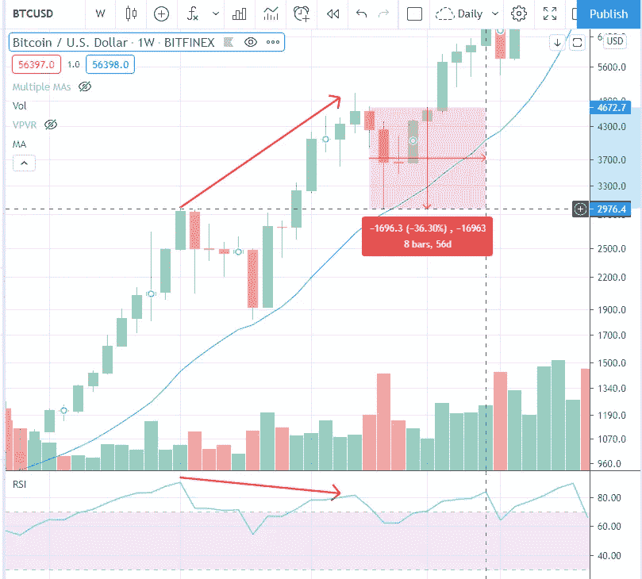

找到一个低 33%的条目意味着我们可以增加 50%的资产。当发现看跌背离时，退出头寸有几个好处。基本上，这种方式可以保护我们的资本，并保持更大的灵活性。以下是可能出现的情况以及如何应对的列表:

*   如果价格从未达到支撑，我们错过了重新进入，我们也可以在突破到新的历史高点时重新进入——我们可能会错过几个百分点的收益，但从长期来看，获得的灵活性是值得的
*   如果价格到达支撑位，蜡烛收在支撑位之上，我们看到交易量增加，我们发现了一个很好的重新入场机会，我们可以增加我们的总持有量
*   如果价格突破支撑位并收于下方，我们已经出局，可以寻找更好的进场点，或者用这笔钱进入其他仓位

 [## 2021 年 17 款最佳加密交易机器人(免费和付费)

### 2021 年币安、比特币基地、库币和其他密码交易所的最佳密码交易机器人。四进制，位间隙…

medium.com](/coinmonks/crypto-trading-bot-c2ffce8acb2a) 

# 基本面分析(市场)

加密市场从根本上不同于股票等传统市场。加密交易不仅是 24/7/365，而且更不稳定，市场上的许多货币都有很强的相关性。在这一章中，我们想谈谈货币的种类，以及这些项目和它们的价格行为是如何联系在一起的。

## 比特币

比特币是一切开始的地方。仍然有人说它的内在价值为零，尽管它是几十年来最看涨的资产。比特币并不是一种全新的技术，而是现有技术的结合，创造出一种具有非常独特属性的货币，我们将在这里快速命名，而不会过多涉及技术细节。

*比特币不可信*。
你可以将比特币发送给世界另一端的人，无需任何第三方介入。这在以前是不可能的。这是可能的，因为整个交易历史和你的公共地址被保存在一个分布式的对等层上，称为区块链，在这个区块链上的交易由独立方(称为矿工)处理。

*比特币意味着所有权
每个比特币地址都有自己的*私钥*。你可以把它想象成一个密码。只有私钥的所有者才能访问该地址上的比特币。这意味着你拥有的比特币(通过私钥)不能被拿走。再说一遍:数字货币的真正所有权在以前是不可能的。你银行账户上的钱属于银行。在破产或金融危机的情况下，你不能指望获得你的钱。*

*比特币固定金额 2100 万* 美元等法定货币可以由美联储随意创造。尤其是现在在电晕危机和即将到来的刺激方案，印钞机正在加班加点。由于比特币的数量是固定的，所以进入该空间的每个用户和机构都在增加每个比特币的价值。机构到了不能再忽视比特币的地步，他们将试图获得所有波动比特币的一定比例。这些将基本上从流通供应中消失，比特币将变得不那么不稳定。

*比特币安全* 你可能读过交易所被黑、比特币丢失或其他类似的故事。但这并不是因为比特币不安全——而是因为交易所不安全，或者人们因为人为错误而丢失了比特币。你可以说比特币是这个星球上最安全的软件。区块链有价值数十亿的比特币等待被攻击和黑客入侵，许多人已经尝试过了。然而，在它被介绍给世界 13 年后，它仍然在这里，并创造了新的历史新高。

*比特币具有先发优势*
关于比特币，你应该记住的最后一件事是，单是它的名字就让它有别于其他任何复制品。比特币是开源的，事实上，有许多项目只是比特币的简单拷贝。但是，所有积极的开发努力都投入到比特币中。而且，现在大家都知道它的名字了。最后但同样重要的是，在很长一段时间里，它是生态系统的门户。许多项目只能用比特币收购。它被列在任何加密交易所。比特币具有先发优势，它不会很快消失。

对于寻求投资加密的投资者来说，比特币应该是他们投资组合中最大的部分(超过 50%)。它经受住了时间的考验:
-比特币经历了多次牛市和熊市
-比特币被[宣布死亡数百次](https://99bitcoins.com/bitcoin-obituaries/)并仍在上涨
-比特币被复制和分叉，人们没有搬走
-比特币被攻击数百次，仍无法破解
-比特币在 13 年后仍拥有超过 50%的市场主导地位
-比特币经历了多次禁令和 FUD，仍在这里

对于交易者来说，比特币应该是所有技术分析的基础。它也可以在任何交易所交易，具有最大的流动性，可以在大多数交易所以高杠杆进行交易。

比特币对整体市场影响很大。在像 [coingecko](https://www.coingecko.com/en) 这样的页面上，你可以看到顶部的主导地位(目前为 60%)，这表明了比特币在整个加密市场中的份额。你也可以在 tradingview (BTC)上查看[随着时间的推移的主导地位。d)。一般来说，你可以说，如果比特币抛售，整个市场很可能会受到冲击。此外:如果比特币创下新的历史新高，而其主导地位在过去几周有所下降，它很可能会在短期内再次增强其主导地位，而其他项目将表现不佳。购买替代加密货币的最佳时机是比特币正在升值，但其主导地位正在下降。所以根据经验:](https://www.tradingview.com/symbols/CRYPTOCAP-BTC.D/)

*   比特币转储——所有东西都转储
*   比特币水泵(新 ATH 和统治图 BTC。d 显示反转)——一切表现都比比特币差
*   比特币涨得慢——一切都跑赢比特币

由于所有的交易所现在也有 USDT 和其他稳定的硬币对来交易替代硬币，所以脱钩正在发生。因此，比特币转储和某些项目或整个行业受到的影响可能没有以前那么大了。但是你可以把它作为一个总的指导方针。

## 以太坊

以太坊是维塔利克·布特林创建的。他是比特币的早期适配者，并采用了比特币的理念(还记得吗？它是开源的)并扩展了它:*以太坊:下一代智能合约&去中心化应用平台—* 这是白皮书的名称。基本上，这个想法是不仅使用分布式系统来存储交易，而且使用称为智能合同的整个应用程序。
这个想法很有吸引力，以太坊不仅是一种支持智能合约的货币，而且基本上是一个全新的货币生态系统(替代硬币，ERC 20 代币)的基础层。
正因为如此，它对投资者来说也很有吸引力，因为你是在押注于建立在它之上的整个生态系统。想象一下，在 21 世纪初，你可以从网上购买股票。可能很难说哪些公司会成功，但你可以肯定许多成功的公司会使用互联网。嗯……许多成功的应用将建立在以太坊之上，你现在就可以投资它。

对于投资者来说，以太坊应该至少占他们投资组合的 20 %- 30 %,因为押注整个生态系统相对安全。

## 替代硬币

现在我们进入了更危险的加密领域。我们将使用术语 Altcoin 来指代任何不是比特币或以太坊的加密货币。还有下面的章节:SmartChains、Defi 和 NFT 是替代币，但它们属于某些群体，这些群体目前有很多炒作，因此给交易者和投资者提供了更好的机会。
以下是一些你绝对应该知道的传统山寨币:

*莱特币*
莱特币是比特币的复制品，主要区别在于流通供应量和交易速度。这是一个成熟的项目，就像在任何主要交易所上市的比特币一样。莱特币通常被称为比特币的测试网。由于比特币项目相当复杂，我们正在处理大量资金，像闪电网络的引入这样的更大变化将首先引入莱特币，然后最终进入比特币。与比特币相比，莱特币的相对实力正在下降，如下图所示(LTCBTC)。所以对于长期投资者来说，比特币是更好的投资。

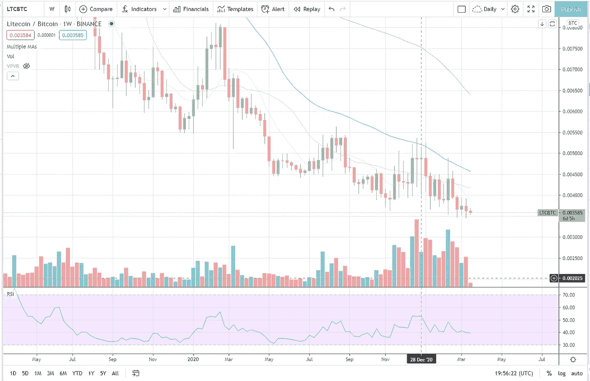

但对于寻找短期机会的交易者来说，LTC 是一种有吸引力的资产。从上图可以看出，周图上 LTCBTC 的值在下降，而成交量在增加，RSI 在上升(多头发散)。这是积累发生的迹象，也是短期趋势反转。LTCUSD 对也在所有较长均线之上交易。一旦我们在 LTCBTC 上交易超过 20MA 和 50MA，这表明趋势可能反转，这将是购买 LTC 的好机会。

*比特币现金*
与莱特币类似，比特币现金是基于比特币。相比之下，它不仅分叉了软件的源代码，还分叉了整个区块链。这意味着整个交易历史也被复制。每一个在分叉发生时拥有比特币的人，也拥有比特币现金。当对项目的发展方向没有一致意见时，就会出现这种分叉。我们最终获得比特币现金的原因是，社区的许多成员对比特币的高交易成本和低交易吞吐量不满意。他们希望有一个快速简单的解决方案来解决这个问题(增加写入区块链的每个事务块的块大小)。比特币现金的支持者声称，这更符合比特币创始人中本聪的愿景。
虽然所有这些都有待讨论，但当时整个讨论似乎对比特币及其名称造成了很大伤害。但我相信比特币会因此变得更加强大。最终，市场决定什么是真正的比特币，目前，比特币的价值是比特币现金的 100 倍。

*Monero*
Monero 可能是最知名的隐私币。它也是基于比特币的思想，但在 Monero 的交易是无法追踪的。虽然比特币允许你匿名汇款，但公共账本上的每个人都可以看到交易。所以如果有人知道你的公开地址，他就知道你拥有多少比特币，你过去收发了多少。

有数百种替代硬币，其中许多是基于以太坊的。对本文来说，浏览所有/大部分内容没有意义。你已经知道，一些传统的硬币，如莱特币、比特币现金和 Monero，都是基于比特币的想法，它们有自己的想法和对分散货币的愿景。基于以太网 ERC-20 的替代硬币通常不仅仅是分散的货币。它们被用于某种应用或提供某些好处。我们将在接下来的 Smartchains、Defi 和 NFT 章节中讨论其中的一些项目。

虽然这些项目中有许多有前途的想法和很大的增长潜力，但它们在加密领域还是相当新的。这意味着还不清楚谁将是市场的赢家，或者是否会有赢家。此外，这些项目中的许多或多或少是基于承诺，没有什么可展示的(这实际上是可行的)。
与 2017 年的上一轮牛市相比，目前市场上的许多项目可以共存，甚至可以很好地合作。尽管从长期来看，这有利于市场，但与以太坊或比特币相比，这些项目的风险仍然要大得多。因此，如果你是一个投资者，替代硬币不应该占你投资组合的 20-30%以上。你只需根据你想要投资的备用币数量，将分配给备用币的 20-30%分成相等的几块。

作为交易者，比特币给你最好的机会。原因是他们仍然跟随更大的趋势(比特币)，但你基本上是在用杠杆交易——没有被清算的风险。

## 智能链

如前所述，比特币现金的产生是因为比特币的交易成本太高，交易吞吐量太低。我们目前在以太坊也有类似的情况。然而，对于以太坊来说，高吞吐量甚至更重要，因为应用程序的整个生态系统应该建立在它的基础上，用户希望应用程序既快又便宜。对此有第二层的解决方案，但它们相当复杂，需要一些时间才能在生产中看到。全球最大的密码交易所之一币安利用这一形势，创建了自己的智能链(币安智能链——BSC)。他们分叉以太坊并改造了它。BSC 上的交易更快更便宜的主要原因是它是一种更集中的服务。虽然更多的权力下放是好事，但这是解决问题的短期办法。这也意味着基于以太坊的项目可以复制到 BSC，因为它们都基于同一个引擎(以太坊虚拟机)。
智能链特别有吸引力，原因与以太坊是一项不错的投资相同。它们是生态系统的支柱，只要人们为之开发应用程序，它们就会成功——而币安让这变得特别容易。不仅如此，相关的硬币 BNB 还有多个用例。与以太坊类似，你必须付费才能在智能链上进行交易。所以 BNB 被用来支付分散应用的费用。持有 BNB 也将减少你在使用币安交易所交易时支付的费用。此外，他们还利用自己企业的资金来资助基于平衡计分卡的新项目。
还有其他智能链，如 Polkadot，但 BSC(硬币:BNB)作为一个主要的例子应该足够了。

## 挑战

Defi 代表分散式金融，该领域的金融服务越来越多，包括贷款、分散式交易所以及与之相关的:流动性提供和收益农业。你可以在 defiprime.com 的[上找到热门 defi 项目的详细列表。](https://defiprime.com/tokenlist)

*分散交易所(DEXes)*
人们对分散交易所的要求由来已久。当你在像币安这样的交易所持有资产，而服务被黑客攻击或关闭时，你的货币就有风险，你可能会失去访问权。
分散式交易所允许您在笔记本电脑上控制私人钥匙和钱包中的货币，同时仍然能够通过智能合约在分散式交易所交易这些资产。这些项目中的大多数，像 Uniswap 和 1Inch，都是基于以太坊的，并且只支持 ERC-20 代币的交易。由于在这些平台上交易需要基础资产的流动性，你可以锁定货币来帮助提供这种流动性，你将获得该平台交易费用的一部分。这意味着您可以访问您的私人密钥，同时通过将您的资产锁定在智能合同中一段固定的时间来获得奖励。

例子:Uniswap，PancakeSwap，SushiSwap，1Inch，Bake【https://defiprime.com/exchanges】也指[T4](https://defiprime.com/exchanges)

*贷款* 智能合约还允许你锁定资金作为抵押品，这样你就可以贷款了。假设你拥有 1 个以太坊(比如价值 1000 美元),你不想卖掉它，因为你认为它的价格在上涨。你可以在一份智能合同中锁定这 1 以太币作为抵押品，并从其他人那里借入其价值的 50 %( 500 美元),这些人希望得到一定的利息回报(例如，一个月后 550 美元)。如果以太坊从 1000 美元跌至 550 美元，你将通过智能合约自动清算，因为这样你仍然可以偿还借钱给你的人。然而，如果以太坊增加到 2000 美元，你可以在一个月后偿还贷款，包括利息，并且仍然有以太坊的收益和额外的 500 美元用于投资。我们刚刚描述的只是杠杆交易的另一种形式。但由于你也可以为像 USDT 这样稳定的硬币提供流动性，并获得高收益，它对那些只想获得相对安全的 APY(年百分比收益率)而没有整体波动性和下行风险的人也很有吸引力。由于它是分散的，它也向那些不能(或不想)通过大多数交易所的 KYC 程序的人开放了市场。

例子:88 英里/小时，Aave，化合物
也指:[https://defiprime.com/decentralized-lending](https://defiprime.com/decentralized-lending)

对于 Defi 的进一步分类你可以看看:
[https://defiprime.com/#defi_projects](https://defiprime.com/#defi_projects)

## NFT (ERC-1155/ERC-721)

NFT 是加密领域最近的炒作。与传统的 ERC-20 代币的主要区别在于，每一个代币都是不同的(不可替换的),并且代表对数字事物甚至可能是现实世界中事物的所有权。艺术家们最近用这个来出售他们的作品(最近的例子: [Hashmasks](https://www.thehashmasks.com/) )。这些艺术品和收藏品的价格令人震惊。然而，以我有限的艺术知识，如果你不能在真正的早期阶段进入这个项目，我不建议购买这些项目。
尽管如此，非正规金融服务的所有权概念仍有很大潜力。艺术家、游戏开发商和大型特许经销商可以用它来出售他们作品的所有权。可能性是无限的。

令牌可以只是图像的所有权，但它也可以让你获得艺术家的歌曲收入，如果他决定每个 NFT 代表所产生的收入的一个百分比。这将激励粉丝购买该项目，因为他们直接从艺术家的成功中获利。同时，它让艺术家有可能将自己的作品货币化，而不需要第三方承包商。

它所需要的只是一种创建、分发和集成这种 NFTs 的简单方法。虽然我不会投资大多数的 NFT，但我会投资一些项目，为内容创作者提供轻松创建 NFT 的可能性，这样他们就可以从这场运动中受益。目前这个领域最大的两个玩家是[金恩](https://www.coingecko.com/en/coins/enjin-coin)和 [Flow](https://www.coingecko.com/en/coins/flow) 。

# 基本面分析(项目)

## 领导力

你在寻找领导层有良好记录的项目。比特币来自密码学领域一些最有经验的研究人员和开发人员。
以太公司的联合创始人之一是 Joeseph Lubin，他是一名企业家，并联合创办了几家公司。
对于较小的项目，更难找到更多关于创始人和开发者的信息，但特别是作为投资者，你应该做好功课。

## 效用

在短期内，许多项目可能会因为炒作而获得可观的收益，但只有具有效用的硬币才会在下一轮熊市中拥有更高的地板，只有具有效用的硬币才会进入新的牛市。目前许多被大肆宣传的项目只是治理的象征。您必须意识到，许多治理令牌目前没有真正的目的。他们给你投票权，让你决定项目/基金应该发生什么，但更多时候，这些权利被锁定在你必须持有的硬币的某个百分比阈值之后。例如，DEX(分散交易)代币的正常用途是有权收取一定比例的交易费。但是，对于 Uniswap，在激活此功能之前有一个 180 天的阈值。所以直到现在，这个项目估值 150 亿美元(2021 年 3 月)，而你作为代币持有者，基本上效用为零。作为投资者，你应该远离这些项目，寻找市值较小的 Defi 项目，最好是基于 BSC 等替代链，并且从第一天起就具有公用事业。一个很好的例子就是[蛋糕](https://academy.binance.com/en/articles/a-guide-to-pancakeswap)。

## 有效性

这基本上意味着项目列在哪里。项目上市的交易所越多，其可用性和流动性就越高。

这也意味着该项目如何很好地集成到现实世界的应用程序中。大多数密码在这方面有所欠缺，但也有一些例外。最高的可用性是当用户只需点击一个按钮就可以获得或购买项目时。像 [Ecomi](https://www.ecomi.com/) 这样的一些项目甚至提供宝石的应用内购买，加密交易发生在后台，对用户完全隐藏，进一步增加了采用。

## 发展

当你在看一个项目时，你要确保有大量的市值或费用被保留下来用于进一步的开发和营销。有些人不喜欢看到数百万美元落入开发商和营销商的手中，但这是一个双赢的局面。如果一个项目没有关于如何支付开发和营销工作的清晰路线图，它从一开始就注定要失败。

## (潜在)市场资本

如果你正在关注像 Uniswap 这样价值 150 亿美元的项目，它会让你对其他分散式交易所的潜在市值有所了解。这方面先发优势没那么大。这些交易所没有任何 KYC，在另一个交易所交易并不费力。还有一些替代项目，它们有自己的特性/优势和不同的用户界面，如 1INCH 和 CAKE，市场价值低得多，但宣传和效用相同。

## 大肆宣传

每个周期都有一定的主题或炒作。目前，市场由 Defi 和 NFT 项目主导，这也是我们之前详细讨论它们的原因。你想在牛市开始时确定一个即将到来的炒作，并将你的 Altcoin 投资组合的很大一部分转移到这些市场。

# 执行

## 交换

多年来，我可能使用过 10 多个不同的交易所，但今天我只使用 2 个——Bitfinex 和币安。他们是该领域非常成熟的参与者，币安尤其接管了这一领域，因为他们过去处理比特币硬分叉(比特币现金的创造)等事情的方式。在其他交易所，你必须将比特币发送到一个私人地址，才能从分割的那一刻起领取比特币现金。币安会简单地给你分叉链，让你立即交易你的比特币现金。这是众多场景中的一个，表明他们的行为有利于他们的用户。自那以后，币安发展迅速，现在即使不是市场上最大的加密交易所，也是其中之一。他们列出了最多的项目，他们有自己的加密 BNB 来降低交易费用，公平的定价模型，高达 125 倍杠杆的期货交易，甚至提供了赌注的可能性。两者——币安和 Bitfinex 都是很好的交流平台，有很好的响应界面。交易所也受到网络效应的影响——如果越来越多的人使用它，交易所就会变得越来越好——所以推荐币安很容易。然而，统计数据显示，在币安，大多数小交易者的杠杆率都过高。

另一方面，Bitfinex 长期以来仅提供 3.3 倍的杠杆。他们最近将 BTCUSD 的杠杆率提高到了 10 倍，将 T2 的杠杆率提高到了 5 倍。对于大部分新手来说，没有高杠杆更多的可以看做是一个特点。你一开始就不应该使用杠杆进行交易，但在 Bitfinex，至少不像在币安那样容易被清算。
此外，如果你想让你的一些交易自动化，这两个项目都有很好的 API。

## 跟踪

你应该从一开始就跟踪每一笔交易。有一些工具可以自动完成这项工作，比如 [cointracking](https://cointracking.info/) ，但是在开始的时候，如果你只是在一个 excel 表格中记录交易也是可以的。这将有助于你更多地反思你的头寸，并防止你过度交易，因为每笔交易都有一些手工操作。你想记录每笔交易的进场、出场、费用和利润。你的税单也需要这个，所以你最好从一开始就这么做。大多数情况下，你应该使用先进先出法来计算你的收入。每当你用一枚硬币换另一枚硬币时，你就触发了一个应税事件，你需要跟踪这个应税事件。

## 现货/多头/空头

如果你做多某样东西，你预计它的价格会上涨。如果你做空某样东西，你预计它的价格会下跌。当我们说“现货”或“现货多头”时，我们谈论的是以当前的现货价格购买比特币这样的资产，没有杠杆。所以如果你是现货做多比特币，说明你买了比特币，期望它升值。你没有使用杠杆，你不能被清算。如果你持有美元或任何其他稳定的法定货币，你基本上是做空比特币，因为你预计比特币会贬值，并以更低的价格回购。在 Bitfinex 和币安这样的平台上，你也可以建立杠杆头寸，押注市场走向。作为一个没有经验的交易者，你应该完全远离这种交易，因为它们包含被清算的风险。如果你真的想进入这个市场，你应该把不超过 10%的投资组合用于杠杆交易，并以最高 3 倍的杠杆进行交易，以限制你的下跌风险。

## 市价订单/限价订单/止损市价订单/OCO

市价单——以当前可用的任何价格买入/卖出资产
限价单——仅在我们触及某个价格时买入/卖出资产
止损市价单——持有资产时，以任何可能的价格自动卖出，一旦我们跌破某个价格
OCO——一个取消另一个。这意味着，如果你买入一项资产，你希望在盈利目标时卖出(卖出，一旦价格达到某个数字)，它还应该通过在价格跌至某个水平时卖出来限制损失。因为你有两个开仓的卖单，一旦止损被触发或目标被击中，你只希望一个被执行，另一个被取消。

作为一个交易者，你应该总是使用 OCO 来进入一个有止损和目标的交易。

如果你正在使用的交易所不支持它，你只需购买资产，并设置止损市场订单和警报，一旦你的价格目标达到，你就可以手动出售。你几乎总是想要一个止损市场订单，因为它保证你离开头寸并限制损失。如果你设置了止损限价单(只按固定价格卖出)，你的订单可能无法兑现，你就被困在了亏损的位置。

当购买时，大多数人应该使用限价单。如果您添加了限价单，该限价单将进入订单簿，然后被交易另一方的人接受，您支付的费用将减少。在这种情况下，您是*制定者*，接受您订单的人是*接受者*。作为一个*制造商*，交易所将总是向你收取较少的费用，因为你通过填写订单簿向资产提供流动性。

# 风险管理

## *交易员风险管理*

这是大多数人都会犯的错误，也是你的秘密 YouTubers 上没有人谈论的。你必须管理好你的风险，限制你能承受的损失，并且在交易的时候要牢记你可能会损失的可能性以及损失的金额。

大多数成功的交易者都同意，作为一个交易者，你不想在一次交易中拿超过 1%的投资组合冒险。这看起来真的很低，但是当你阅读畅销书时，你会一遍又一遍地读到相同的数字，比如《T8 市场奇才》、《牛市和熊市的盈利秘诀》、《T11》等等。

这意味着，如果你想在以太坊建仓，而你只能在现货价格的-10%设置止损单，因为该资产波动太大，你只能用 10%的资金进入。假设你有 10，000 美元，你拿 1000 美元进入头寸。让我们假设以太坊的交易价格正好是 1000 美元。如果你买了 1 个以太坊，它下跌了 10%，你的止损单被触发，你将损失大约。100 美元(你的钱的 1%)。让我们假设，如果支撑位保持，我们有一个上升，我们将看到价格上涨 40%。这意味着如果交易达到你的目标，你将赚 400 美元。既然你可以输 100 美元，赢 400 美元，那么这个交易的风险/回报比为 1:4。一旦你赢了交易，你的投资组合增加了 4%。起初这听起来并不多，但这种价格波动有时一个月会发生几次。

如果你开始时有 10，000 美元，每个月做一笔交易，一年后你会有 16，000 美元(10，000*1.04)。如果你在每笔交易中冒险投入 3%的资金，你会得到 3 倍的利润，所以是 12%而不是 4%。一年后你会有 43，000 美元(10，000*1.12)。一旦你有信心，你可以增加每笔交易的风险金额。例如，如果你交易的是更大的趋势，该项目触及关键支撑位，之后，大量交易量进入，我们在所有移动平均线之上交易，这可能有助于增加头寸规模。
如果你连续输了几笔交易，你想再次降低风险。你可能也想暂停交易。

这里最重要的是，你要时刻意识到每笔交易中你会损失什么，并在每个位置设置止损和目标。你决定你愿意在交易中损失多少钱，定义一个止损，低于最新的支撑，并相应地调整仓位大小。

## *投资者风险管理*

作为一个投资者，以上所有的东西都应该适用，但有一个关键的区别。如果你作为投资者买入一项资产，你希望长期持有该资产。如果不需要，您不希望将您的资产暴露给交换，而是将货币发送到您拥有私钥的私有地址。这也是风险管理的一部分，因为对交易所的黑客攻击可能会让你的资金面临风险。交易者只能通过将资金转移到多个交易所或使用分散的交易所来保护自己免受这种影响。因为作为投资者，你想把你的资产撤出交易所，你也不能设置止损单。当价格跌破关键支撑位时，你仍然可以设置警报。将资产送到交易所并在此时出售仍比持有资产度过多年萧条要好。你可能的亏损百分比当然比交易者高，因为在你真正卖出资产之前有一段时间的延迟。这就是为什么进入这个行业对投资者来说更为重要，因为它将你的大量资金置于风险之中。

所以相比之下，一个风险管理良好的交易者可以大大限制他的下跌风险，每天都可以利用新的机会，但他必须不断观察市场。
如果投资者选择了错误的进场，他可能会比风险管理良好的交易者损失更多，因为他在买卖资产时不够灵活。但他不必密切关注市场，不必支付与交易员一样多的费用，而且在德国等一些国家，只要一年以上不交易该资产(1 年后 0%纳税)，就可以获得巨大的税收优惠。这一切，同时仍然有可能使用技术分析来减少损失。

# 将所有这些放在一起(真实世界的例子)

现在是时候把我们在这篇文章中读到的所有内容放在一起，为投资者和交易者这两条路想出一个策略了。我们将首先从总体上定义什么是最佳战略，然后根据当前市场形势(2021 年 3 月)规划学习内容。

## 投资组合分配

作为投资者，你希望有一个预定义的投资组合分配。下面我将举例说明这种分配方式。当谈到 Altcoin 项目(Defi 和 NFT)时，你可以将投资组合分割成更多的块，但你应该坚持整体分配。

投资组合分配:BTC 50%，ETH 20%，Defi 15%，NFT 15%
Defi 项目:1Inch 5%，Cake 5%，88mph 5%
NFT 项目:金恩 5%，Flow 5%，Rarible 5%

作为交易者，你也会建立这种列表，但你不会试图找到一个单一的条目来长期持有这些硬币——它们只是显示一个项目列表，你对这些项目充满信心，并密切关注现货交易机会。

## 查找条目

从投资者的角度来看，进入市场的最佳时机是在周时间框架内出现实质性的回调之后，当趋势反转已经发生，我们再次在像 20MA 这样的较长均线上方交易。在下面的图表中，你可以看到牛市中的完美进场。

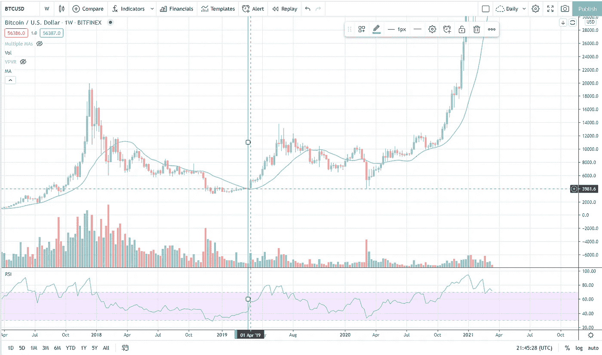

你可以看到 BTCUSD 在 20MA(蓝线)以下交易了几个月。然后，我们在 2018 年 12 月期间在每周上触及真正超卖的 RSI。2019 年 4 月初，BTCUSD 设法突破 20MA，这表明趋势反转，我们可以在 BTCUSD 建立一个长期头寸。4200$.几个月后，价格又回到了这个水平，但只持续了一天。如果你在这一天卖出，一旦我们在大约 20 毫安以上交易，你可以买回。8000$.
这两个时间点都为你的长期头寸提供了买入外汇的绝佳机会。一旦你在 BTCUSD 中确定了形势，你就可以查看其他项目，并在较低的时间框架中寻找条目。
一般来说，当我们在 RSI 上达到超卖状态，并设法回到某一均线上方，甚至可能再次测试该均线时，你总是想买入。在周线图上，20MA 在过去是一个很好的指标。日线上，50MA 经常得到支撑。

现在我们知道了潜在的最佳进入方式，让我们看看当前的市场形势，看看我们是否能发现任何机会。

## 当前市场形势(2021 年 3 月)

下面你可以看到最近的 BTCUSD 周线图。

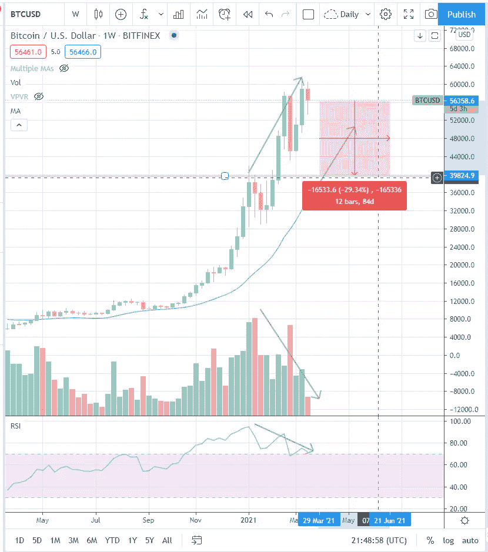

你可以在这里看到一些东西。BTC 在几个月内增值了 600%。与此同时，我们有减少的数量和一个看跌的 RSI 背离。这可能表明短期趋势逆转。我们也远远高于 20MA。在上一个牛市周期中，20MA 在几个不利因素中最终成为支撑位。纵观所有这些，我们可以在几天内轻松地再下跌 30%,我们不得不承认，投资者在此时此刻的风险/回报是次优的。

如果你想进入一个长期的位置，你想购买，一旦比特币在周线上达到 20MA 或在强水平支撑处。在较低的时间范围内更容易找到好的进场单，比如日线。这对于投资者来说是次优的，只有当你不把更多的钱(例如，不超过你年收入的 10%)投入到 crypto 中时，才推荐这样做。这是因为，即使我们在接下来的几周和几个月里提高价格，我们在某个时候也会有一个实质性的缺陷，可能会使 BTC 低于目前的价格水平。我不想说这是肯定的，但我们走得越高，这种情况发生的可能性就越大。因此，目前的市场结构更适合寻找短期机会的交易者。

心理学在这里起了很大的作用。如果你把更多的钱投入一项资产，而它立即下跌 30%-60%，并可能持续几个月或几年，你就不太可能持有这项资产。你也有机会成本，因为这笔钱可能会在其他市场产生回报。所以词条超级重要。投资者目前应该进入头寸的唯一方式是降低时间框架，在支撑位建仓，并设置止损，即使这意味着将资金留在交易所。

因此，给定市场结构，交易者和投资者在更低的时间框架如日线或 4h 内买入前面描述的相同条件(超卖 RSI +之后突破 MA)。这样你就可以进入一个位置，即使我们在周线上相当长，因为你在支撑位买入并设置止损单来限制你的损失。让我们来看看 BTCUSD daily。

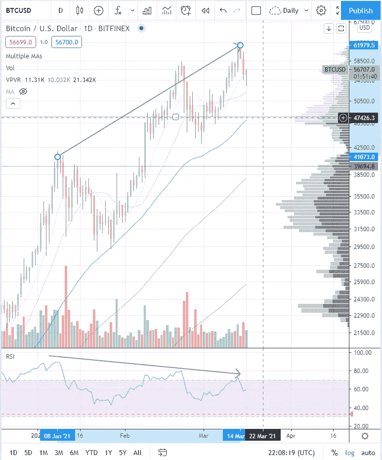

BTCUSD 日线图也显示 RSI 背离看跌，成交量减少。在上一次下跌中，50MA(蓝线)是支撑位。一旦我们在 51，000 美元附近再次触及 50MA，这将是建立多头头寸的好时机。

一旦我们在 50MA 下方有一根完整的蜡烛线，你想退出这个位置。在这一点上，我们的论点是无效的，50MA 现在成为阻力。

下一个条目将在 40，000 美元左右。在这一点上，价格可能会触及 100 毫安。同样，我们应该在收盘跌破支撑位时退出头寸。

如果你被止损出局，你可能会损失大约 5%的资金，但这仍然是一个比被套牢在一个位置，只是看着价格在几天内再下跌 25%更好的选择。当那一刻到来时，在情感上也很难点击卖出按钮——这就是为什么你总是在进入你的位置后设置止损单，所以它会自动执行。

你的目标应该基于以前的挥杆和他们花了多长时间。最后一次摆动大约是 80%。由于牛市已经相当深入，我们可能应该有更温和的目标。所以如果我们在 51，000 美元进场，目标是 40%的波动，我们的目标应该是 71，400 美元。我们不想在最后一个较小的低点交易，所以我们将止损点设在 46000 美元。

进场:51000 美元
止损:46000 美元
目标:71400 美元

# 摘要

让我们用一篇 TL 总结一下这篇文章最重要的方面；灾难恢复列表:

## 投资者

*   应该有按部门预先定义的投资组合分配
*   比特币和以太坊应该构成投资组合的最大部分
*   你想持有目前被炒得沸沸扬扬的股票，比如德菲和 NFT
*   你想在 BTCUSD 周线图上寻找进场点
*   一旦 BTCUSD 上有一个好的条目，这也是在较低的时间范围内寻找替代硬币条目的好时机
*   当我们在 RSI 上遇到超卖的情况，并设法在一个更长的均线上方交易，这是之前的阻力，这是好的进场点
*   一旦您购买了资产，您应该将它发送到硬件钱包中

## 商人

*   应该有一个预定义的硬币列表，他们分析和他们想交易
*   该名单应包括高流动性的硬币，如 BTC 和瑞士联邦理工学院和替代硬币目前炒作的部门 Defi 和 NFT
*   你应该总是带着止损单和止盈单(OCO)进场
*   当我们在 RSI 上遇到超卖的情况，并设法在一个更长的均线上方交易，这是之前的阻力，这是好的进场点
*   你想为每笔交易设定一个固定的风险百分比，并相应地调整仓位大小

还应该提到的是，混合方法非常有意义。你可以在当前市场交易——因为它有利于交易者——但是仍然要在更高的时间框架内寻找投资机会，比如周线。对投资者来说，最好的机会每隔几个月才会出现，所以耐心真的很重要。

哦，在我忘记之前:这不是真正的投资建议。自己做研究。

如果你做到了这一步:祝贺你。如果你喜欢这篇文章，想要更多内容，可以考虑[在 Twitter 上关注我](https://twitter.com/oshellXBT)

> 加入 Coinmonks [电报集团](https://t.me/joinchat/PmKOYQ9NNKZlZGNl)，了解加密交易和投资

## 另外，阅读

*   最好的[密码交易机器人](/coinmonks/crypto-trading-bot-c2ffce8acb2a) | [电网交易机器人](https://blog.coincodecap.com/grid-trading)
*   [加密复制交易平台](/coinmonks/top-10-crypto-copy-trading-platforms-for-beginners-d0c37c7d698c) | [如何在 WazirX 上购买比特币](/coinmonks/buy-bitcoin-on-wazirx-2d12b7989af1)
*   [CoinLoan 点评](/coinmonks/coinloan-review-18128b9badc4)|[Crypto.com 点评](/coinmonks/crypto-com-review-f143dca1f74c) | [火币保证金交易](/coinmonks/huobi-margin-trading-b3b06cdc1519)
*   [尤霍德勒 vs 科恩洛 vs 霍德诺特](/coinmonks/youhodler-vs-coinloan-vs-hodlnaut-b1050acde55a) | [Cryptohopper vs 哈斯博特](https://blog.coincodecap.com/cryptohopper-vs-haasbot)
*   [杠杆代币](/coinmonks/leveraged-token-3f5257808b22) | [最佳密码交易所](/coinmonks/crypto-exchange-dd2f9d6f3769) | [Paxful 点评](/coinmonks/paxful-review-4daf2354ab70)
*   [加密套利](/coinmonks/crypto-arbitrage-guide-how-to-make-money-as-a-beginner-62bfe5c868f6)指南| [如何做空比特币](/coinmonks/how-to-short-bitcoin-568a2d0b4ae5) | [1xBit 回顾](https://blog.coincodecap.com/1xbit-review)
*   [如何在印度购买比特币？](/coinmonks/buy-bitcoin-in-india-feb50ddfef94) | [WazirX 评论](/coinmonks/wazirx-review-5c811b074f5b) | [BitMEX 评论](https://blog.coincodecap.com/bitmex-review)
*   [印度比特币交易所](/coinmonks/bitcoin-exchange-in-india-7f1fe79715c9) | [比特币储蓄账户](/coinmonks/bitcoin-savings-account-e65b13f92451)
*   [币安收费](/coinmonks/binance-fees-8588ec17965) | [Botcrypto 审查](/coinmonks/botcrypto-review-2021-build-your-own-trading-bot-coincodecap-6b8332d736c7) | [Hotbit 审查](/coinmonks/hotbit-review-cd5bec41dafb) | [KuCoin 审查](https://blog.coincodecap.com/kucoin-review)
*   [我的密码副本交易经历](/coinmonks/my-experience-with-crypto-copy-trading-d6feb2ce3ac5) | [购买硬币回顾](https://blog.coincodecap.com/buycoins-review)
*   [Bybit 融资融券交易](/coinmonks/bybit-margin-trading-e5071676244e) | [币安融资融券交易](/coinmonks/binance-margin-trading-c9eb5e9d2116) | [Overbit 审核](/coinmonks/overbit-review-9446ed4f2188)
*   [加密货币储蓄账户](/coinmonks/cryptocurrency-savings-accounts-be3bc0feffbf) | [YoBit 审查](/coinmonks/yobit-review-175464162c62) | [Bitbns 审查](/coinmonks/bitbns-review-38256a07e161)
*   [Botsfolio vs nap bots vs Mudrex](/coinmonks/botsfolio-vs-napbots-vs-mudrex-c81344970c02)|[gate . io 交流回顾](/coinmonks/gate-io-exchange-review-61bf87b7078f)
*   [最佳比特币保证金交易](/coinmonks/bitcoin-margin-trading-exchange-bcbfcbf7b8e3) | [萝莉点评](/coinmonks/lolli-review-e6ddc7895ad8) | [比特币保证金交易](https://blog.coincodecap.com/bityard-margin-trading)
*   [创造并出售你的第一个 NFT](https://blog.coincodecap.com/create-nft) | [本地比特币评论](/coinmonks/localbitcoins-review-6cc001c6ed56)
*   [加密保证金交易交易所](/coinmonks/crypto-margin-trading-exchanges-428b1f7ad108) | [赚取比特币](/coinmonks/earn-bitcoin-6e8bd3c592d9) | [Mudrex 投资](https://blog.coincodecap.com/mudrex-invest-review-the-best-way-to-invest-in-crypto)
*   [如何在印度购买以太坊？](https://blog.coincodecap.com/buy-ethereum-in-india) | [如何在币安购买比特币](https://blog.coincodecap.com/buy-bitcoin-binance)
*   [顶级付费加密货币和区块链课程](https://blog.coincodecap.com/blockchain-courses) | [币安评论](/coinmonks/binance-review-ee10d3bf3b6e)
*   [MXC 交易所评论](/coinmonks/mxc-exchange-review-3af0ec1cba8c) | [Pionex vs 币安](https://blog.coincodecap.com/pionex-vs-binance) | [Pionex 套利机器人](https://blog.coincodecap.com/pionex-arbitrage-bot)
*   [在美国如何使用 BitMEX？](https://blog.coincodecap.com/use-bitmex-in-usa) | [BitMEX 评论](https://blog.coincodecap.com/bitmex-review)