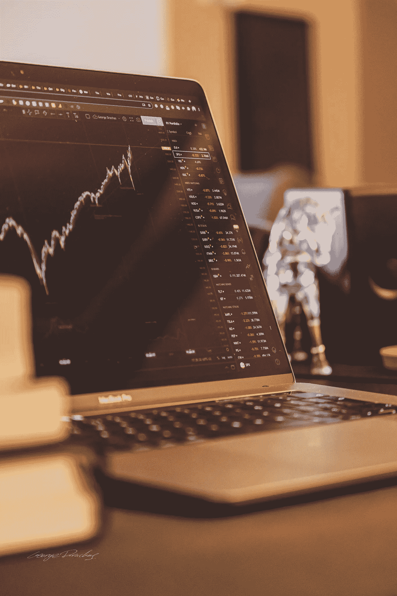
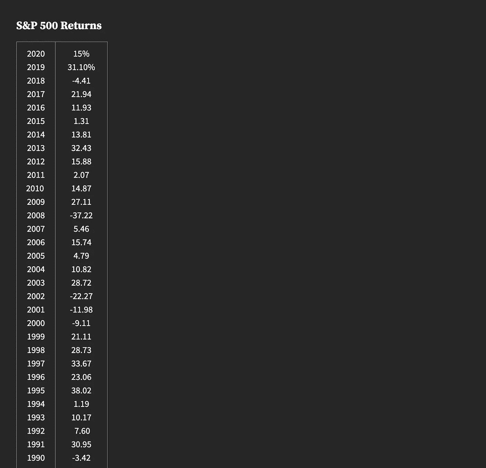
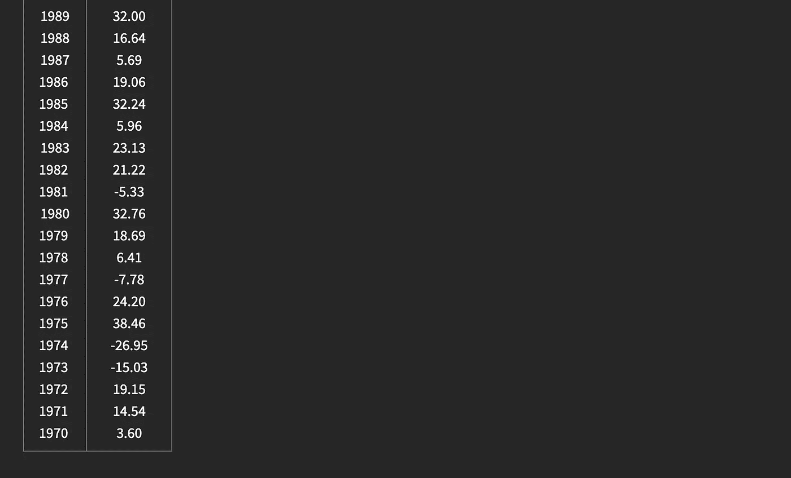
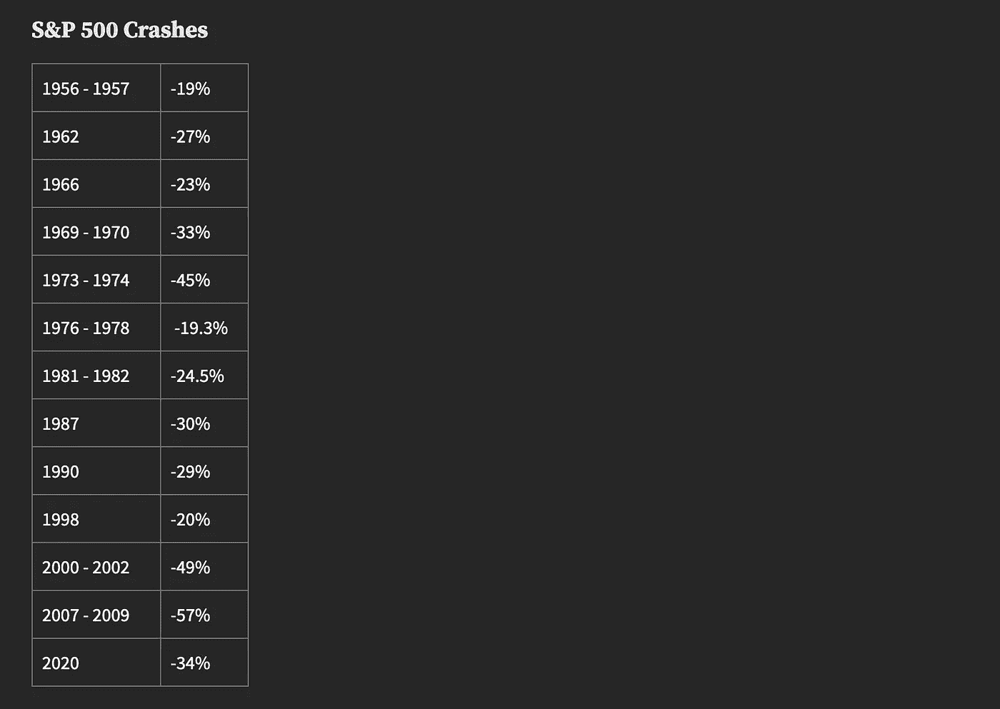
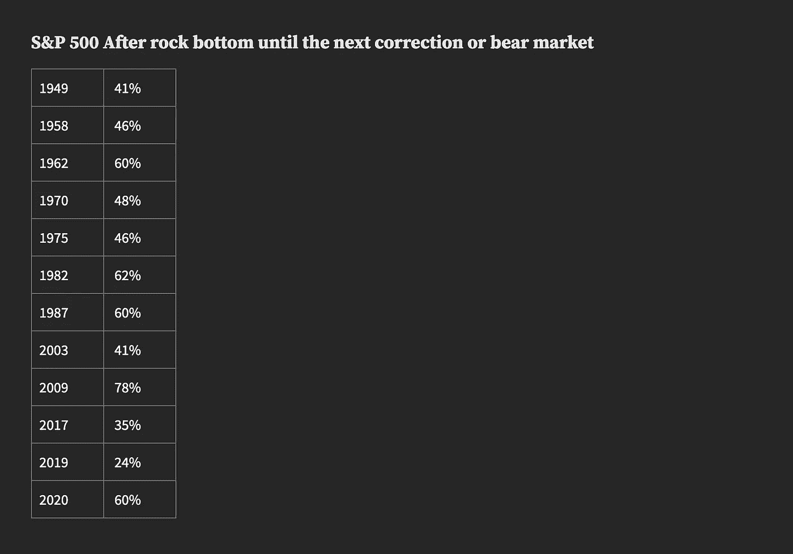
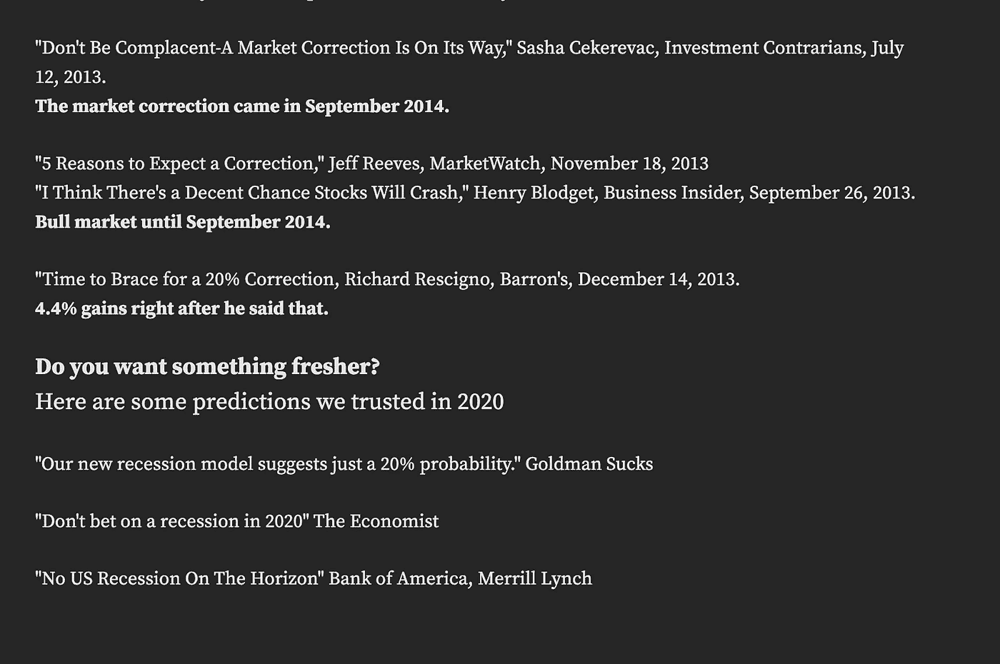
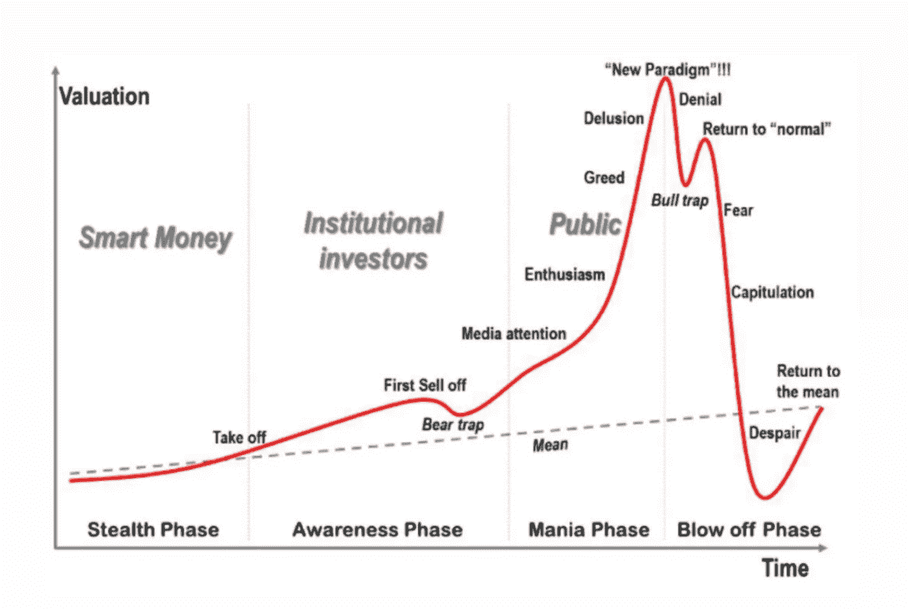

# 简单的投资指南

> 原文：<https://medium.com/coinmonks/the-uncomplicated-guide-to-investing-how-people-actually-get-rich-9668e1bff38d?source=collection_archive---------1----------------------->

你不需要有巨额的资金，不需要咨询理财顾问，也不需要在输入“如何投资”时阅读谷歌的 19.4 亿条结果。

当然，当你是这个游戏的新手时，对于老年人、富人和企业家来说，投资就像是一个黑匣子。我可以向你保证不是。

# **当你认为你投资的时候**

首先，需要注意的是，投资不等同于购买手机、笔记本电脑或电视。

是的，你一定听过有人说“我要投资一部好手机！”

嗯，当你在手机上“投资”时，你离开商店的那一刻就开始赔钱了。下个月你的设备会变得不值钱，第二年可能会降到原价的一半。

投资是为了钱的价值随着时间的推移而增加。

***而且我可以向你保证，当你看完这篇文章的时候，你就离正确投资一步之遥了。***

# **无聊却重要。通货膨胀**

那么，把你的钱存在银行里，每个月存一点，这样来增加你的“财富”怎么样？

你听说过通货膨胀吗？

通货膨胀是一种奇怪的、复杂的经济现象，它每年平均消耗你 2%的钱，这取决于你的国家，所以随着时间的推移，钱会贬值。

这意味着每年东西的价格都比前一年高 2%。

例如，2000 年在美国，一杯 10 美元的咖啡在 2020 年将会变成 12.64 美元，前提是我们购买完全相同的一杯咖啡。

这不是很多钱，但是 10，000 美元呢？好吧，你的 10，000 美元不会再值 10，000 美元了，因为所有东西都会以每年 2%的速度增长，2000 年的 10，000 美元相当于 2020 年的 12，637.58 美元。

但是，把它存在储蓄银行账户里怎么样呢？储蓄账户会给你 0.2%的利息，这意味着你的钱每年上涨 0.2%。但是因为通货膨胀率上升了 2%，随着时间的推移，你仍然在赔钱。

假设我们有一个利率为 2%的假设储蓄账户，它将大致符合通货膨胀率，所以是的，我们在技术上没有随着时间的推移而亏损。

# **投资**

现在真正的投资开始了，因为这里的要点是，我们不只是不想赔钱。

我们其实是想赚钱的。

假设，我们有一个利率为 12%的储蓄银行账户，这是永远不会发生的，因为利率太高了，这意味着我们每年将获得储蓄账户资金价值的 12%。

例如，如果我现在在储蓄账户上增加 100 美元，第二年，它将值 112 美元，然后第二年将是 125 美元，因为在之前的 12%的基础上增加了 12%。

这就是**复利**的威力。

> *你永远也不会获得财务自由。真正的致富之路是留出一部分钱进行投资，让它在多年后复利。你就是这样在睡觉的时候变得富有的。这就是你如何让金钱成为你的奴隶，而不是成为金钱的奴隶。这就是你如何实现真正的财务自由。*
> 
> 托尼·罗宾斯的《不可动摇的 T4》

可悲的是，这些假设的 12%的银行储蓄账户并不真的存在，因为这个数字实在是太高了。

但是！如果我们真的投资了这笔钱，而不是试图在一个储蓄银行账户中找到这个超级惊喜，这是可能发生的。复利法则当然会被应用，我们将开始每年收集这些可爱的 12%。

> *“我们生来就有不同的思考能力，但我们并没有天生的决策能力。”*
> 
> *原理*雷伊·达里奥著

# **投资股市以外的领域**

假设你想投资房地产，用 20 万给€买一栋房子，以此来赚钱。

有两种方法可以从这项投资中赚钱。

首先，假设你向将要住在你房子里的人收取租金。假设你每月向他们收取 1667€。这相当于€每年税前 2 万英镑。因此，每年你可以让€获得 20，000 英镑的租金收入，这是你最初买房时租金的 10%。

这意味着，10 年后你将还清我们投入的€20 万英镑，因为你每年赚 2 万英镑。但是你还没有盈利！你刚刚收回了你为购买或建造房子而投入的首笔存款。从现在开始，你开始每年赚钱，你开始让€税前 20，000 英镑。

其次，这是一种投资，因为房子本身的价值可能会随着时间的推移而上升。

一般来说，在大多数房价长期上涨的发达国家，十年后你的房子可能会比€贵 20 万英镑。事实上，在大多数欧盟国家和美国，从历史上看，房价每 10 年都会出现显著的正价格变化。

所以，你已经开始从租金收入中赚钱，但你也从资本收益中赚钱。资本收益意味着资产的价值增加了。

但问题是，买房子只是为了投资有点风险，因为你不知道它是否会被出租，你需要钱来进行投资。实际上，根据前面提到的例子，你需要有相当多的钱来建造或购买房子，而且你可能还需要抵押贷款。

如果我告诉你，你有另一种选择，在没有大量资金的情况下进行投资，并且不需要花那么多精力来管理资产，那会怎么样？

# **投资股市**

当你在新闻上看到:“埃隆·马斯克已经成为这个星球上最富有的人，超过了亚马逊 CEO 杰夫·贝索斯”等等，你会认为他只是今年卖出了更多的电动汽车吗？都是关于股票的！

现在股票市场来了，它可以给你 10-12%的任何你想投资的金额！

还记得我们第一次提到的 100 美元吗？6 年后就是 197.3 美元，差不多翻了一倍！这不是很多钱，但让我们把€200，000 加到股票市场，而不是那栋房子。会发生什么？

嗯，第一年你的钱会值 220，000€，因为股票市场的平均回报率是 10%。第二年这个数目将值€242，000 英镑，第三年€266，200 英镑，8 年后将值€428，717 英镑！你的钱会翻倍！

但是现实生活现在并不那么感激，我们不知道未来几年的任何事情，因为当你投资股票市场并购买一家公司的股票时，你实际上拥有该公司的一小部分，这意味着当该公司“亏损”时，你也会“亏损”。

所以，你不会每年从投资中获得 10%的利润…这 10%是每 10 年每年的平均回报。例如，在第一年，你将获利 10%,第二年可能是 3%,第三年是-5%!但是接下来就说 20%吧！

在过去 140 年里，10 年期股市回报率平均为 9.2%。而 2010 年到 2020 年之间是 13.6%！

哦，等等！如果你在股票市场回报为-10%而不是 10%的那一年买入呢！？

这就是为什么你不应该投资你至少在未来 3 年内可能需要的钱，你需要分散投资。)为了降低顶上买的几率。如果你看看公司在市场崩盘时的表现，你会发现，与一组公司合并成一只 ETF 相比，跌幅是巨大的，我们稍后会谈到这一点。你必须避免投资于一个领域，例如，技术领域，包括苹果、谷歌、亚马逊等公司…但也要投资于许多不同的领域，如医疗保健、消费品、能源以及包括房地产在内的更多领域！

是的，你可以用你想要的任何数量的钱通过股票市场投资房地产。你不必自己去买房子，也不必去买你要出租的房产。相反，你可以购买一家已经拥有此类资产并从中获利的房地产公司的股票。

因此，你将从这些财产中获得报酬，因为，正如我们之前所说，当你购买一家公司的股票时，你实际上拥有该公司的一小部分，所以你必须每月或每季度通过称为股息的付款获得该公司收益的一部分，这取决于该公司。

并非所有公司都支付股息，但在房地产领域，也就是股票市场中的 REITS，你会获得股息，因为 REITS 的工作是收取租金，并可能将这笔钱的一部分再投资到公司，以便购买更多的房地产，如酒店，办公室，仓库，医疗设施，零售中心。其余部分将作为股息发放给股东，这对投资者来说是一个稳定的收入来源。

换句话说，你甚至可以用 100 欧元的投资收取租金！

一家公司决定发行股息，作为将其部分利润返还给投资该公司的人的一种方式，因此你通过股息赚钱。

从股票中赚钱的第二种方式和房子一样，随着时间的推移，你会获得资本收益。我们说过资本收益意味着资产价值增加。而股份就是资产。

为了理解你如何从股票资本收益中赚钱，我可以告诉你，如果你在 2020 年初以 82 美元/股的价格购买了 10 股特斯拉股票，总共 820 美元，在 2021 年初你现在有 7000 美元，因为现在，一股特斯拉股票价值 700 美元！这大约是 753%的利润！

显然，并不是所有的公司在一年内都有如此惊人的破产，但是我相信我在这里给了你一个关于资本收益的很好的例子！

# **如何投资**

告诉我，你没有去 Apple.com/buy/shares 或其他地方，试图找到“添加到购物车”按钮…

没那么简单！其实说实话，现在这也不是什么复杂的事情。你必须有一个股票经纪公司的账户，像交互式经纪人买卖股票。

过去，股票经纪人是一个自然人，你可以打电话给他说，“我想订购一些苹果公司的股票”。然后你的经纪人会用他的电脑变魔术或者下一纸订单，然后你就会拥有苹果的股票。

值得庆幸的是，这些天我们不必和那个经纪人交谈，因为对于像 InteractiveBrokers.com 这样的在线经纪人，我们可以有一个与我们在脸书创建的略有不同的档案

每个不同的国家都有自己不同的经纪人在该国经营，因为，为了成为一个国家的在线经纪人，你必须遵守百分之一的不同法律。

但这并不意味着，如果你是欧盟公民，你就不能在美国经纪人那里拥有账户。我是一名欧洲公民，我在互动经纪人公司有自己的简介，因为互动经纪人公司在欧洲也有运营办公室，但他们也必须遵守美国法律和你的简介。

举例来说，许多法律中的一条就是，如果你的账户里有 25，000 美元以下，你每周不能交易超过 3 次。所谓交易，我指的是在同一天买卖相同的股票。这是日内交易，法律有助于防止激进交易。

其他美国经纪商包括 TD Ameritrade 和 Fidelity。一些欧洲经纪人是 Degiro 和 eToro，他们遵循稍微灵活一些的欧洲法律…

你的下一步是看看你想在哪个券商开户，之后，你必须从你的网上银行账户电汇资金到你的账户，并购买股票。但是你可能已经注意到了，公司在股票市场上有他们自己的符号。TSLA 代表特斯拉，AAPL 代表苹果，KO 代表可口可乐。

**购买顺序步骤。近期不想买的可以避开他们。**

现在你会看到你可以选择你想买的价格。不要在意 KO 现在的交易价格是 50 美元，因为股票市场是一个拍卖市场，有买价和卖价。例如，你可以设定一个订单，当价格跌至 47 美元时买入，当价格达到 55 美元时卖出。但那是交易！

交易意味着你试图通过投机价格来赚钱，我们在这里想成为投资者而不是交易者！当然，你可以选择“市价单”,这是一种立即买卖证券(股票)的订单，而不需要设定你想要的价格。这种类型的订单保证订单会被执行，但是我们还不知道价格！因为有了这个订单，你就告诉你的经纪人，你是一个有钱人，你不需要用一个好的，符合逻辑的，公平的价格去买！

好吧，不要在这里感到困惑，因为我有一个简单、理想、一体化的解决方案，为你提供简单和快速，即“限价单”。

如果 KO 的股价是 50 美元，你将设置一个略高于这个价格的“限价单”。通过这种方式，你可以告诉经纪人“嘿，你可以以 51 美元的价格购买，但我不会给更多”，所以经纪人会试图找到一个售价在 50 美元到 51 美元之间的人，而不是更多！所以你不会花超过 51 美元！

同样的规则也适用于我们想出售的情况。假设你已经以 50.5 美元/股的均价买入了 KO 股票，我说均价是因为你想在 50 美元到 51 美元之间买入 10 股，而你的经纪人找到了一个想以 50.2 美元卖出 2 股的卖家，另一个想以 50.7 美元卖出 5 股的卖家，以此类推。

所以你有一个平均价格，在我们的例子中，是 50.5 美元。

此刻股价是 60 美元，你想卖掉它。你可以在 59 美元下限价单，你的经纪人会为你找到卖家，因为如果我们把价格设在 61 美元，经纪人什么也不会做。他会一直等到价格涨到 61 美元，然后他会卖掉它。同样的道理也适用于你想买的情况。

# **公司股票 VS 指数基金**

现在最大的问题是:我到底该如何决定购买哪些股票？

好的，为了回答这个问题，我应该澄清一下，我们可以采取两条路径，主动路径和被动路径。

积极投资是指投资者自己买卖股票，以努力“战胜”市场，这意味着他将努力在其股票组合中带来比平均市场更好的结果。

被动投资是指别人替你做这件事，而你拿走 10%的回报，因为这是市场的平均水平。

# **主动投资**

什么时候是购买的合适时机？哪些股票？为什么是这些股票？什么时候是出售它们的时候？多少股票？什么样的股票？

如果你想成为一个积极的投资者，并从你的股票中获得每年超过 10%的利润，你必须回答这些问题。

一定很难回答，对吧？相信我，即使你读了所有的投资畅销书，所有的投资文章，甚至所有的“如何投资”的谷歌搜索结果，你也不可能成为一个好的积极投资者。

因为事实上，你也必须花费一天的大部分时间，阅读所有公司的资产负债表、支出、利润和债务，以判断这是否是一项好的投资，以及该公司的股票价格是否合理。此外，你必须关注商业和经济新闻，以保护你的投资组合免受坏消息的影响。

你必须经常投入大量时间来评估你的投资的未来增长，你的企业的财务健康状况，即债务对权益，财务状况分析，资产对负债，权益回报率，收益和收入，以及股息的稳定性和增长。

那是很大的工作量！尽管如此，有些人还是想成为积极的投资者，因为他们喜欢像特斯拉那样的高额年回报，就像我们之前说过的那样。

最后，大多数人拿走了不到 10%的被动投资者的平均回报，因为他们选错了股票，这些股票在整个市场上表现不佳。

# **被动投资**

所以，大多数人给新手的建议是，你不应该投资个股，你应该投资指数基金。

指数基金到底是什么？你有两个选择:你可以购买共同基金或者指数基金。

共同基金是一种由职业基金经理管理的基金，他们决定基金将投资于哪些公司。他们拿走投资者的钱，他们决定哪些股票对基金来说是最好的，所以假设你把所有的钱投资到一个共同基金，持有苹果 10%的股份，亚马逊 8%的股份，Alphabet(谷歌)5%的股份等等。你的投资组合中也会有 10%的苹果，8%的亚马逊，5%的 Alphabet，以此类推。这里的关键是他们决定，而不是你！

最后，我们将看到大多数人最喜欢的投资类型，指数基金！

你曾经在新闻上看到过道琼斯、纳斯达克或标准普尔 500 指数下跌或上涨或创下新的历史记录吗？

这些是指数，这意味着它们将许多股票“聚集”在一起，并告诉我们一个平均价格，因此我们可以很容易地了解市场目前的情况，而不必检查 50 或 100 只股票的表现来了解今天的回报。

道琼斯指数是跟踪 30 家大型上市公司的道琼斯指数，拥有 DJIA 标志。

标准普尔 500 或标准普尔 500 指数，是美国最大的 500 家公司的指数，所以通过不断观察这个指数，它有 SPX 符号，你知道这 500 家公司现在的表现如何。

纳斯达克是一个类似纽约交易所的交易所，我现在告诉你们这些是因为我想让你们知道，我们有跟踪整个交易所股票的指数，我们也可以有只跟踪交易所最高股票的指数。

同样，纳斯达克 100 指数跟踪在纳斯达克交易所交易的 100 只最大的股票，并有 NDX 代码。

这些只是你不能买卖的指数，这就是像 Vanguard、Black Rock 和 Invesco 这样的大型投资公司的用武之地。他们创造了交易所交易基金，也就是交易所交易基金，简单来说，就是追踪与指数相同的股票的基金！

因此，如果你现在想投资纳斯达克 100 家最大的公司，可以不买 NDX 股票代码，这是该指数的代码，而是 QQQ，这是跟踪纳斯达克 100 指数的景顺 ETF 的代码。这么简单！

我们有数百只追踪指数的交易所交易基金。简单地说，交易所交易基金是一组股票，所以当你购买一只交易所交易基金的股票时，你的钱会分成该交易所交易基金包含的许多不同的股票，你会自动分散你的资金和投资组合。

最后，将你所有的钱投资于一只追踪标普 500 指数的 ETF，意味着你的钱有 6.5%会流向苹果，5.1%流向微软，4.2%流向亚马逊，2%流向脸书，1.9%流向特斯拉，3%流向 Alphabet，1.4%流向伯克希尔哈撒韦等等。如果你想看完整的名单，只需搜索“标准普尔 500 重量级公司”。

当然，如果你认为一家公司会比市场表现更好，并且你足够放心，你可以把 90%的钱投资在标准普尔 500，10%投资在那只股票上，这样你只需要 10%的资金就可以成为积极投资者。

有很多网站可以帮你找到你喜欢的 ETF。举例来说，你也可以去投资基金网站 Vanguard，Black Rock，找到他们的 ETF 的完整列表，并挑选一只投资于美国和欧洲的 ETF，这样你也可以在不同国家实现多元化，而不仅仅是按行业。

ETF 会给你资本收益和红利。欧洲很多 ETF 都是把分红嵌入业绩的，所以你根本不会拿分红，但是那个 ETF 的业绩会更好。

**根据你的居住地，帮助你找到最适合你的 ETF 的步骤。如果你近期不想找什么，就避开他们。**

不过要小心，如果你是欧洲公民，你不能投资美国的 ETF，这意味着如果你想投资标准普尔 500，你可以购买注册地在欧洲而不是美国的 ETF

不要混淆，投资公司 Vanguard 和 Black Rock 在欧洲和美国也有类似的 ETF，它们跟踪同一组股票。唯一不同的是符号！

例如，一只跟踪标准普尔 500 的美国 ETF 是贝莱德创建的 IVV。

贝莱德还创建了一个 ETF，供欧洲公民投资标准普尔 500 指数(S & p500 Index)CSPX。

CSPX 做的工作和 IVV 一样，你不用用美元而是用英镑支付，因为它是在伦敦交易所交易的，如果你想用欧元购买，你也可以这样做！

你可以去 etf 的官方网站，我们的例子是 Black Rock:"[https://www . ishares . com/uk/individual/en/products/253743/ishares-sp-500-b-UC its-ETF-ACC-fund](https://www.ishares.com/uk/individual/en/products/253743/ishares-sp-500-b-ucits-etf-acc-fund)"你会看到过去几年的表现，你会看到哪些公司参与了“持股”类别，一路下去，你会看到“上市”类别，该 ETF 交易的交易所以及股票代码或“股票代码”

因此，如果你想从欧洲用欧元投资标准普尔 500，你可以去买 SXR8，这是同样的 ETF，但在德国交易所 Deutsche Boerse Xetra 交易。

指数基金的费用非常低，因为它们不是由一个真实的人来操作，就像共同基金一样，共同基金的运营经理决定投资什么，并做所有这些研究，以努力“击败”市场，获得比平均每年 10%的标准普尔 500 更好的结果。

指数基金本质上是一种计算机算法，它自动分配指数中的股票，因此，也相应地分配了行业。

这意味着 1980 年的标准普尔 500 和 2020 年的不一样，IBM 当时是标准普尔 500 第一大股票，美国电话电报公司第二，埃克森美孚第三，等等。

沃伦·巴菲特有一句名言:如果你给他 10 万美元，让他现在就投资，他只会投资像标准普尔 500 这样的指数基金。2008 年，沃伦·巴菲特挑战对冲基金行业，试图战胜市场。他说对冲基金有点无意义，因为他们收取的费用太高，而且他们没有得到他们声称得到的那种回报，最后他赢了。

# **熊市和修正**

如果我明天把钱都输光了怎么办！？是什么让投资如此艰难？因为否则，我们都会成为百万富翁…

我们的心理！

这就是股市的问题，当金融问题发生时，人们会变得焦虑和情绪化。

现在我们来谈谈这个，在股票上真正赔钱的唯一方法是，如果你在某个价格买入一只股票，然后你因为突然看到熊市或回调而以低于那个价格卖出。

熊市或牛市到底是什么，什么是修正？所有这些术语都是用来描述市场状况的:牛市是上升的市场，熊市是下降的市场，“修正”只是一个小熊市。

修正是指市场从峰值下跌至少 10%，熊市是指市场从峰值下跌至少 20%。

记住:最大的危险不是调整或熊市，而是退出市场。

当你因为害怕损失更多的钱而卖出时，最后，当市场反弹时，因为它总是反弹，你错过了那个机会，因为你已经卖掉了你的股票！

平均而言，熊市几乎每三到五年发生一次，每年都有调整！所以接受修正作为你的生日吧！

你能做的最好的事情就是什么都不做！如果你的投资组合中有债券，我可以在这里建议再平衡方法，但那是另一篇文章要解释的工作！

从长期来看，股市总是上涨的，如果你能控制自己的情绪，你将成为一个伟大的投资者。

最后，在你的预算中加入“投资”一栏，不管是牛市还是熊市，每个月都把钱投资到你的投资组合中。

在熊市期间，市场，简单地说，是在黑色星期五！你必须继续买进而不是卖出。

这样，你就降低了投资的平均价格。例如，如果你已经在€50 指数的高点买入了一只 ETF，而价格已经开始下跌，你必须按照预算每月买入，不要停止。

所以当价格下跌到，比方说€20，你将已经在€40，然后€30，然后€20 的时候买入，所以你的平均买入价将不再是€50，而是€30，当价格开始反弹，因为 T2 总是反弹，你将开始从€30 获利，而不是从 50！

看看最大的股市崩盘后发生了什么。

这就是标准普尔 500 在崩盘触底后直到下一次修正或熊市之前的表现。

沃伦·巴菲特说他喜欢在别人恐惧的时候贪婪，现在你知道为什么了。

**美国历史上的每一次熊市都会转为牛市！**

总之，如果你害怕了，在崩盘时卖掉了你的股票，会发生什么？你会失去收回所有损失并获利的机会！

# **投资 VS 交易**

投资就是你买入并持有数年或永远。

交易就是当你在赌博时，你买入并期待价格上涨，以便卖出，甚至在同一天卖出，并获利。

你应该总是在想，“我怎样才能在最大化潜在回报的同时降低风险？”

但通过购买加密货币或其他货币，你将自己变成了交易者，因此你将风险最大化。

你在猜测，你无法预测将会发生什么，所以你买入，因为一些消息或朋友告诉你那将是一个好主意。

在这种情况下，你受新闻影响，你让他们成为你的投资朋友。我能在这里再补充一点历史吗？我引用了托尼·罗宾斯的一本最好的投资书籍中的一些预测:*不可动摇*关于这个消息，我对它们进行了评论。自己看看跟着他们走是不是个好主意。

因此，如果你不知道货币、加密货币和细价股会发生什么，为什么你要交易或投资这些，而不是在多年来历史如此壮观的股票市场上？

在这一点上，我想给这篇文章添加下面的图片，你也可以在社交媒体上找到，我希望包括它，因为它很强大。

它发生在每一种情况下，无论是密码或细价股。

这是一个快速提醒，不要让错过的恐惧左右你的决定。

以交易结束，我将只为你写下另一本伟大的投资书的一小段…

> *你认为为什么纽约证券交易所大厅里的经纪人总是在收盘铃响时欢呼雀跃——不管当天市场行情如何？因为无论你什么时候交易，他们都赚钱——不管你有没有。通过投机而不是投资，你降低了自己积累财富的几率，提高了别人积累财富的几率。*
> 
> *聪明的投资者*本杰明·格拉哈姆著

# **资源**

要使用我们提到的符号，你需要一个图表软件，一个好的是交易视图。你可以检查、保存和制作你自己的股票、债券、交易所交易基金、外汇和加密图表清单。

[tradingview.com](http://tradingview.com/)

也许是股票市场最好的“维基百科”。

[investopedia.com](https://www.investopedia.com/)

一个很好的商业和预算网站。

[thebalance.com](http://thebalance.com/)

为了帮助活跃的投资者，为企业提供结构良好、有价值的信息。

[simplywall.st](http://simplywall.st/)

帮助你了解股票市场的开放时间。

[market24hclock.com](http://market24hclock.com/)

在这个网站上测试你的投资组合多年来的表现。转到投资组合回溯测试，创建与整体市场相比较的投资组合。

[portfoliovisualizer.com](http://portfoliovisualizer.com/)

股票市场资源的文章与伟大的插图。

【visualcapitalist.com 号

我要感谢大家，祝你们投资好运，至于你们的投资知识，

无论你想问什么，我都会在这里等你！

请随意让我成为你的投资伙伴，并在社交媒体上联系我。

【yiorgosntrahas.com 

> 加入 Coinmonks [Telegram group](https://t.me/joinchat/EPmjKpNYwRMsBI4p) 学习加密交易和投资

## 另外，阅读

*   什么是[闪贷](https://blog.coincodecap.com/what-are-flash-loans-on-ethereum)？
*   最好的[密码交易机器人](/coinmonks/crypto-trading-bot-c2ffce8acb2a) | [网格交易](https://blog.coincodecap.com/grid-trading)
*   [3 商业评论](/coinmonks/3commas-review-an-excellent-crypto-trading-bot-2020-1313a58bec92) | [Pionex 评论](/coinmonks/pionex-review-exchange-with-crypto-trading-bot-1e459d0191ea) | [Coinrule 评论](https://blog.coincodecap.com/coinrule-review-a-perfect-trading-bot)
*   [AAX 交易所评论](/coinmonks/aax-exchange-review-2021-67c5ea09330c) | [德里比特评论](/coinmonks/deribit-review-options-fees-apis-and-testnet-2ca16c4bbdb2) | [FTX 密码交易所评论](/coinmonks/ftx-crypto-exchange-review-53664ac1198f)
*   [n 零审核](/coinmonks/ngrave-zero-review-c465cf8307fc)
*   [Bybit Exchange 审查](/coinmonks/bybit-exchange-review-dbd570019b71) | [Bityard 审查](https://blog.coincodecap.com/bityard-reivew) | [CoinSpot 审查](https://blog.coincodecap.com/coinspot-review)
*   [3Commas vs Cryptohopper](/coinmonks/3commas-vs-pionex-vs-cryptohopper-best-crypto-bot-6a98d2baa203)
*   最好的比特币[硬件钱包](/coinmonks/the-best-cryptocurrency-hardware-wallets-of-2020-e28b1c124069?source=friends_link&sk=324dd9ff8556ab578d71e7ad7658ad7c) | [BitBox02 回顾](/coinmonks/bitbox02-review-your-swiss-bitcoin-hardware-wallet-c36c88fff29)
*   [莱杰 vs n ave](https://blog.coincodecap.com/ngrave-vs-ledger)|[莱杰 nano s vs x](https://blog.coincodecap.com/ledger-nano-s-vs-x)
*   [密码拷贝交易平台](/coinmonks/top-10-crypto-copy-trading-platforms-for-beginners-d0c37c7d698c) | [比特码拷贝交易](https://blog.coincodecap.com/bityard-copy-trading)
*   [Vauld Review](https://blog.coincodecap.com/vauld-review)|[you hodler Review](/coinmonks/youhodler-4-easy-ways-to-make-money-98969b9689f2)|[BlockFi Review](/coinmonks/blockfi-review-53096053c097)
*   最好的[加密税务软件](/coinmonks/best-crypto-tax-tool-for-my-money-72d4b430816b) | [CoinTracking 评论](/coinmonks/cointracking-review-a-reliable-cryptocurrency-tax-software-5114e3eb5737)
*   最佳[加密借贷平台](/coinmonks/top-5-crypto-lending-platforms-in-2020-that-you-need-to-know-a1b675cec3fa)
*   [莱杰纳米 S vs 特雷佐 one vs 特雷佐 T vs 莱杰纳米 X](https://blog.coincodecap.com/ledger-nano-s-vs-trezor-one-ledger-nano-x-trezor-t)
*   [block fi vs Celsius](/coinmonks/blockfi-vs-celsius-vs-hodlnaut-8a1cc8c26630)|[Hodlnaut 审核](https://blog.coincodecap.com/hodlnaut-review)
*   [Bitsgap 审查](/coinmonks/bitsgap-review-a-crypto-trading-bot-that-makes-easy-money-a5d88a336df2) | [Quadency 审查](/coinmonks/quadency-review-a-crypto-trading-automation-platform-3068eaa374e1)
*   [埃利帕尔泰坦评论](/coinmonks/ellipal-titan-review-85e9071dd029) | [赛克斯斯通评论](https://blog.coincodecap.com/secux-stone-hardware-wallet-review)
*   [DEX Explorer](https://explorer.bitquery.io/ethereum/dex) | [区块链 API](https://explorer.bitquery.io/graphql)|[local bitcoins 审核](https://blog.coincodecap.com/localbitcoins-review)
*   [最佳区块链分析工具](https://bitquery.io/blog/best-blockchain-analysis-tools-and-software)
*   [加密套利](/coinmonks/crypto-arbitrage-guide-how-to-make-money-as-a-beginner-62bfe5c868f6)指南:新手如何赚钱
*   最佳[加密制图工具](/coinmonks/what-are-the-best-charting-platforms-for-cryptocurrency-trading-85aade584d80) | [最佳加密交易所](https://blog.coincodecap.com/crypto-exchange)
*   了解比特币的[最佳书籍有哪些？](/coinmonks/what-are-the-best-books-to-learn-bitcoin-409aeb9aff4b)

> [直接在您的收件箱中获得最佳软件交易](/coinmonks/newsletters/coinmonks)

