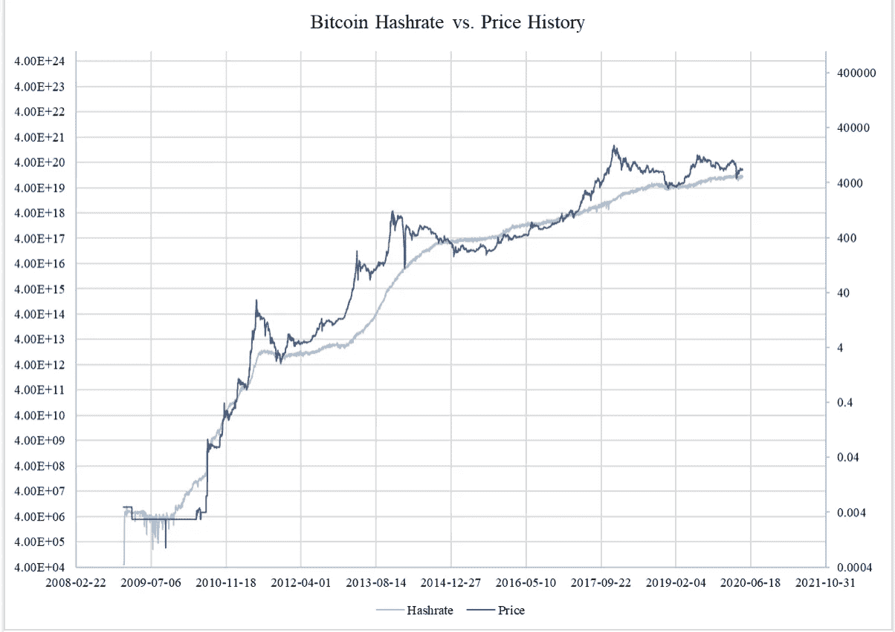
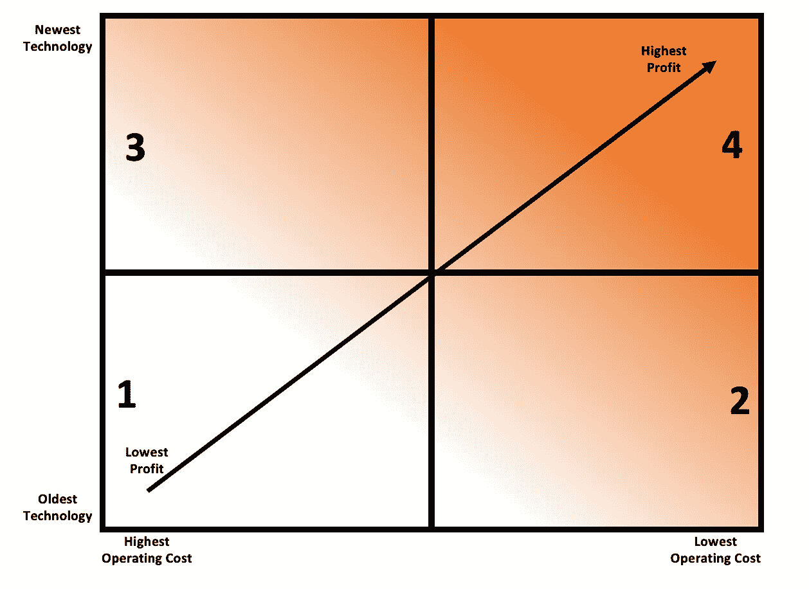

# 比特币价格和杂凑率的意外和悲剧性的破裂

> 原文：<https://medium.com/coinmonks/the-unforeseen-and-tragic-breakup-of-bitcoins-price-and-hash-rate-5c4c5321564d?source=collection_archive---------1----------------------->

不管是选择、命运、背叛还是悲剧，即使是最亲密的关系有时也会走到尽头；罗密欧与朱丽叶，吉尔莫与沃特斯(平克·弗洛伊德)，布鲁特斯与凯撒，犹大与耶稣基督。同样，比特币杂凑率和价格之间备受珍视的关系似乎正过早、出人意料地走到尽头。

Chart Credit: Shaurya Malwa

如上图所示，从一开始，比特币的价格和杂凑率就一直步调一致。比特币分析师之间经常争论这两者谁领先谁，但不管怎样，这两者高度相关是无可争议的。一些著名的学者，如马克斯·凯泽(Max Keiser)，从理论上认为，散列率起着主导作用，它反映了网络的健康和采用，因此随着散列率的增长，它为市场提供了对比特币的信心，价格也随之上涨。其他人将采取相反的立场，认为比特币价格的上涨让矿商有信心进一步投资比特币采矿和/或恢复暂停的运营，从而导致散列率的增加。其他人仍然认为这两者是协同工作的，交换领导角色提供了积极的反馈，推动了图表的上升和向右。

Bitcoin Mining Quadrants: Bob Burnett, Barefoot Mining

无论谁是正确的，这都不再重要，因为从今天早些时候生效的比特币开采难度调整开始，比特币价格和散列率之间的紧密相关性现已被打破。很明显，比特币的价格和散列率都不想结束这种关系，但一个恶棍，在这种情况下，CCP 通过禁止比特币采矿，正在迫使这种关系破裂。

在深入挖掘之前，先快速了解一下价格和散列率关系的正常动态。使用上面的图表，当新的采矿系统进入网络时，它们通常位于象限#3 或#4 的顶部。那些进入者经常大规模地这样做，并且提供了全局散列率的大量提升，因此将已经在网络中的挖掘服务器在图表中向下推。随着采矿服务器向下漂移到象限#1 或#2 或#3 的较轻部分，它们开始在盈利能力上徘徊，并且它们必须不断评估它们的情况。通常，在任何时间点，世界上大约 20%的散列能力位于这些区域，最终所有挖掘服务器都发现自己处于这种勉强活着的位置。一旦采矿服务器在这个区域，如果价格高，矿工打开这些服务器，当价格低，他们将关闭它们。有时，一个挖掘服务器可能会发现自己处于这种“乒乓模式”一年左右，然后才最终完全退役。正是这种挖掘社区利用这种乒乓模式的即时响应能力，导致了价格和散列率之间的高度相关性。(我在这里省略了一些细节和复杂性，因为我的观点只是给那些不太熟悉这个主题的人一些视角。)

不过，中国对国内采矿的禁令打破了这种价格和杂碎率的关系。立即生效，即使是象限#1 左下方的采矿服务器也将在几乎不考虑价格的情况下获得实际利润。所以，如果比特币的价格下降，在可预见的未来，它真的不会迫使它们被关闭。而且，由于所有可用的挖掘服务器都将被打开，价格的增加不会导致散列率的短期增加。换句话说，乒乓效应将不再存在，无法让杂凑利率在短期内对价格行为做出反应。

此外，在中国颁布矿业禁令之前，矿业内部已经在疯狂争夺北美、南美和欧洲的产能。在中国颁布采矿禁令之前，未来 6-9 个月内新设施和能源的明显和更容易的交易已经达成。(例如。我参与的公司将在未来六个月内增加三个新站点。这些都是在禁令颁布前就计划好并得到资助的。)此外，寻求搬迁的中国企业还必须解决一系列其他问题，比如让工厂退役、成立法人实体、寻找保险、在非常拥挤的全球航运网络中获得空间，以及在一个新的国家雇佣员工。这意味着增加新的产能以容纳被取代的中国采矿业在 2022 年不会很容易实现，很可能需要到 2023 年才能解决。

因此，至少在 2023 年下半年之前，价格和散列率之间的强相关性将被打破。总之，杂碎率已经触底，它将无处可去，但在很长一段时间内，价格将根据需求上下浮动。我推测，在 2024 年的某个时候，在下一次减半之后，比特币的价格和散列率之间的浪漫可能会重燃，但在那之前，这两者都是单飞的。

最后一点，正如我之前所写的(见我的其他媒体文章“中国比特币采矿禁令的影响”和“重新部署中国比特币采矿业的成本和力量”)，该网络在短短几周内失去了超过 50%的哈希力量。以前的价格和杂凑率变化，上升或下降，几乎总是由市场驱动的。奥地利经济学家弗里德里希·哈耶克(Friedrich Hayek)以他的工作而闻名，他的工作表明，当政府介入市场时，它们的存在通过产生错误信号破坏了市场的平衡机制，最终导致资本和劳动力的错配。显然，CCPs 此举意在打击中国国内的比特币，但也可能是试图在全球范围内削弱比特币。可能是他们考虑了哈耶克的理论，希望他们的操纵会在比特币生态系统内制造混乱和错误信号。但即使是全球基础设施的急剧减少也不会影响比特币处理交易的能力，不会威胁其账本的安全，也不会妨碍其货币供应的管理。相反，比特币的生态系统优雅地克服了这一障碍，再次表明它是健康、强健和美丽的。

**鲍勃·伯内特
赤脚矿业公司首席执行官
2021 年 7 月 3 日**

 [## 最佳免费加密交易机器人——前 16 名比特币交易机器人[2021]

### 2021 年币安、比特币基地、库币和其他密码交易所的最佳密码交易机器人。四进制，位间隙…

medium.com](/coinmonks/crypto-trading-bot-c2ffce8acb2a)  [## 最佳 6 个加密交易信号电报通道

### 这是乏味的找到正确的加密交易信号提供商。因此，在本文中，我们将讨论最好的…

medium.com](/coinmonks/best-crypto-signals-telegram-5785cdbc4b2b)  [## BlockFi 评论 2021 —通过您的加密获得 8.6%的利率

### 让你的密码发挥作用，获得比特币和其他加密货币的最佳利率

medium.com](/coinmonks/blockfi-review-53096053c097)