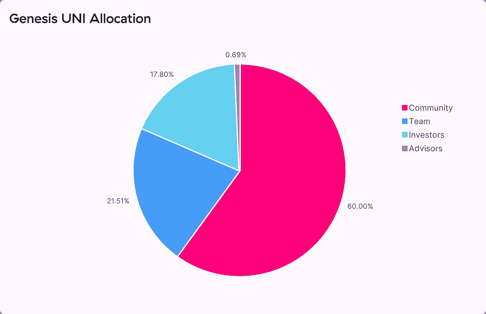
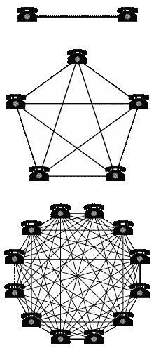
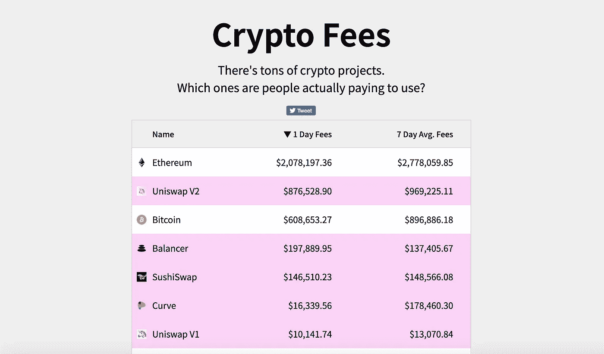
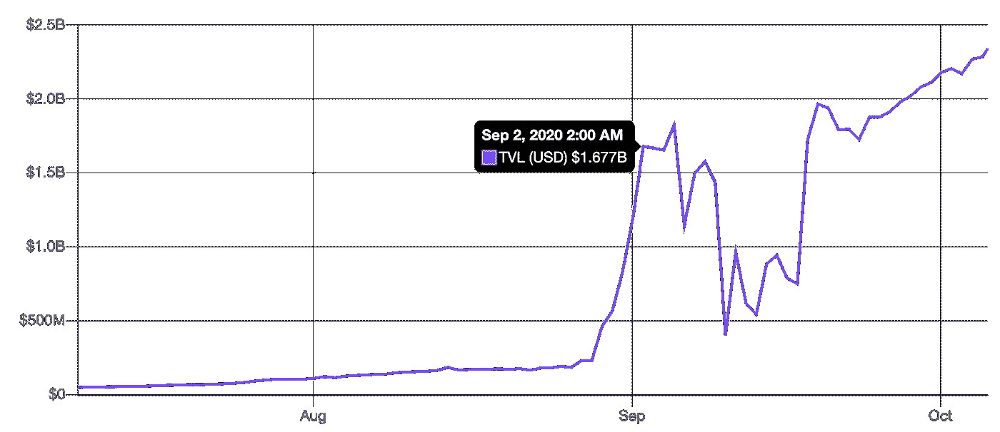
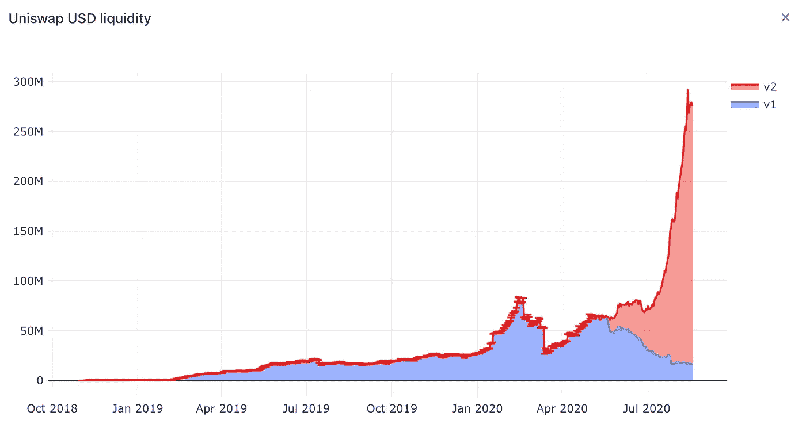
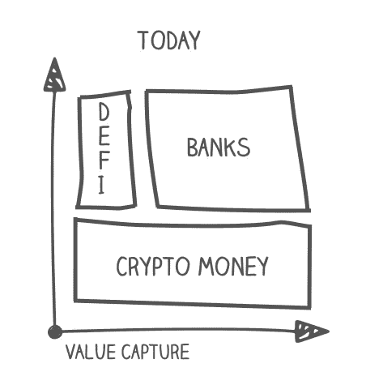
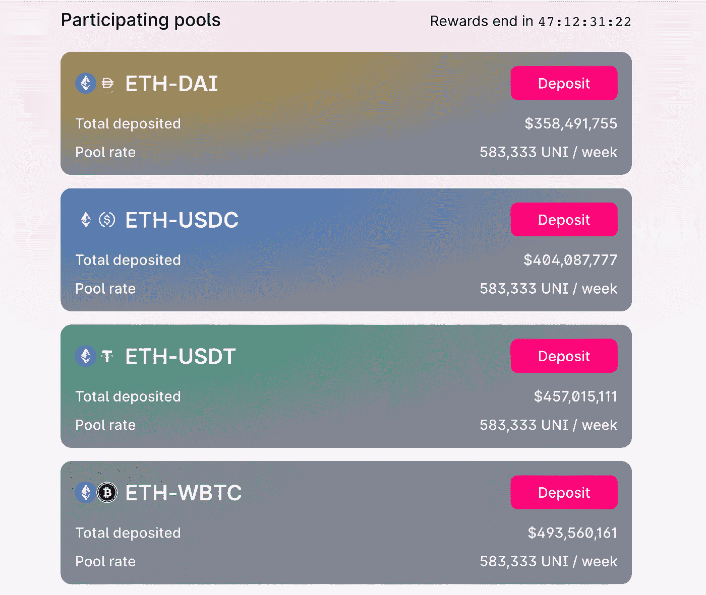
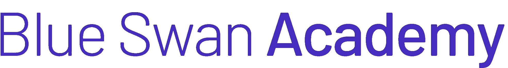

# 迪菲的独角兽

> 原文：<https://medium.com/coinmonks/the-unicorn-of-defi-3875a3f9a63d?source=collection_archive---------2----------------------->

Uniswap is the largest decentralized exchange in crypto

想象一下，在谷歌早期，你搜索的时候会得到谷歌的股份…

或者脸书给了你建立个人档案的股份…

或者优步用公司的股票奖励你骑他们的车。

嗯，这就是 **Uniswap，** crypto 最大的分散式交易所，以太坊最大的应用程序所做的。

该协议目前的市值为 35 亿美元(完全稀释)，其新令牌 **$UNI** 的发行让加密社区大吃一惊。该协议将总共发行 10 亿个令牌。令牌分发模型的特殊性在于:60%将在其用户中分发。这对于投资人甚至创始团队来说都是远远不止的。15%的令牌被追溯性地分发给它的用户！

Allocation of $UNI tokens

这个分配事件是如何发生的？

每个至少与协议交互一次的以太坊地址被分配了 400 美元 UNI，在撰写本文时相当于 1.400 美元。持有流动性的用户(又名“流动性提供者”)得到的甚至更多。甚至试图使用该协议但失败(失败交易)的用户也会得到奖励。资金是通过一种被称为**【空投】**的机制分配的，在这种机制下，代币被自动分配到选定的以太坊地址，用户无需支付任何费用。

这种独特的**追溯分发模型**是加密历史上最民主、最分散的令牌分发事件之一。在撰写本文时， [196k 个地址](https://explore.duneanalytics.com/dashboard/uni-token-claims)已经申请了超过 1 . 2 亿美元的 UNI 令牌。在 DeFi 中，用户有几个地址是很常见的，因此要求$UNI 令牌的用户的确切实际数量是未知的，但仍然非常重要。

为什么这个分配事件是一件大事？第一个原因是它产生了，**自动的、分散的所有权给它的用户。**协议的大部分将由用户所有，而不是由投资者或创始团队所有。项目的实际用户和早期信徒成为项目的股东。这是一个培养忠诚社区的好方法！

正如我们将看到的，加密令牌持有者和公司的传统股东之间有一些一般的相似之处。然而，也有重要的区别。最主要的一点是，代币持有者并不拥有一家公司的股份，而是拥有一个平台的股份。由于**网络效应**，平台的价值随着用户数量的增加呈指数增长。过去几个月里，Uniswap 价值的指数增长证实了这一点。

Diagram illustrating the network effect in a few simple phone networks. The lines represent potential calls between phones. As the number of phones connected to the network grows, the number of potential calls available to each phone grows and increases the utility of each phone, new and existing. Source: [Wikipedia](https://en.wikipedia.org/wiki/Network_effect)

第二，也许是 DeFi 短暂历史中最重要的财富分配事件。价值 5 . 25 亿美元的协议权益自动分配给了机构群体。总计 35 亿美元项目的 60%将分配给其用户。所有这些都发生在 COVID“刺激检查”和关于普遍基本收入(UBI)的讨论日益增多的时代。

**美元有什么用？**

$UNI token 在某些方面类似于传统公司的股权工具。它赋予持有者投票权(政治权利)和潜在的收入分成(经济权利)。

$UNI 令牌的主要功能是**对协议及其金库的治理**。令牌持有者可以对协议开发以及未来的收入分配进行投票。如果代币持有人投票支持，他们可以获得平台产生的部分价值。

Uniswap 创造了哪些收入？主要是交易者使用交易所时支付的交易费用(兑换代币收取 0，3%的费用)。治理合同包含一个“费用开关”，如果被激活，将使持有者赚取一部分协议费用。

这给代币持有者带来了可观的经济价值。Uniswap 是 crypto 中第二个产生最多费用的协议，甚至超过了比特币！

Fees are generated by the top crypto protocols. Source: [cryptofees.info](http://www.cryptofees.info)

## 什么是 Uniswap？

Uniswap 是最大的 DeFi 协议，也是最重要的分散式交换机。它的平均月交易量为 3 . 5 亿美元。这种分散式交易所的运作方式与你可能已经知道的传统交易所略有不同。与传统的交易所不同，在 Uniswap 中，你没有站在交易另一端的对手。相反，有一个由智能合约管理的资产池(又名流动性池)。从技术上讲，人们可以直接与流动性池进行交易(对等智能合约)。任何人都可以向这些资金池提供资金，并从交易者支付的费用中获得 0.3%的份额。

Uniswap is currently the top DeFi protocol with over USD 2 locked. Source: [DeFiPulse](https://defipulse.com/)

像 DeFi 的其他公司一样，Uniswap 今年的增长是指数级的。它是如此成功，以至于交易量与比特币基地这样分散的交易所不相上下。该协议，只有 10 名员工，却达到了一家拥有 1200 名员工的公司即将上市的规模！

Uniswap liquidity: Source: [Dune Analytics](https://explore.duneanalytics.com/dashboards?page=1&page_size=20&q=uniswap%20)

Uniswap 是 DeFi 的基本构建模块之一，也是您在 DeFi 之旅中遇到的第一批协议之一。它允许交易任何类型的加密资产，也允许**列出任何资产并自动为其创建市场**。这是一个巨大的特点，将彻底改变资本市场。在传统金融中，在公开股票市场上市资产的过程需要例如 IPO，并且需要相当大的资本和时间投资。就连在比特币基地这样的集中交易所上市加密资产的过程，直到最近还是一个昂贵而漫长的过程。

不再是了。现在，有了 Uniswap，任何人都可以随意列出资产。如果有足够的流动性，任何种类的资产都可以自动形成市场。因此，Uniswap 最重要的职能之一是一个自动做市商(AMM) 。这是由在传统金融中扮演重要角色的 m [市场庄家](https://www.investopedia.com/terms/m/marketmaker.asp)演变而来的。我们将在下一篇文章中更深入地探讨这一重要角色。

此外，Uniswap 可以说是 DeFi 中最分散和可信的中立协议。因此，它已经成为 DeFi 生态系统中不可或缺的[基础设施](https://bankless.substack.com/p/uniswap-is-infrastructure)。根据瑞恩·亚当斯和大卫·霍夫曼开发的 [**协议接收器论文**](https://bankless.substack.com/p/the-great-protocol-sink-market-monday) **，**的说法，中立的、分散的协议更有可能流行，并且从长远来看更有价值。

Uniswap is a very “dense” protocol in the Protocol Sink Thesis

**错过空投怎么办？**

如果您没有获得任何$UNI 奖励，仍然有机会赚取一些$UNI！与 Uniswap 的 [**产量耕作计划。**](https://bankless.substack.com/p/uniswap-is-infrastructure) 如果您将资金存入四个合格资金池之一:

USDT 联邦理工学院

USDC 联邦理工学院

ETH / DAI

WBTC 联邦理工学院

作为奖励，您将获得$UNI 代币。每个池将每周分发 583，000 个 UNI 令牌，按当前市场价格计算，每个池大约 200 万美元。确切的价值取决于 UNI 的价格，它可能非常不稳定。

你可以在这里计算你的潜在回报。

通过存款，你变成了流动性提供者(LP)

4 pools are initially eligible for “farming” $UNI tokens

我们将在以后的文章中讨论投资自动做市商的特殊性。现在，你需要知道，如果交易对的价格变化，你可能会遭受**暂时的损失。**关于这是什么意思的简短解释，[请看这里](https://www.youtube.com/watch?v=f4HMSiEZBTs)。因此，如果你看好 ETH，选择 ETH / WBTC 池可能更好，因为这些资产可能比 ETH / stablecoin 更相关。

请记住，流动性计划将开放 42 天以上！关于如何作为流动性提供者赚取 UNI 的优秀教程，请看[这里](https://www.youtube.com/watch?v=Sxo-5AX1F4g)。

P.D .无论是作者还是蓝天鹅，都与本文提到的任何项目没有商业关系。任何评论纯粹基于独立的标准和基于作者经验的结论。作者拥有$UNI holdings。本文内容仅供学术和教育之用。这不是财务、税务或法律建议。请做好自己的尽职调查和研究。

蓝天鹅学院是一个面向区块链经济的教育平台，专注于法律和金融行业。请在这里查看我们目前的[产品。](https://academy.blue-swan.io/)

[在这里注册订阅我们的时事通讯！](https://academy.blue-swan.io/form-newsletter-170920)

**同样，阅读**

*   [顶级 DeFi 项目](/coinmonks/defi-future-10-promising-projects-in-the-defi-world-ff2b697ab006)
*   [unis WAP 最佳钱包](/coinmonks/best-wallets-to-use-uniswap-e91a6385d9e8)
*   [面向开发人员的最佳加密 API](/coinmonks/best-crypto-apis-for-developers-5efe3a597a9f)