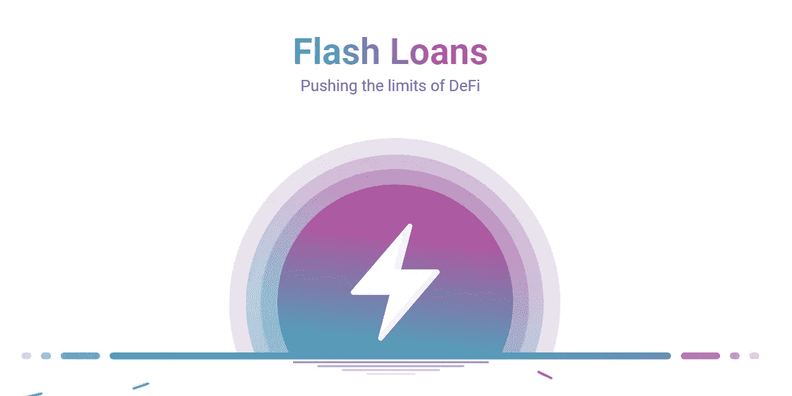
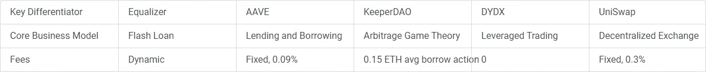
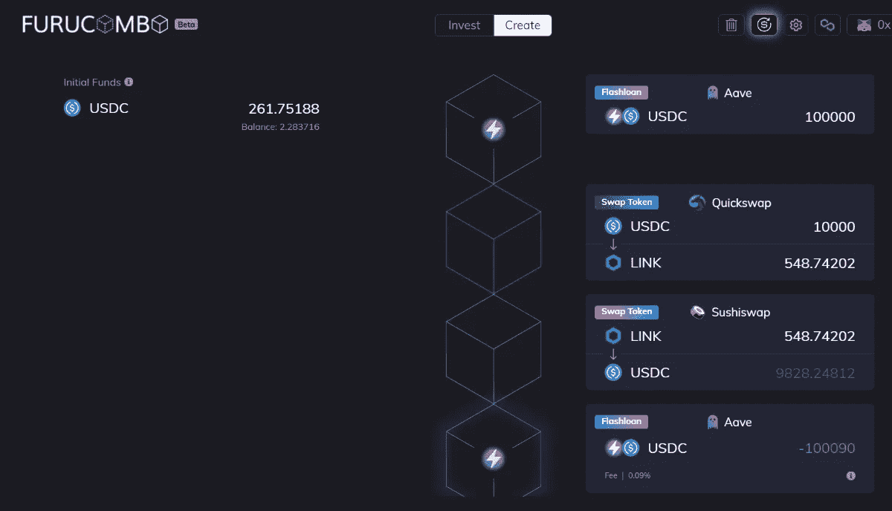

# Flashloans 的无限力量

> 原文：<https://medium.com/coinmonks/the-unlimited-power-of-flashloans-7dc3007b7901?source=collection_archive---------2----------------------->

## 如果我告诉你，你可以在几秒钟内无限制地借钱，没有抵押，风险最小，会怎么样？闪贷让这一切成为可能。

Aave was the first platform to offer flashloans in early 2020

# 什么是闪贷？

大多数人都熟悉[正常贷款](https://www.investopedia.com/terms/l/loan.asp)。贷款人把钱借给借款人，借款人随后要付利息。借款人向贷款人支付暂支款项([抵押物](https://www.investopedia.com/terms/c/collateral.asp))。闪贷有点不同。

**没有抵押物**。借款人通常需要拿出抵押品来确保如果他们不能偿还贷款，贷款人仍然可以拿回他们的钱。快速贷款是无担保的，这意味着它们不需要抵押品。相反，借款人需要立即还钱。

Photo by Max Bender from Unsplash

**瞬间。**与传统贷款不同，闪贷是即时的。贷款在借出的同一笔交易中完成。这意味着借款人在交易结束前进行交易。

**无限贷款额度**。用户可以从提供贷款的 [DeFi](https://www.coindesk.com/learn/what-is-defi/) 协议中借入不超过总[流动性](https://www.gemini.com/cryptopedia/what-is-a-liquidity-pool-crypto-market-liquidity#section-how-do-crypto-liquidity-pools-work)的任何金额。

**风险最小。**闪贷在同一笔交易内偿还。如果交易失败，智能合同 t 确保闪贷不会发生。除了交易费，没有任何风险。

Photo by dhehaivan from Unsplash

# Flashloans 的使用:

## **套利**

闪贷主要用于 [**套利**](https://www.investopedia.com/terms/a/arbitrage.asp) 。套利交易利用市场间的价格差异来获利。

比方说，你在两个不同的[分散交易所](https://coinmarketcap.com/alexandria/glossary/decentralized-exchange-dex)发现了 [ETH](https://ethereum.org/en/eth/) 相当大的价格差异。你可以在没有任何[抵押品](https://www.investopedia.com/terms/c/collateral.asp)的情况下借入大量 [ETH](https://ethereum.org/en/eth/) ，并从差价中获利。

这一切听起来不错，但是有一些[前端运行的机器人](https://www.paradigm.xyz/2020/08/ethereum-is-a-dark-forest/)从[内存池](https://coinmarketcap.com/alexandria/glossary/mempool)中复制你的交易，支付更高的[汽油费](https://ethereum.org/en/developers/docs/gas/)并在你之前被开采，窃取你的[套利](https://www.investopedia.com/terms/a/arbitrage.asp)机会。你还必须考虑到[网络费用](https://ethereum.org/en/developers/docs/gas/)和[价格滑动](https://coinmarketcap.com/alexandria/glossary/slippage)。

套利是一项高度竞争的运动。

Image by Felix Mittermeier from Unsplash

## 清算

除了[套利](https://www.investopedia.com/terms/a/arbitrage.asp)，闪贷还可以用于 [**清算**](https://www.investopedia.com/terms/l/liquidation.asp) 。如果借款人让协议清算他们的头寸，他们将受到惩罚。借款人可以使用闪贷，自行清算他们的头寸，避免罚款。

比如:你用 [ETH](https://ethereum.org/en/eth/) 做[抵押物](https://www.investopedia.com/terms/c/collateral.asp)借了很多 [USDC](https://www.coinbase.com/learn/crypto-basics/what-is-usdc) 。ETH 的价格在你的[平仓](https://www.investopedia.com/terms/l/liquidation.asp)水平附近大幅下跌。你没有 [ETH](https://ethereum.org/en/eth/) 来增加你的[抵押品](https://www.investopedia.com/terms/c/collateral.asp)也没有 [USDC](https://www.coinbase.com/learn/crypto-basics/what-is-usdc) 来偿还贷款。你是做什么的？

你可以取出一笔 [USDC](https://www.coinbase.com/learn/crypto-basics/what-is-usdc) 闪贷来偿还贷款，然后将一部分取出的[ETH](https://ethereum.org/en/eth/)抵押物换成 [USDC](https://www.coinbase.com/learn/crypto-basics/what-is-usdc) 来即时偿还闪贷。用这种方法你可以保留剩余的 [ETH](https://ethereum.org/en/eth/) 而不用支付[清算](https://www.investopedia.com/terms/l/liquidation.asp)。

Image from Leon Contreras from Unsplash

## 抵押品互换

Flashloans 也可以用于[抵押品](https://www.investopedia.com/terms/c/collateral.asp)互换。例如，如果你有一笔 [USDC](https://www.coinbase.com/learn/crypto-basics/what-is-usdc) 贷款，以 [WBTC](https://wbtc.network/) 作为[抵押品](https://www.investopedia.com/terms/c/collateral.asp)，你可以将 [WBTC](https://wbtc.network/) [抵押品](https://www.investopedia.com/terms/c/collateral.asp)换成 [ETH](https://ethereum.org/en/eth/) [抵押品](https://www.investopedia.com/terms/c/collateral.asp)。这让你可以很容易地改变你的风险状况。

## DeFi 黑客

值得一提的是，在大多数 [DeFi](https://www.coindesk.com/learn/what-is-defi/) 黑客攻击和利用中，黑客使用了闪贷。这就像是 flashloan 给了黑客无限的弹药来攻击协议。如果你对加密技术感兴趣，请查看: [rekt.news](https://rekt.news/) 。

Image by Towfique Barbhuiya from Unsplash

# 如何做闪贷

有各种协议提供 flashloans，如 [Aave](https://aave.com/) 、 [KeeperDAO](https://www.keeperdao.com/) 、[均衡器](https://equalizer.finance/)、 [dYdX](https://dydx.exchange/) 和 [Uniswap](https://uniswap.org/) 。[均衡器](https://equalizer.finance/)严格关注 flashloans。

Fees on DeFi protocols that offer flashloans

执行 flashloans 还不是用户友好的。你需要有技术知识，写一份执行贷款的[智能合同](https://www.ibm.com/topics/smart-contracts)。然而，有一个应用程序可以让普通的 [DeFi](https://www.coindesk.com/learn/what-is-defi/) 用户使用 flash loans:[**Furucombo**](https://furucombo.app/combo)

Furucombo platform

Furucombo 允许任何人用 flashloans 创建[套利](https://www.investopedia.com/terms/a/arbitrage.asp)策略。简单的拖放工具使 [DeFi](https://www.coindesk.com/learn/what-is-defi/) 用户能够构建和定制不同的 [DeFi](https://www.coindesk.com/learn/what-is-defi/) 组合。在这里试试:[**furucombo . app**](https://furucombo.app/combo)

# 结论

闪贷可能是一把双刃剑。一方面，它给 [DeFi](https://www.coindesk.com/learn/what-is-defi/) 带来进步和机遇:低资本的交易者可以开展[套利](https://www.investopedia.com/terms/a/arbitrage.asp)和[清算](https://www.investopedia.com/terms/l/liquidation.asp)交易。另一方面，黑客可以发动 [flashloan 攻击](https://blockworks.co/flash-loan-exploit-whips-cream-finance-for-130-million/)，增加他们的利润。Flashloans 是一种工具，既可以用于好的方面，也可以用于坏的方面。但是，即使是用于不良目的的闪贷也间接地加强了生态系统，因为项目提高了安全性以防止未来的攻击。

> 加入 Coinmonks [电报频道](https://t.me/coincodecap)和 [Youtube 频道](https://www.youtube.com/c/coinmonks/videos)了解加密交易和投资

## 另外，阅读

*   [MoonXBT vs Bybit vs 币安](https://blog.coincodecap.com/bybit-binance-moonxbt) | [Arbitrum:第二层解决方案](https://blog.coincodecap.com/arbitrum)
*   [买 PancakeSwap(蛋糕)](https://blog.coincodecap.com/buy-pancakeswap)|[matrix export Review](https://blog.coincodecap.com/matrixport-review)
*   [最佳免费加密信号](https://blog.coincodecap.com/free-crypto-signals) | [YoBit 评论](/coinmonks/yobit-review-175464162c62) | [Bitbns 评论](/coinmonks/bitbns-review-38256a07e161)
*   [OKEx 回顾](/coinmonks/okex-review-6b369304110f) | [Kucoin 交易机器人](/coinmonks/kucoin-trading-bot-automate-your-trades-8cf0ca2138e0) | [期货交易机器人](/coinmonks/futures-trading-bots-5a282ccee3f5)
*   [AscendEx Staking](https://blog.coincodecap.com/ascendex-staking)|[Bot Ocean Review](https://blog.coincodecap.com/bot-ocean-review)|[最佳比特币钱包](https://blog.coincodecap.com/bitcoin-wallets-india)
*   [霍比评论](https://blog.coincodecap.com/huobi-review) | [OKEx 保证金交易](https://blog.coincodecap.com/okex-margin-trading) | [期货交易](https://blog.coincodecap.com/futures-trading)
*   [比特币基地赌注](https://blog.coincodecap.com/coinbase-staking) | [Hotbit 评论](/coinmonks/hotbit-review-cd5bec41dafb) | [KuCoin 评论](https://blog.coincodecap.com/kucoin-review)
*   [最佳加密交易信号电报](/coinmonks/best-crypto-signals-telegram-5785cdbc4b2b) | [MoonXBT 评论](/coinmonks/moonxbt-review-6e4ab26d037)
*   [Coinswitch 俱吠罗评论](/coinmonks/coinswitch-kuber-review-1a8dc5c7a739) | [电网交易机器人](https://blog.coincodecap.com/grid-trading) | [比特币基地收费](/coinmonks/coinbase-fees-831e77d4f2c5)
*   [Bitget 回顾](https://blog.coincodecap.com/bitget-review) | [双子 vs 区块链](https://blog.coincodecap.com/gemini-vs-blockfi) | [OKEx 期货交易](https://blog.coincodecap.com/okex-futures-trading)
*   [OKEx vs KuCoin](https://blog.coincodecap.com/okex-kucoin) | [摄氏替代品](https://blog.coincodecap.com/celsius-alternatives) | [如何购买 VeChain](https://blog.coincodecap.com/buy-vechain)
*   [币安期货交易](https://blog.coincodecap.com/binance-futures-trading)|[3 comas vs Mudrex vs eToro](https://blog.coincodecap.com/mudrex-3commas-etoro)
*   [在印度利用加密套利赚取被动收入](https://blog.coincodecap.com/crypto-arbitrage-in-india)