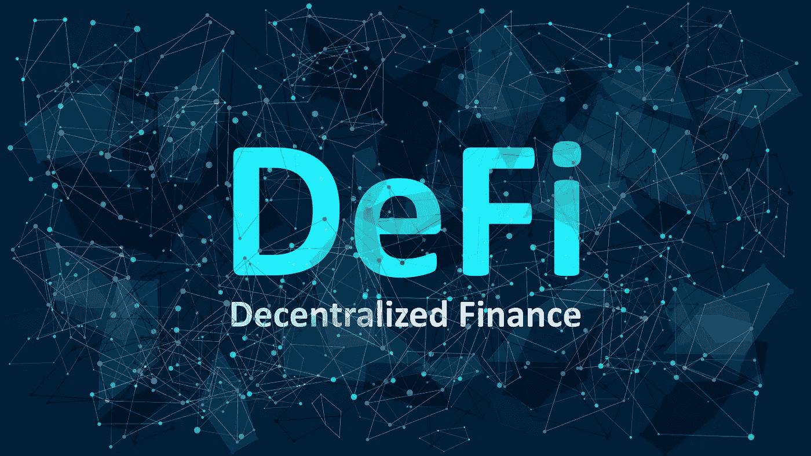
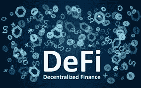

# DeFi 非官方指南

> 原文：<https://medium.com/coinmonks/the-unofficial-guide-through-defi-454bef38addb?source=collection_archive---------3----------------------->

## 什么是，什么不是，多少&多少哇？

如果你有一部手机，DEFI 这个词很有可能以某种形式出现在你的新闻提要中。如果没有，欢迎来到世界上最令人期待的革命，没有人预料到。

> 在陷入怪物 apy 率的仙境之前，也就是 DEFI，有几个典型的原始我们应该解决；
> →DEFI 是两个独立词的概要&题材， ***德*** 集权+ ***FI*** nance。→分散金融指的是产品，以精心设计的智能合约的形式，部署到图灵完整的分布式分类账网络。支持 DEFI 的主要区块链网络是以太坊& BinanceSmartChain。然而，许多其他智能合同区块链正在慢慢获得牵引力(例如:Tron、Polkadot、Kusama、Avalanche 等)
> →DEFI 的目的是取代旧式金融基础设施的过时中央系统。

现在，人们比以往任何时候都更加开始质疑阻碍其人民生活质量和隐私的专制政权。随着每一天的过去，世界各地不同国家的公民对他们的政府失去越来越多的信任。失去对政府的信任意味着失去对支撑政府货币的货币/财政制度的信任；这反过来又直接反映了这个文明不可避免的崩溃。考虑到尼日利亚、委内瑞拉和土耳其等国家是货币崩溃的主要候选人，这并不奇怪。

DEFI 肩负着一项崇高的使命，那就是用更加公平、高效、透明和分散的金融系统(恰好也是数字化的)取代中央金融系统。 ****作者认为，DEFI 被称为金融只是时间问题。****

为了了解 DEFI 到底是什么样子&它的潜在影响；重要的是要意识到构成现代金融体系的 8 *(1)个关键类别；

## DEFI 有哪些不同的类别？

1.  **借出/借入** 相当简单；你有一个 BTC。与其把它放在那里，不如按价格升值——你把它给某人使用，作为回报，这样做可以获得额外报酬。对于借款人来说，情况正好相反。
2.  **交易** 没有交易，金融怎么可能存在？它不能。由于其潜在的盈利能力，交易是最具竞争力的金融领域之一。
3.  **衍生品** 复杂&有时是彻头彻尾的奇异交易工具，对冲&投资。
4.  期权
    最受欢迎的衍生品之一，通常用于管理投资组合中的风险。(允许人们有购买的权利，但没有购买的义务)。
5.  **支付** 一位小个子谈到了公共领域的金融范畴，支付是任何经济风险的命脉。
6.  拥有密码当然很棒……但是你要把它存放在哪里呢？
7.  资产管理
    当你可以拥有一个自动化、透明的系统，不再强迫你去信任(只是验证)的时候，为什么还要让高盛(Goldman Sachs)持有你的资产，年收益率可能是 15%减去通货膨胀&运营费用。
8.  **保险**
    有些讨厌它。有些人喜欢它。其他人都无所谓。不管你在这个光谱中处于什么位置，都不可能否认一个>1000 亿美元产业的重要性。
9.  *(8*+1)* **神谕
    将区块链/加密经济与现实世界的数据结合在一起的粘合剂。神谕是所有加密金融的基本元素，然而，它们可以归因于 DEFI。**

所以现在对 DEFI 的问题来了；为什么要分散一些在集中的时候看起来有效的东西呢？

如果你可能还不知道，在过去的 10 多年里，世界各地的机构因侵犯个人隐私、操纵信息和彻头彻尾的欺诈而被罚款。集权意味着寻租&让自私的对手随心所欲地拥有你的隐私。由于政治联盟等微妙的社会差异，集权带来了排斥全球参与的偏见。

另一方面，我们有分散的系统。分散式系统分配权力/所有权并强加责任。

> 权力下放是腐败的敌人。
> 
> (—安德烈·迪多夫斯基)

但是这些手续已经够了；DEFI 只对世界上 99%的人重要，原因只有一个——收益。Moonshot，杠杆长 100 倍，没有停止，rekt，当 lambos。

当 DEFI 在 2020 年夏天登上“主流”舞台时，项目推出了 1000%+APY 产品 0.0。客观地说，向 DEFI 投资 10，000 美元意味着 100，000 美元的回报。这显然是不可能的，更不用说是可持续的。不久后，市场回到均值水平，然后一路狂飙，涨幅超过 12 倍(实际上否定了所谓的可持续发展的“基本原理”逻辑)。

这些 giga-chad 回归的故事激起了散户的兴趣&然后每个人都想参与进来。只有一个问题。怎么…

如今参加 DEFI 不一定是最简单的用户体验。许多人想尝试一些很酷的新协议，但不久之后，迷失在他们的元掩码种子短语中&放弃吧。见鬼，有些人甚至没有走那么远——选择太多了，可能会让人不知所措；毕竟，我到底要定义什么样的链条？

正如本文开头所提到的，目前的 DEFI 主要基于以太坊& BSC(binancesmartchan)*{这两个链使用相同的部署环境:EVM[以太坊虚拟机]* 陷入其中是对您宝贵智力的浪费——而使用任何 DEFI 产品都意味着高风险——不使用 DEFI 可能意味着相反的情况。

首先，看看这个领域的领导者，尝试一下，了解他们会让你掉进兔子洞，找到新的机会；

这里有 5 个最著名的，用户友好的 DEFI 产品*(这些都是建立在以太坊之上的)。*

-大院($COMP ) → [简介](https://coinmarketcap.com/currencies/compound/) → [场地](https://compound.finance/governance/comp) ***||借出/借入***
-AAVE($ AAVE)→[简介](https://coinmarketcap.com/currencies/aave/) → [场地](https://aave.com/)**】| |借出/借入**
-UniSwap($ UNI)→[简介](https://coinmarketcap.com/currencies/uniswap/) → [场地](https://uniswap.org/) ***||交换***

狩猎愉快🍾

> * * * * * * * * * * * * * * * * * *
> 重要提示
> * * * * * * * * * * * * * * * * * * * *
> 媒体把大众的视角&对 DEFI 是什么的理解给搅浑了。只是为了澄清一些事情；柴叶 INU 不是 DEFI。DOGE 不是 DEFI。如果你选择参加 DEFI，请随时做好准备。
> 4)比特币 DEFI(改变主意*🙃*)

> 加入 [Coinmonks 电报频道](https://t.me/coincodecap)，了解加密交易和投资

 [## 最佳免费加密交易机器人——前 16 名比特币交易机器人[2021]

### 2021 年币安、比特币基地、库币和其他密码交易所的最佳密码交易机器人。四进制，位间隙…

medium.com](/coinmonks/crypto-trading-bot-c2ffce8acb2a)  [## 最佳 6 个加密交易信号电报通道

### 这是乏味的找到正确的加密交易信号提供商。因此，在本文中，我们将讨论最好的…

medium.com](/coinmonks/best-crypto-signals-telegram-5785cdbc4b2b)  [## BlockFi 评论 2021 —通过您的加密获得 8.6%的利率

### 让你的密码发挥作用，获得比特币和其他加密货币的最佳利率

medium.com](/coinmonks/blockfi-review-53096053c097)  [## 加密税务软件——五大最佳比特币税务计算器[2021]

### 不管你是刚接触加密还是已经在这个领域呆了一段时间，你都需要交税。

medium.com](/coinmonks/best-crypto-tax-tool-for-my-money-72d4b430816b) 

## 另外，阅读

*   [尤霍德勒 vs 考尼洛 vs 霍德诺特](/coinmonks/youhodler-vs-coinloan-vs-hodlnaut-b1050acde55a) | [Cryptohopper vs 哈斯博特](https://blog.coincodecap.com/cryptohopper-vs-haasbot)
*   [币安 vs 北海巨妖](https://blog.coincodecap.com/binance-vs-kraken) | [美元成本平均交易机器人](https://blog.coincodecap.com/pionex-dca-bot)
*   [如何在印度购买比特币？](/coinmonks/buy-bitcoin-in-india-feb50ddfef94) | [WazirX 评论](/coinmonks/wazirx-review-5c811b074f5b) | [BitMEX 评论](https://blog.coincodecap.com/bitmex-review)
*   [比特币主根](https://blog.coincodecap.com/bitcoin-taproot) | [Bitso 点评](https://blog.coincodecap.com/bitso-review) | [排名前 6 的比特币信用卡](/coinmonks/bitcoin-credit-card-bc8ab6f377c6)
*   [双子座 vs 比特币基地](https://blog.coincodecap.com/gemini-vs-coinbase) | [比特币基地 vs 北海巨妖](https://blog.coincodecap.com/kraken-vs-coinbase) | [硬币罐 vs 硬币点](https://blog.coincodecap.com/coinspot-vs-coinjar)
*   [印度密码交易所](/coinmonks/bitcoin-exchange-in-india-7f1fe79715c9) | [比特币储蓄账户](/coinmonks/bitcoin-savings-account-e65b13f92451) | [Paxful 审核](/coinmonks/paxful-review-4daf2354ab70)
*   [杠杆令牌](/coinmonks/leveraged-token-3f5257808b22) | [最佳加密交易所](/coinmonks/crypto-exchange-dd2f9d6f3769) | [AscendEX 评论](/coinmonks/ascendex-review-53e829cf75fa)
*   [Godex.io 审核](/coinmonks/godex-io-review-7366086519fb) | [邀请审核](/coinmonks/invity-review-70f3030c0502) | [BitForex 审核](/coinmonks/bitforex-review-c4bb28d9e271) | [HitBTC 审核](/coinmonks/hitbtc-review-c5143c5d53c2)
*   [Crypto.com 费用](/coinmonks/binance-fees-8588ec17965) | [僵尸加密审查](/coinmonks/botcrypto-review-2021-build-your-own-trading-bot-coincodecap-6b8332d736c7) | [替代品](https://blog.coincodecap.com/crypto-com-alternatives)
*   [MXC 交易所评论](/coinmonks/mxc-exchange-review-3af0ec1cba8c) | [Pionex vs 币安](https://blog.coincodecap.com/pionex-vs-binance) | [Pionex 套利机器人](https://blog.coincodecap.com/pionex-arbitrage-bot)
*   [我的密码交易经验](/coinmonks/my-experience-with-crypto-copy-trading-d6feb2ce3ac5) | [比特币基地评论](/coinmonks/coinbase-review-6ef4e0f56064)
*   [加密货币储蓄账户](/coinmonks/cryptocurrency-savings-accounts-be3bc0feffbf) | [赌注加密](https://blog.coincodecap.com/staking-crypto) | [窃取 x 评论](/coinmonks/stealthex-review-396c67309988)
*   [BigONE 交易所评论](/coinmonks/bigone-exchange-review-64705d85a1d4) | [CEX。IO 审查](https://blog.coincodecap.com/cex-io-review) | [交换区审查](/coinmonks/swapzone-review-crypto-exchange-data-aggregator-e0ad78e55ed7)
*   [最佳比特币保证金交易](/coinmonks/bitcoin-margin-trading-exchange-bcbfcbf7b8e3) | [Bityard 保证金交易](https://blog.coincodecap.com/bityard-margin-trading) | [Prokey 审核](/coinmonks/prokey-review-26611173c13c)
*   [加密保证金交易交易所](/coinmonks/crypto-margin-trading-exchanges-428b1f7ad108) | [赚取比特币](/coinmonks/earn-bitcoin-6e8bd3c592d9) | [Mudrex 投资](https://blog.coincodecap.com/mudrex-invest-review-the-best-way-to-invest-in-crypto)
*   [WazirX vs coin dcx vs bit bns](/coinmonks/wazirx-vs-coindcx-vs-bitbns-149f4f19a2f1)|[block fi vs coin loan vs Nexo](/coinmonks/blockfi-vs-coinloan-vs-nexo-cb624635230d)