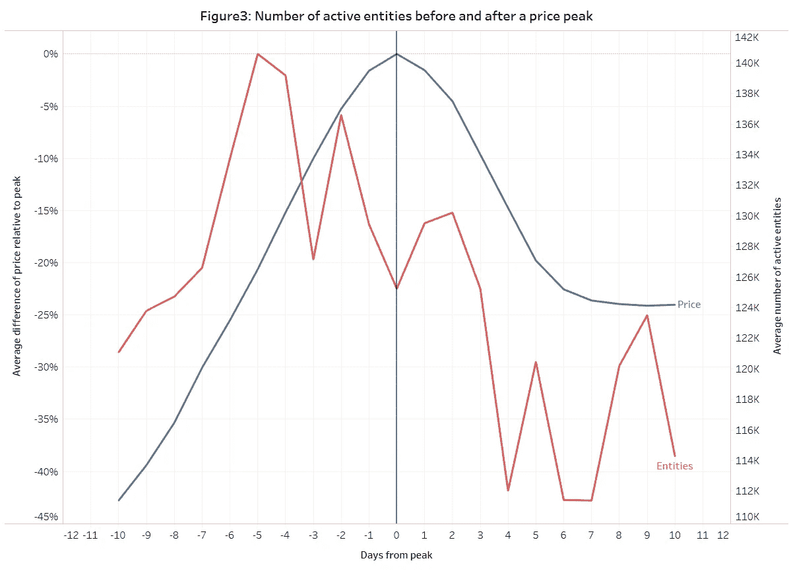

# 关于比特币峰值的未知故事

> 原文：<https://medium.com/coinmonks/the-untold-story-about-bitcoin-peaks-12083ec0950d?source=collection_archive---------4----------------------->

你担心你会错过高峰期的机会吗？你希望在 2017 年 12 月比特币达到 19000 美元时卖掉一些吗？嗯…，不要对自己太苛刻，因为我们很多人都错过了那个机会。当时，我们很多人都想象着 5 万年前的 BTC。从长远来看，我们太乐观了。我的意思是，谁能预测比特币的情绪会在短短两个月内从 19k 跌至 7k？比特币仍然是一个新生的资产类别，它有着活跃的本质。所以，不管你喜不喜欢，你是在坐过山车。

如今，比特币的价格达到了另一个历史新高，看涨的叙述将看跌的叙述带到了角落。但是如果你有疑问或者有其他想法，不要害羞。

我们写这篇文章的目的是帮助你更好地理解投资者/交易者在这些夸张时期的行为，通过与之前类似的情况进行比较，当时比特币经历了从超级看涨到超级看跌的情绪突变。本研究使用的指标是所谓的链上指标；这意味着你可以通过查看比特币节点来获得它们。为简单起见，我们将 [Glassnode](https://glassnode.com/) 的服务用于链上数据。

在接下来的方法论部分，我们将揭示我们在情绪变化的日子里聚焦的方法的细节。我们总共确定了以下 13 天:


以下是主要发现:

**1-价格峰值通常是连锁交易数量的转折点**

在比特币交易高峰期到来之前的日子里，比特币交易的需求比高峰期之后的日子里要多。
从图表中可以看出，在同等价格下，高峰前后，每天的交易量高峰前高于高峰后。


交易数据是实体调整的，这意味着它不包括区块链上同一实体的地址之间进行的交易。所以，这个数字是真实交易的近似代理。在分类账上将价值从一个所有者转移到另一个所有者的人。

我们分析的范围是上述 13 个点各前后十天。x 轴上的零代表 13 个峰值。任何图表上的每个点代表 13 个点的简单平均值。

我们选择呈现价格相对于峰值的%变化，而不是以美元为单位的价格。这是因为美元数额从一个峰值到另一个峰值变化很大，这将使我们的结果偏向 13 个事件中的 1 个或 2 个事件。

**2-** **老前辈在巅峰之前卖出，后来者在巅峰之后卖出**

如该图所示，在相同价格下，峰值前几天出售的已用产出(比特币记账单位)的利润率通常高于峰值后几天出售的产出的利润率。这意味着那些以较低价格购买的人往往会在情绪发生变化之前卖掉他们的比特币。但是要小心，虽然到目前为止老前辈在大多数时候都是正确的，但这并不意味着在未来的高峰中会一直如此。


**3-** **高峰前与比特币互动的用户比高峰后多**

这张是最明显的图表。这很容易得到常识的支持。高峰之前，创建和使用地址的人比高峰之后多。这可能是我的行为科学问题。实体是属于同一所有者的地址组。



方法:
我们选取了比特币生命周期中的 13 个高峰期，从 2010 年到 2020 年 11 月，来进行分析。
在比特币价格数据的 5 天移动平均线上，通过以下标准的组合来识别峰值。
13 个峰值的数据点已使用简单平均值进行平均，在图表上表示为单个数据点。

以下代码用于准备数据和识别峰值:

```
**import** pandas **as** pd
**import** datetime **as** dt
data = pd.read_csv(**'price.csv'**)
data.timestamp = data.timestamp.apply(**lambda** x: \dt.datetime.strptime(x, **"%Y-%m-%dT%H:%M:%SZ"**).date())
data = data.groupby([**'timestamp'**]).mean().reset_index()
data = data.fillna(method=**'bfill'**)
data[**'price-ma'**]=data[**'c'**].rolling(5).mean()crash_days_1 = []
**for** i **in** range(0, len(data.index) - 3, 1):
        **for** m **in** range(i, i +3, 1):
            **if** data[**'price-ma'**].iloc[m + 1] <= data[**'price-ma'**].iloc[m]:
                **pass
            else**:
                **break
            if** m==i+2: crash_days_1.append(i)

crash_days_2 = []
**for** i **in** range(0, len(data.index) - 3, 1):
    **for** m **in** range(i, i + 3, 1):
        **if** data[**'price-ma'**].iloc[m + 1]>= data[**'price-ma'**].iloc[m] :
            **pass
        else**:
            **break
        if** m==i+2:
            crash_days_2.append(i+3)

crash_days_3 = []
**for** k **in** range(0, len(data.index) - 30, 1):
    **if** data[**'price-ma'**].iloc[k+30] < 0.85* data[**'price-ma'**].iloc[k]:
        crash_days_3.append(k)

crash_days_4 = []
**for** k **in** range(0, len(data.index) - 10, 1):
    **if** data[**'price-ma'**].iloc[k+8] > 1.1*data[**'price-ma'**].iloc[k]:
        crash_days_4.append(k+8)

Communlist =list(set(crash_days_1)& set(crash_days_2)&set(crash_days_3)& set(crash_days_4))
```

功劳归于 [Bitprobe](http://Bitprobe.io) 。

## 另外，阅读

*   什么是[闪贷](https://blog.coincodecap.com/what-are-flash-loans-on-ethereum)？
*   最好的[密码交易机器人](/coinmonks/crypto-trading-bot-c2ffce8acb2a)
*   [3 商业评论](/coinmonks/3commas-review-an-excellent-crypto-trading-bot-2020-1313a58bec92) | [Pionex 评论](/coinmonks/pionex-review-exchange-with-crypto-trading-bot-1e459d0191ea) | [Coinrule 评论](https://blog.coincodecap.com/coinrule-review-a-perfect-trading-bot)
*   [AAX 交易所评论](/coinmonks/aax-exchange-review-2021-67c5ea09330c) | [德里比特评论](/coinmonks/deribit-review-options-fees-apis-and-testnet-2ca16c4bbdb2) | [FTX 密码交易所评论](/coinmonks/ftx-crypto-exchange-review-53664ac1198f)
*   [n 零审核](/coinmonks/ngrave-zero-review-c465cf8307fc)
*   [Bybit Exchange 审查](/coinmonks/bybit-exchange-review-dbd570019b71) | [Bityard 审查](https://blog.coincodecap.com/bityard-reivew)
*   [3Commas vs Cryptohopper](/coinmonks/3commas-vs-pionex-vs-cryptohopper-best-crypto-bot-6a98d2baa203)
*   最好的比特币[硬件钱包](/coinmonks/the-best-cryptocurrency-hardware-wallets-of-2020-e28b1c124069?source=friends_link&sk=324dd9ff8556ab578d71e7ad7658ad7c)
*   [总账 vs 平均](https://blog.coincodecap.com/ngrave-vs-ledger)
*   [密码本交易平台](/coinmonks/top-10-crypto-copy-trading-platforms-for-beginners-d0c37c7d698c)
*   [莱杰 nano s vs x](https://blog.coincodecap.com/ledger-nano-s-vs-x)
*   [Vauld Review](https://blog.coincodecap.com/vauld-review)|[you hodler Review](/coinmonks/youhodler-4-easy-ways-to-make-money-98969b9689f2)
*   最好的[加密税务软件](/coinmonks/best-crypto-tax-tool-for-my-money-72d4b430816b) | [CoinTracking 评论](/coinmonks/cointracking-review-a-reliable-cryptocurrency-tax-software-5114e3eb5737)
*   最佳[加密贷款平台](/coinmonks/top-5-crypto-lending-platforms-in-2020-that-you-need-to-know-a1b675cec3fa)
*   [莱杰纳米 S vs 特雷佐 one vs 特雷佐 T vs 莱杰纳米 X](https://blog.coincodecap.com/ledger-nano-s-vs-trezor-one-ledger-nano-x-trezor-t)
*   [block fi vs Celsius](/coinmonks/blockfi-vs-celsius-vs-hodlnaut-8a1cc8c26630)vs Hodlnaut
*   [Bitsgap 审查](/coinmonks/bitsgap-review-a-crypto-trading-bot-that-makes-easy-money-a5d88a336df2) | [Quadency 审查](/coinmonks/quadency-review-a-crypto-trading-automation-platform-3068eaa374e1)
*   [埃利帕尔泰坦评论](/coinmonks/ellipal-titan-review-85e9071dd029) | [赛克斯斯通评论](https://blog.coincodecap.com/secux-stone-hardware-wallet-review)
*   [BlockFi 评论](/coinmonks/blockfi-review-53096053c097) |在您的加密中赚取高达 8.6%的利息
*   [DEX Explorer](https://explorer.bitquery.io/ethereum/dex) 和[区块链 API](https://explorer.bitquery.io/graphql)
*   [加密套利](/coinmonks/crypto-arbitrage-guide-how-to-make-money-as-a-beginner-62bfe5c868f6)指南:新手如何赚钱
*   最佳[加密制图工具](/coinmonks/what-are-the-best-charting-platforms-for-cryptocurrency-trading-85aade584d80)
*   了解比特币的[最佳书籍有哪些？](/coinmonks/what-are-the-best-books-to-learn-bitcoin-409aeb9aff4b)

> [在您的收件箱中直接获得最佳软件交易](/coinmonks/newsletters/coinmonks)

[](https://medium.com/coinmonks/newsletters/coinmonks)